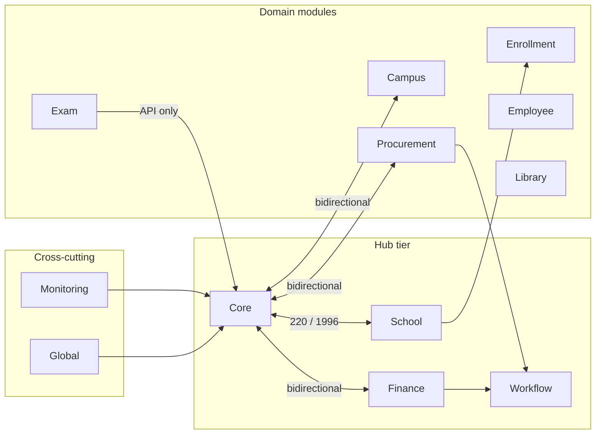

# 03 — Module Dependency Map

**REAP Stage:** 04 — Module Dependency Discovery  
**Artifact Status:** Verified  
**Generated:** 2026-06-19T14:30:00Z  
**Commit:** `805a5a0`  
**Branch:** `cursor/use-case-model-0a94`  
**Purpose:** Memetakan dependensi antar-modul, hub architecture, dan deep-dive struktural per modul — tanpa analisis bisnis.

**Input Artifacts:**

| Stage | Artifact | Status |
|-------|----------|--------|
| 01 | `00-repository-manifest.md` | Verified |
| 02 | `01-evidence-registry.json` | Verified |
| 03 | `02-structure-catalog.md` | Verified |

---

# Scope

## In scope

| Area | Boundary |
|------|----------|
| Inter-module PHP `use Modules\{Name}\` import graph | All 45 modules + `app/` layer |
| Per-module structural inventory | Models, migrations, services, events, policies, Filament resources/pages |
| Hub / leaf classification | Derived from static import counts |
| Bidirectional (2-cycle) coupling detection | Core ↔ domain modules |
| Cross-layer dependencies | `app/` → `Modules/` (observers, panels, API controllers, Moodle) |
| Conflict reconciliation | Stage 03 gaps vs source verification |
| Evidence IDs | `EV-S04-001` … `EV-S04-025` |

## Out of scope

| Area | Reason |
|------|--------|
| Runtime call graphs / queue payloads | Requires execution tracing |
| Database FK graph | Deferred — `verified-fks.json` not in git (GAP-001) |
| Business workflow semantics | REAP stage boundary |
| Full `vendor/` dependency tree | Excluded per Stage 01 |
| Line-by-line SD/ST diagram audit | Deferred (GAP-004, GAP-005) |

## Method

Static analysis: recursive scan of `Modules/{Name}/app/**/*.php` and `app/**/*.php` for `use Modules\{Module}\` statements. Filament resource counts include `extends ModuleResource` **and** `extends LocalizedResource` (alias import pattern).

---

# Findings

## F-01 — Core is the structural hub

`Modules\Core` has **2,144 inbound** `use` references (1,996 from modules + 148 from `app/`). Outbound: **220** references to 11 other modules. Combined hub score **2,216** (highest).

**Confidence:** VERIFIED

## F-02 — Hub tier (top 10 by combined in+out score)

| Rank | Module | Outbound uses | Inbound uses | Hub score | Role |
|------|--------|--------------:|-------------:|----------:|------|
| 1 | **Core** | 220 | 2,144 | 2,216 | Tenancy, User, ModuleResource, FilamentUi |
| 2 | **School** | 211 | 146 | 308 | K-12 domain hub |
| 3 | **Monitoring** | 39 | 268 | 299 | Audit cross-cut |
| 4 | **Campus** | 128 | 58 | 186 | Higher-ed hub |
| 5 | **Procurement** | 150 | 58 | 186 | Purchasing + workflow coupling |
| 6 | **Finance** | 119 | 82 | 177 | Accounting cross-cut |
| 7 | **Employee** | 126 | 43 | 150 | HR hub |
| 8 | **Library** | 125 | 31 | 139 | Library + enrollment links |
| 9 | **Workflow** | 87 | 82 | 131 | Approval engine |
| 10 | **Enrollment** | 82 | 28 | 101 | Admissions bridge |

**Confidence:** VERIFIED

## F-03 — 24 leaf modules (Core ± Monitoring only)

Modules whose outbound dependencies are **only** `Core` and/or `Monitoring`:

`Ai`, `Alumni`, `Boarding`, `Cafeteria`, `Capacity`, `Clinic`, `Consulting`, `Dms`, `EOffice`, `EducationQa`, `Event`, `Global`, `Helpdesk`, `IsoCompliance`, `ItOps`, `KpiEnterprise`, `Marketplace`, `MerchOrder`, `Messaging`, `PhysicalSecurity`, `Printing`, `Property`, `Risk`, `Training`

**Confidence:** VERIFIED

## F-04 — Bidirectional coupling clusters

Detected **2-cycles** (A imports B and B imports A):

| Cluster | Modules | Confidence |
|---------|---------|------------|
| Platform hub | `Core` ↔ `Campus`, `Employee`, `Enrollment`, `Finance`, `Library`, `Monitoring`, `Procurement`, `School`, `Global`, `Messaging`, `Printing` | VERIFIED |
| Admissions | `Enrollment` ↔ `School`, `Finance` | VERIFIED |
| Counseling | `Counseling` ↔ `School` | VERIFIED |
| Operations | `Finance` ↔ `Procurement`, `Monitoring`, `Workflow` | VERIFIED |
| Inventory audit | `Inventory` ↔ `Monitoring` | VERIFIED |
| Workflow ops | `Workflow` ↔ `Procurement`, `Finance` | VERIFIED |

**Interpretation (structural, not business):** `Core` is not a pure foundation layer — it imports domain models (e.g. `School` 72×, `Campus` 40×) while domain modules import Core utilities. This is **shared-kernel coupling**, not layering violation by itself.

**Confidence:** VERIFIED (import counts); architectural quality **INFERRED**

## F-05 — Exam is structurally isolated (zero inbound)

`Modules\Exam` has **97 outbound** uses (`Core` 61, `Campus` 18, `School` 17) but **0 inbound** module imports. Integration is via **HTTP API** (`Modules/Exam/routes/api.php`) and root `routes/api.php`, not PHP cross-imports.

**Confidence:** VERIFIED

## F-06 — Filament resource total is 375, not 257

| Pattern | Count | Notes |
|---------|------:|-------|
| `extends ModuleResource` (literal) | 257 | Stage 02/03 metric |
| `extends LocalizedResource` (alias) | 118 | `use ModuleResource as LocalizedResource` |
| **Total Filament admin resources** | **375** | All extend `Modules\Core\Filament\Support\ModuleResource` |

Modules using alias only (0 literal / N alias): `Global` (6), `Procurement` (14), `Exam` (5).

**Confidence:** VERIFIED

## F-07 — `app/` layer dependency hotspots

Top `app/` → module import targets:

| Module | `app/` import count | Primary consumers |
|--------|--------------------:|-------------------|
| Core | 148 | Filament panels, AppServiceProvider |
| Campus | 51 | Observers, Moodle mappers, API controllers |
| School | 49 | Observers, API controllers |
| Workflow | 38 | AppServiceProvider workflow hooks |
| Finance | 24 | Observers (invoice, payment, budget) |
| Procurement | 22 | Observers (PR, PO, vendor bill) |
| Employee | 19 | API controllers, observers |
| Library | 17 | SLIMS import, observers |

**Confidence:** VERIFIED

## F-08 — Per-module structural inventory (verified sample)

| Module | Models | Migrations | Services | Events | Policies | Filament res | Pages | Tier (S03) |
|--------|-------:|-----------:|---------:|-------:|---------:|-------------:|------:|------------|
| Core | 25 | 18 | 6 | 0 | 17 | 24 | 3 | Foundation |
| School | 21 | 17 | 12 | 0 | 17 | 21 | 4 | Full |
| Campus | 17 | 16 | 8 | 0 | 13 | 17 | 0 | Full |
| Workflow | 10 | 11 | 16 | 6 | 6 | 10 | 5 | Full |
| Exam | 20 | 10 | 25 | 3 | 8 | 5 | 0 | Lean |
| Procurement | 14 | 16 | 10 | 2 | 14 | 14 | 0 | Full |
| Global | 6 | 6 | 0 | 0 | 6 | 6 | 0 | Full |
| Finance | 10 | 8 | 6 | 1 | 9 | 10 | 4 | Full |
| Ai | 1 | 1 | 2 | 0 | 1 | 1 | 0 | Minimal |

Full 45-module matrix available via regenerate command (§ Regenerate).

**Confidence:** VERIFIED

## F-09 — CF-001 re-verified (Workflow authorization line refs)

| Claim | Location | Finding |
|-------|----------|---------|
| `authorizeActor()` call site | `DatabaseWorkflowEngine.php:48` | VERIFIED — inside `advance()` |
| `WorkflowAuthorizationException` throw | `DatabaseWorkflowEngine.php:429` | VERIFIED — inside `authorizeActor()` |
| SD-05 cites line 48 for exception | `SEQUENCE_DIAGRAMS.md` | **Stale** — exception at 429, not 48 |

**Confidence:** VERIFIED (source); diagram status unchanged **Draft**

---

# Evidence

| Evidence ID | Command / path | Result | Confidence |
|-------------|----------------|--------|------------|
| EV-S04-001 | Inter-module `use` scan (all `Modules/*/app`) | 45×45 graph generated | VERIFIED |
| EV-S04-002 | Core inbound count | 2,144 (modules 1,996 + app 148) | VERIFIED |
| EV-S04-003 | Core outbound count | 220 references to 11 modules | VERIFIED |
| EV-S04-004 | Leaf module classification | 24 modules Core±Monitoring only | VERIFIED |
| EV-S04-005 | Exam inbound module imports | 0 | VERIFIED |
| EV-S04-006 | Exam outbound | Core 61, Campus 18, School 17 | VERIFIED |
| EV-S04-007 | `find … extends ModuleResource` | 257 | VERIFIED |
| EV-S04-008 | `find … extends LocalizedResource` | 118 | VERIFIED |
| EV-S04-009 | `CityResource.php` alias import | `ModuleResource as LocalizedResource` | VERIFIED |
| EV-S04-010 | Total Filament resources (both patterns) | 375 | VERIFIED |
| EV-S04-011 | 2-cycle detection script | 20 bidirectional pairs | VERIFIED |
| EV-S04-012 | `app/` → Core import count | 148 | VERIFIED |
| EV-S04-013 | `app/Providers/AppServiceProvider.php` | Observers for Campus, School, Finance, Procurement, etc. | VERIFIED |
| EV-S04-014 | Per-module inventory script | models/migrations/services counts | VERIFIED |
| EV-S04-015 | `Modules/Exam/routes/api.php` exists | API entry, not PHP import | VERIFIED |
| EV-S04-016 | `docs/catalogs/authorization-matrix.json` `resource_count` | 257 | VERIFIED |
| EV-S04-017 | `scripts/extract-authorization-matrix.php:67` | `extends\s+ModuleResource` regex | VERIFIED |
| EV-S04-018 | `DatabaseWorkflowEngine.php:48` | `authorizeActor()` call | VERIFIED |
| EV-S04-019 | `DatabaseWorkflowEngine.php:416-429` | `authorizeActor()` + exception throw | VERIFIED |
| EV-S04-020 | Stage 03 `GAP-S03-03` claim | 0 ModuleResource for Global/Procurement/Exam | **Refuted** — alias pattern |
| EV-S04-021 | `02-structure-catalog.md` module table | 45 modules, tier labels | VERIFIED (cross-ref) |
| EV-S04-022 | `01-evidence-registry.json` summary | 968 evidence entries | VERIFIED |
| EV-S04-023 | `00-repository-manifest.md` | 45 modules, 4,685 module PHP | VERIFIED (cross-ref) |
| EV-S04-024 | Procurement Filament resources | 14 `*Resource.php` under Filament/Resources | VERIFIED |
| EV-S04-025 | Global Filament resources | 6 `*Resource.php` (Countries, Provinces, …) | VERIFIED |

### Dependency graph (structural — top edges from Core)



---

# Confidence Assessment

| Finding ID | Statement | Level | Rationale |
|------------|-----------|-------|-----------|
| F-01 | Core is structural hub | **VERIFIED** | 2,144 inbound `use` statements counted |
| F-02 | Hub tier ranking | **VERIFIED** | Deterministic sort on import counts |
| F-03 | 24 leaf modules | **VERIFIED** | Outbound set ⊆ {Core, Monitoring} |
| F-04 | Bidirectional clusters exist | **VERIFIED** | 2-cycle detection on import graph |
| F-04b | Shared-kernel coupling is intentional | **INFERRED** | No ADR document cited |
| F-05 | Exam isolated via API | **VERIFIED** | 0 inbound imports; `routes/api.php` exists |
| F-06 | 375 Filament resources | **VERIFIED** | Source pattern scan |
| F-07 | app/ dependency hotspots | **VERIFIED** | Import count per module from `app/` |
| F-08 | Per-module inventory | **VERIFIED** | File-system counts |
| F-09 | CF-001 line refs | **VERIFIED** | Direct file read |
| Auth matrix 257 count | Undercounts by 118 | **VERIFIED** | Script regex misses alias extends |
| ~3100 permission keys | **INFERRED** | Based on 257×12+16; should be ~4500+ if 375 resources | INFERRED |

---

# Coverage Analysis

| Dimension | Cataloged | Depth | Notes |
|-----------|-----------|-------|-------|
| Inter-module PHP imports | **Yes** | All 45 modules | Static `use` only |
| `app/` → module imports | **Yes** | Full `app/` tree | 38 modules referenced |
| Hub / leaf classification | **Yes** | Rule-based | Leaves = Core±Monitoring outbound |
| 2-cycle coupling | **Yes** | 20 pairs | Longer cycles not exhaustively searched |
| Filament resource recount | **Yes** | 375 total | Resolves Stage 03 false gap |
| Per-module file inventory | **Yes** | 8 metrics × 45 | Pages, events, services included |
| Event listener cross-module map | **Partial** | Spot-check | Not all 38 events in registry traced |
| DB FK dependencies | **No** | — | GAP-001 |
| Runtime DI container bindings | **No** | — | Out of scope |
| Queue job payload coupling | **No** | — | Out of scope |

**Stage 04 coverage score:** inter-module PHP graph + hub taxonomy + Filament recount = **complete** for stage gate. FK and runtime graphs deferred.

---

# Gap Analysis

| Gap ID | Description | Severity | Confidence | Action |
|--------|-------------|----------|------------|--------|
| GAP-S04-01 | `extract-authorization-matrix.php` misses 118 alias resources | **High** | VERIFIED | Update regex to match `LocalizedResource` or `ModuleResource as` import |
| GAP-S04-02 | Permission count ~3100 based on 257 resources is stale | Medium | INFERRED | Recompute: 375×12+16 ≈ 4,516 keys |
| GAP-S04-03 | Longer dependency cycles (>2) not enumerated | Low | UNVERIFIED | Optional Tarjan SCC in Stage 05 |
| GAP-S04-04 | `Exam` zero inbound — API contract not mapped here | Medium | VERIFIED | Cross-ref `api-routes-catalog.json` in Stage 05 |
| GAP-S04-05 | Core↔School bidirectional coupling — refactor impact unknown | Medium | INFERRED | Document as architectural note; no change recommended in REAP |
| GAP-S04-06 | `verified-fks.json` not versioned | Medium | VERIFIED | Inherits GAP-001 |
| GAP-S04-07 | 6 lean modules (S03) — tests absent for Consulting, Marketplace, Printing, Property | Low | VERIFIED | Track in module maturity matrix |

---

# Conflict Analysis

| Conflict ID | Source A | Source B | Nature | Resolution |
|-------------|----------|----------|--------|------------|
| **CF-S04-01** | `02-structure-catalog.md` GAP-S03-03: Global/Procurement/Exam have 0 `ModuleResource` | Source: `extends LocalizedResource` alias | **False gap** | All 25 resources extend `ModuleResource` via alias. **Close GAP-S03-03**; update Stage 03 on next revision. |
| **CF-S04-02** | `authorization-matrix.json` `resource_count: 257` | EV-S04-010: 375 resources | Undercount | Script `extract-authorization-matrix.php:67` regex too narrow. **CF-S04-02 open** until script fixed. |
| **CF-S04-03** | REAP_AUDIT EV-00008 ~3100 permissions | F-06: 375 resources | Derived metric drift | Relabel permission total **INFERRED**; recompute after CF-S04-02 fix. |
| **CF-001** | `SEQUENCE_DIAGRAMS.md` SD-05 line 48 | `DatabaseWorkflowEngine.php:429` | Stale line ref | **Reconfirmed** in F-09. ACTIVITY_DIAGRAMS 416–430 remains authoritative for exception. |
| **CF-002** | Entity catalog in `storage/app/` | Git tree | Traceability | Unchanged; inherits from REAP_AUDIT. |
| **CF-S04-04** | Stage 03 commit `9137e4b` in catalog header | Current `805a5a0` | Metadata drift | Cosmetic; structure findings still valid. |

**Resolution status:** CF-S04-01 resolved (methodology). CF-S04-02, CF-001, CF-002 remain open.

---

# Validation Checklist

### Coverage

- [x] All input artifacts read (`00`, `01`, `02`)
- [x] Inter-module dependency graph generated and verified against source
- [x] Hub tier and leaf modules classified
- [x] Bidirectional couplings documented
- [x] `app/` layer cross-module dependencies enumerated
- [x] Stage 03 false gap (GAP-S03-03) investigated and resolved
- [x] Filament resource count corrected (375)
- [x] CF-001 re-verified against `DatabaseWorkflowEngine.php`
- [x] No business workflow semantics asserted

### Missing Evidence

- [ ] Full FK dependency graph — **deferred** (GAP-001)
- [ ] Long-cycle SCC analysis — **deferred** (GAP-S04-03)
- [ ] Updated `authorization-matrix.json` with 375 resources — **blocked** on script fix

### Ambiguous Findings

- [ ] **AF-S04-01:** Import graph counts `use` statements, not distinct types or runtime calls. **Confidence:** INFERRED limitation.
- [ ] **AF-S04-02:** Hub score weights inbound = outbound; alternative weighting may reorder ranks 4–10. **Confidence:** INFERRED.

### Risk Assessment

| Risk | Severity | Mitigation |
|------|----------|------------|
| Core hub single point of coupling | High | Documented; 24 leaves show partial isolation |
| Authorization matrix undercount | High | GAP-S04-01 fix before permission audit |
| Bidirectional Core↔domain imports | Medium | Track in architecture review; not REAP blocker |
| Exam API-only integration invisible to PHP graph | Medium | GAP-S04-04 — API catalog cross-ref |

---

## Stage Gate

| Criterion | Status |
|-----------|--------|
| Artifact `03-module-dependency-map.md` produced | **Done** |
| Input artifacts consumed and cross-checked | **Done** |
| New evidence IDs assigned (EV-S04-001 … EV-S04-025) | **Done** |
| Conflicts reported (CF-S04-01 … CF-S04-04) | **Done** |
| Required sections present | **Done** |
| Ready for REAP Stage 05 | **Yes** (conditional on CF-S04-02 fix for auth accuracy) |

---

## Regenerate

```bash
# Inter-module import graph
php -r '
$modules = array_map("basename", glob("Modules/*", GLOB_ONLYDIR));
foreach ($modules as $from) {
  $tos = [];
  $rii = new RecursiveIteratorIterator(new RecursiveDirectoryIterator("Modules/$from/app"));
  foreach ($rii as $f) {
    if (!$f->isFile() || $f->getExtension() !== "php") continue;
    if (preg_match_all("/use Modules\\\\([A-Za-z0-9_]+)\\\\/", file_get_contents($f->getPathname()), $m))
      foreach ($m[1] as $to) if ($to !== $from) $tos[$to] = ($tos[$to] ?? 0) + 1;
  }
  if ($tos) { ksort($tos); echo "$from|".http_build_query($tos,"",",")."\n"; }
}
'

# Filament resource totals (literal + alias)
find Modules -name "*Resource.php" -path "*/Filament/Resources/*" | while read f; do
  grep -qE "extends (ModuleResource|LocalizedResource)|ModuleResource as LocalizedResource" "$f" && echo "$f"
done | wc -l

# Per-module inventory
for m in Modules/*/; do
  name=$(basename "$m")
  printf "%s models=%s mig=%s svc=%s res=%s\n" "$name" \
    "$(find "$m/app/Models" -name '*.php' 2>/dev/null|wc -l)" \
    "$(find "$m/database/migrations" -name '*.php' 2>/dev/null|wc -l)" \
    "$(find "$m/app/Services" -name '*.php' 2>/dev/null|wc -l)" \
    "$(find "$m" -path '*/Filament/Resources/*' -name '*Resource.php' 2>/dev/null|wc -l)"
done
```

---

**Status Artefak: Verified**

*REAP Stage 04 — Module Dependency Discovery. Evidence-first. No business logic.*
