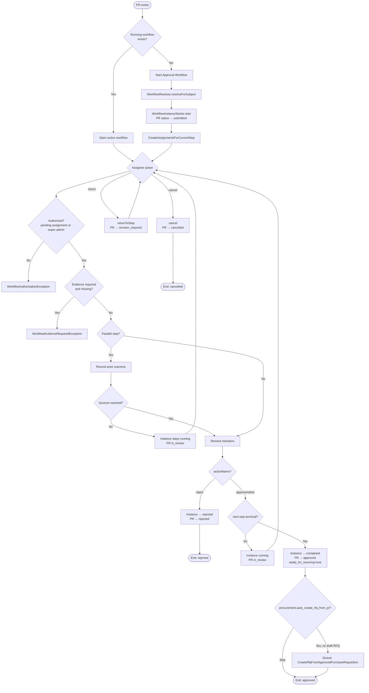
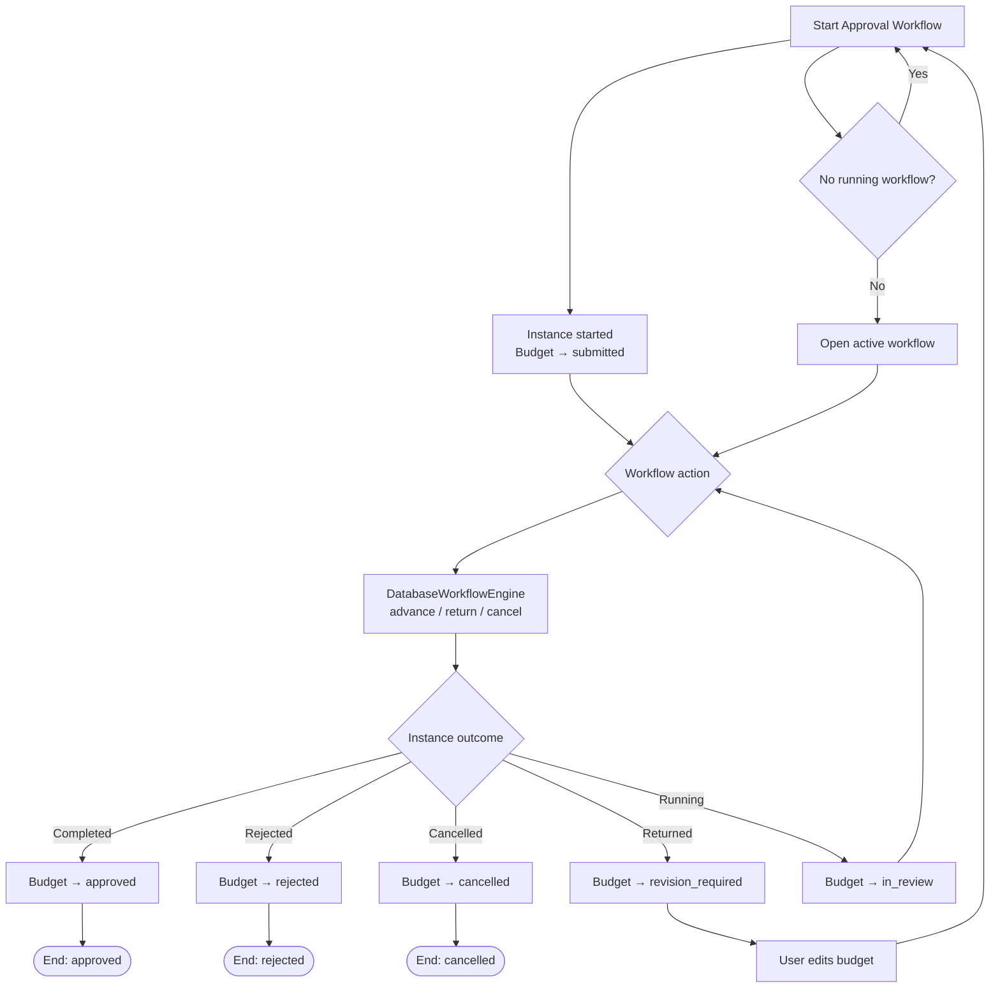
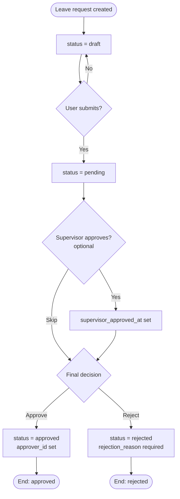
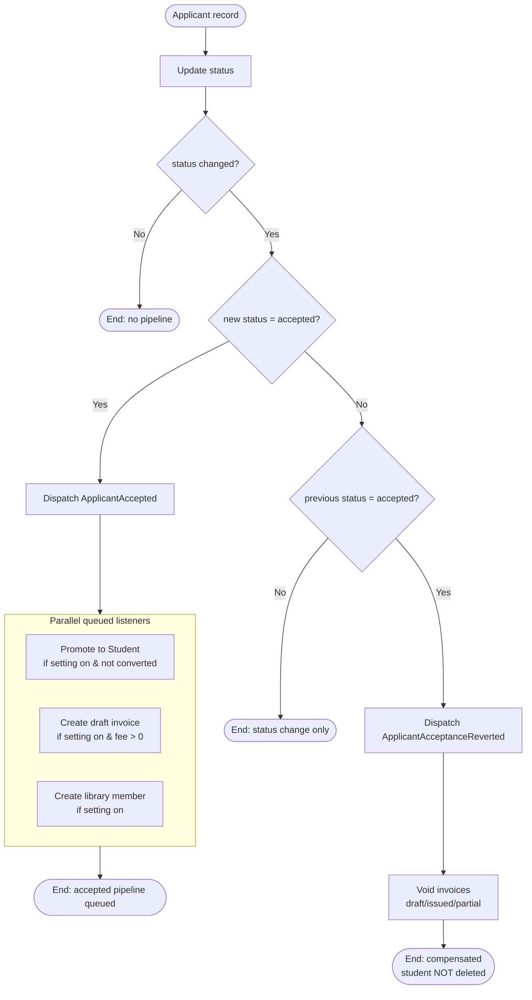
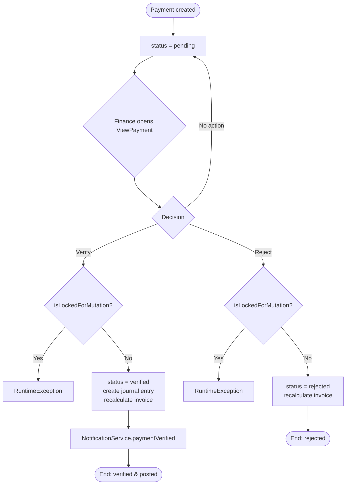
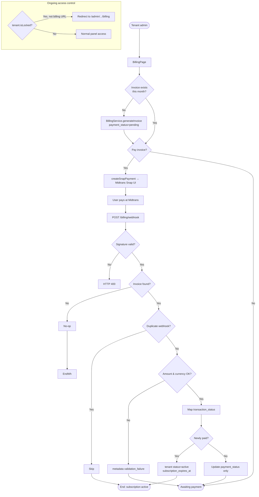
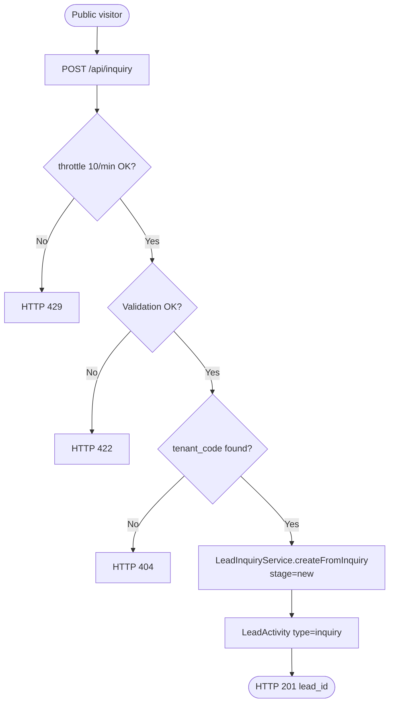

# Activity Diagrams

Evidence-based activity flows for main FoundationOS business processes. Decision conditions, reject paths, and rollbacks are taken from model status fields, workflow engine logic, and event listeners — not invented.

**Verification date:** 2026-06-19  
**Related:** `USE_CASES.md`, `SEQUENCE_DIAGRAMS.md`, `EVENTS.md`

---

## Process List

| ID | Process | Start state | Terminal states | Primary evidence |
|----|---------|-------------|-----------------|------------------|
| AD-01 | Purchase requisition approval workflow | PR exists, no running workflow | `approved`, `rejected`, `cancelled`, `revision_required` | `ViewPurchaseRequisition.php`, `SyncWorkflowSubjectState.php`, `DatabaseWorkflowEngine.php` |
| AD-02 | Budget approval workflow | Budget `draft` or `revision_required` | `approved`, `rejected`, `cancelled`, `revision_required` | `ViewBudget.php`, `SyncBudgetWorkflowState.php` |
| AD-03 | Leave request approval | Leave `draft` | `approved`, `rejected` | `ViewLeaveRequest.php` |
| AD-04 | Applicant acceptance & compensation | Applicant any status | `accepted` + downstream records; rollback voids invoices | `Applicant.php`, `ApplicantPromotionService.php`, `CompensateApplicantAcceptance.php` |
| AD-05 | Student payment verification & posting | Payment `pending` | `verified`, `rejected` | `ViewPayment.php`, `FinanceControlService.php` |
| AD-06 | SaaS subscription billing cycle | Tenant with plan | Invoice `paid` / `failed`; tenant `active` or locked | `BillingPage.php`, `BillingService.php`, `Tenant::isLocked()` |
| AD-07 | Public enrollment lead inquiry | Anonymous visitor | Lead `new` created | `InquiryController.php`, `LeadInquiryService.php` |

---

## AD-01 — Purchase Requisition Approval Workflow

### Activity Steps

1. Tenant admin views PR in Filament.
2. Optional: download PDF if `isPrintable()`.
3. Start approval workflow if no running instance exists.
4. Workflow resolver picks definition; instance starter creates running instance.
5. Assignees act on current step (advance, return, cancel, reject).
6. Subject state synced on workflow events.
7. On final approval: optional auto-RFQ creation (queued).

### Decision Nodes

| Node | Condition | Outcome | Source |
|------|-----------|---------|--------|
| D1 | Running `WorkflowInstance` exists for PR? | Yes → open workflow; No → show Start | `ViewPurchaseRequisition.php:41-64` |
| D2 | Actor has pending assignment OR is global super admin? | No → `WorkflowAuthorizationException` | `DatabaseWorkflowEngine.php:416-430` |
| D3 | Current step `requiresEvidence()` AND upload count &lt; required? | Yes → `WorkflowEvidenceRequiredException` | `DatabaseWorkflowEngine.php:52-63` |
| D4 | Step is parallel gateway? | Yes → quorum path; No → linear advance | `DatabaseWorkflowEngine.php:72-77` |
| D5 | Parallel: `verdict.reached`? | No → wait for more approvers | `DatabaseWorkflowEngine.php:188-203` |
| D6 | `actionName === 'reject'`? | Yes → instance `Rejected` | `DatabaseWorkflowEngine.php:435-436` |
| D7 | `actionName === 'cancel'`? | Yes → instance `Cancelled` | `DatabaseWorkflowEngine.php:439-440` |
| D8 | `nextStep` null or `is_terminal`? | Yes → instance `Completed` | `DatabaseWorkflowEngine.php:443-444` |
| D9 | Instance status after advance? | `Completed` → PR `approved`; `Rejected` → PR `rejected`; else → `in_review` | `SyncWorkflowSubjectState.php:44-72` |

### Parallel Paths

| Path | Description | Source |
|------|-------------|--------|
| Parallel quorum step | Multiple assignees vote; engine waits until `parallelCoordinator.evaluate()` returns `reached: true` | `DatabaseWorkflowEngine.php:158-247` |
| Post-approval automation | `PurchaseRequisitionApproved` → queued `CreateRfqFromApprovedPurchaseRequisition` (independent of UI) | `SyncWorkflowSubjectState.php:54`, `CreateRfqFromApprovedPurchaseRequisition.php` |

### End Conditions

| End | PR status | Workflow instance | Side effects |
|-----|-----------|-------------------|--------------|
| Approved | `approved`, `ready_for_sourcing=true` | `completed` | `PurchaseRequisitionApproved` event; optional RFQ draft |
| Rejected | `rejected` | `rejected` | `rejection_reason` from latest log |
| Cancelled | `cancelled` | `cancelled` | Notes appended with cancel reason |
| Returned | `revision_required` | `running` (earlier step) | Assignee must revise and resubmit |
| In review | `in_review` | `running` | Intermediate steps |

### Source Files

- `Modules/Procurement/app/Filament/Resources/PurchaseRequisitions/Pages/ViewPurchaseRequisition.php`
- `Modules/Workflow/app/Services/DatabaseWorkflowInstanceStarter.php`
- `Modules/Workflow/app/Services/DatabaseWorkflowEngine.php`
- `Modules/Workflow/app/Filament/Resources/WorkflowInstances/Pages/ViewWorkflowInstance.php`
- `Modules/Workflow/app/Listeners/SyncWorkflowSubjectState.php`
- `Modules/Procurement/app/Listeners/CreateRfqFromApprovedPurchaseRequisition.php`

### Activity Flow

---

## AD-02 — Budget Approval Workflow

### Activity Steps

Same workflow engine as AD-01, with budget-specific start guard and state sync.

### Decision Nodes

| Node | Condition | Outcome | Source |
|------|-----------|---------|--------|
| B1 | Budget status in `draft`, `revision_required` AND no running workflow? | Required to show Start | `ViewBudget.php:53-57` |
| B2–B8 | Same engine decisions as AD-01 D2–D8 | Same instance transitions | `DatabaseWorkflowEngine.php` |
| B9 | Instance `Completed` / `Rejected` / returned / cancelled? | Budget status mapped | `SyncBudgetWorkflowState.php:24-69` |

### Parallel Paths

Same parallel quorum mechanism as AD-01 when workflow step uses parallel gateway.

### End Conditions

| End | Budget status | Source |
|-----|---------------|--------|
| Approved | `approved`, `approved_by`, `approved_at` set | `SyncBudgetWorkflowState.php:45-50` |
| Rejected | `rejected` | `SyncBudgetWorkflowState.php:55-64` |
| Cancelled | `cancelled` | `SyncBudgetWorkflowState.php:34-37` |
| Revision required | `revision_required` | `SyncBudgetWorkflowState.php:30-33` |
| In review | `in_review` | `SyncBudgetWorkflowState.php:67-69` |

### Source Files

- `Modules/Finance/app/Filament/Resources/Budgets/Pages/ViewBudget.php`
- `Modules/Workflow/app/Listeners/SyncBudgetWorkflowState.php`
- `Modules/Workflow/app/Services/DatabaseWorkflowEngine.php`

### Activity Flow

---

## AD-03 — Leave Request Approval

### Activity Steps

1. Create leave request (`draft` via API or Filament).
2. Submit for approval → `pending`.
3. Optional supervisor approval timestamp.
4. Final approve or reject.

### Decision Nodes

| Node | Condition | Visible action | Source |
|------|-----------|----------------|--------|
| L1 | `status === 'draft'`? | Submit for Approval | `ViewLeaveRequest.php:35-41` |
| L2 | `status === 'pending'` AND `supervisor_approved_at === null`? | Supervisor Approve | `ViewLeaveRequest.php:47-55` |
| L3 | `status === 'pending'`? | Approve / Reject | `ViewLeaveRequest.php:61-91` |
| L4 | Reject path | Requires `rejection_reason` | `ViewLeaveRequest.php:78-88` |

### Parallel Paths

None — sequential optional supervisor step then final approval (supervisor not enforced before approve in code).

### End Conditions

| End | `leave_requests.status` | Source |
|-----|-------------------------|--------|
| Approved | `approved` + `approver_id`, `approved_at` | `ViewLeaveRequest.php:64-68` |
| Rejected | `rejected` + `rejection_reason` | `ViewLeaveRequest.php:85-88` |
| Awaiting | `pending` | After submit |

### Source Files

- `Modules/Employee/app/Filament/Resources/LeaveRequests/Pages/ViewLeaveRequest.php`
- `app/Http/Controllers/Api/v1/LeaveRequestController.php` (creates `draft`)

### Activity Flow

---

## AD-04 — Applicant Acceptance & Compensation (Rollback)

### Activity Steps

1. Admin or API creates/updates applicant.
2. Status set to `accepted`.
3. Model dispatches `ApplicantAccepted`.
4. Queued listeners promote student, create invoice, create library member (settings-gated).
5. If status leaves `accepted`, dispatch `ApplicantAcceptanceReverted` → void open invoices.

### Decision Nodes

| Node | Condition | Outcome | Source |
|------|-----------|---------|--------|
| A1 | `wasChanged('status')`? | No → no event | `Applicant.php:69-71` |
| A2 | `status === 'accepted'`? | Dispatch `ApplicantAccepted` | `Applicant.php:76-78` |
| A3 | `getOriginal('status') === 'accepted'`? | Dispatch `ApplicantAcceptanceReverted` | `Applicant.php:82-87` |
| A4 | `enrollment.auto_promote_accepted_applicant` enabled? | Skip student create | `ApplicantPromotionService.php:28-30` |
| A5 | `converted_to_student_id` already set? | Idempotent return | `ApplicantPromotionService.php:34-36` |
| A6 | `enrollment.auto_invoice_on_accept` AND `registration_fee > 0`? | Skip invoice | `ApplicantOnboardingInvoiceService.php:27-37` |
| A7 | Invoice status in `draft`, `issued`, `partial`? | Void on rollback | `CompensateApplicantAcceptance.php:38-43` |

### Parallel Paths

| Listener | Queue | Action |
|----------|-------|--------|
| `CreateStudentFromAcceptedApplicant` | Yes | `ApplicantPromotionService::promote()` |
| `CreateInitialInvoiceFromAcceptedApplicant` | Yes | `ApplicantOnboardingInvoiceService::createDraftFor()` |
| `CreateLibraryMemberFromAcceptedApplicant` | Yes | Library member (setting-gated) |

Listeners are independent queued jobs after `ApplicantAccepted` (parallel async, not transactional together).

### End Conditions

| End | State | Rollback |
|-----|-------|----------|
| Accepted | Student linked, draft invoice may exist, library member may exist | — |
| Reverted from accepted | Applicant new status | Open invoices → `void`; student record **not** deleted (`EVENTS.md`) |

### Source Files

- `Modules/Enrollment/app/Models/Applicant.php`
- `Modules/School/app/Listeners/CreateStudentFromAcceptedApplicant.php`
- `Modules/Finance/app/Listeners/CreateInitialInvoiceFromAcceptedApplicant.php`
- `Modules/Library/app/Listeners/CreateLibraryMemberFromAcceptedApplicant.php`
- `Modules/Enrollment/app/Listeners/CompensateApplicantAcceptance.php`
- `tests/Feature/ApplicantAcceptedPipelineTest.php`

### Activity Flow

---

## AD-05 — Student Payment Verification & Posting

### Activity Steps

1. Payment created (`pending`) via API or Filament.
2. Finance user verifies or rejects from `ViewPayment`.
3. Verify: journal entry created, invoice recalculated, notification sent.
4. Reject: payment finalized as rejected, invoice recalculated.

### Decision Nodes

| Node | Condition | Outcome | Source |
|------|-----------|---------|--------|
| P1 | `payment.status === 'pending'`? | Show verify/reject actions | `ViewPayment.php:38,58` |
| P2 | `payment.isLockedForMutation()`? | Exception on verify/reject | `FinanceControlService.php:48-50,79-81` |
| P3 | Verify vs reject | Branch posting vs rejection audit | `FinanceControlService.php:43-72,74-90` |

### Parallel Paths

None in single payment transaction (verify runs journal + invoice update in one DB transaction).

### End Conditions

| End | Payment status | Side effects |
|-----|----------------|--------------|
| Verified | `verified` | Journal entry, invoice recalc, `NotificationService::paymentVerified` | `FinanceControlService.php:52-68` |
| Rejected | `rejected` | Invoice recalc, audit log | `FinanceControlService.php:83-90` |
| Pending | `pending` | Awaiting finance action | Initial create |

### Source Files

- `Modules/Finance/app/Filament/Resources/Payments/Pages/ViewPayment.php`
- `Modules/Finance/app/Services/FinanceControlService.php`
- `app/Http/Controllers/Api/v1/PaymentController.php`

### Activity Flow

---

## AD-06 — SaaS Subscription Billing Cycle

### Activity Steps

1. Tenant admin opens Billing page.
2. Generate monthly invoice if not already billed this month.
3. Pay via Midtrans Snap.
4. Midtrans webhook updates invoice and may activate tenant.
5. Locked tenants redirected to billing (except billing routes).

### Decision Nodes

| Node | Condition | Outcome | Source |
|------|-----------|---------|--------|
| S1 | Invoice already exists for current year/month? | Warning, skip generate | `BillingPage.php:109-121` |
| S2 | Webhook signature valid? | 400 if not | `BillingService.php:119`, `BillingController.php:20-26` |
| S3 | `order_id` matches `invoice_number`? | No-op if missing | `BillingService.php:121-134` |
| S4 | Duplicate `webhookKey` in metadata? | Idempotent skip | `BillingService.php:139-141` |
| S5 | Amount/currency match invoice? | Metadata failure flag, no status change | `BillingService.php:143-161` |
| S6 | `transaction_status` mapping | `paid`, `pending`, `failed` | `BillingService.php:166-172` |
| S7 | Newly `paid` (was not paid before)? | `activateTenantSubscription` | `BillingService.php:191-193` |
| S8 | `tenant.isLocked()`? | Redirect non-billing routes to billing | `EnsureTenantSubscriptionActive.php:20-26`, `Tenant.php:165-168` |

### Parallel Paths

User payment (browser → Midtrans) and webhook notification are concurrent external paths converging on `subscription_logs`.

### End Conditions

| End | Subscription log | Tenant |
|-----|-------------------|--------|
| Paid | `payment_status = paid` | `status = active`, `subscription_expires_at` set | `BillingService.php:197-205` |
| Failed | `payment_status = failed` | May become `past_due` / `suspended` (lifecycle outside single webhook) |
| Locked | — | `suspended` OR `past_due` past grace | `Tenant.php:165-168` |

### Source Files

- `app/Filament/Pages/BillingPage.php`
- `app/Services/BillingService.php`
- `app/Http/Controllers/BillingController.php`
- `app/Http/Middleware/EnsureTenantSubscriptionActive.php`
- `Modules/Core/app/Models/Tenant.php`

### Activity Flow

---

## AD-07 — Public Enrollment Lead Inquiry

### Activity Steps

1. Visitor POSTs inquiry with `tenant_code`.
2. Controller validates payload (throttle 10/min).
3. Resolve tenant by code.
4. Create lead + inquiry activity.

### Decision Nodes

| Node | Condition | Outcome | Source |
|------|-----------|---------|--------|
| I1 | Validation passes? | 422 if not | `InquiryController.php:19-28` |
| I2 | `tenant_code` exists? | 404 `firstOrFail` | `InquiryController.php:30` |

### Parallel Paths

None.

### End Conditions

| End | Result |
|-----|--------|
| Success | Lead `stage=new`, activity `inquiry`; HTTP 201 | `LeadInquiryService.php:29-47`, `InquiryController.php:47-50` |
| Unknown tenant | 404 | `InquiryController.php:30` |

### Source Files

- `Modules/Enrollment/app/Http/Controllers/InquiryController.php`
- `Modules/Enrollment/app/Services/LeadInquiryService.php`
- `Modules/Enrollment/routes/api.php`

### Activity Flow

---

## Global Decision Node Index

| ID | Process | Label | Expression in code |
|----|---------|-------|-------------------|
| D2 / B2 | AD-01, AD-02 | Workflow authorization | `assignments pending for actor` OR `isGlobalSuperAdmin()` |
| D6 | AD-01, AD-02 | Reject action | `actionName === 'reject'` → `WorkflowInstanceStatus::Rejected` |
| D-return | AD-01, AD-02 | Return | `returnToStep` → subject `revision_required` |
| D-cancel | AD-01, AD-02 | Cancel | `cancel()` → subject `cancelled` |
| A3 | AD-04 | Acceptance rollback trigger | `getOriginal('status') === 'accepted'` |
| P2 | AD-05 | Payment locked | `isLockedForMutation()` |
| S5 | AD-06 | Webhook amount guard | `amountMatchesInvoice && currencyMatchesInvoice` |
| S8 | AD-06 | Tenant lock | `status === 'suspended'` OR `past_due` past grace |

---

## Parallel Paths Summary

| Process | Parallelism type | Evidence |
|---------|------------------|----------|
| AD-01 | Workflow parallel quorum steps | `WorkflowParallelCoordinator::evaluate()` |
| AD-01 | Post-approval RFQ listener (async) | `ShouldQueue` listener |
| AD-04 | Three acceptance listeners (async) | `ShouldQueue` on School/Finance/Library listeners |
| AD-06 | User checkout ∥ webhook notification | Midtrans external flow |

---

## End Conditions Summary

| Process | Success end | Failure / rollback end |
|---------|-------------|--------------------------|
| AD-01 | PR `approved` | `rejected`, `cancelled`, `revision_required` |
| AD-02 | Budget `approved` | `rejected`, `cancelled`, `revision_required` |
| AD-03 | Leave `approved` | `rejected` |
| AD-04 | Accepted + downstream records | Revert → void invoices (not delete student) |
| AD-05 | Payment `verified` + journal | Payment `rejected` |
| AD-06 | Invoice `paid`, tenant `active` | `failed` webhook; tenant `isLocked` blocks panel |
| AD-07 | Lead created 201 | 404 / 422 / 429 |

---

## Source Files (master index)

| File | Processes |
|------|-----------|
| `Modules/Workflow/app/Services/DatabaseWorkflowEngine.php` | AD-01, AD-02 |
| `Modules/Workflow/app/Listeners/SyncWorkflowSubjectState.php` | AD-01 |
| `Modules/Workflow/app/Listeners/SyncBudgetWorkflowState.php` | AD-02 |
| `Modules/Procurement/.../ViewPurchaseRequisition.php` | AD-01 |
| `Modules/Finance/.../ViewBudget.php` | AD-02 |
| `Modules/Employee/.../ViewLeaveRequest.php` | AD-03 |
| `Modules/Enrollment/app/Models/Applicant.php` | AD-04 |
| `Modules/Enrollment/app/Listeners/CompensateApplicantAcceptance.php` | AD-04 |
| `Modules/Finance/app/Services/FinanceControlService.php` | AD-05 |
| `Modules/Finance/.../ViewPayment.php` | AD-05 |
| `app/Services/BillingService.php` | AD-06 |
| `app/Filament/Pages/BillingPage.php` | AD-06 |
| `Modules/Enrollment/.../InquiryController.php` | AD-07 |

---

## Coverage Notes

| Requested element | Coverage |
|-------------------|----------|
| Decision branches with conditions | All diagrams label predicates from code |
| Reject paths | AD-01, AD-02 (`reject` action), AD-03, AD-05 |
| Rollback | AD-04 `ApplicantAcceptanceReverted` compensation |
| Return / revision | AD-01, AD-02 `returnToStep` → `revision_required` |
| Not expanded | Generic Filament CRUD, Moodle sync, exam runtime — see `SEQUENCE_DIAGRAMS.md` |
