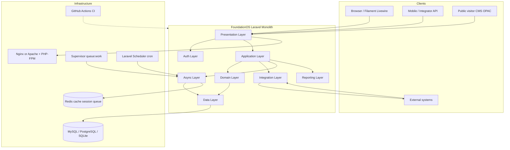
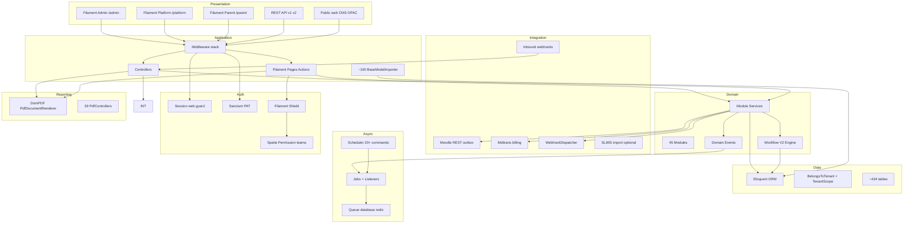
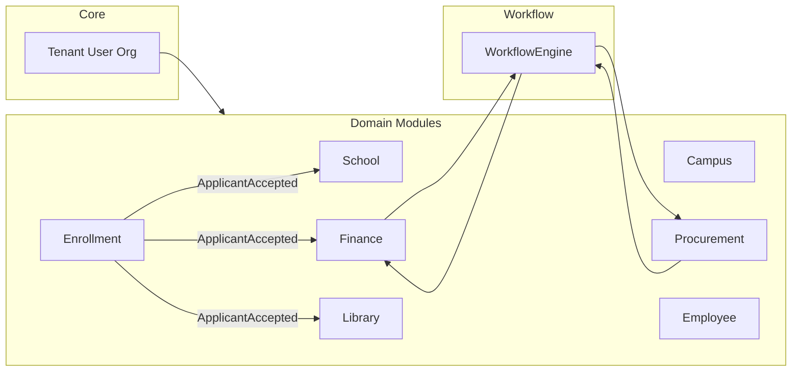
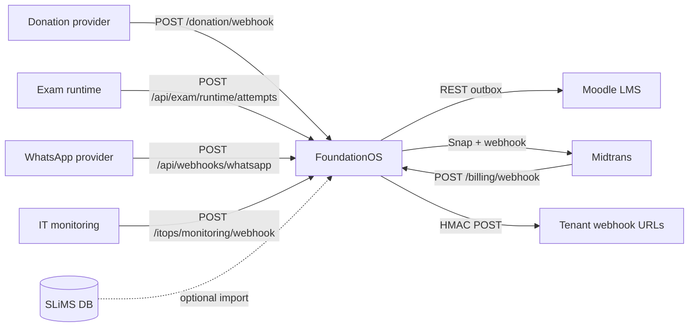
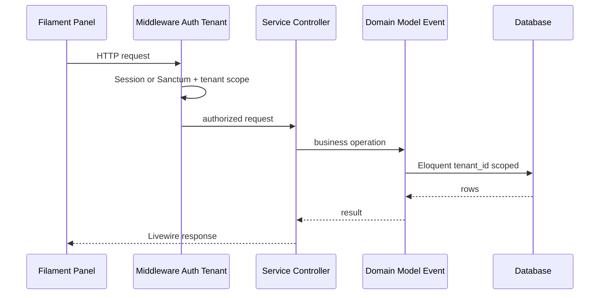
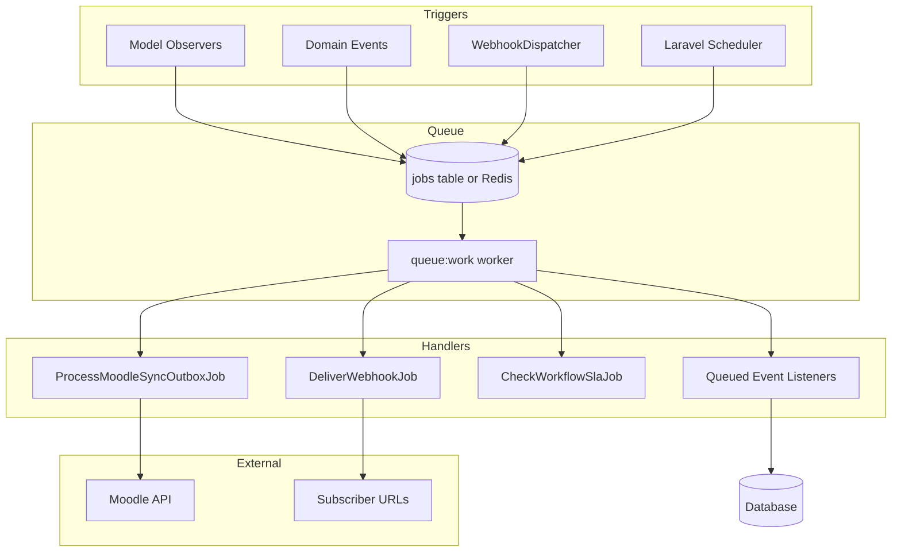
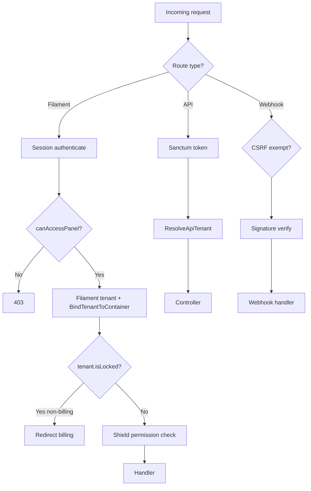
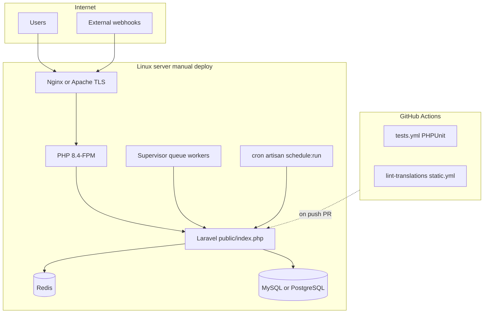

# Architecture Documentation

Evidence-based system architecture for FoundationOS, synthesized from repository structure, routing, providers, configuration, and prior discovery artifacts (`USE_CASES.md`, `SEQUENCE_DIAGRAMS.md`, `ACTIVITY_DIAGRAMS.md`, `STATE_DIAGRAMS.md`, `EVENTS.md`, `storage/app/entity-catalog.json`).

**Verification date:** 2026-06-19  
**Runtime:** Laravel 13 monolith, PHP 8.4, shared-database multi-tenancy

---

## System Overview

FoundationOS is a **modular ERP for educational institutions** delivered as a single Laravel application. One deployment serves many tenants; isolation is enforced by `tenant_id` on operational tables and request-scoped tenant resolution—not by separate databases or `stancl/tenancy`.

| Dimension | Verified fact | Evidence |
|-----------|---------------|----------|
| Modules | **45** feature modules under `Modules/` | `ls Modules/` |
| Admin UI resources | **257** classes extending `ModuleResource` | grep `extends ModuleResource` |
| Database tables | **434** cataloged | `storage/app/entity-catalog.json` |
| Filament panels | **3** (`admin`, `platform`, `parent`) | `app/Providers/Filament/*PanelProvider.php` |
| API surface | `/api/v1`, `/api/v2` + module routes | `routes/api.php`, `Modules/*/routes/` |
| Primary admin path | `/admin` (tenant-scoped Filament) | `AdminPanelProvider.php:43-44` |
| Queue default | `database` (env override to `redis` in prod guide) | `config/queue.php:16`, `SETUP.md` |
| IaC in repo | **None** (no Docker/K8s/Terraform); CI via GitHub Actions | `.github/workflows/`, no `Dockerfile` |



---

## Layered Architecture

### Layer definitions (verified boundaries)

| Layer | Responsibility | Key locations |
|-------|----------------|----------------|
| **Presentation** | UI, HTTP entry, Livewire/Filament | `app/Filament/`, `app/Providers/Filament/`, `Modules/*/resources/views/`, `Modules/*/Filament/` |
| **Application** | HTTP controllers, middleware, orchestration | `app/Http/`, `Modules/*/Http/Controllers/`, `routes/` |
| **Domain** | Business rules, models, services, events | `Modules/*/Models/`, `Modules/*/Services/`, `Modules/*/Events/`, `app/Integrations/` |
| **Data** | Persistence, scoping, migrations | `database/migrations/`, `Modules/*/database/migrations/`, Eloquent |
| **Integration** | External APIs, inbound webhooks | `app/Integrations/Moodle/`, `BillingService`, module webhook controllers |
| **Async** | Queues, jobs, scheduled commands, queued listeners | `app/Jobs/`, `routes/console.php`, `ShouldQueue` listeners |
| **Auth** | Session, Sanctum, Shield, policies | `Modules/Core/Models/User.php`, `config/permission.php`, Filament plugins |
| **Reporting** | PDF generation, document templates | `*PdfController.php`, `PdfDocumentRenderer`, `PrintableDocumentService` |
| **Infrastructure** | Deploy, process supervision, CI | `SETUP.md`, `.github/workflows/` |

### Layered diagram



---

## Module Map

### Module inventory (45)

All modules registered via `coolsam/modules` (`composer.json` autoload PSR-4 prefixes, `bootstrap/cache/modules.php` providers).

| Module | Primary domain (from structure) | Filament resources (count) |
|--------|----------------------------------|----------------------------|
| Core | Tenancy, users, orgs, settings | 10 |
| Global | Reference geography/timezone | (in Core/Global resources) |
| School | K-12 students, classes, grades | 7+ |
| Campus | Higher-ed programs, courses, thesis | 7+ |
| Enrollment | Admissions, leads, applicants | 7+ |
| Employee | HR, leave, payroll | 7+ |
| Finance | Accounting, invoices, payments | 7+ |
| Procurement | PR, RFQ, PO, vendor bills | 7+ |
| Library | Books, loans, OPAC | 1+ (`LibraryResource`) |
| Workflow | Approval engine metadata | 7+ |
| Monitoring | Audit, webhooks, Moodle outbox UI | 2+ |
| Messaging | Notifications, WhatsApp webhook | 2+ |
| Exam | Exam runtime sync, gradebook | 5+ |
| Cms | Public sites | 10 |
| Event | Event management | 10 |
| … | 30 additional operational modules | 1–10 each |

Top modules by `ModuleResource` count (verified grep): **Event (10), Core (10), Cms (10), Transport (9), Training (9), InternalAudit (9), Clinic (9), Alumni (9)**.

### Module internal pattern (repeated)

```
Modules/<Name>/
  app/Models, Services, Events, Listeners, Policies
  app/Filament/Resources/<Model>/  → extends ModuleResource
  database/migrations, factories, seeders
  routes/web.php, routes/api.php (optional)
```

Evidence: `CLAUDE.md`, `Modules/Core/app/Filament/Support/ModuleResource.php`.

### Cross-module coupling (verified event bus)

| Event | Publishers | Subscribers (modules) |
|-------|------------|------------------------|
| `ApplicantAccepted` | Enrollment | School, Finance, Library |
| `PurchaseRequisitionApproved` | Workflow → Procurement | Procurement (RFQ auto-create) |
| `StudentInvoicePaid` | Finance | Enrollment (registration update) |
| `WorkflowStarted/Advanced/...` | Workflow | Workflow listeners + PR/Budget sync |

Source: `EVENTS.md`, `Modules/Workflow/app/Providers/EventServiceProvider.php`.



---

## Integration Map

| Integration | Direction | Entry / client | Config | Evidence |
|-------------|-----------|----------------|--------|----------|
| **Midtrans** | Inbound webhook + outbound Snap | `POST /billing/webhook`, `BillingService::createSnapPayment` | `config/midtrans.php` | `routes/web.php`, `BillingService.php` |
| **Moodle** | Outbound REST (outbox) | `MoodleClient::call`, `ProcessMoodleSyncOutboxJob` | `config/moodle.php` | `app/Integrations/Moodle/` |
| **Tenant webhooks** | Outbound HTTP | `WebhookDispatcher` → `DeliverWebhookJob` | DB `webhook_subscriptions` | `app/Services/WebhookDispatcher.php` |
| **Donation provider** | Inbound | `POST /donation/webhook` | module config | `Modules/Donation/routes/web.php` |
| **Exam runtime** | Inbound API | `POST /api/exam/runtime/attempts` | Sanctum | `Modules/Exam/routes/api.php` |
| **WhatsApp** | Inbound | `POST /api/webhooks/whatsapp/{provider}` | `config/messaging` | `routes/api.php` |
| **IT monitoring** | Inbound | `POST /itops/monitoring/webhook` | ItOps module | `Modules/ItOps/routes/web.php` |
| **SLiMS** | Inbound DB import (optional) | `SlimsImportService` | tenant settings keys | `Modules/Library/app/Support/SlimsImportService.php` |

**Not in repo as inbound actor:** Moodle does not call FoundationOS webhooks for master data; sync is FOS → Moodle via outbox (`README.md`, `MOODLE.md` pattern).



---

## Data Flow

### Tenancy resolution (every request path)

| Path | Resolver | Sets |
|------|----------|------|
| Filament `/admin` | Filament tenant + `BindTenantToContainer` | `CurrentTenant` from `Filament::getTenant()` |
| API | `ResolveApiTenant` on Sanctum PAT `tenant_id` | `CurrentTenant::set($token->tenant_id)` |
| Public/module routes | Explicit `tenant` route param or `tenant_code` | Per-controller (e.g. `InquiryController`) |

Evidence: `BelongsToTenant.php`, `ResolveApiTenant.php`, `BindTenantToContainer.php`, `App\Scopes\TenantScope`.

### Representative synchronous flows

| Flow | Path | Layers touched |
|------|------|----------------|
| Admin CRUD | Filament → `ModuleResource` → Eloquent | Presentation → Application → Domain → Data |
| API read | `routes/api.php` → v1 controllers → models | Presentation → Application → Data |
| PR approval | Filament action → `DatabaseWorkflowEngine` → `SyncWorkflowSubjectState` | Presentation → Domain → Data → Events |
| Payment verify | `ViewPayment` → `FinanceControlService` → journal + invoice | Presentation → Domain → Data |
| Applicant accept | Filament save → `Applicant` model event → queued listeners | Domain → Async → Data |

Detailed message-level flows: `SEQUENCE_DIAGRAMS.md` (SD-01–SD-13).



### Shared-database model

- **No** per-tenant database; **yes** `tenant_id` column on operational tables.
- Global users; membership via `user_tenant_roles`.
- Spatie Permission **teams mode** with `team_foreign_key = tenant_id` (`config/permission.php:96,134`).

---

## Async Flow

### Queue infrastructure

| Component | Default / prod | Evidence |
|-----------|----------------|----------|
| Connection | `env('QUEUE_CONNECTION', 'database')` | `config/queue.php:16` |
| Production guide | `QUEUE_CONNECTION=redis`, Supervisor `queue:work redis` | `SETUP.md:287,470` |
| Jobs table | `jobs` when using database driver | `config/queue.php:41` |
| Moodle queue name | `moodle-sync` | `config/moodle.php:23` |

### Job classes (app + module)

| Job | Trigger | Purpose |
|-----|---------|---------|
| `ProcessMoodleSyncOutboxJob` | Outbox enqueue, scheduler drain | Moodle sync |
| `DeliverWebhookJob` | `WebhookDispatcher` | Outbound tenant webhooks |
| `CheckWorkflowSlaJob` | Workflow SLA scheduler | Workflow escalations |

### Queued listeners (`ShouldQueue`, verified)

- `CreateStudentFromAcceptedApplicant`, `CreateInitialInvoiceFromAcceptedApplicant`, `CreateLibraryMemberFromAcceptedApplicant`
- `CompensateApplicantAcceptance`, `UpdateRegistrationOnInvoicePaid`
- `CreateRfqFromApprovedPurchaseRequisition`
- `RunWorkflowAutomatedActions`

Pattern: domain event → listener implements `ShouldQueue` → `InteractsWithTenant` captures tenant context (`app/Concerns/InteractsWithTenant.php`).

### Scheduler (`routes/console.php`)

**20+** scheduled Artisan commands including: `fos:moodle:drain-outbox`, `fos:billing:check-grace-period`, `fos:billing:generate-invoices`, `workflow:escalate-overdue`, `reports:weekly-summary`, domain-specific maintenance (library fines, legal contracts, helpdesk SLA, etc.).



---

## Security Flow

### Authentication paths

| Actor | Mechanism | Panel / route | Gate |
|-------|-----------|---------------|------|
| Tenant admin | Session (`web` guard) + Filament login | `/admin` | `User::canAccessPanel('admin')` — `user_tenant_roles` or super admin |
| Platform owner | Session + role `platform_owner` (team `0`) | `/platform` | `canAccessPanel('platform')` |
| Parent | Session + `parent_students` link | `/parent` | `canAccessPanel('parent')` |
| API client | Sanctum bearer PAT with `tenant_id` | `/api/v1/*` | `auth:sanctum`, `resolve.api.tenant` |
| Webhooks | No session; CSRF exempt or signature | `/billing/webhook`, etc. | `MidtransWebhookVerifier`, HMAC headers |

Evidence: `Modules/Core/app/Models/User.php:463-484`, `bootstrap/app.php:30-33`, `AdminPanelProvider.php:115-118`.

### Authorization

| Layer | Technology | Evidence |
|-------|------------|----------|
| Filament resources | **Filament Shield** + generated permissions | `AdminPanelProvider.php:133`, `shield:generate` in `CLAUDE.md` |
| Policies | Module `Policies/` + `authorize()` on PDF trait | `RendersTenantPdf.php:32` |
| Super admin bypass | `Gate::before` + `is_super_admin` | `AppServiceProvider.php:93-98` |
| Teams | Spatie `teams => true`, `tenant_id` | `config/permission.php` |
| Tenant subscription lock | `EnsureTenantSubscriptionActive` | Redirect to billing if `Tenant::isLocked()` |

### Security monitoring

- `LogSecurityAuthEvents` on `Failed`, `Lockout`, `Login` (`AppServiceProvider.php:131-133`)
- `LogTenantSwitchAudit` on `TenantSwitched`
- Activity log package: `spatie/laravel-activitylog` (`composer.json`)



---

## Deployment View

### Runtime topology (from `SETUP.md` — not container-defined in repo)



### Process model

| Process | Command (documented) | Evidence |
|---------|---------------------|----------|
| HTTP | Nginx → `public/index.php` | `SETUP.md` web server section |
| Queue worker | `php artisan queue:work redis --sleep=3 --tries=3` | `SETUP.md:470` |
| Scheduler | `* * * * * php artisan schedule:run` | `SETUP.md` scheduler section |
| Dev local | `composer run dev` (server + queue + logs + vite) | `composer.json` scripts |

### CI/CD (repository only — no deploy pipeline YAML)

| Workflow | Purpose |
|----------|---------|
| `.github/workflows/tests.yml` | PHPUnit on PHP 8.4 |
| `.github/workflows/static.yml` | Static analysis |
| `.github/workflows/lint-translations.yml` | Translation lint |
| `.github/workflows/lint-tenant-fields.yml` | Tenant field lint |
| `.github/workflows/mobile-shell.yml` | Mobile shell build |

### Environment dependencies (production guide)

- PHP 8.4+, Node 18+, Composer, MySQL 8+ or PostgreSQL 12+
- Redis recommended for cache, session, queue (`SETUP.md:285-287`)
- SSL/TLS termination at reverse proxy
- Secrets: `MIDTRANS_*`, `MOODLE_*`, DB credentials, `APP_KEY`

### Health check

- Laravel built-in: `GET /up` (`bootstrap/app.php:23`)

---

## Layer → Evidence Index

| Layer | Primary evidence files |
|-------|------------------------|
| Presentation | `app/Providers/Filament/AdminPanelProvider.php`, `PlatformPanelProvider.php`, `ParentPanelProvider.php`, `routes/api.php`, `Modules/Cms/routes/web.php`, `Modules/Library/routes/web.php` |
| Application | `app/Http/Controllers/`, `bootstrap/app.php`, `Modules/*/Http/Controllers/` |
| Domain | `Modules/*/Models/`, `Modules/*/Services/`, `Modules/Workflow/app/Services/DatabaseWorkflowEngine.php`, `app/Integrations/` |
| Data | `Modules/*/database/migrations/`, `Modules/Core/app/Models/Concerns/BelongsToTenant.php`, `storage/app/entity-catalog.json` |
| Integration | `app/Integrations/Moodle/`, `app/Services/BillingService.php`, `app/Services/WebhookDispatcher.php`, `Modules/Library/app/Support/SlimsImportService.php` |
| Async | `app/Jobs/`, `routes/console.php`, `config/queue.php`, queued listeners in `Modules/*/Listeners/` |
| Auth | `Modules/Core/app/Models/User.php`, `config/permission.php`, `AdminPanelProvider.php` (Shield MFA) |
| Reporting | `Modules/Core/app/Support/Pdf/PdfDocumentRenderer.php`, `Modules/Core/app/Http/Controllers/Concerns/RendersTenantPdf.php`, 39 `*PdfController.php` |
| Infrastructure | `SETUP.md`, `.github/workflows/`, `config/database.php`, `config/queue.php` |

---

## Related Documentation Map

| Document | Scope |
|----------|-------|
| `USE_CASES.md` | Actors, use cases, actor–use case matrix |
| `SEQUENCE_DIAGRAMS.md` | Message-level flows (auth, API, workflow, webhooks) |
| `ACTIVITY_DIAGRAMS.md` | Business process decisions and rollbacks |
| `STATE_DIAGRAMS.md` | Entity status machines |
| `EVENTS.md` | Cross-module domain events |
| `CLAUDE.md` / `README.md` | Conventions and module patterns |
| `SETUP.md` | Production deployment runbook |
| `MOODLE.md`, `WORKFLOW.md`, `FINANCE.md` | Domain runbooks |

---

## Explicit Non-Claims

The following are **not** present in the repository and are omitted from diagrams:

- Kubernetes / Docker Compose / Terraform definitions
- Separate microservices or tenant-per-database provisioning
- API gateway or service mesh
- Automated production deploy workflow (only CI test/lint)
- Student-facing Filament panel (mobile uses Sanctum API only)
