# Sequence Diagrams

Evidence-based sequence diagrams for verified FoundationOS flows. Every message maps to a concrete class, method, middleware, or route handler in the repository.

**Verification date:** 2026-06-19  
**Related:** `USE_CASES.md`, `EVENTS.md`

---

## Diagram List

| ID | Title | Category | Entry point |
|----|-------|----------|-------------|
| SD-01 | Filament admin session authentication | Login / auth | `GET /admin/login` |
| SD-02 | API bearer token authentication | Login / auth | `GET /api/v1/me` |
| SD-03 | API create payment (write transaction) | Create transaction | `POST /api/v1/payments` |
| SD-04 | API create applicant (write transaction) | Create transaction | `POST /api/v1/applicants` |
| SD-05 | Purchase requisition workflow approval | Approval | `ViewWorkflowInstance` advance action |
| SD-06 | Leave request manual approval | Approval | `ViewLeaveRequest` approve action |
| SD-07 | Applicant acceptance finalization pipeline | Posting / finalization | `Applicant` status → `accepted` |
| SD-08 | Midtrans subscription webhook finalization | Posting / finalization | `POST /billing/webhook` |
| SD-09 | Moodle course sync (outbound integration) | Integration call | `CourseObserver` → outbox |
| SD-10 | Tenant outbound webhook delivery | Integration call | `WebhookDispatcher::dispatch()` |
| SD-11 | Moodle outbox background job processing | Background job | `ProcessMoodleSyncOutboxJob` |
| SD-12 | PR-approved RFQ auto-creation (queued listener) | Background job | `PurchaseRequisitionApproved` |
| SD-13 | Leave request PDF report generation | Report generation | `GET …/leave-requests/{id}/pdf` |

---

## Actors and Lifelines

| Lifeline | Role | Source |
|----------|------|--------|
| **AdminUser** | Human operator | Filament admin panel |
| **ApiClient** | External/mobile integrator | Sanctum bearer token |
| **Midtrans** | Payment gateway | `POST /billing/webhook` |
| **Moodle** | LMS REST API | `MoodleClient::call()` |
| **Subscriber** | Tenant webhook endpoint | `DeliverWebhookJob` HTTP POST |
| **Browser** | HTTP client | All web routes |

| Lifeline | Layer | Primary files |
|----------|-------|---------------|
| **FilamentPanel** | UI / routing | `app/Providers/Filament/AdminPanelProvider.php` |
| **SessionGuard** | Auth | Laravel `web` guard (Filament `->login()`) |
| **UserModel** | Domain | `Modules/Core/app/Models/User.php` |
| **SanctumMiddleware** | Auth | `auth:sanctum` (`routes/api.php`) |
| **ResolveApiTenant** | Tenancy | `app/Http/Middleware/ResolveApiTenant.php` |
| **CurrentTenant** | Tenancy | `app/Support/CurrentTenant.php` |
| **IdempotencyKey** | API safety | `app/Http/Middleware/IdempotencyKey.php` |
| **WorkflowEngine** | Approval | `Modules/Workflow/app/Services/DatabaseWorkflowEngine.php` |
| **EventBus** | Events | Laravel `Event::dispatch` / listeners |
| **QueueWorker** | Async | Laravel queue (`ShouldQueue` jobs/listeners) |
| **DB** | Persistence | Eloquent models / `DB::transaction` |

---

## SD-01 — Filament Admin Session Authentication

### Step-by-step Message Flow

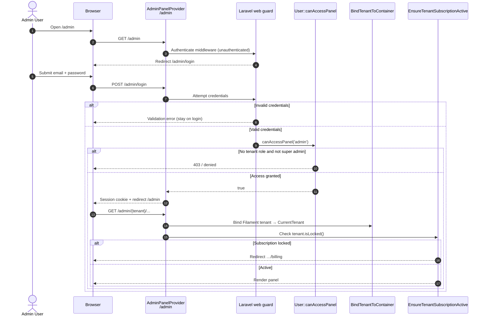

### Service Calls

| Step | Call | File |
|------|------|------|
| Panel login enabled | `->login()` | `AdminPanelProvider.php:47` |
| Auth middleware stack | `Authenticate::class` | `AdminPanelProvider.php:115-118` |
| Panel access gate | `User::canAccessPanel()` | `Modules/Core/app/Models/User.php:463-484` |
| Tenant bind | `CurrentTenant::set()` | `BindTenantToContainer.php:31` |
| Subscription lock | `Tenant::isLocked()` | `EnsureTenantSubscriptionActive.php:20-26` |

### Database Interaction

| Step | Table / model | Operation |
|------|---------------|-----------|
| Login | `users` | Read by email; session auth |
| Access check | `user_tenant_roles` | `userTenantRoles()->exists()` |
| Super admin | `users.is_super_admin` | Boolean bypass |
| Tenant context | `tenants` | Filament tenant switcher |

### External Call

None.

### Error Branches

| Branch | Trigger | Evidence |
|--------|---------|----------|
| Invalid credentials | Failed guard attempt | Filament login form |
| Panel denied | `canAccessPanel` false | `User.php:476` |
| Subscription locked | `tenant->isLocked()` | `EnsureTenantSubscriptionActive.php:20` |

---

## SD-02 — API Bearer Token Authentication

### Step-by-step Message Flow

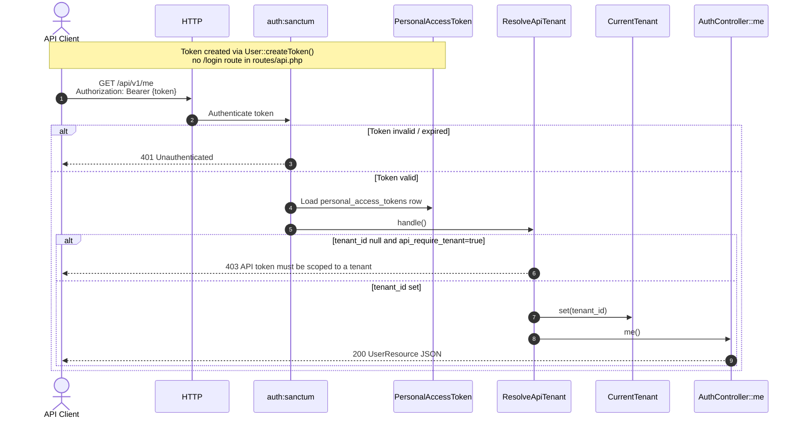

### Service Calls

| Step | Call | File |
|------|------|------|
| Route middleware | `auth:sanctum`, `resolve.api.tenant` | `routes/api.php:44-46` |
| Token model | `PersonalAccessToken` (+ `tenant_id`) | `app/Models/PersonalAccessToken.php` |
| Tenant resolution | `ResolveApiTenant::handle()` | `ResolveApiTenant.php:15-34` |
| Profile | `AuthController::me()` | `AuthController.php:12-14` |

### Database Interaction

| Step | Table | Operation |
|------|-------|-----------|
| Auth | `personal_access_tokens` | Lookup by token hash |
| Tenant scope | `personal_access_tokens.tenant_id` | Read |
| User | `users` | Load authenticated user |

### External Call

None.

### Error Branches

| Branch | HTTP | Evidence |
|--------|------|----------|
| Unauthenticated | 401 | Sanctum |
| Token without tenant | 403 | `ResolveApiTenant.php:24-25` |
| No tenant on token endpoint | 404 `no_tenant` | `AuthController.php:21-22` (tenants/current only) |

---

## SD-03 — API Create Payment (Write Transaction)

### Step-by-step Message Flow

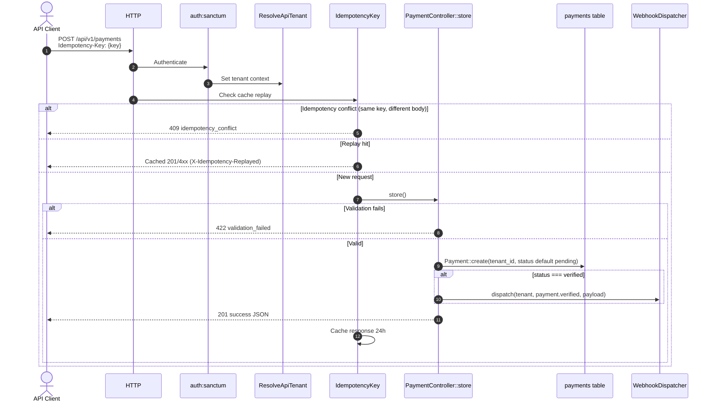

### Service Calls

| Step | Call | File |
|------|------|------|
| Controller | `PaymentController::store()` | `PaymentController.php:19-62` |
| Idempotency | `IdempotencyKey::handle()` | `IdempotencyKey.php:14-52` |
| Outbound event | `WebhookDispatcher::dispatch()` | `WebhookDispatcher.php:16-37` |

### Database Interaction

| Step | Model | Operation |
|------|-------|-----------|
| Create | `Modules\Finance\Models\Payment` | INSERT with `tenant_id` |
| Webhook prep | `webhook_deliveries` | INSERT (via dispatcher) |

### External Call

Deferred to SD-10 (`DeliverWebhookJob`).

### Error Branches

| Branch | Response | Evidence |
|--------|----------|----------|
| Validation | 422 | `PaymentController.php:33-35` |
| Idempotency conflict | 409 | `IdempotencyKey.php:29-34` |
| Unauthenticated | 401 | Sanctum |

---

## SD-04 — API Create Applicant (Write Transaction)

### Step-by-step Message Flow

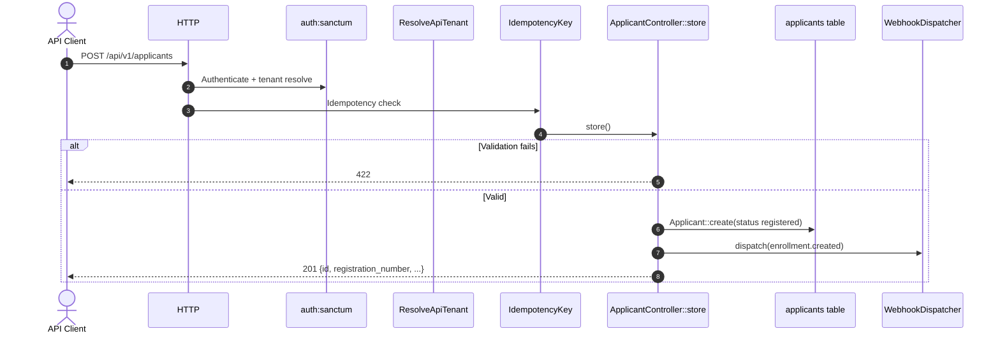

### Service Calls

| Step | Call | File |
|------|------|------|
| Controller | `ApplicantController::store()` | `ApplicantController.php:19-64` |
| Webhook | `enrollment.created` event | `ApplicantController.php:47-54` |

### Database Interaction

| Step | Model | Operation |
|------|-------|-----------|
| Create | `Modules\Enrollment\Models\Applicant` | INSERT |

### External Call

Outbound webhook via SD-10.

### Error Branches

| Branch | Response | Evidence |
|--------|----------|----------|
| Validation | 422 | `ApplicantController.php:35-37` |

---

## SD-05 — Purchase Requisition Workflow Approval

### Step-by-step Message Flow

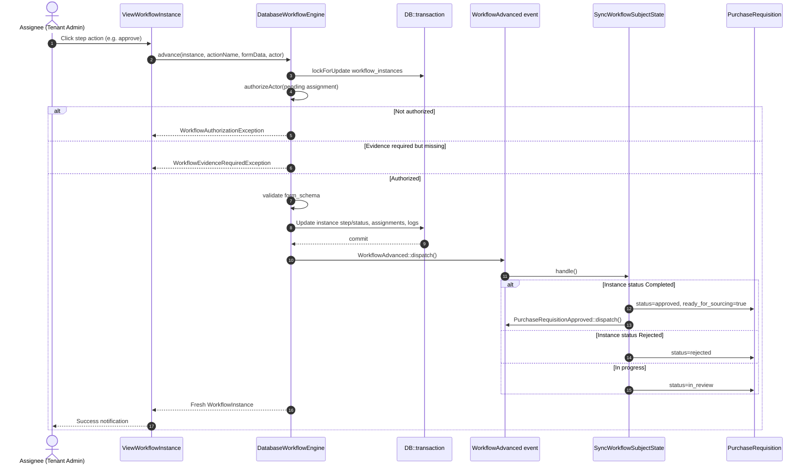

### Service Calls

| Step | Call | File |
|------|------|------|
| UI action | `ViewWorkflowInstance` header action | `ViewWorkflowInstance.php:86-109` |
| Engine | `DatabaseWorkflowEngine::advance()` | `DatabaseWorkflowEngine.php:37-92` |
| Subject sync | `SyncWorkflowSubjectState::handle()` | `SyncWorkflowSubjectState.php:15-72` |
| PR approved event | `PurchaseRequisitionApproved::dispatch()` | `SyncWorkflowSubjectState.php:54` |

### Database Interaction

| Step | Tables | Operation |
|------|--------|-----------|
| Lock | `workflow_instances` | `lockForUpdate` |
| Advance | `workflow_assignments`, `workflow_instance_logs` | UPDATE/INSERT |
| Final approve | `purchase_requisitions` | `status`, `approved_by`, `approved_at` |

### External Call

None directly; downstream SD-12 (RFQ automation).

### Error Branches

| Branch | Exception / behavior | Evidence |
|--------|---------------------|----------|
| No pending assignment | Actions hidden | `ViewWorkflowInstance.php:47-48` |
| Unauthorized actor | `WorkflowAuthorizationException` | `DatabaseWorkflowEngine.php:48` |
| Missing evidence | `WorkflowEvidenceRequiredException` | `DatabaseWorkflowEngine.php:52-62` |

---

## SD-06 — Leave Request Manual Approval

### Step-by-step Message Flow

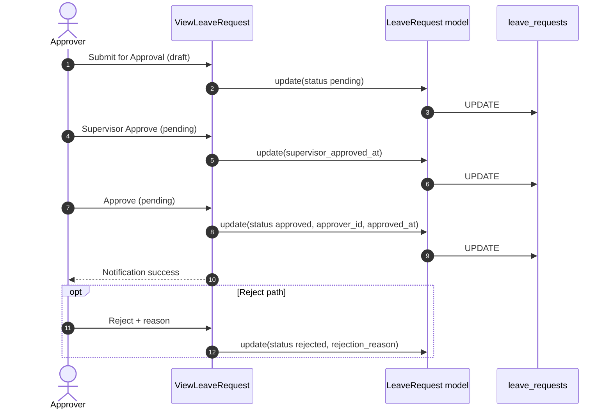

### Service Calls

| Step | Call | File |
|------|------|------|
| Submit | `ViewLeaveRequest` submitForApproval | `ViewLeaveRequest.php:31-41` |
| Supervisor | supervisorApprove action | `ViewLeaveRequest.php:43-55` |
| Approve | approve action | `ViewLeaveRequest.php:57-71` |
| Reject | reject action | `ViewLeaveRequest.php:73-91` |

### Database Interaction

| Field | Transition |
|-------|------------|
| `status` | `draft` → `pending` → `approved` / `rejected` |
| `supervisor_approved_at` | Set on supervisor step |
| `approver_id`, `approved_at` | Set on final approve |

### External Call

None.

### Error Branches

| Branch | Behavior | Evidence |
|--------|----------|----------|
| Wrong status | Action not visible | `->visible(fn (): bool => $record->status === …)` |

---

## SD-07 — Applicant Acceptance Finalization Pipeline

### Step-by-step Message Flow

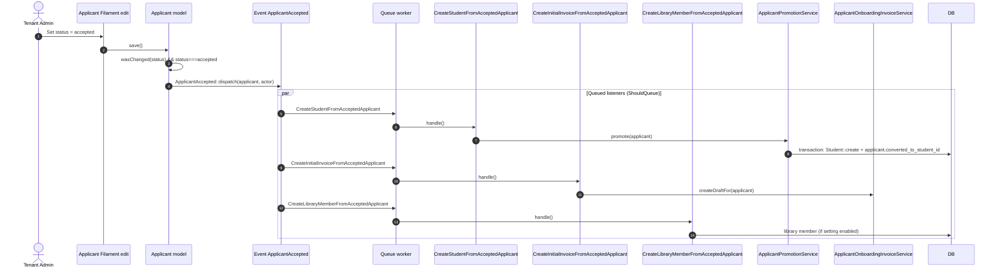

### Service Calls

| Step | Call | File |
|------|------|------|
| Trigger | `Applicant::updated` booted callback | `Applicant.php:68-78` |
| Student | `ApplicantPromotionService::promote()` | `ApplicantPromotionService.php:26-70` |
| Invoice listener | `CreateInitialInvoiceFromAcceptedApplicant` | `CreateInitialInvoiceFromAcceptedApplicant.php:21-28` |
| Student listener | `CreateStudentFromAcceptedApplicant` | `CreateStudentFromAcceptedApplicant.php:21-28` |

### Database Interaction

| Step | Models | Operation |
|------|--------|-----------|
| Accept | `applicants` | UPDATE `status` |
| Promote | `students`, `applicants.converted_to_student_id` | INSERT + UPDATE |
| Invoice | `student_invoices` | INSERT draft (service-dependent) |
| Library | `library_members` | INSERT (setting-gated) |

### External Call

None.

### Error Branches

| Branch | Behavior | Evidence |
|--------|----------|----------|
| Auto-promote disabled | `promote()` returns null | `ApplicantPromotionService.php:28-30` |
| Already converted | Idempotent return existing student | `ApplicantPromotionService.php:34-36` |
| Setting off per listener | Listener skips via setting / AutomationRunLogger | `EVENTS.md`, listener services |

---

## SD-08 — Midtrans Subscription Webhook Finalization

### Step-by-step Message Flow

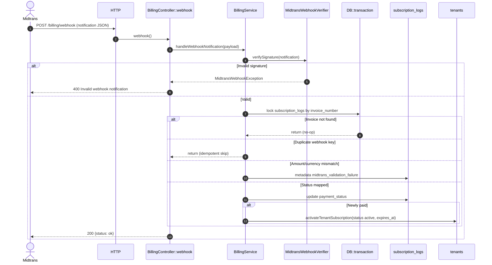

### Service Calls

| Step | Call | File |
|------|------|------|
| Controller | `BillingController::webhook()` | `BillingController.php:16-36` |
| Handler | `BillingService::handleWebhookNotification()` | `BillingService.php:117-195` |
| Activate | `activateTenantSubscription()` | `BillingService.php:197-205` |

### Database Interaction

| Table | Operation |
|-------|-----------|
| `subscription_logs` | `lockForUpdate`, UPDATE `payment_status`, metadata |
| `tenants` | UPDATE `status`, `subscribed_at`, `subscription_expires_at` on first paid |

### External Call

| Direction | Target | Evidence |
|-----------|--------|----------|
| Inbound | Midtrans notification POST | `routes/web.php:12` |
| Outbound (user flow) | Midtrans Snap token | `BillingService::createSnapPayment()` (SD related, `BillingPage.php:75-98`) |

### Error Branches

| Branch | HTTP | Evidence |
|--------|------|----------|
| Invalid signature | 400 | `BillingController.php:20-26` |
| Processing error | 500 | `BillingController.php:27-33` |
| Amount mismatch | No status change; metadata flag | `BillingService.php:143-150` |
| Duplicate webhook | Early return | `BillingService.php:139-141` |

---

## SD-09 — Moodle Course Sync (Outbound Integration)

### Step-by-step Message Flow

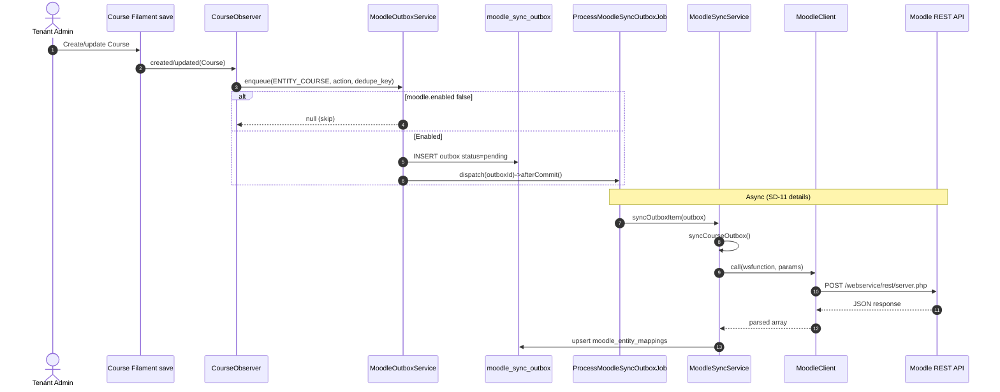

### Service Calls

| Step | Call | File |
|------|------|------|
| Observer | `CourseObserver::enqueue()` | `CourseObserver.php:55-76` |
| Outbox | `MoodleOutboxService::enqueue()` | `MoodleOutboxService.php:35-72` |
| Sync | `MoodleSyncService::syncOutboxItem()` | `MoodleSyncService.php:33-44` |
| HTTP | `MoodleClient::call()` | `MoodleClient.php:12-60` |

### Database Interaction

| Table | Operation |
|-------|-----------|
| `courses` | Source entity (Campus module) |
| `moodle_sync_outbox` | INSERT pending row |
| `moodle_entity_mappings` | UPSERT after successful sync |

### External Call

| Target | Protocol | Evidence |
|--------|----------|----------|
| Moodle | REST `server.php` form POST | `MoodleClient.php:25-38` |

### Error Branches

| Branch | Behavior | Evidence |
|--------|----------|----------|
| Moodle disabled | No outbox row | `MoodleOutboxService.php:43-45` |
| Duplicate dedupe_key | Swallow `QueryException` 23000 | `MoodleOutboxService.php:65-67` |
| Sync failure | Job retry / terminal failed | `ProcessMoodleSyncOutboxJob.php:55-69` |

---

## SD-10 — Tenant Outbound Webhook Delivery

### Step-by-step Message Flow

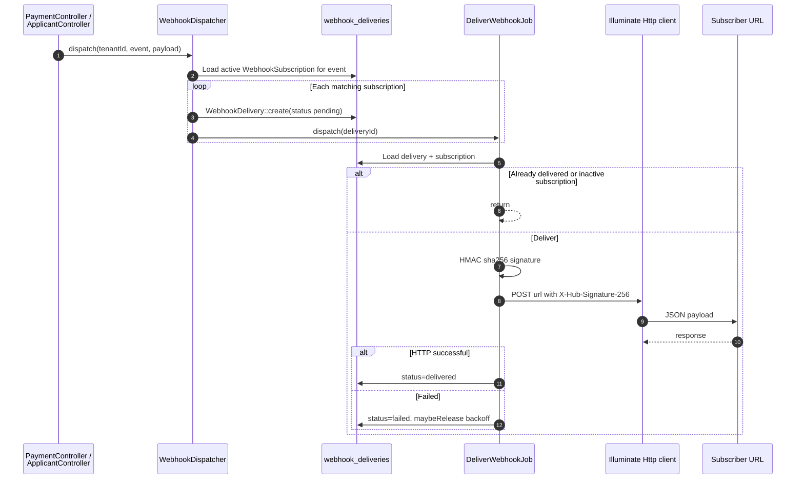

### Service Calls

| Step | Call | File |
|------|------|------|
| Dispatch | `WebhookDispatcher::dispatch()` | `WebhookDispatcher.php:16-37` |
| Deliver | `DeliverWebhookJob::handle()` | `DeliverWebhookJob.php:23-71` |
| Backoff | `backoff()` 1m→8h | `DeliverWebhookJob.php:74-77` |

### Database Interaction

| Table | Operation |
|-------|-----------|
| `webhook_subscriptions` | READ active, event filter |
| `webhook_deliveries` | INSERT; UPDATE status, attempt_count |

### External Call

| Target | Headers | Evidence |
|--------|---------|----------|
| Tenant-configured URL | `X-Hub-Signature-256`, `X-Webhook-Event`, `X-Delivery-Id` | `DeliverWebhookJob.php:45-52` |

### Error Branches

| Branch | Behavior | Evidence |
|--------|----------|----------|
| Inactive subscription | `failed` + message | `DeliverWebhookJob.php:33-36` |
| HTTP non-2xx | `failed` + retry release | `DeliverWebhookJob.php:54-63` |
| Exception | `failed` + error_message | `DeliverWebhookJob.php:64-70` |

---

## SD-11 — Moodle Outbox Background Job Processing

### Step-by-step Message Flow

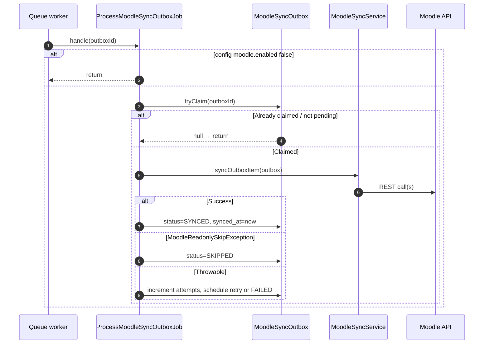

### Service Calls

| Step | Call | File |
|------|------|------|
| Job | `ProcessMoodleSyncOutboxJob::handle()` | `ProcessMoodleSyncOutboxJob.php:27-71` |
| Claim | `MoodleSyncOutbox::tryClaim()` | Referenced in job line 33 |
| Sync | `MoodleSyncService::syncOutboxItem()` | `MoodleSyncService.php:33-44` |

### Database Interaction

| Table | Operation |
|-------|-----------|
| `moodle_sync_outbox` | Atomic claim; UPDATE status, attempts, `next_retry_at`, `last_error` |

### External Call

Moodle REST via `MoodleClient` (see SD-09).

### Error Branches

| Branch | Outbox status | Evidence |
|--------|---------------|----------|
| Readonly mode | `SKIPPED` | `ProcessMoodleSyncOutboxJob.php:48-54` |
| Retries exhausted | `FAILED` + report | `ProcessMoodleSyncOutboxJob.php:58-68` |
| Transient error | `PENDING` + `next_retry_at` | `ProcessMoodleSyncOutboxJob.php:60-65` |

---

## SD-12 — PR-Approved RFQ Auto-Creation (Queued Listener)

### Step-by-step Message Flow

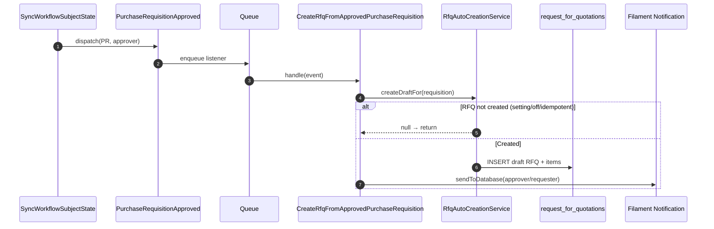

### Service Calls

| Step | Call | File |
|------|------|------|
| Event | `PurchaseRequisitionApproved` | `SyncWorkflowSubjectState.php:54` |
| Listener | `CreateRfqFromApprovedPurchaseRequisition::handle()` | `CreateRfqFromApprovedPurchaseRequisition.php:17-31` |
| Service | `RfqAutoCreationService::createDraftFor()` | Referenced line 25 |

### Database Interaction

| Model | Operation |
|-------|-----------|
| `PurchaseRequisition` | Source (approved) |
| `RequestForQuotation` | INSERT draft |

### External Call

None.

### Error Branches

| Branch | Behavior | Evidence |
|--------|----------|----------|
| No requisition | Early return | `CreateRfqFromApprovedPurchaseRequisition.php:21-23` |
| RFQ skipped | `createDraftFor` null | `CreateRfqFromApprovedPurchaseRequisition.php:27-29` |
| Notification failure | Swallowed | `CreateRfqFromApprovedPurchaseRequisition.php:46-48` |

---

## SD-13 — Leave Request PDF Report Generation

### Step-by-step Message Flow

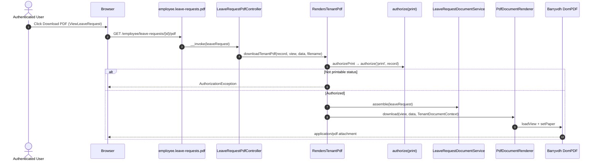

### Service Calls

| Step | Call | File |
|------|------|------|
| UI link | `ViewLeaveRequest` downloadPdf | `ViewLeaveRequest.php:24-30` |
| Controller | `LeaveRequestPdfController::__invoke()` | `LeaveRequestPdfController.php:14-22` |
| PDF trait | `RendersTenantPdf::downloadTenantPdf()` | `RendersTenantPdf.php:22-48` |
| Assembler | `LeaveRequestDocumentService::assemble()` | Referenced in controller |
| Renderer | `PdfDocumentRenderer::download()` | `PdfDocumentRenderer.php:14-24` |

### Database Interaction

| Step | Operation |
|------|-----------|
| Route model binding | READ `leave_requests` |
| Tenant context | READ `tenants` (+ optional `organizations`) |

### External Call

None (local DomPDF render).

### Error Branches

| Branch | Exception | Evidence |
|--------|-----------|----------|
| Policy denied | AuthorizationException | `RendersTenantPdf.php:32` |
| Not printable | AuthorizationException | `RendersTenantPdf.php:34-36` |
| Action hidden in UI | `isPrintable()` false | `ViewLeaveRequest.php:28` |

---

## Cross-Diagram Service Index

| Service / component | Diagrams | File |
|-------------------|----------|------|
| `BillingService` | SD-08 | `app/Services/BillingService.php` |
| `WebhookDispatcher` | SD-03, SD-04, SD-10 | `app/Services/WebhookDispatcher.php` |
| `DatabaseWorkflowEngine` | SD-05 | `Modules/Workflow/app/Services/DatabaseWorkflowEngine.php` |
| `SyncWorkflowSubjectState` | SD-05, SD-12 | `Modules/Workflow/app/Listeners/SyncWorkflowSubjectState.php` |
| `ApplicantPromotionService` | SD-07 | `Modules/Enrollment/app/Services/ApplicantPromotionService.php` |
| `MoodleOutboxService` | SD-09, SD-11 | `app/Integrations/Moodle/MoodleOutboxService.php` |
| `MoodleSyncService` | SD-09, SD-11 | `app/Integrations/Moodle/MoodleSyncService.php` |
| `PdfDocumentRenderer` | SD-13 | `Modules/Core/app/Support/Pdf/PdfDocumentRenderer.php` |

---

## Coverage Notes

| Requested category | Diagram(s) | Gap |
|--------------------|------------|-----|
| Login / auth | SD-01, SD-02 | No `POST /api/login` route — API uses pre-issued Sanctum PAT |
| Create transaction | SD-03, SD-04 | Billing invoice creation (`BillingPage::generateInvoice`) follows same BillingService path as SD-08 |
| Approval | SD-05, SD-06 | Budget workflow mirrors SD-05 via `SyncBudgetWorkflowState` |
| Posting / finalization | SD-07, SD-08 | Finance payment verify in admin may use separate `FinanceControlService` (not expanded here) |
| Integration call | SD-09, SD-10 | Exam runtime ingest (`ExamRuntimeWebhookController`) is inbound-only, no outbound |
| Background job | SD-11, SD-12 | Other `ShouldQueue` listeners follow same Event → Queue pattern |
| Report generation | SD-13 | 20+ module `*PdfController` classes share `RendersTenantPdf` pattern |
