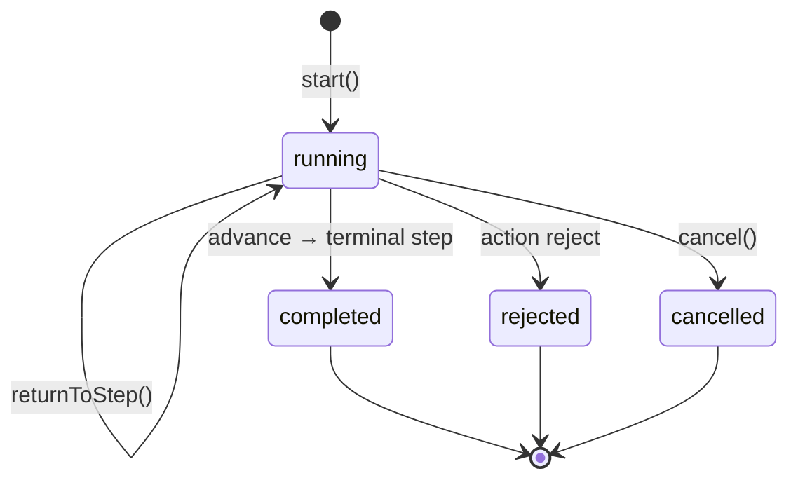
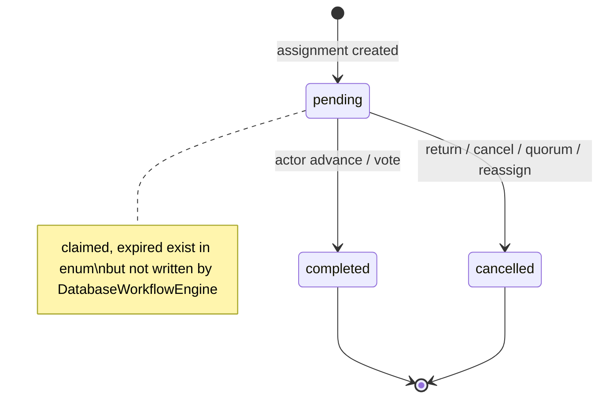
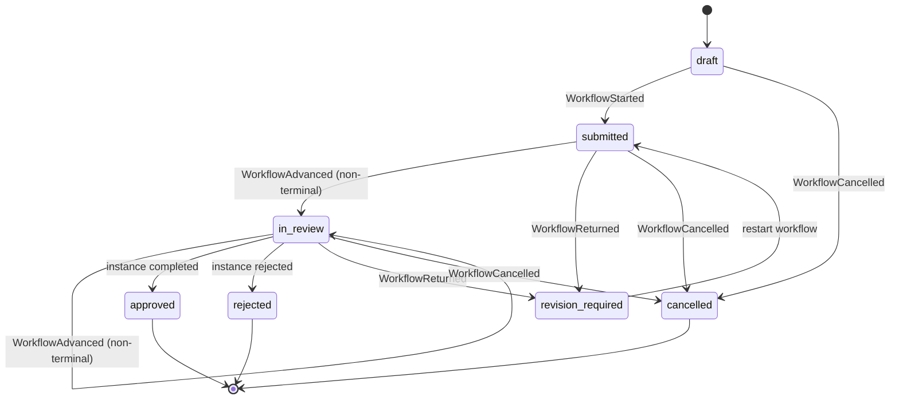
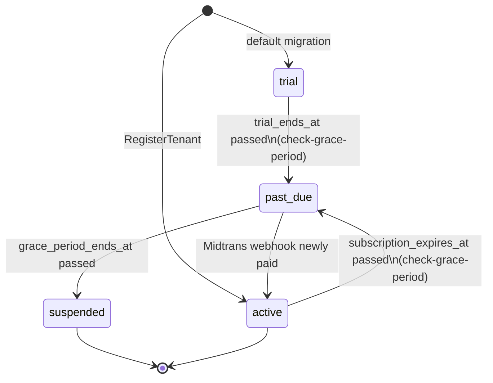
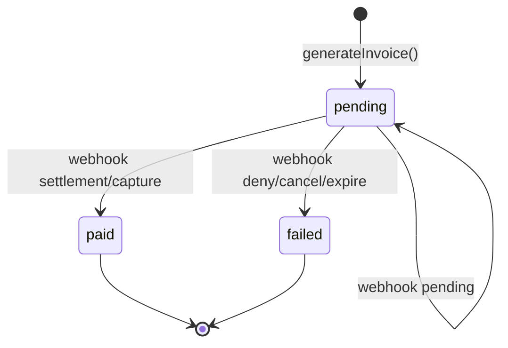
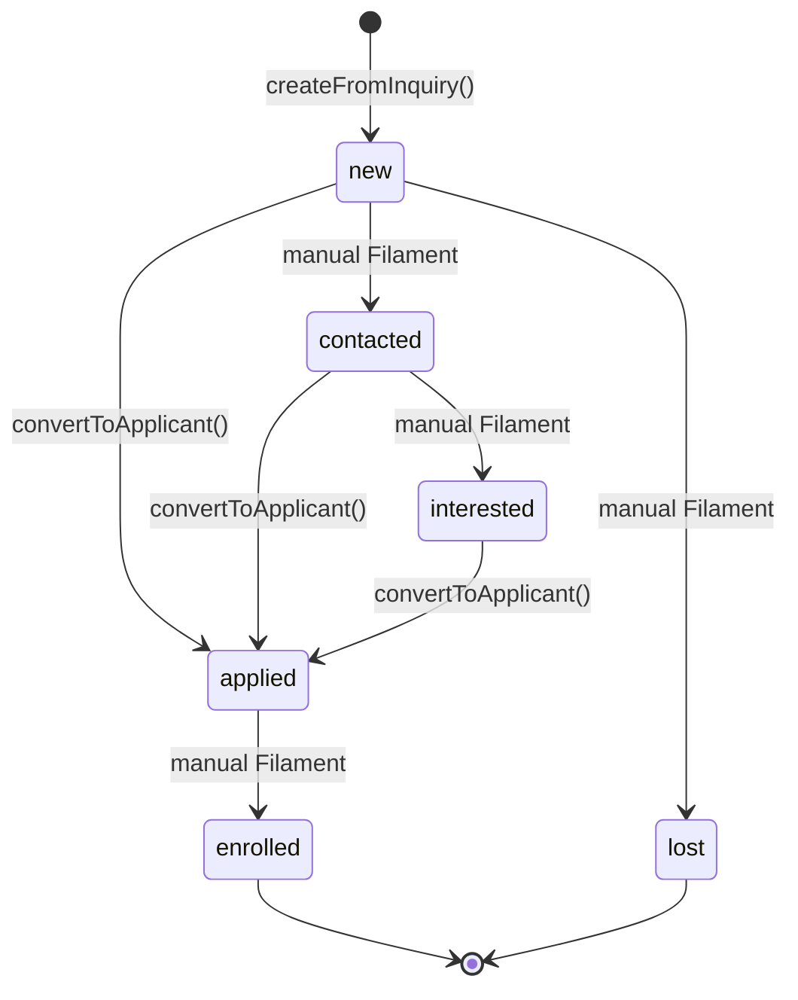
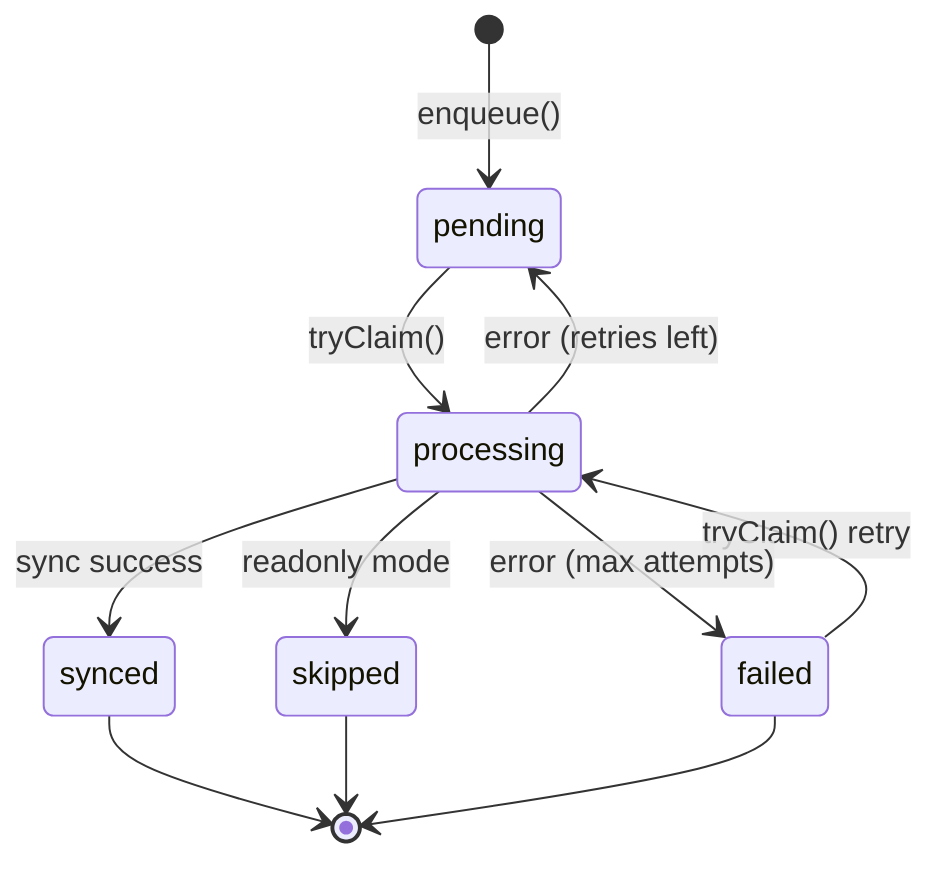
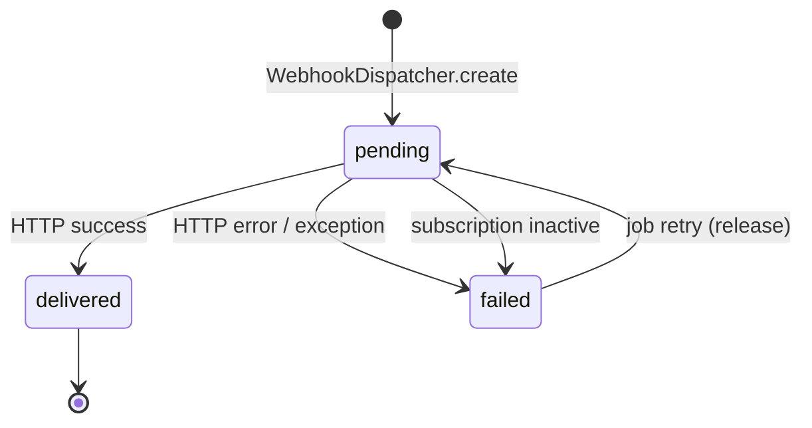

```mermaid
stateDiagram-v2
    [*] --> registered : default / API

    registered --> accepted : status edit
    screening --> accepted : status edit
    registered --> rejected : status edit (manual)
    screening --> rejected : status edit (manual)

    accepted --> registered : revert status
    accepted --> screening : revert status
    accepted --> rejected : revert status

    state accepted {
        [*] --> pipeline : ApplicantAccepted
        pipeline --> [*] : queued listeners
    }

    accepted --> enrolled : manual (UI state)

    note right of screening : Manual Filament assignment;\nno dedicated service transition
```

# State Diagrams

State machines discovered from enums, model guards, workflow listeners, services, and Filament status options. **Automated transitions** are separated from **manual-only states** (appear in UI/filters but no transition handler found in services).

**Verification date:** 2026-06-19  
**Related:** `ACTIVITY_DIAGRAMS.md`, `SEQUENCE_DIAGRAMS.md`, `EVENTS.md`

---

## State per Entity / Process

| ID | Entity / process | State field | State source type |
|----|------------------|-------------|-----------------|
| ST-01 | `WorkflowInstance` | `status` | PHP enum `WorkflowInstanceStatus` |
| ST-02 | `WorkflowAssignment` | `status` | PHP enum `WorkflowAssignmentStatus` |
| ST-03 | `PurchaseRequisition` | `status` | String + workflow listener sync |
| ST-04 | `Budget` | `status` | String + workflow listener sync |
| ST-05 | `LeaveRequest` | `status` | String + Filament actions |
| ST-06 | `Applicant` | `status` | String + model events |
| ST-07 | `Payment` | `status` | String + `FinanceControlService` |
| ST-08 | `StudentInvoice` | `status` | String + `FinanceControlService` |
| ST-09 | `Tenant` (SaaS lifecycle) | `status` | String + billing / scheduler |
| ST-10 | `SubscriptionLog` | `payment_status` | String + `BillingService` webhook |
| ST-11 | `Lead` | `stage` | `Lead::STAGES` constant |
| ST-12 | `MoodleSyncOutbox` | `status` | Model constants + job |
| ST-13 | `WebhookDelivery` | `status` | String + `DeliverWebhookJob` |

---

## ST-01 — WorkflowInstance

### States (enum only)

| State | Value | Source |
|-------|-------|--------|
| Running | `running` | `WorkflowInstanceStatus.php` |
| Completed | `completed` | same |
| Rejected | `rejected` | same |
| Cancelled | `cancelled` | same |

### Valid Transitions

| From | To | Trigger | Source |
|------|-----|---------|--------|
| — | `running` | `WorkflowInstanceStarter::start()` | `DatabaseWorkflowInstanceStarter.php:62-66` |
| `running` | `running` | `advance()` linear non-terminal step | `DatabaseWorkflowEngine.php:443-447` |
| `running` | `running` | `advanceParallel()` quorum not reached | `DatabaseWorkflowEngine.php:188-203` |
| `running` | `completed` | `advance()` / quorum + terminal `nextStep` | `DatabaseWorkflowEngine.php:443-444` |
| `running` | `rejected` | `advance()` with `actionName === 'reject'` | `DatabaseWorkflowEngine.php:435-436` |
| `running` | `cancelled` | `cancel()` OR `actionName === 'cancel'` | `DatabaseWorkflowEngine.php:315-340`, `439-440` |
| `running` | `running` | `returnToStep()` resets terminal timestamps | `DatabaseWorkflowEngine.php:279-287` |

### Invalid Transitions

| Attempt | Guard | Source |
|---------|-------|--------|
| Any action without pending assignment | `WorkflowAuthorizationException` (unless super admin) | `DatabaseWorkflowEngine.php:416-430` |
| Advance with missing required evidence | `WorkflowEvidenceRequiredException` | `DatabaseWorkflowEngine.php:52-62` |
| Return to unknown step | `WorkflowAuthorizationException` | `DatabaseWorkflowEngine.php:263-265` |

### Trigger Events

| Event | When | Source |
|-------|------|--------|
| `WorkflowStarted` | After start transaction | `DatabaseWorkflowInstanceStarter.php:85` |
| `WorkflowAdvanced` | After successful advance with transition | `DatabaseWorkflowEngine.php:87-88` |
| `WorkflowReturned` | After return | `DatabaseWorkflowEngine.php:305-310` |
| `WorkflowCancelled` | After cancel | `DatabaseWorkflowEngine.php:356` |

### Side Effects

Listeners on events: `SyncWorkflowSubjectState`, `SyncBudgetWorkflowState`, `CreateAssignmentsForCurrentStep`, `RunWorkflowAutomatedActions`, `ScheduleWorkflowSlaCheck` (see `Modules/Workflow/app/Providers/EventServiceProvider.php`).

### Source Files

- `Modules/Workflow/app/Enums/WorkflowInstanceStatus.php`
- `Modules/Workflow/app/Services/DatabaseWorkflowEngine.php`
- `Modules/Workflow/app/Services/DatabaseWorkflowInstanceStarter.php`

### State Diagram



---

## ST-02 — WorkflowAssignment

### States (enum only)

| State | Value | Source |
|-------|-------|--------|
| Pending | `pending` | `WorkflowAssignmentStatus.php` |
| Claimed | `claimed` | same |
| Completed | `completed` | same |
| Cancelled | `cancelled` | same |
| Expired | `expired` | same |

### Valid Transitions (verified in engine)

| From | To | Trigger | Source |
|------|-----|---------|--------|
| `pending` | `completed` | Actor completes step action | `DatabaseWorkflowEngine.php:115-122`, `171-180` |
| `pending` | `cancelled` | `returnToStep()`, `cancel()`, parallel quorum reached | `DatabaseWorkflowEngine.php:272-276`, `328-332`, `207-212` |
| `pending` | `cancelled` | `reassign()` on old assignment | `DatabaseWorkflowEngine.php:377-380` |
| — | `pending` | New assignment created for step | `DatabaseWorkflowEngine.php:382-395` |

### Invalid Transitions

| Note | Source |
|------|--------|
| `claimed` / `expired` not set by `DatabaseWorkflowEngine` in reviewed paths | Engine grep — no writes to `claimed` or `expired` |
| Complete without pending row for actor | `authorizeActor()` | `DatabaseWorkflowEngine.php:422-429` |

### Side Effects

Completing assignment may advance instance (ST-01). Pending assignments drive Filament action visibility (`ViewWorkflowInstance.php:47-48`).

### Source Files

- `Modules/Workflow/app/Enums/WorkflowAssignmentStatus.php`
- `Modules/Workflow/app/Services/DatabaseWorkflowEngine.php`

### State Diagram



---

## ST-03 — PurchaseRequisition

### States

| State | Observed in | Automated? |
|-------|-------------|------------|
| `draft` | Migration default | Initial |
| `submitted` | Table filter, listener | Yes — `WorkflowStarted` |
| `in_review` | Table filter, listener | Yes — intermediate advance |
| `revision_required` | Listener | Yes — `WorkflowReturned` |
| `approved` | Table filter, listener | Yes — instance `completed` |
| `rejected` | Table filter, listener | Yes — instance `rejected` |
| `cancelled` | Table filter, listener | Yes — `WorkflowCancelled` |

Sources: migration `default('draft')`, `PurchaseRequisitionsTable.php:87-94`, `SyncWorkflowSubjectState.php`.

### Valid Transitions

| From | To | Trigger | Source |
|------|-----|---------|--------|
| `draft` | `submitted` | Workflow started | `SyncWorkflowSubjectState.php:25-28` |
| `submitted` / `in_review` | `in_review` | Workflow advanced (non-terminal) | `SyncWorkflowSubjectState.php:69-72` |
| * | `revision_required` | Workflow returned | `SyncWorkflowSubjectState.php:29-33` |
| * | `cancelled` | Workflow cancelled | `SyncWorkflowSubjectState.php:34-38` |
| * | `approved` | Instance `completed` | `SyncWorkflowSubjectState.php:46-54` |
| * | `rejected` | Instance `rejected` | `SyncWorkflowSubjectState.php:59-64` |

### Invalid Transitions

| Guard | Source |
|-------|--------|
| Start workflow while instance already `running` | `ViewPurchaseRequisition.php:60-64` |
| Manual status edits not blocked in model — **automation assumes workflow-driven sync** | No model-level state machine guard |

### Side Effects

| Transition | Side effect |
|------------|-------------|
| → `approved` | `ready_for_sourcing=true`, `PurchaseRequisitionApproved` event → optional RFQ | `SyncWorkflowSubjectState.php:47-54` |

### Source Files

- `Modules/Procurement/database/migrations/2026_03_24_152544_create_purchase_requisitions_table.php`
- `Modules/Workflow/app/Listeners/SyncWorkflowSubjectState.php`
- `Modules/Procurement/app/Filament/Resources/PurchaseRequisitions/Tables/PurchaseRequisitionsTable.php`

### State Diagram



---

## ST-04 — Budget

### States

| State | Evidence |
|-------|----------|
| `draft` | Migration default; start workflow guard | `create_budgets_table.php:24`, `ViewBudget.php:53` |
| `revision_required` | Workflow return | `SyncBudgetWorkflowState.php:30-33`, `ViewBudget.php:53` |
| `submitted` | Workflow started | `SyncBudgetWorkflowState.php:25-28` |
| `in_review` | Intermediate advance | `SyncBudgetWorkflowState.php:67-69` |
| `approved` | Instance completed | `SyncBudgetWorkflowState.php:45-50` |
| `rejected` | Instance rejected | `SyncBudgetWorkflowState.php:55-64` |
| `cancelled` | Workflow cancelled | `SyncBudgetWorkflowState.php:34-37` |
| `closed` | `Budget::isPrintable()` only | `Budget.php:80` — **no automated transition found** |

### Valid Transitions

Same pattern as ST-03 via `SyncBudgetWorkflowState` (budget-specific attribute updates + audit).

### Invalid Transitions

| Guard | Source |
|-------|--------|
| Start workflow unless `draft` or `revision_required` and no running instance | `ViewBudget.php:53-57` |

### Side Effects

`AuditTrailRecorder::record()` on each budget status sync (`SyncBudgetWorkflowState.php:76-82`).

### Source Files

- `Modules/Finance/database/migrations/2026_03_24_152535_create_budgets_table.php`
- `Modules/Workflow/app/Listeners/SyncBudgetWorkflowState.php`
- `Modules/Finance/app/Filament/Resources/Budgets/Pages/ViewBudget.php`

### State Diagram

```mermaid
stateDiagram-v2
    [*] --> draft

    draft --> submitted : WorkflowStarted
    revision_required --> submitted : WorkflowStarted
    submitted --> in_review : WorkflowAdvanced
    in_review --> approved : instance completed
    in_review --> rejected : instance rejected
    in_review --> revision_required : WorkflowReturned
    submitted --> cancelled : WorkflowCancelled
    in_review --> cancelled : WorkflowCancelled

    approved --> [*]
    rejected --> [*]
    cancelled --> [*]

    note right of closed : State in isPrintable() only;\nno automated transition located
```

---

## ST-05 — LeaveRequest

### States

| State | Evidence |
|-------|----------|
| `draft` | Migration default; API create | `create_leave_requests_table.php:24`, `LeaveRequestController.php:35` |
| `pending` | Submit action | `ViewLeaveRequest.php:38` |
| `approved` | Approve action | `ViewLeaveRequest.php:64-68` |
| `rejected` | Reject action | `ViewLeaveRequest.php:85-88` |
| `cancelled` | Table filter only | `LeaveRequestsTable.php:88` — **no action handler found** |

### Valid Transitions

| From | To | Trigger | Source |
|------|-----|---------|--------|
| — | `draft` | API `POST leave-requests` | `LeaveRequestController.php:35` |
| `draft` | `pending` | Submit for Approval | `ViewLeaveRequest.php:38` |
| `pending` | `approved` | Approve (supervisor step optional) | `ViewLeaveRequest.php:57-68` |
| `pending` | `rejected` | Reject + reason | `ViewLeaveRequest.php:73-88` |

### Invalid Transitions

| Guard | Source |
|-------|--------|
| Approve/reject actions hidden unless `status === 'pending'` | `ViewLeaveRequest.php:61,77` |
| Submit hidden unless `draft` | `ViewLeaveRequest.php:35` |

### Side Effects

`supervisor_approved_at` set independently (does not change `status`) (`ViewLeaveRequest.php:50-52`).

### Source Files

- `Modules/Employee/database/migrations/2026_03_24_152720_create_leave_requests_table.php`
- `Modules/Employee/app/Filament/Resources/LeaveRequests/Pages/ViewLeaveRequest.php`
- `app/Http/Controllers/Api/v1/LeaveRequestController.php`

### State Diagram

```mermaid
stateDiagram-v2
    [*] --> draft : API create / manual

    draft --> pending : submitForApproval
    pending --> approved : approve
    pending --> rejected : reject (reason required)

    approved --> [*]
    rejected --> [*]

    note right of cancelled : In UI filter only;\nno verified transition handler
```

---

## ST-06 — Applicant

### States

| State | Evidence |
|-------|----------|
| `registered` | Migration default; API default | `create_applicants_table.php:35`, `ApplicantController.php:43` |
| `screening` | Table filter | `ApplicantsTable.php:141` |
| `accepted` | Model event trigger | `Applicant.php:76-78` |
| `rejected` | `isRejected()` | `Applicant.php:233` |
| `enrolled` | Table filter; `isEnrolled()` | `ApplicantsTable.php:144`, `Applicant.php:228` |

### Valid Transitions (automated)

| From | To | Trigger | Side effects | Source |
|------|-----|---------|--------------|--------|
| * | `accepted` | Status update | `ApplicantAccepted` → student/invoice/library listeners | `Applicant.php:76-78` |
| `accepted` | * (not `accepted`) | Status update | `ApplicantAcceptanceReverted` → void open invoices | `Applicant.php:82-87`, `CompensateApplicantAcceptance.php` |

### Invalid Transitions

No model guard preventing status edits. Business rules enforced in listeners (idempotent promote, skip if already converted).

### Side Effects

| Event | Side effects |
|-------|--------------|
| `ApplicantAccepted` | Queued: student, draft invoice, library member (settings) | `EVENTS.md` |
| `ApplicantAcceptanceReverted` | Void invoices `draft`/`issued`/`partial`; **does not delete student** | `CompensateApplicantAcceptance.php`, `EVENTS.md` |

### Source Files

- `Modules/Enrollment/app/Models/Applicant.php`
- `Modules/Enrollment/app/Filament/Resources/Applicants/Tables/ApplicantsTable.php`
- `Modules/Enrollment/app/Listeners/CompensateApplicantAcceptance.php`

### State Diagram



---

## ST-07 — Payment

### States

| State | Evidence |
|-------|----------|
| `pending` | Migration default; API default | `create_payments_table.php:29`, `PaymentController.php:41` |
| `verified` | `FinanceControlService`, API validation | `FinanceControlService.php:53`, `PaymentController.php:30` |
| `rejected` | `FinanceControlService` | `FinanceControlService.php:84` |
| `reversed` | `isLockedForMutation()` | `Payment.php:76` — **no `reverse` action found in ViewPayment** |

### Valid Transitions

| From | To | Trigger | Source |
|------|-----|---------|--------|
| — | `pending` | Create (API/Filament) | `PaymentController.php:41` |
| — | `verified` | API create with `status=verified` | `PaymentController.php:30,41` |
| `pending` | `verified` | `FinanceControlService::verifyPayment()` | `FinanceControlService.php:43-71` |
| `pending` | `rejected` | `FinanceControlService::rejectPayment()` | `FinanceControlService.php:74-90` |

### Invalid Transitions

| Guard | Source |
|-------|--------|
| Verify/reject when `isLockedForMutation()` (`verified`, `rejected`, `reversed`) | `FinanceControlService.php:48-50,79-81` |
| Filament actions visible only when `pending` | `ViewPayment.php:38,58` |

### Side Effects

| To | Side effects |
|----|--------------|
| `verified` | Journal entry, invoice recalc, `NotificationService::paymentVerified`, optional `payment.verified` webhook (API path) | `FinanceControlService.php:59-68`, `PaymentController.php:44-51` |
| `rejected` | Invoice recalc, audit | `FinanceControlService.php:90-93` |

### Source Files

- `Modules/Finance/app/Models/Payment.php`
- `Modules/Finance/app/Services/FinanceControlService.php`
- `Modules/Finance/app/Filament/Resources/Payments/Pages/ViewPayment.php`

### State Diagram

```mermaid
stateDiagram-v2
    [*] --> pending : create

    pending --> verified : verifyPayment()
    pending --> rejected : rejectPayment()

    verified --> [*]
    rejected --> [*]

    note right of reversed : Referenced in isLockedForMutation();\nno UI transition verified in ViewPayment
```

---

## ST-08 — StudentInvoice

### States

| State | Written by service? | Evidence |
|-------|---------------------|----------|
| `draft` | Yes | Migration default; `recalculateInvoice`, onboarding service |
| `issued` | Yes | `markInvoiceIssued`, `recalculateInvoice` | `FinanceControlService.php:31,198` |
| `partial` | Yes | `recalculateInvoice` | `FinanceControlService.php:199` |
| `paid` | Yes | `recalculateInvoice` | `FinanceControlService.php:200-212` |
| `void` | Yes | Applicant compensation | `CompensateApplicantAcceptance.php:43` |
| `cancelled` | Model guard only | `StudentInvoice.php:89,94` |
| `partially_paid` | UI filter only | `StudentInvoicesTable.php:108` |
| `overdue` | UI filter only | `StudentInvoicesTable.php:110` — **no service write found** |

### Valid Transitions

| From | To | Trigger | Source |
|------|-----|---------|--------|
| — | `draft` | Create (onboarding, manual) | `ApplicantOnboardingInvoiceService.php` |
| `draft` | `issued` | `markInvoiceIssued()` | `FinanceControlService.php:21-33`, `ViewStudentInvoice.php:37` |
| `draft` | `draft` | `recalculateInvoice` (no verified payments) | `FinanceControlService.php:197` |
| `issued` / `partial` | `partial` | Partial verified payments | `FinanceControlService.php:199` |
| * | `paid` | Verified total ≥ invoice amount | `FinanceControlService.php:200-212` |
| `draft`/`issued`/`partial` | `void` | Applicant acceptance reverted | `CompensateApplicantAcceptance.php:38-43` |

### Invalid Transitions

| Guard | Source |
|-------|--------|
| `markInvoiceIssued` only when `status === 'draft'` | `ViewStudentInvoice.php:37` |
| `isLockedForMutation()` when `paid`, `void`, `cancelled` | `StudentInvoice.php:89` |
| Issue locked invoice | `FinanceControlService.php:26-28` |

### Side Effects

| To | Side effects |
|----|--------------|
| `paid` | `StudentInvoicePaid` event (when newly paid) | `FinanceControlService.php:211-212` |

### Source Files

- `Modules/Finance/app/Models/StudentInvoice.php`
- `Modules/Finance/app/Services/FinanceControlService.php`
- `Modules/Enrollment/app/Listeners/CompensateApplicantAcceptance.php`

### State Diagram

```mermaid
stateDiagram-v2
    [*] --> draft

    draft --> issued : markInvoiceIssued()
    draft --> void : ApplicantAcceptanceReverted

    issued --> partial : verifyPayment (partial amount)
    partial --> partial : verifyPayment (still partial)
    partial --> paid : verifyPayment (full amount)
    issued --> paid : verifyPayment (full amount)

  issued --> void : ApplicantAcceptanceReverted
    partial --> void : ApplicantAcceptanceReverted

    paid --> [*]
    void --> [*]

    note right of overdue : UI filter only
    note right of partially_paid : UI label;\nservice writes partial
```

---

## ST-09 — Tenant (SaaS lifecycle)

### States

| State | Evidence |
|-------|----------|
| `trial` | Migration default | `create_tenants_table.php:29` |
| `active` | Registration; webhook activation | `RegisterTenant.php:78`, `BillingService.php:199-200` |
| `past_due` | Grace command | `CheckGracePeriodCommand.php:32,60` |
| `suspended` | Grace command | `CheckGracePeriodCommand.php:46` |

### Valid Transitions

| From | To | Trigger | Source |
|------|-----|---------|--------|
| — | `trial` | Migration default for new tenants | `create_tenants_table.php:29` |
| — | `active` | Tenant registration | `RegisterTenant.php:78` |
| `past_due` / * | `active` | Subscription invoice newly paid (webhook) | `BillingService.php:191-193` |
| `active` | `past_due` | Subscription expired (`fos:billing:check-grace-period`) | `CheckGracePeriodCommand.php:23-37` |
| `trial` | `past_due` | Trial expired (command) | `CheckGracePeriodCommand.php:53-65` |
| `past_due` | `suspended` | Grace period expired | `CheckGracePeriodCommand.php:41-49` |

### Invalid Transitions

| Effect (not hard block) | Source |
|-------------------------|--------|
| `isLocked()` blocks panel except billing when `suspended` or `past_due` past grace | `Tenant.php:165-168`, `EnsureTenantSubscriptionActive.php:20-26` |

### Side Effects

| State | Side effect |
|-------|-------------|
| `active` (from payment) | `subscription_expires_at`, clear `grace_period_ends_at` | `BillingService.php:199-204` |
| `past_due` | Set `grace_period_ends_at` | `CheckGracePeriodCommand.php:33,61` |

### Source Files

- `Modules/Core/app/Models/Tenant.php`
- `app/Console/Commands/CheckGracePeriodCommand.php`
- `app/Services/BillingService.php`
- `app/Filament/Pages/Tenancy/RegisterTenant.php`

### State Diagram



---

## ST-10 — SubscriptionLog.payment_status

### States (from webhook mapping)

| State | Set when | Source |
|-------|----------|--------|
| `pending` | Invoice generated | `BillingService.php:103` |
| `pending` | Midtrans `transaction_status=pending` | `BillingService.php:169` |
| `paid` | `capture+accept` or `settlement` | `BillingService.php:167-168` |
| `failed` | `deny`, `cancel`, `expire` | `BillingService.php:170` |

### Valid Transitions

| From | To | Trigger | Source |
|------|-----|---------|--------|
| — | `pending` | `generateInvoice()` | `BillingService.php:103` |
| `pending` | `paid` | Webhook settlement/capture | `BillingService.php:166-181` |
| `pending` | `failed` | Webhook deny/cancel/expire | same |
| `pending` | `pending` | Webhook pending status | `BillingService.php:169` |
| * | * (no change) | Duplicate webhook key | `BillingService.php:139-141` |
| * | * (no change) | Amount/currency mismatch | `BillingService.php:143-160` |

### Side Effects

First transition to `paid` activates tenant (ST-09) (`BillingService.php:191-193`).

### Source Files

- `app/Services/BillingService.php`
- `Modules/Core/app/Models/SubscriptionLog.php`
- `tests/Feature/BillingWebhookSecurityTest.php`

### State Diagram



---

## ST-11 — Lead.stage

### States (`Lead::STAGES` only)

```
new, contacted, interested, applied, enrolled, lost
```

Source: `Modules/Enrollment/app/Models/Lead.php:16`

### Valid Transitions (automated)

| From | To | Trigger | Source |
|------|-----|---------|--------|
| — | `new` | Public inquiry | `LeadInquiryService.php:35` |
| * | `applied` | `convertToApplicant()` | `LeadInquiryService.php:54-57` |

### Invalid Transitions

No stage machine guard on model. Other stage changes are manual via Filament `Select` (`LeadResource.php:27-30`).

### Source Files

- `Modules/Enrollment/app/Models/Lead.php`
- `Modules/Enrollment/app/Services/LeadInquiryService.php`
- `Modules/Enrollment/app/Filament/Resources/Leads/LeadResource.php`

### State Diagram



---

## ST-12 — MoodleSyncOutbox

### States (constants only)

`pending`, `processing`, `synced`, `failed`, `skipped` — `MoodleSyncOutbox.php:10-18`

### Valid Transitions

| From | To | Trigger | Source |
|------|-----|---------|--------|
| — | `pending` | `MoodleOutboxService::enqueue()` | `MoodleOutboxService.php:55` |
| `pending` / `failed` | `processing` | `tryClaim()` | `MoodleSyncOutbox.php:63-65` |
| `processing` | `synced` | Job success | `ProcessMoodleSyncOutboxJob.php:42-47` |
| `processing` | `skipped` | `MoodleReadonlySkipException` | `ProcessMoodleSyncOutboxJob.php:48-54` |
| `processing` | `pending` | Job failure (retries remain) | `ProcessMoodleSyncOutboxJob.php:60-65` |
| `processing` | `failed` | Job failure (max attempts) | `ProcessMoodleSyncOutboxJob.php:60-62` |

### Invalid Transitions

| Guard | Source |
|-------|--------|
| Job no-op if `moodle.enabled` false | `ProcessMoodleSyncOutboxJob.php:29-31` |
| `tryClaim` fails if not `pending`/`failed` | `MoodleSyncOutbox.php:63` |

### Source Files

- `app/Models/MoodleSyncOutbox.php`
- `app/Jobs/ProcessMoodleSyncOutboxJob.php`
- `app/Integrations/Moodle/MoodleOutboxService.php`

### State Diagram



---

## ST-13 — WebhookDelivery

### States (from model helpers)

| State | Method | Source |
|-------|--------|--------|
| `pending` | `isPending()` | `WebhookDelivery.php:39` |
| `delivered` | `isDelivered()` | `WebhookDelivery.php:44` |
| `failed` | `isFailed()` | `WebhookDelivery.php:49` |

### Valid Transitions

| From | To | Trigger | Source |
|------|-----|---------|--------|
| — | `pending` | `WebhookDispatcher` create | `WebhookDispatcher.php:25-34` |
| `pending` | `delivered` | HTTP 2xx | `DeliverWebhookJob.php:54-55` |
| `pending` | `failed` | HTTP non-success or exception | `DeliverWebhookJob.php:54-68` |
| `pending` | `failed` | Inactive subscription | `DeliverWebhookJob.php:33-36` |

### Invalid Transitions

| Guard | Source |
|-------|--------|
| Job returns early if already delivered | `DeliverWebhookJob.php:27-28` |

### Side Effects

Failed deliveries schedule `next_retry_at` and job `release()` with backoff (`DeliverWebhookJob.php:74-86`).

### Source Files

- `app/Services/WebhookDispatcher.php`
- `app/Jobs/DeliverWebhookJob.php`
- `Modules/Monitoring/app/Models/WebhookDelivery.php`

### State Diagram



---

## Master: Invalid Transition Guards

| Entity | Guard method / rule | Blocks |
|--------|---------------------|--------|
| `Payment` | `isLockedForMutation()` | Re-verify / re-reject when `verified`, `rejected`, `reversed` |
| `StudentInvoice` | `isLockedForMutation()` | Mutations when `paid`, `void`, `cancelled` |
| `StudentInvoice` | `markIssued` visible only `draft` | Issue from non-draft |
| `WorkflowInstance` | `authorizeActor()` | Actions without pending assignment |
| `WorkflowInstance` | Evidence check | Advance without uploads |
| `Tenant` | `isLocked()` | Panel access (redirect to billing) |
| `MoodleSyncOutbox` | `tryClaim()` | Double processing |
| `WebhookDelivery` | `isDelivered()` | Redundant delivery |

---

## Master: Trigger Events Index

| Event | Affects state of |
|-------|------------------|
| `WorkflowStarted` | PR → `submitted`; Budget → `submitted` |
| `WorkflowAdvanced` | PR/Budget intermediate or terminal |
| `WorkflowReturned` | PR/Budget → `revision_required` |
| `WorkflowCancelled` | PR/Budget → `cancelled` |
| `ApplicantAccepted` | Downstream records (not applicant status itself) |
| `ApplicantAcceptanceReverted` | Invoices → `void` |
| `PurchaseRequisitionApproved` | RFQ automation (not PR status) |
| `StudentInvoicePaid` | Downstream enrollment registration |
| Midtrans webhook | `SubscriptionLog.payment_status`, `Tenant.status` |

---

## Source Files (consolidated)

| Area | Files |
|------|-------|
| Workflow engine | `DatabaseWorkflowEngine.php`, `WorkflowInstanceStatus.php`, `WorkflowAssignmentStatus.php` |
| PR / Budget sync | `SyncWorkflowSubjectState.php`, `SyncBudgetWorkflowState.php` |
| HR leave | `ViewLeaveRequest.php`, `LeaveRequestController.php` |
| Enrollment | `Applicant.php`, `Lead.php`, `LeadInquiryService.php`, `CompensateApplicantAcceptance.php` |
| Finance | `FinanceControlService.php`, `ViewPayment.php`, `ViewStudentInvoice.php`, `StudentInvoice.php` |
| Billing / tenant | `BillingService.php`, `CheckGracePeriodCommand.php`, `Tenant.php` |
| Integrations | `MoodleSyncOutbox.php`, `ProcessMoodleSyncOutboxJob.php`, `DeliverWebhookJob.php` |

---

## Coverage Notes

| Topic | Note |
|-------|------|
| Manual-only states | `screening`, `enrolled` (applicant), `cancelled` (leave), `closed` (budget), `overdue`/`partially_paid` (invoice UI) — listed but no dedicated service transition |
| `WorkflowDefinitionStatus` | Enum exists (`draft/active/archived`) — workflow **definition** lifecycle, not instance; omitted to avoid conflation |
| Other modules | Exam, Inventory, Library loan statuses have enums — out of scope for main verified business paths in `ACTIVITY_DIAGRAMS.md` |
