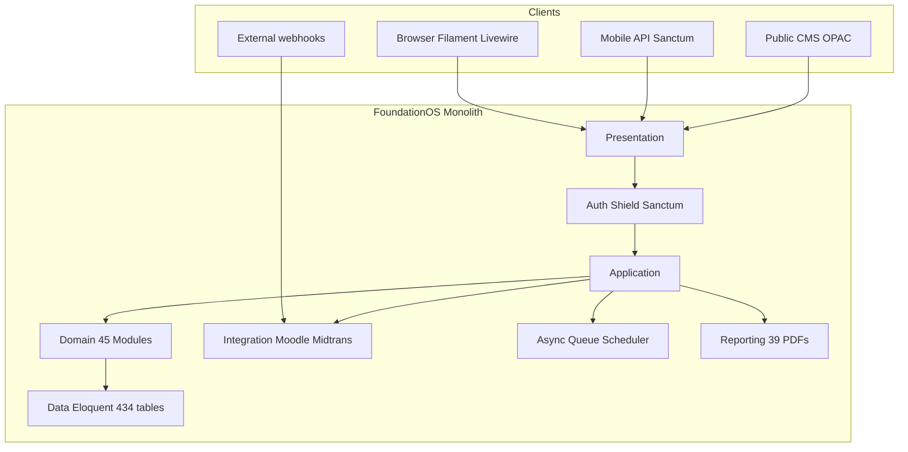
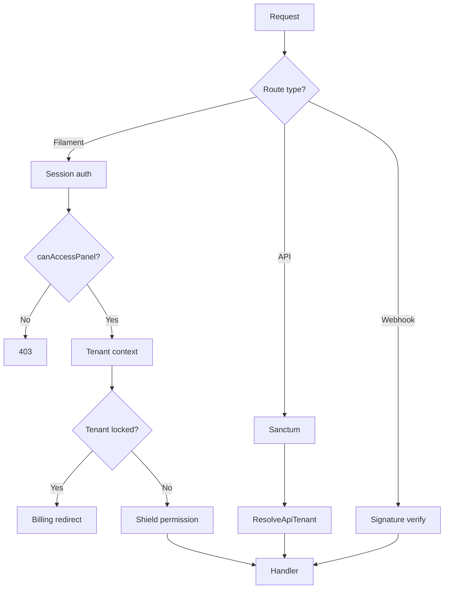
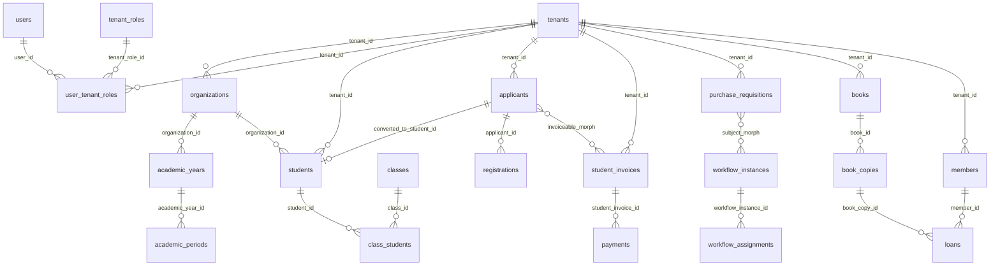
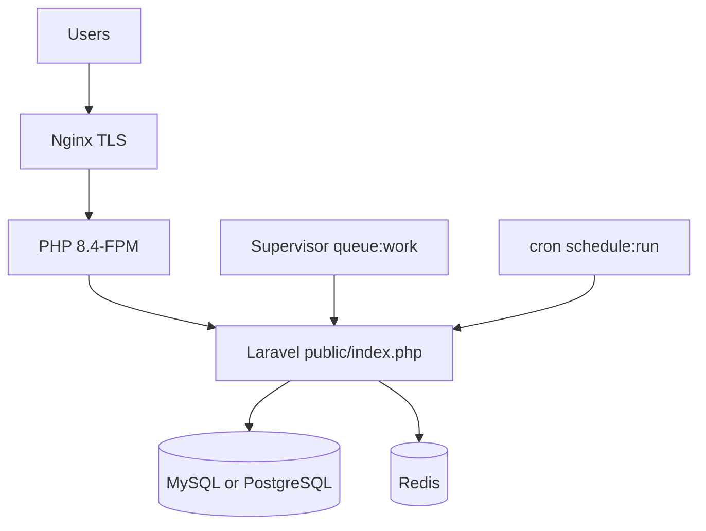

# FoundationOS — Technical Documentation

**Master technical reference** consolidating verified repository discovery. This document cites code, routes, migrations, and configuration; items without direct evidence are marked **belum terverifikasi**.

**Verification date:** 2026-06-19 (ERD, route counts, authorization & API catalogs re-verified)  
**Branch evidence:** `cursor/use-case-model-0a94`  
**Companion artifacts:** `USE_CASES.md`, `SEQUENCE_DIAGRAMS.md`, `ACTIVITY_DIAGRAMS.md`, `STATE_DIAGRAMS.md`, `ARCHITECTURE.md`, `EVENTS.md`, `AUTHORIZATION_MATRIX.md`, `API_ROUTES.md`

---

## Table of Contents

1. [Executive Summary](#1-executive-summary)
2. [Repository Scope](#2-repository-scope)
3. [Technology Stack](#3-technology-stack)
4. [Architecture Overview](#4-architecture-overview)
5. [Domain / Module Catalog](#5-domain--module-catalog)
6. [Master Data Catalog](#6-master-data-catalog)
7. [Transaction Catalog](#7-transaction-catalog)
8. [Business Rules](#8-business-rules)
9. [Authorization Model](#9-authorization-model)
10. [Event Model](#10-event-model)
11. [Job / Scheduler Model](#11-job--scheduler-model)
12. [API Documentation](#12-api-documentation)
13. [Integration Matrix](#13-integration-matrix)
14. [Reporting Catalog](#14-reporting-catalog)
15. [Configuration Matrix](#15-configuration-matrix)
16. [Entity Relationship Diagram](#16-entity-relationship-diagram)
17. [Use Case Diagrams](#17-use-case-diagrams)
18. [Sequence Diagrams](#18-sequence-diagrams)
19. [Activity Diagrams](#19-activity-diagrams)
20. [State Diagrams](#20-state-diagrams)
21. [Deployment / Infrastructure](#21-deployment--infrastructure)
22. [Gap Analysis](#22-gap-analysis)
23. [Evidence Matrix](#23-evidence-matrix)
24. [Appendix: File Evidence Index](#24-appendix-file-evidence-index)

---

## 1. Executive Summary

FoundationOS is a **modular SaaS ERP for educational institutions** implemented as a single Laravel 13 monolith with Filament v5 admin UI, Livewire v4, and shared-database multi-tenancy (`tenant_id` on operational tables; no `stancl/tenancy`).

| Dimension | Verified value | Primary evidence |
|-----------|----------------|------------------|
| Feature modules | **45** | `Modules/` directory listing |
| Filament admin resources | **257** `ModuleResource` subclasses | `find Modules -name '*Resource.php' \| grep ModuleResource` |
| Database tables | **434** | `storage/app/entity-catalog.json` |
| Eloquent models | **402** | `storage/app/entity-catalog-extract.md` |
| Application routes (except vendor) | **1778** | `php artisan route:list --except-vendor --json` (array count) |
| API routes (`api/*` prefix) | **101** | `scripts/extract-api-routes.php` |
| Shield resource permissions (est.) | **~3100** | 257 resources × 12 policy methods + 16 custom (`AUTHORIZATION_MATRIX.md`) |
| Filament panels | **3** (`admin`, `platform`, `parent`) | `app/Providers/Filament/*PanelProvider.php` |
| CSV importers | **132** | `app/Filament/Imports/*Importer.php` |
| PDF report controllers | **39** | `Modules/*/Http/Controllers/*PdfController.php` |
| Scheduled Artisan commands | **28** | `routes/console.php` |

**Primary user surfaces:**

- **Tenant admin** — `/admin` (Filament, tenant-scoped, Shield permissions)
- **Platform owner** — `/platform` (SaaS operator)
- **Parent** — `/parent` (linked children)
- **Mobile / integrator** — Sanctum API `/api/v1`, `/api/v2`
- **Public** — CMS, library OPAC, enrollment inquiry, letter verification

**Core cross-cutting engines:** Workflow V2 (metadata-driven approvals), Finance control (invoice/payment recalculation), Moodle outbound sync (outbox), tenant subscription billing (Midtrans).

---

## 2. Repository Scope

### In scope (this repository)

| Area | Location |
|------|----------|
| Application code | `app/`, `Modules/` |
| Migrations & seeders | `database/`, `Modules/*/database/` |
| Routes | `routes/`, `Modules/*/routes/` |
| Configuration | `config/`, `Modules/*/config/` |
| Tests | `tests/` |
| CI workflows | `.github/workflows/` |
| Deployment runbook | `SETUP.md` |
| Domain runbooks | `WORKFLOW.md`, `MOODLE.md`, `FINANCE.md`, `PROCUREMENT.md`, `LIBRARY.md` |
| Machine catalogs | `storage/app/entity-catalog.json`, `verified-fks.json` |

### Explicitly out of scope (not in repo)

| Item | Status |
|------|--------|
| Docker / Kubernetes / Terraform | **belum terverifikasi** in repo — no `Dockerfile`, no IaC |
| Separate microservices | Monolith only |
| Tenant-per-database provisioning | Shared DB pattern only |
| Automated production deploy pipeline | CI = test/lint only |
| Student Filament panel | Mobile via Sanctum API only |
| Inbound Moodle webhooks | Outbound outbox only |

---

## 3. Technology Stack

| Layer | Package / version | Evidence |
|-------|-------------------|----------|
| Runtime | PHP **8.4** | `composer.json` `require.php` |
| Framework | Laravel **13** | `laravel/framework: ^13.0` |
| Admin UI | Filament **5** | `filament/filament: ^5.4` |
| Reactive UI | Livewire **4** | `AGENTS.md` / Boost guidelines |
| Module system | coolsam/modules **5** | `composer.json` |
| Authorization UI | filament-shield **4** | `bezhansalleh/filament-shield: ^4.2` |
| Permissions | spatie/laravel-permission (teams mode) | `config/permission.php` |
| API tokens | laravel/sanctum **4** | `laravel/sanctum: ^4.3` |
| PDF | barryvdh/laravel-dompdf **3** | `composer.json` |
| Payments | midtrans/midtrans-php **2** | `composer.json` |
| Workflow rules | jwadhams/json-logic-php | `composer.json` |
| Activity log | spatie/laravel-activitylog **5** | `composer.json` |
| QR codes | simplesoftwareio/simple-qrcode **4** | `composer.json` |
| Observability | laravel/pulse **1** | `composer.json` |
| Frontend build | Vite + Tailwind **4** | `AGENTS.md` |
| Testing | PHPUnit **12** | `phpunit/phpunit: ^12.5` |
| Default queue driver | `database` (env → `redis` in prod guide) | `config/queue.php`, `SETUP.md` |

---

## 4. Architecture Overview

Nine logical layers map to repository boundaries. Full layer diagrams and module integration map: **`ARCHITECTURE.md`**.



### Tenancy model

- `Tenant` = SaaS account boundary (`Modules\Core\Models\Tenant`)
- `User` is global; tenant membership via `user_tenant_roles`
- Operational models use `BelongsToTenant` + `tenant_id` (`Modules/Core/app/Models/Concerns/BelongsToTenant.php`)
- Filament admin: `->tenant(Tenant::class)` in `AdminPanelProvider`
- Spatie Permission **teams mode**: `team_foreign_key = tenant_id` (`config/permission.php:96,134`)

### Panel routing

| Panel ID | Path | Access gate |
|----------|------|-------------|
| `admin` | `/admin` | `User::canAccessPanel` — `user_tenant_roles` or `is_super_admin` |
| `platform` | `/platform` | Spatie role `platform_owner` (team `tenant_id = 0`) |
| `parent` | `/parent` | `parent_students.parent_user_id` link exists |

Evidence: `Modules/Core/app/Models/User.php:463-484`

---

## 5. Domain / Module Catalog

**45 modules** under `Modules/` (alphabetical):

| Module | Primary domain | Hub models (sample) |
|--------|----------------|---------------------|
| Ai | AI prompt templates | `AiPromptTemplate` |
| Alumni | Alumni relations | `Alumni`, tracer study |
| Asset | Fixed assets | `Asset`, maintenance |
| Boarding | Dormitory | `Dormitory`, leave permits |
| Cafeteria | Food services | Tenant settlement |
| Campus | Higher education | `Faculty`, `StudyProgram`, `Course`, `CollageStudent`, `Thesis` |
| Capacity | Capacity planning | `CapacityResource`, forecasts |
| Clinic | School clinic | `ClinicVisit`, `HealthRecord` |
| Cms | Public websites | `Site`, `Page`, `Article` |
| Consulting | B2B consulting | `ConsultingEngagement`, invoices |
| Core | Tenancy, users, orgs | `Tenant`, `Organization`, `User`, `AcademicYear` |
| Counseling | Student counseling | Risk scan jobs |
| Dms | Document management | Folders, archive jobs |
| Donation | Fundraising | Campaigns, recurring charges |
| EducationQa | Accreditation / QA | `QualityStandard`, surveys |
| Employee | HR | `Employee`, `LeaveRequest`, payroll |
| Enrollment | Admissions | `Applicant`, `Registration`, `Lead` |
| EOffice | Official letters | `Letter`, verification token |
| Event | Events management | `Event`, tickets, certificates |
| Exam | Online exams | Runtime API, results |
| Facility | Buildings / rooms | `Building`, `Room`, bookings |
| Finance | Accounting | `ChartOfAccount`, `StudentInvoice`, `Payment`, `JournalEntry` |
| Global | Reference geo data | `Country`, `Province`, `City` |
| Helpdesk | IT support | `Ticket`, SLA jobs |
| InternalAudit | Internal audit | `AuditEngagement`, findings |
| Inventory | Stock | `StockItem`, warehouses |
| IsoCompliance | ISO controls | `IsoControl` |
| ItOps | IT operations | Licenses, monitoring webhook |
| KpiEnterprise | Enterprise KPI | Cascades, targets |
| Legal | Contracts | `Contract`, expiry jobs |
| Library | Library OPAC | `Book`, `Loan`, `Fine` |
| Marketplace | E-commerce | Products, orders |
| MerchOrder | Uniforms / books | `MerchOrder` |
| Messaging | Notifications | Templates, WhatsApp webhook |
| Monitoring | Audit / webhooks | `AuditLog`, `MoodleSyncOutbox`, `WebhookDelivery` |
| PhysicalSecurity | Guards, visitors | Patrol, incidents |
| Printing | Publications | Royalties, print orders |
| Procurement | Purchasing | `PurchaseRequisition`, `RFQ`, `PurchaseOrder` |
| Property | Lease management | `LeaseAgreement`, invoices |
| Risk | Risk register | `Risk`, assessments |
| Sales | Sales orders | `SalesOrder` |
| School | K-12 | `Student`, `SchoolClass`, attendance, grades |
| Training | External training | Programs, certificates |
| Transport | Shuttle routes | `Route`, `Vehicle` |
| Workflow | Approvals V2 | `Workflow`, `WorkflowInstance`, engine |

**Filament surface:** 257 resources extend `Modules\Core\Filament\Support\ModuleResource` (tenant scoping, `FilamentUi` labels, import actions). Meta-use-case **UC-ADM-000** covers standard CRUD for all (`USE_CASES.md`).

---

## 6. Master Data Catalog

Master data = relatively stable reference entities, often tenant-scoped, imported via `BaseModelImporter` subclasses.

### Global (non-tenant or shared reference)

| Entity | Table | Model | Module |
|--------|-------|-------|--------|
| Country | `countries` | `Country` | Global |
| Province | `provinces` | `Province` | Global |
| City | `cities` | `City` | Global |
| District | `districts` | `District` | Global |
| Village | `villages` | `Village` | Global |
| Timezone | `timezones` | `Timezone` | Global |
| Subscription plan | `subscription_plans` | `SubscriptionPlan` | Core |
| Module registry | `modules` | `Module` | Core |

### Tenant-scoped core

| Entity | Table | Model | Notes |
|--------|-------|-------|-------|
| Tenant | `tenants` | `Tenant` | SaaS boundary |
| Organization | `organizations` | `Organization` | School/campus unit |
| User | `users` | `User` | Global identity |
| Tenant role | `tenant_roles` | `TenantRole` | Domain membership |
| User–tenant role | `user_tenant_roles` | `UserTenantRole` | Panel access |
| Academic year | `academic_years` | `AcademicYear` | |
| Academic period | `academic_periods` | `AcademicPeriod` | |
| Department | `departments` | `Department` | |
| Tenant setting | `tenant_settings` | `TenantSetting` | Key-value config |
| Organization setting | `organization_settings` | `OrganizationSetting` | Per-org overrides |

### Domain master data (representative)

| Domain | Examples | Importer evidence |
|--------|----------|-------------------|
| School | `curricula`, `subjects`, `school_classes`, `teachers` | `CurriculumImporter`, `SubjectImporter` |
| Campus | `faculties`, `study_programs`, `courses`, `lecturers` | `FacultyImporter`, `CourseImporter` |
| Finance | `chart_of_accounts`, `tuition_types` | `ChartOfAccountImporter` |
| Procurement | `vendors`, `procurement_categories` | `VendorImporter` |
| Library | `books`, `book_categories`, `members` | `BookImporter`, `MemberImporter` |
| Employee | `positions`, `shifts` | `PositionImporter`, `ShiftImporter` |

**Full machine catalog:** `storage/app/entity-catalog.json` (434 tables, 402 models). Human extract: `storage/app/entity-catalog-extract.md`.

---

## 7. Transaction Catalog

Transactions = state-changing operations with identifiable entry points (API writes, Filament actions, webhooks, workflow steps).

### API write transactions (idempotency-supported)

| ID | Operation | Route | Controller | Middleware |
|----|-----------|-------|------------|------------|
| TX-API-01 | Create applicant | `POST /api/v1/applicants` | `ApplicantController@store` | `auth:sanctum`, `resolve.api.tenant`, `idempotency` |
| TX-API-02 | Record payment | `POST /api/v1/payments` | `PaymentController@store` | same |
| TX-API-03 | Create leave request | `POST /api/v1/leave-requests` | `LeaveRequestController@store` | same |
| TX-API-04 | Register device | `POST /api/v1/devices` | `DeviceController@store` | `auth:sanctum`, `resolve.api.tenant` |
| TX-API-05 | Deactivate device | `DELETE /api/v1/devices/{token}` | `DeviceController@destroy` | same |

v2 mirrors read/write paths under `/api/v2/*` (`routes/api.php:81-116`).

### Admin workflow transactions

| ID | Operation | Entry | Engine / service |
|----|-----------|-------|------------------|
| TX-WF-01 | Start PR approval | `ViewPurchaseRequisition` | `WorkflowInstanceStarter` |
| TX-WF-02 | Advance workflow step | `ViewWorkflowInstance` | `DatabaseWorkflowEngine::advance()` |
| TX-WF-03 | Return workflow step | `ViewWorkflowInstance` | `DatabaseWorkflowEngine::returnToStep()` |
| TX-WF-04 | Cancel workflow | `ViewWorkflowInstance` | `DatabaseWorkflowEngine::cancel()` |
| TX-WF-05 | Start budget approval | `ViewBudget` | Workflow resolver + starter |
| TX-WF-06 | Approve/reject leave | `ViewLeaveRequest` | Filament actions |

### Posting / finalization transactions

| ID | Operation | Trigger | Downstream |
|----|-----------|---------|------------|
| TX-POST-01 | Accept applicant | `Applicant.status → accepted` | Student, invoice, library member (`EVENTS.md`) |
| TX-POST-02 | Verify payment | `ViewPayment` verify action | `FinanceControlService::recalculateInvoice()` |
| TX-POST-03 | Invoice paid | Recalculation → `paid` | `StudentInvoicePaid` → registration update |
| TX-POST-04 | PR approved | Workflow completed | `PurchaseRequisitionApproved` → optional RFQ |
| TX-POST-05 | Midtrans subscription paid | `POST /billing/webhook` | `BillingService`, tenant unlock |

### Public transactions

| ID | Operation | Route | Service |
|----|-----------|-------|---------|
| TX-PUB-01 | Enrollment inquiry | Public enrollment API | `LeadInquiryService` |
| TX-PUB-02 | Library reserve/checkout | OPAC web routes | Library circulation services |
| TX-PUB-03 | CMS contact form | CMS web routes | **belum terverifikasi** — controller per site module |

Detail flows: **`SEQUENCE_DIAGRAMS.md`** (SD-03–SD-08), **`ACTIVITY_DIAGRAMS.md`** (AD-01–AD-07).

---

## 8. Business Rules

| Rule ID | Domain | Rule | Evidence |
|---------|--------|------|----------|
| BR-TEN-01 | Tenancy | Every operational row carries `tenant_id`; queries scoped via `BelongsToTenant` | `BelongsToTenant.php`, `TenantScope` |
| BR-TEN-02 | Tenancy | Locked tenant redirected to billing except billing routes | `EnsureTenantSubscriptionActive` middleware |
| BR-WF-01 | Workflow | Resolver picks tenant+org-specific workflow over tenant-wide | `WorkflowResolver` |
| BR-WF-02 | Workflow | Advance requires pending assignment unless super admin | `DatabaseWorkflowEngine.php:416-430` |
| BR-WF-03 | Workflow | Evidence required when step `requiresEvidence()` | `DatabaseWorkflowEngine.php:52-63` |
| BR-WF-04 | Workflow | Parallel steps wait for quorum | `DatabaseWorkflowEngine.php:158-247` |
| BR-FIN-01 | Finance | Invoice status derived from payments via `recalculateInvoice()` | `FinanceControlService` |
| BR-FIN-02 | Finance | Paid invoice dispatches `StudentInvoicePaid` | `EVENTS.md` |
| BR-ENR-01 | Enrollment | Applicant acceptance is idempotent for student/invoice/member | Listeners in `EVENTS.md` |
| BR-ENR-02 | Enrollment | Revert acceptance voids non-paid invoices | `CompensateApplicantAcceptance` |
| BR-PROC-01 | Procurement | Auto-RFQ from approved PR when setting enabled | `procurement.auto_create_rfq_from_pr` |
| BR-API-01 | API | Write endpoints accept idempotency key | `IdempotencyKey` middleware |
| BR-API-02 | API | Rate limit 60/min per token or IP | `routes/api.php:24-28` |
| BR-MOODLE-01 | Integration | FOS → Moodle one-way via outbox | `MoodleOutboxService`, observers |
| BR-AUTH-01 | Auth | Global super admin bypasses all gates | `AppServiceProvider.php:93-98` |
| BR-UI-01 | UI | All labels via `FilamentUi` (bilingual id/en) | `CLAUDE.md` |

Manual-only states (UI without automated transition): see **`STATE_DIAGRAMS.md`** flags (e.g. invoice `overdue` display, leave `cancelled`).

---

## 9. Authorization Model

### Authentication matrix

| Actor | Mechanism | Entry | Evidence |
|-------|-----------|-------|----------|
| Tenant admin | Session `web` guard | `/admin/login` | Filament `AdminPanelProvider` |
| Platform owner | Session + role | `/platform/login` | `User::canAccessPanel('platform')` |
| Parent | Session | `/parent/login` | `ParentPanelProvider` |
| API client | Sanctum PAT (`tenant_id` on token) | `/api/v1/me` | `routes/api.php`, `ResolveApiTenant` |
| Webhooks | No session; signature/HMAC | Various `POST` routes | `MidtransWebhookVerifier`, etc. |

### Panel access (`User::canAccessPanel`)

```463:484:Modules/Core/app/Models/User.php
    public function canAccessPanel(Panel $panel): bool
    {
        if ($panel->getId() === 'platform') {
            setPermissionsTeamId(0);

            return $this->hasRole('platform_owner');
        }

        if ($panel->getId() === 'admin') {
            if ($this->isGlobalSuperAdmin()) {
                return true;
            }

            return $this->userTenantRoles()->exists();
        }

        if ($panel->getId() === 'parent') {
            return ParentStudent::query()->where('parent_user_id', $this->getKey())->exists();
        }

        return false;
    }
```

### Authorization layers

| Layer | Technology | Scope |
|-------|------------|-------|
| Filament resource/action | **Filament Shield** + generated permissions | Per resource, per tenant team |
| Eloquent policies | `Modules/*/Policies/` | Model-level |
| Super admin | `Gate::before` + `users.is_super_admin` | Global bypass |
| Spatie teams | `tenant_id` as team key | `config/permission.php` |
| PDF routes | Policy `view` on record | `RendersTenantPdf` trait |
| Pulse dashboard | `viewPulse` gate | Super admin only |

**Permission regeneration:** `php artisan shield:generate --all --panel=admin` (`CLAUDE.md`).

### Full authorization matrix (generated)

**Human-readable:** `AUTHORIZATION_MATRIX.md`  
**Machine catalog:** `docs/catalogs/authorization-matrix.json`  
**Regenerate:** `php scripts/extract-authorization-matrix.php`

| Metric | Value | Source |
|--------|-------|--------|
| `ModuleResource` classes | **257** | Scanned from `Modules/*/app/Filament/Resources/**` |
| Policy methods per resource | **12** | `config/filament-shield.php` `policies.methods` |
| Permission name pattern | `{Method}:{ModelShortName}` (Pascal) | `config/filament-shield.php` `permissions` |
| Custom permissions | **16** (Exam) | `config/filament-shield.php` `custom_permissions` |
| Estimated permission keys | **~3100** | 257 × 12 + 16 |

Example for `Student` resource: `ViewAny:Student`, `View:Student`, `Create:Student`, … `Reorder:Student`.

Per-module resource counts and sample subjects: see **`AUTHORIZATION_MATRIX.md` § Resources by module**.

> **Note:** Catalog is derived from resource classes + Shield config, not from a live `permissions` table dump. Runtime role assignments are tenant-specific (`tenant_id` team).

### Authorization flow



---

## 10. Event Model

Cross-module domain events cataloged in **`EVENTS.md`**. Summary:

| Event | Publisher | Subscribers (queued) | Idempotent |
|-------|-----------|----------------------|------------|
| `PurchaseRequisitionApproved` | Procurement / workflow sync | `CreateRfqFromApprovedPurchaseRequisition` | Yes |
| `ApplicantAccepted` | Enrollment | `CreateStudentFromAcceptedApplicant`, `CreateInitialInvoiceFromAcceptedApplicant`, `CreateLibraryMemberFromAcceptedApplicant` | Yes |
| `ApplicantAcceptanceReverted` | Enrollment | `CompensateApplicantAcceptance` | Yes |
| `StudentInvoicePaid` | Finance | `UpdateRegistrationOnInvoicePaid` | Yes |
| `WorkflowAdvanced` | Workflow | Internal + `SyncWorkflowSubjectState` | N/A |

**Queued listeners (`ShouldQueue`):** 7 files under `Modules/*/Listeners/` (grep verified).

**Module-local events** (Exam, Sales, Inventory, Helpdesk, Legal, ItOps): exist in `Modules/*/app/Events/` — **no cross-module subscribers yet** (`EVENTS.md:79-81`).

**Conventions:** dispatch after DB commit; listeners use `InteractsWithTenant`; wrap side effects with `AutomationRunLogger`.

---

## 11. Job / Scheduler Model

### Queue jobs (application-level)

| Job | Trigger | Purpose | File |
|-----|---------|---------|------|
| `ProcessMoodleSyncOutboxJob` | Outbox insert / scheduler drain | Push master data to Moodle REST | `app/Jobs/ProcessMoodleSyncOutboxJob.php` |
| `DeliverWebhookJob` | `WebhookDispatcher` | POST tenant webhook URLs | `app/Jobs/DeliverWebhookJob.php` |
| `CheckWorkflowSlaJob` | Workflow SLA breach | Escalation notifications | `Modules/Workflow/app/Jobs/CheckWorkflowSlaJob.php` |

Default queue connection: `env('QUEUE_CONNECTION', 'database')` (`config/queue.php`).

### Scheduled commands (`routes/console.php`)

| Schedule | Command | Domain |
|----------|---------|--------|
| Every minute | `fos:moodle:drain-outbox` | Moodle sync |
| Every 5 min | `fos:moodle:sweep-stale-processing` | Moodle sync |
| Hourly | `fos:moodle:reconcile all --dry-run` | Moodle reconcile |
| Hourly | `fos:library:recalc-fines` | Library |
| Hourly | `workflow:escalate-overdue` | Workflow SLA |
| Hourly | `donation:send-campaign-update` | Donation |
| Daily 01:00 | `fos:billing:check-grace-period` | SaaS billing |
| Daily 02:15 | `donation:charge-recurring` | Donation |
| Daily 02:30 | `dms:archive-expired` | DMS |
| Daily 04:30 | `school:recompute-risk-scores` | School |
| Daily 05:00 | `safety:daily-rounds` | Physical security |
| Daily 05:30 | `counseling:scan-risk` | Counseling |
| Daily 06:00 | `school:apply-late-fees` | School finance |
| Daily 06:30 | `asset:check-maintenance-due` | Asset |
| Daily 06:45 | `asset:check-insurance-expiry` | Asset |
| Daily 07:00 | `legal:check-expiring-contracts` | Legal |
| Daily 07:30 | `itops:check-expiry` | ItOps |
| Every 15 min | `helpdesk:check-sla` | Helpdesk |
| Monthly 1st 02:00 | `fos:billing:generate-invoices` | SaaS billing |
| Monthly 1st 03:00 | `school:generate-monthly-tuition` | School |
| Monthly 1st 03:30 | `printing:calculate-royalty-monthly` | Printing |
| Monthly 1st 04:00 | `property:generate-monthly-lease-invoice` | Property |
| Weekly Mon 04:00 | `cafeteria:settle-tenants` | Cafeteria |
| Weekly Mon 05:00 | `training:settle-affiliate` | Training |
| Weekly Mon 07:00 | `reports:weekly-summary` | Reporting |
| Weekly Mon 08:00 | `comms:send-newsletter` | Messaging |
| Every 4 hours | `enrollment:lead-followup-due` | Enrollment CRM |
| Yearly Jul 1 | `alumni:tracer-study-blast` | Alumni |

**Scheduler prerequisite:** cron `* * * * * php artisan schedule:run` (`SETUP.md`).

---

## 12. API Documentation

### Surface summary

| Prefix | Auth | Purpose |
|--------|------|---------|
| `/api/v1/*` | Sanctum + tenant resolve | Primary mobile/integrator API |
| `/api/v2/*` | Same + version meta middleware | Forward-compatible reads/writes |
| `/api/openapi.json` | Public | OpenAPI v1 spec |
| `/api/v2/openapi.json` | Public | OpenAPI v2 spec |
| `/api/exam/runtime/*` | Sanctum | Exam attempt ingestion |
| `/api/webhooks/whatsapp/{provider}` | Provider-specific | WhatsApp inbound |
| `/api/letters/verify/{token}` | Public | E-office letter verification |

### Authenticated endpoints (`routes/api.php`)

| Method | Path | R/W | Notes |
|--------|------|-----|-------|
| GET | `/api/v1/me` | Read | Current user |
| GET | `/api/v1/tenants/current` | Read | Tenant context |
| GET | `/api/v1/organizations` | Read | Index + show |
| GET | `/api/v1/students` | Read | Index + show |
| GET | `/api/v1/college-students` | Read | Index + show |
| GET | `/api/v1/classes` | Read | Index + show |
| GET | `/api/v1/courses` | Read | Index + show |
| GET | `/api/v1/employees` | Read | Index + show |
| POST | `/api/v1/applicants` | Write | Idempotency middleware |
| POST | `/api/v1/payments` | Write | Idempotency middleware |
| POST | `/api/v1/leave-requests` | Write | Idempotency middleware |
| POST | `/api/v1/devices` | Write | Push notification registration |
| DELETE | `/api/v1/devices/{token}` | Write | Device deactivation |
| GET | `/api/v1/students/{id}/dashboard` | Read | Mobile dashboard aggregates |

**Full catalog (101 routes):** `API_ROUTES.md` and `docs/catalogs/api-routes-catalog.json`  
**Regenerate:** `php scripts/extract-api-routes.php`

### Routes by module (summary)

| Module | Routes | Examples |
|--------|--------|----------|
| Api | 43 | `api/v1/me`, `api/v1/students`, `api/v2/*`, OpenAPI |
| Campus | 5 | `api/v1/campuses` REST scaffold |
| Core | 5 | `api/v1/cores` REST scaffold |
| Employee | 4 | `api/v1/employees` (+ module REST) |
| Enrollment | 1 | `api/inquiry` (public POST) |
| Exam | 1 | `api/exam/runtime/attempts` |
| EOffice | 1 | `api/letters/verify/{token}` |
| Finance | 5 | `api/v1/finances` REST scaffold |
| Global | 5 | `api/v1/globals` REST scaffold |
| Inventory | 5 | `api/v1/inventories` REST scaffold |
| Library | 5 | `api/v1/libraries` REST scaffold |
| Messaging | 1 | `api/webhooks/whatsapp/{provider}` |
| Monitoring | 5 | `api/v1/monitorings` REST scaffold |
| Procurement | 5 | `api/v1/procurements` REST scaffold |
| Sales | 5 | `api/v1/sales` REST scaffold |
| School | 5 | `api/v1/schools` REST scaffold |

Module REST scaffolds (`api/v1/{module}` CRUD) are registered via module route service providers — see per-route middleware in **`API_ROUTES.md`**.

**Rate limiting:** 60 requests/minute per token ID or IP (`routes/api.php:24-28`).

---

## 13. Integration Matrix

| System | Direction | Pattern | Entry / client | Evidence |
|--------|-----------|---------|----------------|----------|
| **Moodle** | Outbound only | Outbox → queue → REST | `MoodleOutboxService`, `MoodleClient`, `ProcessMoodleSyncOutboxJob` | `MOODLE.md`, observers |
| **Midtrans** | Inbound webhook + outbound Snap | HTTP webhook + SDK | `POST /billing/webhook`, `BillingService` | `config/midtrans.php` |
| **Donation payments** | Inbound webhook | HTTP | `POST /donation/webhook` | `Modules/Donation/routes/web.php` |
| **Tenant webhooks** | Outbound | Queue job POST | `WebhookDispatcher`, `DeliverWebhookJob` | `Monitoring` module |
| **WhatsApp** | Inbound | Webhook API | `POST /api/webhooks/whatsapp/{provider}` | `WhatsAppWebhookController` |
| **IT monitoring** | Inbound | Webhook | `POST /itops/monitoring/webhook` | `Modules/ItOps/routes/web.php` |
| **Exam runtime** | Inbound | Sanctum API | `POST /api/exam/runtime/attempts` | `Modules/Exam/routes/api.php` |
| **SLiMS** | Import (optional) | Batch import | `SlimsImportService` | `LIBRARY.md` |
| **Mobile push** | Outbound | **belum terverifikasi** provider abstraction | `DeviceController`, `NotificationService` | Messaging module |

### Moodle partitioning (logical)

| FOS entity | Moodle entity | `idnumber` pattern |
|------------|---------------|-------------------|
| Tenant | Course category | `fos_tenant_{id}` |
| Course | Course | `fos_course_{id}` |
| User | User | `fos_user_{id}` |

Evidence: `CLAUDE.md`, `MOODLE.md`

---

## 14. Reporting Catalog

**39 PDF controllers** using `PdfDocumentRenderer` / `RendersTenantPdf` trait.

| Module | Controller | Document |
|--------|------------|----------|
| Campus | `CollageStudentPdfController` | Student card |
| Campus | `StudyPlanPdfController` | Study plan |
| Campus | `StudyResultPdfController` | Study results |
| Campus | `ThesisPdfController` | Thesis |
| Campus | `WisudaPdfController` | Graduation |
| Campus | `YudisiumPdfController` | Yudisium |
| Employee | `EmploymentContractPdfController` | Contract |
| Employee | `LeaveRequestPdfController` | Leave letter |
| Enrollment | `ApplicantAcceptancePdfController` | Acceptance letter |
| Enrollment | `ApplicantRejectionPdfController` | Rejection letter |
| Enrollment | `ExamSchedulePdfController` | Exam schedule |
| Enrollment | `RegistrationPdfController` | Registration |
| Exam | `ExamParticipantTokenPdfController` | Participant token |
| Exam | `ExamResultsPdfController` | Results |
| Event | `EventCertificatePdfController` | Certificate |
| Finance | `CustomerInvoicePdfController` | Customer invoice |
| Finance | `PaymentPdfController` | Payment receipt |
| Finance | `StudentInvoicePdfController` | Student invoice |
| Library | `FinePdfController` | Fine notice |
| Library | `LoanPdfController` | Loan slip |
| Legal | `ContractPdfController` | Contract |
| MerchOrder | `MerchOrderPdfController` | Order |
| Procurement | `GoodsReceiptPdfController` | GRN |
| Procurement | `PurchaseOrderPdfController` | PO |
| Procurement | `PurchaseRequisitionPdfController` | PR |
| Procurement | `RequestForQuotationPdfController` | RFQ |
| Procurement | `VendorBillPdfController` | Vendor bill |
| Property | `LeaseInvoicePdfController` | Lease invoice |
| School | `AttendanceRecapPdfController` | Attendance recap |
| School | `ClassGradeLedgerPdfController` | Grade ledger |
| School | `ReportCardPdfController` | Report card |
| School | `ReportCardBulkPdfController` | Bulk report cards |
| School | `StudentAchievementPdfController` | Achievement |
| Sales | `SalesOrderPdfController` | Sales order |
| Training | `TrainingCertificatePdfController` | Certificate |
| Consulting | `EngagementInvoicePdfController` | Invoice |
| Donation | `DonationPdfController` | Receipt |
| EOffice | `LetterPdfController` | Official letter |
| Boarding | `BoardingLeavePermitPdfController` | Leave permit |

**Scheduled report:** `reports:weekly-summary` (weekly, Monday 07:00).

**Core renderer:** `Modules/Core/app/Support/Pdf/PdfDocumentRenderer.php`

---

## 15. Configuration Matrix

### Application config files (`config/`)

| File | Purpose |
|------|---------|
| `app.php` | App name, locale, timezone |
| `auth.php` | Guards, providers |
| `cache.php` | Cache drivers |
| `database.php` | DB connections |
| `filesystems.php` | Storage disks |
| `filament-shield.php` | Shield code generation |
| `filament-modules.php` | Module discovery |
| `fos.php` | FOS-specific flags |
| `fos_module_maturity.php` | Module maturity metadata |
| `legal.php` | Legal module defaults |
| `logging.php` | Log channels |
| `mail.php` | Mail transport |
| `midtrans.php` | `MIDTRANS_*` env keys |
| `moodle.php` | `MOODLE_*` env keys |
| `permission.php` | Spatie teams (`tenant_id`) |
| `pulse.php` | Pulse dashboard |
| `queue.php` | Queue connection (default `database`) |
| `sanctum.php` | API token config |
| `session.php` | Session driver |
| `tenancy.php` | Tenancy helpers |
| `workflow.php` | Workflow engine defaults |
| `workflow-dynamic-sources.php` | Dynamic assignee sources |
| `activitylog.php` | Activity log |
| `services.php` | Third-party credentials |

### Module config (`Modules/*/config/`)

Core, Campus, School, Finance, Enrollment, Employee, Workflow, Library, Exam, Monitoring, Messaging, Procurement, Global, Inventory, Sales.

### Runtime tenant settings (`tenant_settings`)

Examples referenced in code/docs:

| Key | Group | Purpose |
|-----|-------|---------|
| `default_locale` | `core` | Tenant default UI language |
| `procurement.auto_create_rfq_from_pr` | procurement | Auto RFQ on PR approval |
| `enrollment.auto_promote_accepted_applicant` | enrollment | Auto student creation |
| `enrollment.auto_invoice_on_accept` | enrollment | Auto invoice on accept |
| `library.auto_member_on_accept` | library | Auto library member |

Evidence: `EVENTS.md`, `CLAUDE.md` (locale setting)

### Environment variables (integration-critical)

| Variable family | Config file |
|-----------------|-------------|
| `APP_*`, `DB_*` | `config/app.php`, `database.php` |
| `MIDTRANS_*` | `config/midtrans.php` |
| `MOODLE_*` | `config/moodle.php` |
| `QUEUE_CONNECTION`, `REDIS_*` | `queue.php`, `database.php` |
| `ACTIVITYLOG_ENABLED` | `activitylog.php` |

---

## 16. Entity Relationship Diagram

Full FK catalog: `storage/app/verified-fks.json` (~5472 entries). Eloquent relation graph: `storage/app/entity-relations.json` (many `verified: false` — prefer migration `constrained()` for ERD).

### Hub ERD (tenant-scoped core + major domains)

Table names match `storage/app/entity-catalog.json`. FK edges cite migration `constrained()`; morph edges are polymorphic (no DB FK).



| Edge | Evidence |
|------|----------|
| `students.tenant_id`, `students.organization_id` | `Modules/School/database/migrations/2026_03_24_152528_create_students_table.php` |
| `class_students.class_id` → `classes` | `Modules/School/database/migrations/2026_03_24_152531_create_class_students_table.php` |
| `applicants.converted_to_student_id` → `students` | `Modules/Enrollment/database/migrations/2026_03_24_152536_create_applicants_table.php` |
| `registrations.applicant_id` → `applicants` | `Modules/Enrollment/database/migrations/2026_03_24_152537_create_registrations_table.php` |
| `payments.student_invoice_id` → `student_invoices` | `Modules/Finance/database/migrations/2026_03_24_152535_create_payments_table.php` |
| `student_invoices` `invoiceable_type` / `invoiceable_id` | `Modules/Finance/database/migrations/2026_03_24_152535_create_student_invoices_table.php`; morph target `Applicant` in `ApplicantOnboardingInvoiceService.php` |
| `workflow_instances.subject_type` / `subject_id` | `Modules/Workflow/database/migrations/2026_03_26_210300_create_workflow_instances_table.php` |
| `loans.member_id`, `loans.book_copy_id` | `Modules/Library/database/migrations/2026_03_24_152543_create_loans_table.php` |

### Tenancy FK pattern

Nearly all operational tables: `tenant_id → tenants.id` with `cascadeOnDelete` or equivalent (migration grep). Optional `organization_id → organizations.id` for org-scoped data.

---

## 17. Use Case Diagrams

**Full specification:** `USE_CASES.md`

### Summary

| Category | Count | IDs |
|----------|-------|-----|
| Actors | 12 | A1–A12 |
| Use cases | 33 | UC-ADM-000–008, UC-PLT-001–002, UC-PAR-001–002, UC-API-001–007, UC-PUB-001–007, UC-EXT-001–005 |

### Admin panel (excerpt)

```mermaid
usecaseDiagram
    actor "Tenant Admin" as TA
    actor "Super Admin" as SA

    package "Admin /admin" {
        usecase "UC-ADM-000 Filament CRUD" as CRUD
        usecase "UC-ADM-004 PR Workflow" as PRW
        usecase "UC-ADM-006 Process Workflow" as WFP
        usecase "UC-ADM-008 Accept Applicant" as ACC
    }

    TA --> CRUD
    TA --> PRW
    TA --> WFP
    TA --> ACC
    SA --> CRUD
    SA --> WFP
```

---

## 18. Sequence Diagrams

**Full diagrams (13):** `SEQUENCE_DIAGRAMS.md`

| ID | Title | Entry point |
|----|-------|-------------|
| SD-01 | Filament admin session auth | `GET /admin/login` |
| SD-02 | API bearer token auth | `GET /api/v1/me` |
| SD-03 | API create payment | `POST /api/v1/payments` |
| SD-04 | API create applicant | `POST /api/v1/applicants` |
| SD-05 | PR workflow approval | `ViewWorkflowInstance` advance |
| SD-06 | Leave request approval | `ViewLeaveRequest` approve |
| SD-07 | Applicant acceptance pipeline | `Applicant.status → accepted` |
| SD-08 | Midtrans subscription webhook | `POST /billing/webhook` |
| SD-09 | Moodle course sync outbound | `CourseObserver` → outbox |
| SD-10 | Tenant outbound webhook | `WebhookDispatcher` |
| SD-11 | Moodle outbox job | `ProcessMoodleSyncOutboxJob` |
| SD-12 | PR-approved RFQ auto-create | `PurchaseRequisitionApproved` listener |
| SD-13 | Leave request PDF | PDF route |

---

## 19. Activity Diagrams

**Full diagrams (7):** `ACTIVITY_DIAGRAMS.md`

| ID | Process |
|----|---------|
| AD-01 | Purchase requisition approval workflow |
| AD-02 | Budget approval workflow |
| AD-03 | Leave request approval |
| AD-04 | Applicant acceptance & compensation |
| AD-05 | Student payment verification & posting |
| AD-06 | SaaS subscription billing cycle |
| AD-07 | Public enrollment lead inquiry |

Each diagram documents decision nodes, parallel paths, reject/rollback, and source file citations.

---

## 20. State Diagrams

**Full diagrams (13):** `STATE_DIAGRAMS.md`

| ID | Entity / process | State field |
|----|----------------|-------------|
| ST-01 | `WorkflowInstance` | `status` (enum) |
| ST-02 | `WorkflowAssignment` | `status` (enum) |
| ST-03 | `PurchaseRequisition` | `status` |
| ST-04 | `Budget` | `status` |
| ST-05 | `LeaveRequest` | `status` |
| ST-06 | `Applicant` | `status` |
| ST-07 | `Payment` | `status` |
| ST-08 | `StudentInvoice` | `status` |
| ST-09 | `Tenant` (SaaS lifecycle) | `status` |
| ST-10 | `SubscriptionLog` | `payment_status` |
| ST-11 | `Lead` | `stage` |
| ST-12 | `MoodleSyncOutbox` | `status` |
| ST-13 | `WebhookDelivery` | `status` |

**Manual-only states** are explicitly flagged in `STATE_DIAGRAMS.md` (no automated transition handler found).

---

## 21. Deployment / Infrastructure

### Repository CI (verified)

| Workflow | Purpose |
|----------|---------|
| `.github/workflows/tests.yml` | PHPUnit PHP 8.4 |
| `.github/workflows/static.yml` | Static analysis |
| `.github/workflows/lint-translations.yml` | Translation lint |
| `.github/workflows/lint-tenant-fields.yml` | Tenant field lint |
| `.github/workflows/mobile-shell.yml` | Mobile shell build |

### Production topology (`SETUP.md` — manual deploy, not containerized)



| Process | Command |
|---------|---------|
| HTTP | Nginx → `public/index.php` |
| Queue worker | `php artisan queue:work redis --sleep=3 --tries=3` |
| Scheduler | `* * * * * php artisan schedule:run` |
| Health | `GET /up` (`bootstrap/app.php`) |
| Local dev | `composer run dev` |

**Not in repo:** Kubernetes, Docker Compose, Terraform, automated deploy pipeline.

---

## 22. Gap Analysis

| Gap | Impact | Status |
|-----|--------|--------|
| No IaC / containers | Manual deploy only | Documented in `SETUP.md` |
| No student Filament panel | Students use API only | By design (`USE_CASES.md`) |
| Moodle inbound sync | One-way outbox only | `MOODLE.md` |
| Module events without cross-subscribers | Exam, Sales, Inventory, etc. | `EVENTS.md:79-81` |
| Manual-only state labels | UI filters without transition code | `STATE_DIAGRAMS.md` |
| `entity-relations.json` low verification | ERD relation edges uncertain | Use migrations + `verified-fks.json` |
| OpenAPI coverage vs module REST scaffolds | Partial — OpenAPI may not list all module CRUD routes | Compare `API_ROUTES.md` with `api/openapi.json` |
| Permission matrix vs DB | Catalog from code/config; not live `permissions` table export | `docs/catalogs/authorization-matrix.json` |
| Public API write surface | Limited to applicants, payments, leave | By design (`routes/api.php`) |
| Automated production CD | CI tests only | No deploy workflow YAML |

---

## 23. Evidence Matrix

| Conclusion | Evidence type | Location |
|------------|---------------|----------|
| 45 modules | Directory count | `Modules/` |
| 257 Filament resources | Class extends | `grep extends ModuleResource` |
| 434 tables | JSON catalog | `storage/app/entity-catalog.json` |
| 1778 routes | Artisan JSON count | `php artisan route:list --except-vendor --json` |
| 101 API routes | Extract script | `docs/catalogs/api-routes-catalog.json` |
| 257 Shield resources | Extract script | `docs/catalogs/authorization-matrix.json` |
| Shared DB tenancy | Trait + docs | `BelongsToTenant.php`, `CLAUDE.md` |
| 3 panels | Provider classes | `app/Providers/Filament/` |
| Panel access rules | Method | `User.php:463-484` |
| Super admin gate bypass | Gate callback | `AppServiceProvider.php:93-98` |
| Spatie teams = tenant | Config | `config/permission.php:96,134` |
| 28 scheduled commands | Route file | `routes/console.php` |
| 3 queue jobs | Class files | `app/Jobs/`, `Modules/Workflow/app/Jobs/` |
| 7 queued cross-module listeners | Class files | `Modules/*/Listeners/` |
| 39 PDF controllers | Glob | `*PdfController.php` |
| API idempotency | Middleware | `app/Http/Middleware/IdempotencyKey.php` |
| API rate limit 60/min | Route definition | `routes/api.php:24-28` |
| Midtrans billing webhook | Route + service | `routes/web.php`, `BillingService` |
| Moodle outbox drain | Schedule + job | `routes/console.php:11`, `ProcessMoodleSyncOutboxJob` |
| Workflow engine | Service class | `DatabaseWorkflowEngine.php` |
| Cross-module events | Doc + listeners | `EVENTS.md` |
| No Docker/K8s | Absence | No `Dockerfile` in repo root |
| Health endpoint | Bootstrap | `bootstrap/app.php` |

---

## 24. Appendix: File Evidence Index

### Documentation artifacts (this discovery set)

| File | Content |
|------|---------|
| `TECHNICAL_DOCUMENTATION.md` | This master document |
| `USE_CASES.md` | Actors, use cases, matrices |
| `SEQUENCE_DIAGRAMS.md` | SD-01 – SD-13 |
| `ACTIVITY_DIAGRAMS.md` | AD-01 – AD-07 |
| `STATE_DIAGRAMS.md` | ST-01 – ST-13 |
| `ARCHITECTURE.md` | Layered architecture, integration maps |
| `AUTHORIZATION_MATRIX.md` | Shield permissions, panel access, per-module resources |
| `API_ROUTES.md` | Full `api/*` route table (101 routes) |
| `REAP_AUDIT.md` | REAP v1.0 compliance audit, EV-IDs, conflicts, stage gate |
| `00-repository-manifest.md` | REAP Stage 01 repository scope manifest |
| `01-evidence-registry.json` | REAP Stage 02 evidence registry (968 entries) |
| `02-structure-catalog.md` | REAP Stage 03 structure discovery (45 modules, entrypoints) |
| `03-module-dependency-map.md` | REAP Stage 04 module dependency graph (hub/leaf, 375 Filament resources) |
| `EVENTS.md` | Cross-module domain events |
| `CLAUDE.md` | Agent/dev conventions |
| `README.md` | Project overview |
| `SETUP.md` | Production deployment runbook |
| `WORKFLOW.md` | Workflow V2 details |
| `MOODLE.md` | Moodle integration |
| `FINANCE.md` | Finance golden path |
| `PROCUREMENT.md` | Procurement runbook |
| `LIBRARY.md` | Library / SLiMS |

### Machine-readable catalogs

| File | Content |
|------|---------|
| `storage/app/entity-catalog.json` | 434 tables, model mapping |
| `storage/app/entity-catalog-extract.md` | Human-readable extract |
| `storage/app/verified-fks.json` | Foreign key catalog |
| `storage/app/entity-relations.json` | Eloquent relations (partial verification) |
| `storage/app/entity-groups.json` | ERD grouping data |
| `docs/catalogs/authorization-matrix.json` | 257 resources, ~3100 permission keys |
| `docs/catalogs/api-routes-catalog.json` | 101 API routes with middleware |

### Regeneration scripts

| Script | Output |
|--------|--------|
| `scripts/extract-authorization-matrix.php` | `docs/catalogs/authorization-matrix.json` |
| `scripts/extract-api-routes.php` | `docs/catalogs/api-routes-catalog.json` |
| `scripts/generate-docs-appendices.php` | `AUTHORIZATION_MATRIX.md`, `API_ROUTES.md` |

### Critical code entry points

| Concern | Path |
|---------|------|
| Admin panel config | `app/Providers/Filament/AdminPanelProvider.php` |
| Platform panel | `app/Providers/Filament/PlatformPanelProvider.php` |
| Parent panel | `app/Providers/Filament/ParentPanelProvider.php` |
| API routes | `routes/api.php` |
| Scheduler | `routes/console.php` |
| User / panel access | `Modules/Core/app/Models/User.php` |
| Tenant model | `Modules/Core/app/Models/Tenant.php` |
| Module resource base | `Modules/Core/app/Filament/Support/ModuleResource.php` |
| Tenancy trait | `Modules/Core/app/Models/Concerns/BelongsToTenant.php` |
| Workflow engine | `Modules/Workflow/app/Services/DatabaseWorkflowEngine.php` |
| Workflow starter | `Modules/Workflow/app/Services/DatabaseWorkflowInstanceStarter.php` |
| Finance control | `Modules/Finance/app/Services/FinanceControlService.php` |
| Billing | `app/Services/BillingService.php` |
| Moodle client | `app/Integrations/Moodle/MoodleClient.php` |
| Moodle outbox | `app/Integrations/Moodle/MoodleOutboxService.php` |
| Webhook dispatch | `app/Services/WebhookDispatcher.php` |
| API tenant middleware | `app/Http/Middleware/ResolveApiTenant.php` |
| Idempotency middleware | `app/Http/Middleware/IdempotencyKey.php` |
| OpenAPI | `app/Http/Controllers/Api/OpenApiController.php` |
| PDF renderer | `Modules/Core/app/Support/Pdf/PdfDocumentRenderer.php` |
| Permissions config | `config/permission.php` |
| Queue config | `config/queue.php` |

### Test evidence (representative)

| Test file | Validates |
|-----------|-----------|
| `tests/Feature/UserIdentityAccessTest.php` | `canAccessPanel` for all panels |
| `tests/Feature/TenantIsolationStudentTest.php` | Tenant isolation + panel access |
| `tests/Feature/CoreTenancyFoundationTest.php` | Core tenancy foundation |
| `tests/Feature/WorkflowDefinitionLifecycleTest.php` | Workflow lifecycle |
| `tests/Feature/FilamentUiTranslationsTest.php` | Bilingual UI |

---

*End of technical documentation. For diagram source detail, open the linked companion files; all Mermaid in those files was generated from repository evidence as of 2026-06-19.*
