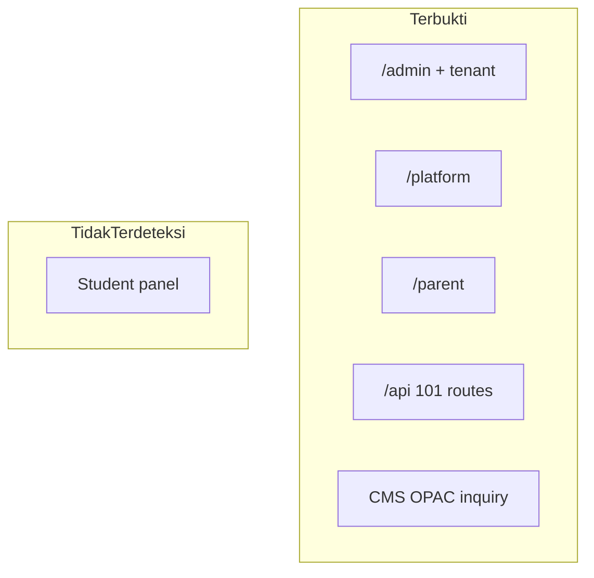

# 01 — Ringkasan Sistem

**Commit analisis:** `d3be06aa`  
**Metode:** Analisis statis source code  
**Konvensi:** FAKTA · INFERENSI · KETIDAKPASTIAN · TIDAK TERDETEKSI DI KODE

---

## Deskripsi Aplikasi

### FAKTA

FoundationOS adalah **platform ERP modular untuk lembaga pendidikan** (menengah dan tinggi), diimplementasikan sebagai aplikasi web monolit berbasis Laravel. Satu instance aplikasi melayani banyak tenant (akun SaaS) dengan isolasi data melalui kolom `tenant_id` pada tabel operasional — bukan database terpisah per tenant.

Antarmuka utama admin menggunakan **Filament v5** (Livewire). Terdapat **45 modul fitur** di `Modules/`, **257** resource CRUD Filament (`ModuleResource`), dan **3 panel** web: admin (`/admin`), platform (`/platform`), parent (`/parent`).

## Bukti

| File | Komponen | Keterangan |
|------|----------|------------|
| `README.md` | — | Deskripsi ERP pendidikan K-12 & kampus |
| `composer.json` | `require.laravel/framework`, `filament/filament` | Laravel 13, Filament 5 |
| `Modules/Core/app/Models/Concerns/BelongsToTenant.php` | trait `BelongsToTenant` | Pola multi-tenancy shared-database |
| `app/Providers/Filament/AdminPanelProvider.php` | `panel()` | Panel `admin`, path `/admin` |
| `app/Providers/Filament/PlatformPanelProvider.php` | `panel()` | Panel `platform` |
| `app/Providers/Filament/ParentPanelProvider.php` | `panel()` | Panel `parent` |
| `Modules/` | 45 direktori | `ls Modules/` |
| `Modules/Core/app/Filament/Support/ModuleResource.php` | `class ModuleResource` | Base 257 resource |
| — | `rg -l "extends ModuleResource" Modules` | Hasil: **257** file |

---

## Tujuan Aplikasi

### FAKTA (dari positioning kode & README)

| Tujuan | Indikasi di kode |
|--------|------------------|
| Mengelola operasional institusi pendidikan secara terpadu | Modul School, Campus, Enrollment, Employee, Finance, Library, Workflow |
| Menyediakan SaaS multi-tenant untuk banyak lembaga | Model `Tenant`, registrasi tenant, billing Midtrans |
| Menyediakan admin UI metadata-driven (CRUD + workflow) | 257 `ModuleResource`, Workflow V2 engine |
| Menyediakan API untuk integrasi mobile/eksternal | `routes/api.php`, Sanctum, OpenAPI |
| Sinkronisasi data master ke Moodle | `app/Integrations/Moodle/` |

## Bukti

| File | Komponen | Keterangan |
|------|----------|------------|
| `README.md` | §Tentang FoundationOS | Akademik, HR, keuangan, procurement, perpustakaan, workflow |
| `Modules/Core/app/Models/Tenant.php` | model | Entitas tenant SaaS |
| `app/Filament/Pages/BillingPage.php` | — | Billing langganan |
| `app/Services/BillingService.php` | — | Integrasi Midtrans |
| `Modules/Workflow/app/Services/DatabaseWorkflowEngine.php` | `advance()` | Mesin approval |
| `routes/api.php` | prefix `v1` | API mobile/integrator |
| `app/Integrations/Moodle/MoodleOutboxService.php` | `enqueue()` | Outbox sync Moodle |

### KETIDAKPASTIAN

| Item | Status |
|------|--------|
| Dokumen SRS / product vision resmi di luar README | **TIDAK TERDETEKSI DI KODE** |
| KPI bisnis produk (adopsi, SLA) | **TIDAK TERDETEKSI DI KODE** |

---

## Scope Aplikasi

### FAKTA — Dalam scope (terbukti di kode)

| Boundary | Detail |
|----------|--------|
| Panel admin tenant | `/admin` — CRUD domain, workflow, billing, MFA |
| Panel platform | `/platform` — operasi SaaS (role `platform_owner`) |
| Panel orang tua | `/parent` — data anak terhubung |
| REST API | Prefix `api/` — 101 rute (katalog JSON) |
| Web publik | CMS, OPAC perpustakaan, inquiry enrollment |
| Webhook inbound | Midtrans billing, donation, WhatsApp, exam runtime |
| Console / scheduler | `routes/console.php`, `app/Console/Commands/` |
| Queue async | `database` default; job Moodle outbox |

## Bukti

| File | Komponen | Keterangan |
|------|----------|------------|
| `docs/catalogs/api-routes-catalog.json` | `route_count: 101` | Jumlah rute API |
| `Modules/Cms/routes/web.php` | routes | CMS publik |
| `Modules/Library/routes/web.php` | routes | OPAC |
| `Modules/Enrollment/app/Http/Controllers/InquiryController.php` | `store()` | `POST api/inquiry` |
| `bootstrap/app.php` | CSRF except | `billing/webhook`, `donation/webhook` |
| `config/queue.php` | `default` | `env('QUEUE_CONNECTION', 'database')` |

### TIDAK TERDETEKSI DI KODE — Luar scope

| Boundary | Status |
|----------|--------|
| Portal login siswa/mahasiswa (panel Filament dedicated) | **TIDAK TERDETEKSI DI KODE** |
| Aplikasi mobile native (binary) | **TERINDIKASI NAMUN BELUM TERBUKTI PENUH** — folder `mobile/` hanya konfigurasi shell |
| Microservices terpisah | **TIDAK TERDETEKSI DI KODE** |

---

## Domain Bisnis

Domain di bawah ini **hanya** yang dapat dipetakan ke modul/model/route di repositori.

### FAKTA — Domain inti (hub)

| Domain | Modul | Entitas/model contoh |
|--------|-------|----------------------|
| Tenancy & identitas | Core | `Tenant`, `User`, `Organization`, `TenantRole` |
| Referensi geografis | Global | `Country`, `Province`, `City` |
| K-12 / sekolah | School | `Student`, `SchoolClass`, `Attendance`, `Assessment` |
| Perguruan tinggi | Campus | `Faculty`, `StudyProgram`, `Course`, `CollageStudent` |
| Admisi & CRM | Enrollment | `Applicant`, `Lead`, `AdmissionPeriod` |
| SDM & payroll | Employee | `Employee`, `LeaveRequest`, `SalarySlip`, `KpiScore` |
| Akuntansi & tagihan | Finance | `ChartOfAccount`, `StudentInvoice`, `Payment`, `JournalEntry` |
| Pengadaan | Procurement | `PurchaseRequisition`, `PurchaseOrder`, `VendorBill` |
| Perpustakaan | Library | `Book`, `Loan`, `Fine`, `Member` |
| Persetujuan & automasi | Workflow | `Workflow`, `WorkflowInstance`, `WorkflowAssignment` |
| Audit & integrasi | Monitoring | `AuditLog`, `MoodleSyncOutbox`, `WebhookDelivery` |

## Bukti

| File | Komponen | Keterangan |
|------|----------|------------|
| `03-module-dependency-map.md` | F-02 hub tier | Core, School, Campus, Finance, Workflow, dll. |
| `Modules/School/app/Models/Student.php` | model | Domain K-12 |
| `Modules/Campus/app/Models/StudyProgram.php` | model | Domain PT |
| `Modules/Finance/app/Models/StudentInvoice.php` | model | Keuangan siswa |
| `Modules/Procurement/app/Services/ThreeWayMatchValidator.php` | — | Aturan procurement |

### FAKTA — Domain operasional tambahan (modul leaf / spesialis)

| Kelompok | Modul |
|----------|-------|
| Fasilitas & aset | Facility, Asset, Property, Boarding, Transport |
| Kesehatan & konseling | Clinic, Counseling |
| Komunikasi & CMS | Messaging, Cms, Event |
| Kepatuhan & risiko | IsoCompliance, InternalAudit, Risk, EducationQa, Legal |
| Komersial | Sales, Marketplace, MerchOrder, Donation, Consulting, Training |
| Lainnya | Ai, Alumni, Cafeteria, Capacity, Dms, EOffice, Exam, Helpdesk, Inventory, ItOps, KpiEnterprise, PhysicalSecurity, Printing |

## Bukti

| File | Komponen | Keterangan |
|------|----------|------------|
| `Modules/` | 45 direktori | Daftar lengkap modul |
| `03-module-dependency-map.md` | F-03 | 24 modul leaf (hanya depend ke Core/Monitoring) |

### INFERENSI

| Pernyataan | Alasan |
|------------|--------|
| Modul leaf banyak yang masih dominan CRUD | Import graph hanya ke Core; tidak semua `Services/` diaudit |
| Domain bisnis "ERP lengkap" mencakup semua 45 modul aktif per tenant | `TenantModule` mengatur aktivasi; aturan runtime belum diverifikasi penuh |

---

## Modul Utama

### FAKTA — Klasifikasi struktural

| Tier | Modul | Peran |
|------|-------|-------|
| **Hub platform** | Core | Tenancy, user, `ModuleResource`, `FilamentUi`, organisasi |
| **Hub domain** | School, Campus, Employee, Finance, Procurement, Enrollment, Library, Workflow | Proses bisnis inti pendidikan |
| **Cross-cut** | Monitoring, Global, Messaging | Audit, referensi, notifikasi |
| **Leaf (24)** | Ai, Alumni, Boarding, …, Training | Domain spesialis; dependensi minimal ke Core |

## Bukti

| File | Komponen | Keterangan |
|------|----------|------------|
| `03-module-dependency-map.md` | F-01, F-02, F-03 | Skor hub & daftar leaf |
| `Modules/Core/module.json` | — | Modul fondasi |
| `Modules/Workflow/module.json` | — | Modul workflow |

### FAKTA — Statistik modul

| Metrik | Nilai |
|--------|------:|
| Jumlah modul | 45 |
| Resource Filament (`ModuleResource`) | 257 |
| Migrasi database (total repo) | 244 |
| File test PHPUnit | 173 |

## Bukti

| File | Komponen | Keterangan |
|------|----------|------------|
| `00-repository-manifest.md` | §2 | Hitungan migrasi, test, modul |
| — | `rg -l "extends ModuleResource" Modules` | 257 |

---

## Diagram Scope (FAKTA)

**Sumber diagram:** `AdminPanelProvider.php`, `api-routes-catalog.json`, absence of student panel provider.

---

## Ringkasan untuk Pembaca

| Aspek | Kesimpulan |
|-------|------------|
| Apa | ERP modular multi-tenant untuk pendidikan |
| Siapa | Admin tenant, platform owner, orang tua, klien API |
| Bagaimana | Laravel monolith + Filament + 45 modul |
| Batas | Tidak ada portal siswa terpisah di kode; ERD penuh butuh artefak entity-catalog |

Lihat **`02_inventaris_teknologi.md`** untuk stack lengkap (bahasa, framework, DB, middleware, auth, CI/CD).
