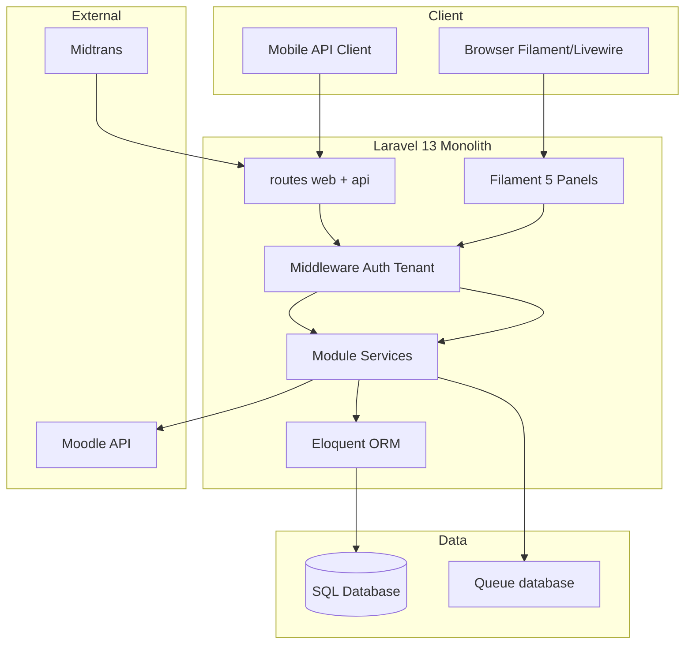

# 02 — Inventaris Teknologi

**Commit analisis:** `d3be06aa`  
**Tujuan dokumen:** Inventaris lengkap stack teknis sistem — setiap temuan disertai bukti file.

---

## Technology Stack (Ringkasan)

| # | Kategori | Temuan | Keyakinan |
|---|----------|--------|-----------|
| 1 | Bahasa pemrograman | **PHP 8.4**, JavaScript (ES module) | FAKTA |
| 2 | Framework | **Laravel 13**, **Filament 5**, **Livewire 4** | FAKTA |
| 3 | Database | SQLite (default dev), MySQL/MariaDB/PostgreSQL (didukung Laravel) | FAKTA |
| 4 | ORM | **Eloquent** (Laravel) | FAKTA |
| 5 | Library utama | Sanctum, Shield, Spatie Permission/Activitylog, Midtrans, DomPDF, JSONLogic | FAKTA |
| 6 | Dependency | Composer (PHP) + NPM (frontend) | FAKTA |
| 7 | Struktur folder | `app/`, `Modules/` (45), `routes/`, `config/`, `database/` | FAKTA |
| 8 | Entry point | `public/index.php`, `artisan`, `bootstrap/app.php` | FAKTA |
| 9 | Build system | **Vite 8** + Tailwind CSS 4 | FAKTA |
| 10 | CI/CD | **GitHub Actions** (5 workflow) | FAKTA |
| 11 | Environment | `.env` / `.env.example` + `config/*.php` | FAKTA |
| 12 | Middleware | Laravel global + alias custom + Filament stack | FAKTA |
| 13 | Authentication | Session (web/Filament), **Sanctum** (API), MFA Filament | FAKTA |
| 14 | Authorization | **Spatie Permission** (teams=`tenant_id`) + **Filament Shield** + Policies | FAKTA |

---

## 1. Bahasa Pemrograman

### FAKTA

| Bahasa | Penggunaan | Versi / catatan |
|--------|------------|-----------------|
| **PHP** | Backend, modul, Filament, Artisan | Constraint `^8.4` |
| **JavaScript** | Frontend asset (Vite) | ES modules (`package.json` `"type": "module"`) |
| **SQL** | Schema via Laravel migrations | 244 file migrasi PHP |
| **Blade** | Template view | 108 file `.blade.php` (manifest) |

## Bukti

| File | Komponen | Keterangan |
|------|----------|------------|
| `composer.json` | `require.php` | `"php": "^8.4"` |
| `package.json` | `"type": "module"` | JavaScript module |
| `vite.config.js` | `defineConfig` | Bundler frontend |
| `00-repository-manifest.md` | §2.1 | 5.281 file PHP tracked; 108 blade |

### TIDAK TERDETEKSI DI KODE

| Bahasa | Status |
|--------|--------|
| TypeScript | **TIDAK TERDETEKSI DI KODE** — tidak ada `tsconfig.json` di root |
| Python / Go / Rust | **TIDAK TERDETEKSI DI KODE** |

---

## 2. Framework

### FAKTA

| Framework | Versi (constraint) | Peran |
|-----------|-------------------|-------|
| **Laravel** | `^13.0` | Application framework, routing, Eloquent, queue |
| **Filament** | `^5.4` | Admin UI (Resources, Pages, Widgets) |
| **Livewire** | v4 (transitif Filament) | Komponen UI reaktif |
| **coolsam/modules** | `^5.1` | Modular monolith (nwidart-compatible) |

## Bukti

| File | Komponen | Keterangan |
|------|----------|------------|
| `composer.json` | `require.laravel/framework` | Laravel 13 |
| `composer.json` | `require.filament/filament` | Filament 5 |
| `composer.json` | `require.coolsam/modules` | 45 modul di `Modules/` |
| `README.md` | Technology Stack | Livewire 4, Filament 5 |
| `AGENTS.md` | Foundational Context | Versi ekosistem resmi proyek |
| `app/Providers/Filament/AdminPanelProvider.php` | `extends PanelProvider` | Konfigurasi panel |

---

## 3. Database

### FAKTA

| Aspek | Temuan |
|-------|--------|
| Default connection (dev) | `sqlite` — `env('DB_CONNECTION', 'sqlite')` |
| Driver didukung di config | `sqlite`, `mysql`, `mariadb`, `pgsql`, `sqlsrv` |
| Schema management | Laravel migrations (244 file) |
| Pola multi-tenant | Shared database; kolom `tenant_id` |
| Session / cache / queue default | `database` driver (`.env.example`) |

## Bukti

| File | Komponen | Keterangan |
|------|----------|------------|
| `config/database.php` | `'default' => env('DB_CONNECTION', 'sqlite')` | Default DB |
| `config/database.php` | `'connections'` | sqlite, mysql, mariadb, pgsql, sqlsrv |
| `.env.example` | `DB_CONNECTION=sqlite` | Dev default |
| `.env.example` | `SESSION_DRIVER=database`, `QUEUE_CONNECTION=database`, `CACHE_STORE=database` | Driver infra |
| `00-repository-manifest.md` | migrasi | 244 file |
| `Modules/Core/database/migrations/` | `create_*_table.php` | DDL domain |

### KETIDAKPASTIAN

| Item | Status |
|------|--------|
| Engine DB produksi pasti (MySQL vs Postgres) | **KETIDAKPASTIAN** — ditentukan `DB_CONNECTION` di deploy, tidak di-hardcode |
| Jumlah tabel = 434 | **TIDAK TERDETEKSI DI GIT** — `entity-catalog.json` tidak ter-commit |

---

## 4. ORM

### FAKTA

| Aspek | Temuan |
|-------|--------|
| ORM | **Eloquent** (`Illuminate\Database\Eloquent`) |
| Model domain | `Modules/*/app/Models/` + `app/Models/` (bridge) |
| Global scope tenant | `BelongsToTenant` + `TenantScope` |
| User provider auth | Eloquent → `Modules\Core\Models\User` |

## Bukti

| File | Komponen | Keterangan |
|------|----------|------------|
| `config/auth.php` | `providers.users.driver` | `'eloquent'` |
| `config/auth.php` | `model` | `User::class` (Core) |
| `app/Models/User.php` | `extends` Core User | Bridge ekosistem |
| `Modules/Core/app/Models/Concerns/BelongsToTenant.php` | trait | Scope ORM tenant |
| `app/Scopes/TenantScope.php` | `apply()` | Global scope query |

### TIDAK TERDETEKSI DI KODE

| Pola | Status |
|------|--------|
| Repository pattern layer terpusat | **TIDAK TERDETEKSI DI KODE** |
| Doctrine ORM | **TIDAK TERDETEKSI DI KODE** |

---

## 5. Library Utama (Produksi)

### FAKTA

| Library | Paket Composer | Fungsi |
|---------|----------------|--------|
| Filament Shield | `bezhansalleh/filament-shield` | RBAC UI + generate permission |
| Spatie Activity Log | `spatie/laravel-activitylog` | Log aktivitas model |
| Laravel Sanctum | `laravel/sanctum` | API token authentication |
| JSON Logic | `jwadhams/json-logic-php` | Kondisi transisi workflow |
| Midtrans PHP | `midtrans/midtrans-php` | Pembayaran SaaS billing |
| DomPDF | `barryvdh/laravel-dompdf` | Generasi PDF |
| Simple QR Code | `simplesoftwareio/simple-qrcode` | QR code |
| Laravel Pulse | `laravel/pulse` | Observability dashboard |

## Bukti

| File | Komponen | Keterangan |
|------|----------|------------|
| `composer.json` | `require` | Daftar paket di atas |
| `config/filament-shield.php` | — | Konfigurasi Shield |
| `config/midtrans.php` | — | Billing |
| `config/moodle.php` | — | Integrasi LMS |
| `Modules/Workflow/app/Support/JsonLogicEvaluator.php` | — | Evaluator rules |
| `database/migrations/2026_05_22_142909_create_activity_log_table.php` | — | Tabel activity log |
| `database/migrations/2026_05_23_073542_create_pulse_tables.php` | — | Tabel Pulse |

**Catatan:** Spatie Permission diakses via Filament Shield (tidak terdaftar langsung di `composer.json` root — dependency transitif Shield).

---

## 6. Dependency Management

### FAKTA — PHP (Composer)

| Aspek | Detail |
|-------|--------|
| Manifest | `composer.json`, `composer.lock` |
| Autoload PSR-4 | `App\`, `Modules\{Name}\`, `Database\Factories\` |
| Merge plugin | `Modules/*/composer.json` di-merge |
| Scripts | `dev`, `test`, `lint`, `analyse`, `setup` |

## Bukti

| File | Komponen | Keterangan |
|------|----------|------------|
| `composer.json` | `autoload.psr-4` | Namespace 45+ modul |
| `composer.json` | `extra.merge-plugin` | `Modules/*/composer.json` |
| `composer.json` | `scripts` | `dev`, `test`, `lint:translations` |

### FAKTA — JavaScript (NPM)

| Paket | Versi | Peran |
|-------|-------|-------|
| vite | ^8.0.0 | Bundler |
| tailwindcss | ^4.3.0 | CSS |
| laravel-vite-plugin | ^3.0.0 | Bridge Laravel-Vite |
| cytoscape, dagre | ^3.x / ^0.8 | Workflow designer graph |

## Bukti

| File | Komponen | Keterangan |
|------|----------|------------|
| `package.json` | `devDependencies` | Daftar paket NPM |
| `package-lock.json` | — | Lock file (jika ada di repo) |

### FAKTA — Dev dependencies (PHP)

`phpunit/phpunit`, `laravel/pint`, `larastan/larastan`, `phpstan/phpstan`, `fakerphp/faker`, `laravel/boost`, `laravel/pail`, `mockery/mockery`, `nunomaduro/collision`

## Bukti

| File | Komponen | Keterangan |
|------|----------|------------|
| `composer.json` | `require-dev` | Daftar lengkap |

---

## 7. Struktur Folder

### FAKTA

| Path | Peran | Bukti hitungan |
|------|-------|----------------|
| `app/` | Layer aplikasi: Filament panels, HTTP, Jobs, Integrations, Imports | 318 PHP — manifest |
| `Modules/` | 45 modul domain | `ls Modules/` |
| `routes/` | `web.php`, `api.php`, `console.php` | 3 file |
| `config/` | Konfigurasi aplikasi | 24 file PHP |
| `Modules/*/config/` | Konfigurasi per modul | 17 file — manifest |
| `database/migrations/` | Migrasi core | 37 + 207 modul = 244 |
| `database/seeders/`, `factories/` | Seed & factory | manifest |
| `resources/` | CSS, JS, views global | Vite inputs |
| `public/` | Document root | `index.php` |
| `tests/` | PHPUnit feature/unit | 173 file |
| `scripts/` | Lint, ekstraksi docs | 21 file |
| `docs/catalogs/` | JSON katalog API & auth | ter-commit |
| `bootstrap/` | `app.php`, `providers.php` | Bootstrap Laravel |
| `mobile/` | Konfigurasi shell mobile | `02-structure-catalog.md` |

### Pola internal modul (FAKTA)

```
Modules/{Name}/
  app/Filament/Resources/
  app/Models/
  app/Policies/
  app/Providers/
  app/Services/
  database/migrations/
  routes/web.php, api.php
  module.json
```

## Bukti

| File | Komponen | Keterangan |
|------|----------|------------|
| `CLAUDE.md` | Directory Layout | Konvensi modul |
| `Modules/School/app/Filament/Resources/Students/` | — | Contoh struktur resource |
| `00-repository-manifest.md` | §1–2 | Inventaris folder |

### Dikecualikan (FAKTA)

`vendor/`, `node_modules/`, `.git/` — `.gitignore`

---

## 8. Entry Point Aplikasi

### FAKTA

| Entry | Path / perintah | Fungsi |
|-------|-----------------|--------|
| HTTP | `public/index.php` | Front controller → `bootstrap/app.php` |
| Bootstrap | `bootstrap/app.php` | Routing, middleware, exceptions |
| Providers | `bootstrap/providers.php` | Registrasi service provider |
| CLI | `artisan` | Console commands |
| Scheduler | `routes/console.php` | Scheduled tasks |
| Health | `GET /up` | Health check Laravel 11+ |

## Bukti

| File | Komponen | Keterangan |
|------|----------|------------|
| `public/index.php` | `$app->handleRequest()` | Entry HTTP |
| `bootstrap/app.php` | `withRouting()` | web, api, console, health |
| `bootstrap/providers.php` | array | App + 3 Filament providers |
| `bootstrap/app.php` | `withCommands` | `app/Console/Commands` |

### FAKTA — Service providers terdaftar

`AppServiceProvider`, `AdminPanelProvider`, `PlatformPanelProvider`, `ParentPanelProvider`

## Bukti

| File | Komponen | Keterangan |
|------|----------|------------|
| `bootstrap/providers.php` | — | Daftar provider |

---

## 9. Build System

### FAKTA

| Tool | Peran |
|------|-------|
| **Vite 8** | Bundle CSS/JS |
| **Tailwind CSS 4** | Utility-first CSS via `@tailwindcss/vite` |
| **laravel-vite-plugin** | Integrasi manifest ke Blade/Filament |

### Input Vite

- `resources/css/app.css`
- `resources/js/app.js`
- `resources/js/workflow-designer.js`
- `resources/css/filament/admin/theme.css`

## Bukti

| File | Komponen | Keterangan |
|------|----------|------------|
| `vite.config.js` | `laravel({ input: [...] })` | Entry points build |
| `package.json` | `scripts.build` | `vite build` |
| `package.json` | `scripts.dev` | `vite` dev server |
| `composer.json` | `scripts.dev` | `npm run dev` + artisan serve |
| `composer.json` | `scripts.setup` | `npm run build` pada setup |
| `app/Providers/Filament/AdminPanelProvider.php` | `viteTheme()` | Theme CSS admin |

---

## 10. CI/CD

### FAKTA — GitHub Actions (5 workflow)

| Workflow | File | Trigger | Job |
|----------|------|---------|-----|
| Tests | `.github/workflows/tests.yml` | push/PR `main` | PHPUnit PHP 8.4 |
| Static Analysis | `.github/workflows/static.yml` | push/PR `main` | Pint, PHPStan (2 job) |
| Translation Lint | `.github/workflows/lint-translations.yml` | path filter Filament | `lint-translations.php` |
| Lint Tenant Fields | `.github/workflows/lint-tenant-fields.yml` | — | `lint-tenant-fields.php` |
| Mobile Shell | `.github/workflows/mobile-shell.yml` | — | Build mobile shell |

## Bukti

| File | Komponen | Keterangan |
|------|----------|------------|
| `.github/workflows/tests.yml` | `php artisan test --compact` | CI test |
| `.github/workflows/static.yml` | `pint --test`, `phpstan analyse` | CI quality |
| `.github/workflows/lint-translations.yml` | `composer run lint:translations` | CI i18n |

### TIDAK TERDETEKSI DI KODE

| Item | Status |
|------|--------|
| Dockerfile / Kubernetes / Terraform | **TIDAK TERDETEKSI DI KODE** |
| Pipeline deploy produksi (selain GHA test/lint) | **TIDAK TERDETEKSI DI KODE** |

---

## 11. Konfigurasi Environment

### FAKTA

| Mekanisme | Lokasi |
|-----------|--------|
| Variabel environment | `.env` (lokal, gitignored) |
| Template | `.env.example` |
| Config PHP | `config/*.php` (24 file) + `Modules/*/config/` |
| Override per key | `env('KEY', default)` di config |

### Variabel penting (`.env.example`)

| Grup | Variabel contoh |
|------|-----------------|
| App | `APP_NAME`, `APP_ENV`, `APP_KEY`, `APP_URL`, `APP_LOCALE` |
| Database | `DB_CONNECTION`, `DB_HOST`, `DB_DATABASE`, … |
| Session/Queue/Cache | `SESSION_DRIVER`, `QUEUE_CONNECTION`, `CACHE_STORE` |
| Redis | `REDIS_HOST`, `REDIS_PORT` |
| Moodle | `MOODLE_BASE_URL`, `MOODLE_WS_TOKEN`, `MOODLE_SYNC_ENABLED`, … |
| Tenancy | `TENANCY_API_REQUIRE_TENANT`, `TENANCY_SCOPE_FAIL_CLOSED` |
| Midtrans | `MIDTRANS_SERVER_KEY`, `MIDTRANS_CLIENT_KEY`, `MIDTRANS_IS_PRODUCTION` |
| Exam runtime | `EXAM_RUNTIME_*` |
| Sanctum | `SANCTUM_STATEFUL_DOMAINS` (via `config/sanctum.php`) |
| Vite | `VITE_APP_NAME` |

## Bukti

| File | Komponen | Keterangan |
|------|----------|------------|
| `.env.example` | — | Template env lengkap |
| `.gitignore` | `.env` | Secret tidak di-commit |
| `config/database.php` | `env('DB_CONNECTION')` | Pola config |
| `config/tenancy.php` | — | Tenancy fail-closed |
| `config/moodle.php` | — | Integrasi Moodle |
| `config/midtrans.php` | — | Pembayaran |
| `config/queue.php` | `env('QUEUE_CONNECTION', 'database')` | Queue default |

---

## 12. Middleware

### FAKTA — Global & alias (`bootstrap/app.php`)

| Middleware / alias | Kelas | Fungsi |
|--------------------|-------|--------|
| `trustProxies('*')` | Laravel built-in | Proxy trust |
| CSRF except | — | `billing/webhook`, `donation/webhook` |
| `api.version.meta` | `AttachApiVersionMeta` | Meta versi API v2 |
| `resolve.api.tenant` | `ResolveApiTenant` | Bind tenant dari token API |
| `idempotency` | `IdempotencyKey` | Idempotent POST |
| `subscription.active` | `EnsureTenantSubscriptionActive` | Cek langganan tenant |
| `role` | `Spatie\Permission\Middleware\RoleMiddleware` | Role check |
| `permission` | `PermissionMiddleware` | Permission check |
| `role_or_permission` | `RoleOrPermissionMiddleware` | Kombinasi |

## Bukti

| File | Komponen | Keterangan |
|------|----------|------------|
| `bootstrap/app.php` | `withMiddleware()` | Registrasi global & alias |
| `app/Http/Middleware/ResolveApiTenant.php` | `handle()` | API tenant |
| `app/Http/Middleware/IdempotencyKey.php` | — | Idempotency |
| `app/Http/Middleware/EnsureTenantSubscriptionActive.php` | — | Subscription gate |
| `routes/api.php` | middleware groups | `throttle:api`, `auth:sanctum`, `resolve.api.tenant`, `idempotency` |

### FAKTA — Filament Admin panel middleware

| Lapisan | Middleware |
|---------|------------|
| Panel | `EncryptCookies`, `StartSession`, `AuthenticateSession`, `PreventRequestForgery`, … |
| Auth | `Authenticate`, `SetUserLocale`, `EnsureTenantSubscriptionActive` |
| Tenant (persistent) | `SyncShieldTenant`, `BindTenantToContainer` |

## Bukti

| File | Komponen | Keterangan |
|------|----------|------------|
| `app/Providers/Filament/AdminPanelProvider.php` | `->middleware()`, `->authMiddleware()`, `->tenantMiddleware()` | Stack Filament admin |
| `app/Http/Middleware/BindTenantToContainer.php` | `handle()` | Set `CurrentTenant` |
| `Modules/Core/Http/Middleware/SetUserLocale.php` | — | Locale user |

### FAKTA — Sanctum middleware (config)

`AuthenticateSession`, `EncryptCookies`, `ValidateCsrfToken` — untuk SPA stateful.

## Bukti

| File | Komponen | Keterangan |
|------|----------|------------|
| `config/sanctum.php` | `middleware` | Middleware Sanctum |

---

## 13. Authentication

### FAKTA

| Channel | Mekanisme | Bukti |
|---------|-----------|-------|
| **Web / Filament** | Guard `web`, driver `session` | `config/auth.php` |
| **API** | `auth:sanctum` bearer token | `routes/api.php`, `config/sanctum.php` |
| **User model** | `Modules\Core\Models\User` | `config/auth.php` |
| **MFA admin** | Filament App + Email authentication | `AdminPanelProvider.php` |
| **Password reset / email verify** | Filament built-in | `AdminPanelProvider.php` |
| **Personal access tokens** | Tabel `personal_access_tokens` | migration Sanctum |

## Bukti

| File | Komponen | Keterangan |
|------|----------|------------|
| `config/auth.php` | `guards.web` | Session driver |
| `config/auth.php` | `providers.users.model` | `User::class` |
| `config/sanctum.php` | `guard`, `expiration` | Token API |
| `app/Providers/Filament/AdminPanelProvider.php` | `->login()`, `multiFactorAuthentication()` | Login + MFA |
| `database/migrations/2026_05_22_003518_create_personal_access_tokens_table.php` | — | Token storage |
| `app/Http/Middleware/ResolveApiTenant.php` | — | Tenant pada token API |

### FAKTA — Panel access (bukan auth credential, tetapi gate setelah login)

| Panel | Syarat |
|-------|--------|
| `admin` | Global super admin **atau** `userTenantRoles` exists |
| `platform` | Role `platform_owner` (team id 0) |
| `parent` | Record `parent_students.parent_user_id` |

## Bukti

| File | Komponen | Keterangan |
|------|----------|------------|
| `Modules/Core/app/Models/User.php` | `canAccessPanel()` | Baris 463–484 |

### TIDAK TERDETEKSI DI KODE

| Mekanisme | Status |
|-----------|--------|
| OAuth2 / Social login (Google, etc.) | **TIDAK TERDETEKSI DI KODE** |
| LDAP / SAML SSO | **TIDAK TERDETEKSI DI KODE** |

---

## 14. Authorization

### FAKTA

| Lapisan | Implementasi |
|---------|--------------|
| **Spatie Permission** | Roles & permissions; **teams enabled**; `team_foreign_key = tenant_id` |
| **Filament Shield** | Generate permission per resource; plugin di admin panel |
| **Policies** | `Modules/*/app/Policies/` per model |
| **Global bypass** | `Gate::before` → `isGlobalSuperAdmin()` |
| **Domain membership** | `TenantRole`, `UserTenantRole` (terpisah dari Spatie) |
| **Pulse dashboard** | `Gate::define('viewPulse', ...)` super admin only |

## Bukti

| File | Komponen | Keterangan |
|------|----------|------------|
| `config/permission.php` | `'teams' => true`, `'team_foreign_key' => 'tenant_id'` | RBAC per tenant |
| `config/filament-shield.php` | `super_admin`, `panel_user`, custom permissions | Shield config |
| `app/Providers/AppServiceProvider.php` | `Gate::before`, `Gate::define('viewPulse')` | Bypass super admin |
| `app/Providers/Filament/AdminPanelProvider.php` | `FilamentShieldPlugin::make()` | Shield di panel |
| `Modules/Core/app/Services/TenantAdminProvisioner.php` | `assignShieldSuperAdmin()` | Provisi super_admin per tenant |
| `database/migrations/2026_03_25_120551_create_permission_tables.php` | — | Tabel Spatie |
| `docs/catalogs/authorization-matrix.json` | `resource_count: 257` | Katalog permission scaffold |

### INFERENSI

| Pernyataan | Alasan |
|------------|--------|
| ~3100 permission keys (257 resource × 12 aksi + custom) | Dihitung dari pola Shield — `REAP_AUDIT.md` EV-00008 |

### KETIDAKPASTIAN

| Item | Status |
|------|--------|
| Matriks permission efektif per tenant di DB produksi | **KETIDAKPASTIAN** — butuh query runtime `roles`/`permissions` |

---

## Arsitektur Teknis

### FAKTA — Pola arsitektur



## Bukti

| File | Komponen | Keterangan |
|------|----------|------------|
| `bootstrap/app.php` | routing | Monolith entry |
| `composer.json` | single `type: project` | Bukan multi-repo services |
| `config/queue.php` | database queue | Async in-process |
| `app/Integrations/Moodle/MoodleClient.php` | — | Outbound integration |

### FAKTA — Karakteristik teknis kunci

| Karakteristik | Implementasi |
|---------------|--------------|
| Multi-tenancy | Shared DB + `tenant_id` scope |
| Modularisasi | 45 modul, autoload PSR-4 per modul |
| UI admin | Filament metadata (Resource/Form/Table classes) |
| Workflow | Metadata + JSONLogic + snapshot instance |
| API versioning | v1, v2 + OpenAPI JSON |
| i18n | `FilamentUi` + `preferred_locale` user |

## Bukti

| File | Komponen | Keterangan |
|------|----------|------------|
| `config/tenancy.php` | — | Tenancy config |
| `Modules/Workflow/app/Services/DatabaseWorkflowInstanceStarter.php` | `buildSnapshot()` | Workflow snapshot |
| `app/Http/Controllers/Api/OpenApiController.php` | — | OpenAPI |
| `Modules/Core/app/Support/FilamentUi.php` | — | Bilingual UI |

---

## Tools Pengembangan

| Tool | Perintah / file | Fungsi |
|------|-----------------|--------|
| Laravel Pint | `vendor/bin/pint` | PHP formatter |
| PHPStan / Larastan | `vendor/bin/phpstan` | Static analysis |
| PHPUnit | `php artisan test` | Testing |
| Laravel Pail | `php artisan pail` | Log tail (dev) |
| Tinker | `php artisan tinker` | REPL |
| Translation lint | `composer run lint:translations` | Anti hardcoded label |
| Tenant field lint | `composer run lint:tenant-fields` | Cek pola tenant |
| Route list | `php artisan route:list` | Inspeksi rute |
| Doc extraction | `scripts/extract-api-routes.php`, dll. | Katalog otomatis |

## Bukti

| File | Komponen | Keterangan |
|------|----------|------------|
| `composer.json` | `scripts` | `test`, `lint`, `analyse`, `lint:translations` |
| `scripts/lint-translations.php` | — | Linter terjemahan |
| `scripts/extract-api-routes.php` | — | Generator `api-routes-catalog.json` |

---

## Referensi Silang

- Ringkasan bisnis & modul: **`01_ringkasan_sistem.md`**
- Gap inventaris (entity catalog, deploy): **`17_gap_analysis.md`**
