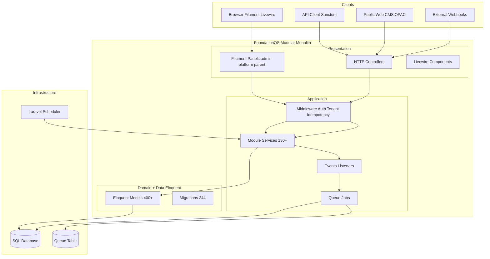
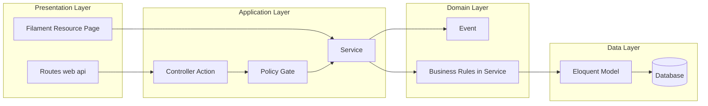
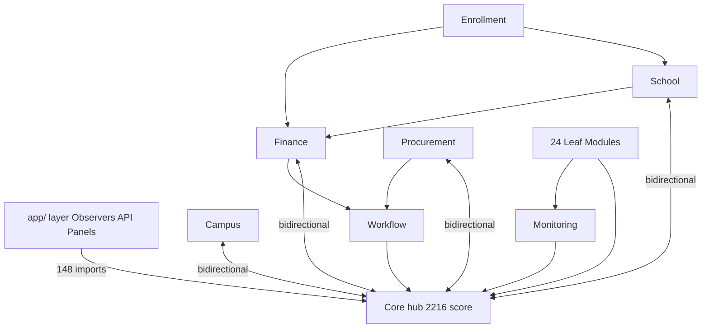
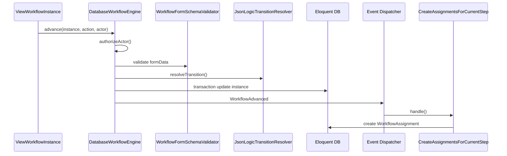
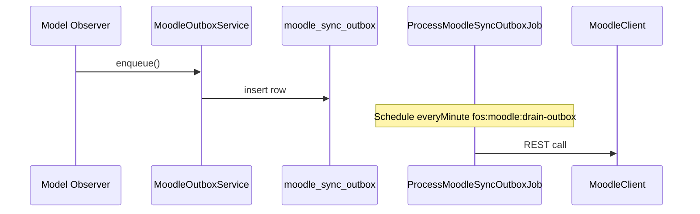

# 03 — Arsitektur Aplikasi

**Commit:** `d3be06aa` · **Metode:** Analisis statis source code + graf impor PHP

---

## Ringkasan

FoundationOS diimplementasikan sebagai **modular monolith** Laravel dengan pola **layered + MVC (Laravel/Filament)**. Pola Clean Architecture, Hexagonal, Onion, dan microservices **tidak diadopsi secara eksplisit** di struktur folder/kontrak kode.

---

## 1. Identifikasi Pola Arsitektur

| Pola | Status | Kesimpulan |
|------|--------|------------|
| **Monolith** | **FAKTA** | Satu deployable `composer.json`, satu proses PHP, 45 modul dalam repo yang sama |
| **Layer architecture** | **FAKTA** | Presentation → Application → Domain → Data terlihat di pemisahan folder |
| **MVC** | **FAKTA (parsial)** | Laravel MVC: Controller + Model (Eloquent) + View (Blade/Livewire); banyak logika di Service & Filament Resource |
| **Modular monolith** | **FAKTA** | `coolsam/modules`, namespace `Modules\{Name}\` |
| **Clean Architecture** | **TIDAK TERDETEKSI DI KODE** | Tidak ada ring Domain/Application/Infrastructure terpisah; tidak ada port/adapter formal |
| **Hexagonal** | **TIDAK TERDETEKSI DI KODE** | Tidak ada folder `Ports/`/`Adapters/`; beberapa `Contracts/` di Workflow saja |
| **Onion** | **TIDAK TERDETEKSI DI KODE** | Tidak ada dependency rule inward-only yang terenforce |
| **Microservice** | **TIDAK TERDETEKSI DI KODE** | Tidak ada service boundary terpisah, API gateway internal, atau deploy unit per modul |

## Bukti — Monolith & modular

| File | Komponen | Keterangan |
|------|----------|------------|
| `composer.json` | `"type": "project"` | Satu artefak aplikasi |
| `composer.json` | `coolsam/modules` | Modular monolith |
| `bootstrap/app.php` | `Application::configure()` | Single application bootstrap |
| `public/index.php` | `$app->handleRequest()` | Satu HTTP entry |

## Bukti — Layer (bukan Clean/Hexagonal)

| File | Komponen | Keterangan |
|------|----------|------------|
| `app/Providers/Filament/` | Panel providers | Presentation |
| `app/Http/Controllers/`, `Modules/*/Http/Controllers/` | Controllers | Application / MVC |
| `Modules/*/Services/` | ~130+ service classes | Domain/application logic |
| `Modules/*/Models/` | Eloquent models | Domain + persistence (aktif record) |
| `Modules/*/database/migrations/` | Migrations | Data schema |
| `Modules/Workflow/app/Contracts/` | `WorkflowEngine`, dll. | **PARSIAL** — interface hanya di modul Workflow |

## Bukti — Bukan microservice

| Temuan | Keterangan |
|--------|------------|
| Tidak ada `Dockerfile` / service mesh | **TIDAK TERDETEKSI DI KODE** |
| Komunikasi antar modul | PHP `use` import + shared DB, bukan HTTP antar service |
| `Modules/Exam` | Integrasi via HTTP API ke modul lain, bukan deploy terpisah — `Modules/Exam/routes/api.php` |

---

## 2. Inventaris Komponen Arsitektural

### 2.1 Controller

**FAKTA:** HTTP controllers di `app/Http/Controllers/` dan `Modules/*/Http/Controllers/` — API v1, PDF, webhook, OPAC, CMS publik.

## Bukti

| File | Komponen | Keterangan |
|------|----------|------------|
| `app/Http/Controllers/Api/v1/ApplicantController.php` | `store()` | API write applicant |
| `app/Http/Controllers/BillingController.php` | — | Webhook Midtrans |
| `Modules/Enrollment/app/Http/Controllers/InquiryController.php` | `store()` | Public inquiry |
| `Modules/Exam/app/Http/Controllers/Api/ExamRuntimeWebhookController.php` | `storeAttempt()` | Exam webhook |
| `Modules/Library/app/Http/Controllers/PublicOpacController.php` | — | OPAC publik |
| `Modules/Campus/app/Http/Controllers/CampusController.php` | REST scaffold | Module API CRUD |

**INFERENSI:** Filament Pages/Livewire (`ViewWorkflowInstance`, `WorkflowCanvas`) berperan sebagai controller UI — bukan class `*Controller`.

---

### 2.2 Service

**FAKTA:** Logika bisnis terpusat di `Modules/*/app/Services/` (~130+ kelas `*Service`).

## Bukti

| File | Komponen | Keterangan |
|------|----------|------------|
| `Modules/Workflow/app/Services/DatabaseWorkflowEngine.php` | `advance()` | Engine approval |
| `Modules/Finance/app/Services/FinanceControlService.php` | `verifyPayment()` | Kontrol keuangan |
| `Modules/Enrollment/app/Services/ApplicantPromotionService.php` | — | Promosi applicant |
| `Modules/Procurement/app/Services/ThreeWayMatchValidator.php` | — | Validasi procurement |
| `app/Services/BillingService.php` | — | Billing SaaS |
| `app/Integrations/Moodle/MoodleOutboxService.php` | `enqueue()` | Integrasi Moodle |

---

### 2.3 Repository

**FAKTA:** **TIDAK TERDETEKSI DI KODE** — tidak ada layer `*Repository` interface/implementasi dominan.

## Bukti

| File | Komponen | Keterangan |
|------|----------|------------|
| `rg "Repository" --glob "*.php"` (exclude vendor) | 1 match | Hanya komentar di `config/database.php` |

**INFERENSI:** Eloquent Model + Query Builder menggantikan repository pattern.

---

### 2.4 Model & Entity

**FAKTA:** Domain persistence memakai **Eloquent Model** (`extends Model`), bukan entity class terpisah dari ORM.

## Bukti

| File | Komponen | Keterangan |
|------|----------|------------|
| `Modules/Core/app/Models/Tenant.php` | `class Tenant extends Model` | Entitas tenant |
| `Modules/School/app/Models/Student.php` | model | Entitas siswa |
| `Modules/Workflow/app/Models/WorkflowInstance.php` | model | Runtime workflow |
| `Modules/Core/app/Models/Concerns/BelongsToTenant.php` | trait | Pola entity operasional |

**TIDAK TERDETEKSI DI KODE:** folder `Entity/` atau DDD aggregate root terpisah dari Model.

---

### 2.5 Middleware

**FAKTA:** Middleware global, alias Laravel, Filament stack, dan modul Core.

## Bukti

| File | Komponen | Keterangan |
|------|----------|------------|
| `bootstrap/app.php` | `alias()` | `resolve.api.tenant`, `idempotency`, Spatie role/permission |
| `app/Http/Middleware/BindTenantToContainer.php` | `handle()` | Tenant context Filament |
| `app/Http/Middleware/ResolveApiTenant.php` | `handle()` | Tenant dari token API |
| `app/Http/Middleware/EnsureTenantSubscriptionActive.php` | `handle()` | Gate langganan |
| `app/Http/Middleware/IdempotencyKey.php` | — | Idempotency API |
| `Modules/Core/Http/Middleware/SetUserLocale.php` | — | Locale user |
| `app/Providers/Filament/AdminPanelProvider.php` | `->middleware()`, `->tenantMiddleware()` | Stack Filament + `SyncShieldTenant` |

---

### 2.6 DTO

**FAKTA:** **TIDAK TERDETEKSI DI KODE** — tidak ada namespace `Dto`/`DTO` atau kelas `*Dto`.

## Bukti

| Temuan | Keterangan |
|--------|------------|
| `rg "class \w+Dto\|namespace .*\\Dto"` | No matches |
| `Modules/Workflow/app/Support/WorkflowContextData.php` | **TERINDIKASI** — value object/array shape untuk context workflow, bukan DTO layer formal |

---

### 2.7 Event

**FAKTA:** Laravel domain events di `Modules/*/app/Events/`; listener di `Listeners/` dan `EventServiceProvider`.

## Bukti

| File | Komponen | Keterangan |
|------|----------|------------|
| `Modules/Workflow/app/Events/WorkflowStarted.php` | event | Start workflow |
| `Modules/Workflow/app/Events/WorkflowAdvanced.php` | event | Advance workflow |
| `Modules/Enrollment/app/Events/ApplicantAccepted.php` | `__construct(Applicant, ?User)` | Pipeline admisi |
| `Modules/Finance/app/Events/StudentInvoicePaid.php` | event | Pipeline finance |
| `Modules/Workflow/app/Providers/EventServiceProvider.php` | listener map | `CreateAssignmentsForCurrentStep`, dll. |
| `app/Providers/AppServiceProvider.php` | observer registrations | Model observers (cross-cutting) |

---

### 2.8 Queue

**FAKTA:** Queue driver default `database`; jobs di `app/Jobs/` dan `Modules/Workflow/app/Jobs/`.

## Bukti

| File | Komponen | Keterangan |
|------|----------|------------|
| `config/queue.php` | `'default' => env('QUEUE_CONNECTION', 'database')` | Driver default |
| `app/Jobs/ProcessMoodleSyncOutboxJob.php` | `handle()` | Drain Moodle outbox |
| `app/Jobs/DeliverWebhookJob.php` | — | Webhook delivery |
| `Modules/Workflow/app/Jobs/CheckWorkflowSlaJob.php` | — | SLA workflow |
| `.env.example` | `QUEUE_CONNECTION=database` | Konfigurasi dev |

---

### 2.9 Scheduler

**FAKTA:** 28 entri `Schedule::command` di `routes/console.php`.

## Bukti

| File | Komponen | Keterangan |
|------|----------|------------|
| `routes/console.php` | `Schedule::command(...)` | 28 scheduled tasks |
| `routes/console.php` | `fos:moodle:drain-outbox` | `->everyMinute()` |
| `routes/console.php` | `fos:billing:generate-invoices` | `->monthlyOn(1, '02:00')` |
| `routes/console.php` | `school:generate-monthly-tuition` | `->monthlyOn(1, '03:00')` |
| `routes/console.php` | `helpdesk:check-sla` | `->everyFifteenMinutes()` |

---

## 3. Diagram Arsitektur (Mermaid)

### 3.1 High-level system architecture

**Sumber:** `bootstrap/app.php`, `AdminPanelProvider.php`, struktur `Modules/*/`.

---

### 3.2 Layer flow (request path)

**Contoh bukti jalur:** `ApplicantController@store` → model/service → DB (`routes/api.php`); `ViewWorkflowInstance` → `DatabaseWorkflowEngine::advance()` → `WorkflowInstance` model.

---

### 3.3 Dependency flow (modul & app)

**Sumber:** Analisis statis `use Modules\{Name}\` — `03-module-dependency-map.md` F-01, F-04; script impor 2026-06-19.

---

### 3.4 Component interaction — Workflow advance

## Bukti

| File | Komponen | Keterangan |
|------|----------|------------|
| `Modules/Workflow/app/Filament/Resources/WorkflowInstances/Pages/ViewWorkflowInstance.php` | actions | Memicu engine |
| `Modules/Workflow/app/Services/DatabaseWorkflowEngine.php` | `advance()` baris 37+ | Orkestrasi |
| `Modules/Workflow/app/Providers/EventServiceProvider.php` | mapping | Listener chain |

---

### 3.5 Component interaction — Moodle outbox

## Bukti

| File | Komponen | Keterangan |
|------|----------|------------|
| `app/Observers/StudentObserver.php` | — | Trigger sync |
| `app/Jobs/ProcessMoodleSyncOutboxJob.php` | `handle()` | Worker |
| `routes/console.php` | `fos:moodle:drain-outbox` | Scheduler |

---

## 4. Karakteristik Arsitektural Penting

| Karakteristik | Implementasi | Keyakinan |
|---------------|--------------|-----------|
| Shared-kernel coupling | `Core` mengimpor model domain (School 72×, Campus 40×) sambil domain mengimpor Core utilities | FAKTA |
| UI metadata-driven | 375 Filament resources (257 literal + 118 alias `LocalizedResource`) | FAKTA |
| Workflow metadata-driven | Snapshot + JSONLogic transitions | FAKTA |
| API modular scaffold | 14 modul punya `routes/api.php` | FAKTA |
| Tenancy | `BelongsToTenant` global scope | FAKTA |

## Bukti

| File | Komponen | Keterangan |
|------|----------|------------|
| `03-module-dependency-map.md` | F-06 | 375 Filament resources |
| `02-structure-catalog.md` | §2.1 | 44 web.php + 14 api.php modul |
| `Modules/Workflow/app/Services/JsonLogicWorkflowTransitionResolver.php` | — | Rules engine |

---

## 5. KETIDAKPASTIAN & Gap

| Item | Status |
|------|--------|
| Runtime DI binding graph lengkap | **TIDAK TERDETEKSI** — hanya spot-check `WorkflowServiceProvider` |
| Queue payload coupling antar modul | **TERINDIKASI NAMUN BELUM TERBUKTI PENUH** |
| Apakah arsitektur target = Clean/Hexagonal | **TIDAK TERDETEKSI DI KODE** — tidak ada ADR |

---

## Referensi

- Inventaris teknologi: `02_inventaris_teknologi.md`
- Analisis per modul: `04_analisis_modul.md`
- Peta dependensi: `03-module-dependency-map.md`
