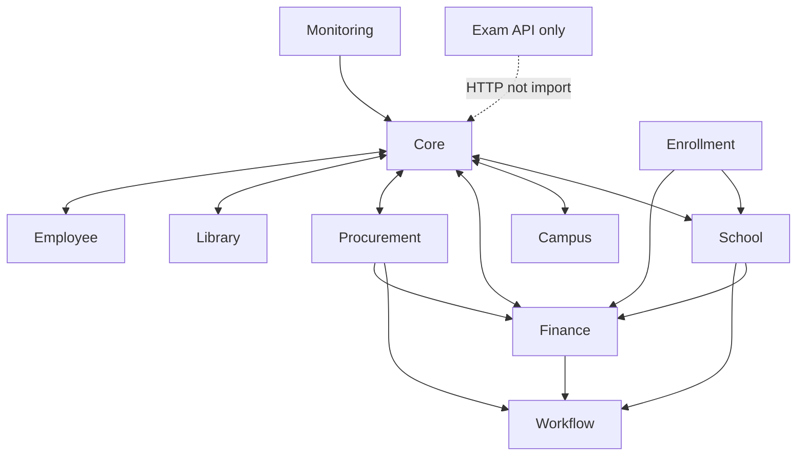

# 04 — Analisis Modul

**Commit:** `d3be06aa` · **Metode:** Scan folder modul + graf impor PHP statis (`use Modules\{Name}\`)

**Legenda tujuan:**
- **FAKTA** — ada di `module.json` `description` atau komentar file resmi
- **INFERENSI** — diturunkan dari nama modul + model/service dominan (bukan dokumen SRS)

**Legenda tier:** Foundation / Hub / Leaf / Isolated — dari `03-module-dependency-map.md` & hitungan impor

---

## Ringkasan Agregat

| Metrik | Nilai | Bukti |
|--------|------:|-------|
| Total modul | 45 | `ls Modules/` |
| Modul leaf (depend hanya Core ± Monitoring) | 24 | Analisis impor statis |
| Modul hub domain | 11 | Core, School, Campus, Finance, Procurement, Workflow, Employee, Enrollment, Library, Monitoring, Exam |
| Total Filament Resource | 375 | 257 `extends ModuleResource` + 118 alias `LocalizedResource` — `03-module-dependency-map.md` F-06 |

---

## Tabel Ringkas Semua Modul

| Modul | Tier | Models | Services | Controllers | Resources | Events | Policies | Outbound utama |
|-------|------|-------:|---------:|------------:|----------:|-------:|---------:|----------------|
| Ai | Minimal | 1 | 2 | 0 | 1 | 0 | 1 | Core |
| Alumni | Leaf | 9 | 1 | 0 | 9 | 0 | 1 | Core, Monitoring |
| Asset | Domain | 7 | 2 | 0 | 7 | 0 | 1 | Core, Finance |
| Boarding | Leaf | 7 | 2 | 1 | 7 | 0 | 2 | Core |
| Cafeteria | Leaf | 8 | 1 | 0 | 8 | 0 | 1 | Core |
| Campus | Hub | 17 | 8 | 7 | 17 | 0 | 13 | Core, Finance |
| Capacity | Leaf | 3 | 1 | 0 | 3 | 0 | 1 | Core |
| Clinic | Leaf | 9 | 1 | 0 | 9 | 0 | 1 | Core |
| Cms | Leaf | 10 | 3 | 1 | 10 | 0 | 1 | Core, Enrollment |
| Consulting | Leaf | 6 | 2 | 1 | 6 | 0 | 1 | Core |
| Core | Foundation | 25 | 6 | 2 | 24 | 0 | 17 | School, Campus, Employee, Finance, Procurement |
| Counseling | Bridge | 7 | 2 | 1 | 7 | 0 | 2 | Core, School |
| Dms | Leaf | 4 | 1 | 0 | 4 | 0 | 1 | Core |
| Donation | Domain | 7 | 4 | 2 | 7 | 0 | 2 | Core, Finance |
| EducationQa | Leaf | 8 | 2 | 0 | 8 | 0 | 1 | Core |
| Employee | Hub | 13 | 4 | 4 | 13 | 0 | 12 | Core, Workflow, Finance |
| Enrollment | Hub | 10 | 6 | 6 | 10 | 2 | 6 | Core, Finance, School |
| EOffice | Leaf | 5 | 3 | 2 | 5 | 0 | 1 | Core |
| Event | Leaf | 10 | 2 | 1 | 10 | 0 | 2 | Core |
| Exam | Isolated | 20 | 25 | 3 | 5 | 3 | 8 | Core, Campus, School (API keluar) |
| Facility | Domain | 8 | 3 | 0 | 8 | 0 | 1 | Core, Finance, Sales |
| Finance | Hub | 10 | 6 | 5 | 10 | 1 | 9 | Core, Workflow, Enrollment |
| Global | Leaf | 6 | 0 | 1 | 6 | 0 | 6 | Core |
| Helpdesk | Leaf | 6 | 1 | 0 | 6 | 1 | 1 | Core |
| InternalAudit | Domain | 9 | 1 | 0 | 9 | 0 | 1 | Core, Risk |
| Inventory | Bridge | 7 | 7 | 1 | 7 | 1 | 4 | Core, Workflow, Procurement, Finance |
| IsoCompliance | Leaf | 7 | 2 | 0 | 7 | 0 | 1 | Core |
| ItOps | Leaf | 4 | 3 | 1 | 4 | 1 | 1 | Core |
| KpiEnterprise | Leaf | 6 | 2 | 0 | 6 | 0 | 1 | Core |
| Legal | Domain | 4 | 4 | 1 | 4 | 1 | 2 | Core, Messaging |
| Library | Hub | 21 | 3 | 4 | 20 | 0 | 21 | Core, Enrollment, School |
| Marketplace | Leaf | 8 | 2 | 0 | 8 | 0 | 0 | Core |
| MerchOrder | Leaf | 6 | 2 | 1 | 6 | 0 | 1 | Core |
| Messaging | Leaf | 3 | 3 | 1 | 3 | 0 | 1 | Core |
| Monitoring | Cross-cut | 7 | 3 | 1 | 5 | 0 | 3 | Core, Inventory, Procurement |
| PhysicalSecurity | Leaf | 8 | 1 | 0 | 8 | 0 | 1 | Core |
| Printing | Leaf | 8 | 3 | 0 | 8 | 0 | 0 | Core |
| Procurement | Hub | 14 | 10 | 6 | 14 | 2 | 14 | Core, Workflow, Finance |
| Property | Leaf | 6 | 2 | 1 | 6 | 0 | 1 | Core |
| Risk | Leaf | 7 | 1 | 0 | 7 | 0 | 1 | Core |
| Sales | Domain | 4 | 3 | 2 | 4 | 1 | 1 | Core, Finance |
| School | Hub | 21 | 12 | 7 | 21 | 0 | 17 | Core, Workflow, Finance, Enrollment |
| Training | Leaf | 9 | 3 | 2 | 9 | 0 | 2 | Core |
| Transport | Domain | 9 | 1 | 0 | 9 | 0 | 1 | Core, Asset |
| Workflow | Hub | 10 | 16 | 0 | 10 | 6 | 6 | Core, Procurement, Finance |

**Bukti hitungan komponen:** script Python scan `Modules/{Name}/app/` — 2026-06-19.  
**Bukti impor:** analisis `use Modules\{Name}\` di `Modules/{Modul}/app/**/*.php`.

---

## Detail Per Modul

---

### Ai

| Field | Nilai |
|-------|-------|
| **Tujuan** | **FAKTA:** Governance AI advisor, prompt registry, audit usage (`module.json` description) |
| **Komponen** | 1 model, 2 services, 1 Filament resource, 1 policy |
| **Dependency outbound** | Core(8), Monitoring(1) |
| **Relasi** | Leaf → Core; tidak diimpor modul lain secara signifikan |

## Bukti

| File | Komponen | Keterangan |
|------|----------|------------|
| `Modules/Ai/module.json` | `description` | Teks tujuan modul |
| `Modules/Ai/app/Models/AiPromptTemplate.php` | model | Registry prompt |
| `Modules/Ai/app/Services/AiAdvisorService.php` | class | Layanan advisor |
| `Modules/Ai/app/Filament/Resources/AiPromptTemplates/AiPromptTemplateResource.php` | resource | UI admin |

---

### Alumni

| Field | Nilai |
|-------|-------|
| **Tujuan** | **INFERENSI:** Manajemen alumni, karier, donasi alumni — dari model `Alumnus`, `JobPosting`, `InternshipPosting` |
| **Komponen** | 9 models, 1 service, 9 resources |
| **Dependency** | Core(33), Monitoring(9) — leaf |
| **Relasi** | Hanya ke Core + Monitoring |

## Bukti

| File | Komponen | Keterangan |
|------|----------|------------|
| `Modules/Alumni/app/Models/Alumnus.php` | model | Entitas utama |
| `Modules/Alumni/app/Services/CompanyPartnerRegistrationService.php` | service | Registrasi mitra |
| `Modules/Alumni/database/migrations/2026_05_24_000000_create_alumni_tables.php` | migration | Schema batch |

---

### Asset

| Field | Nilai |
|-------|-------|
| **Tujuan** | **INFERENSI:** Manajemen aset, depresiasi, peminjaman — `Asset`, `AssetDepreciation`, `AssetLoan` |
| **Komponen** | 7 models, 2 services, 7 resources |
| **Dependency** | Core(28), Monitoring(7), Finance(1) |
| **Relasi** | Transport mengimpor Asset(1) |

## Bukti

| File | Komponen | Keterangan |
|------|----------|------------|
| `Modules/Asset/app/Services/AssetDepreciationService.php` | service | Depresiasi |
| `Modules/Asset/app/Models/Asset.php` | model | Entitas aset |
| `routes/console.php` | `asset:check-maintenance-due` | Scheduler terkait modul |

---

### Boarding

| Field | Nilai |
|-------|-------|
| **Tujuan** | **INFERENSI:** Asrama, penugasan kamar, izin keluar — `Dormitory`, `RoomAssignment`, `BoardingLeavePermit` |
| **Komponen** | 7 models, 2 services, 1 controller (PDF), 7 resources |
| **Dependency** | Leaf: Core, Monitoring |
| **Relasi** | `BoardingLeavePermitPdfController` |

## Bukti

| File | Komponen | Keterangan |
|------|----------|------------|
| `Modules/Boarding/app/Models/Dormitory.php` | model | Asrama |
| `Modules/Boarding/app/Services/BoardingLeavePermitDocumentService.php` | service | Dokumen izin |
| `Modules/Boarding/app/Http/Controllers/BoardingLeavePermitPdfController.php` | controller | PDF |

---

### Cafeteria

| Field | Nilai |
|-------|-------|
| **Tujuan** | **INFERENSI:** Kantin, menu, dompet siswa — `Menu`, `StudentWallet`, `CafeteriaTransaction` |
| **Komponen** | 8 models, 1 service, 8 resources |
| **Dependency** | Leaf |
| **Relasi** | Scheduler `cafeteria:settle-tenants` — `routes/console.php` |

## Bukti

| File | Komponen | Keterangan |
|------|----------|------------|
| `Modules/Cafeteria/app/Models/Menu.php` | model | Menu kantin |
| `Modules/Cafeteria/app/Services/MenuRegistrationService.php` | service | Registrasi menu |

---

### Campus

| Field | Nilai |
|-------|-------|
| **Tujuan** | **INFERENSI:** Perguruan tinggi — fakultas, prodi, KRS, wisuda — `Faculty`, `StudyProgram`, `StudyPlan`, `CollageStudent` |
| **Komponen** | 17 models, 8 services, 7 controllers (PDF), 17 resources, 13 policies |
| **Dependency** | Hub: Core(126), Monitoring(8), Finance(1); **bidirectional** dengan Core |
| **Relasi** | Exam mengimpor Campus(18); Core mengimpor Campus(40) |

## Bukti

| File | Komponen | Keterangan |
|------|----------|------------|
| `Modules/Campus/app/Models/StudyProgram.php` | model | Program studi |
| `Modules/Campus/app/Services/TranscriptDocumentService.php` | service | Transkrip PDF |
| `Modules/Campus/app/Http/Controllers/CampusController.php` | controller | REST API scaffold |
| `app/Observers/CourseObserver.php` | observer | Moodle sync trigger (app→Campus) |

---

### Capacity

| Field | Nilai |
|-------|-------|
| **Tujuan** | **INFERENSI:** Perencanaan kapasitas fasilitas — `CapacityResource`, `CapacityForecast` |
| **Komponen** | 3 models, 1 service, 3 resources |
| **Dependency** | Leaf |

## Bukti

| File | Komponen | Keterangan |
|------|----------|------------|
| `Modules/Capacity/app/Models/CapacityResource.php` | model | Resource kapasitas |
| `Modules/Capacity/app/Services/CapacityResourceRegistrationService.php` | service | Registrasi |

---

### Clinic

| Field | Nilai |
|-------|-------|
| **Tujuan** | **INFERENSI:** Klinik sekolah/kampus — `HealthRecord`, `ClinicVisit`, `VaccinationRecord` |
| **Komponen** | 9 models, 1 service, 9 resources |
| **Dependency** | Leaf |

## Bukti

| File | Komponen | Keterangan |
|------|----------|------------|
| `Modules/Clinic/app/Models/HealthRecord.php` | model | Rekam kesehatan |
| `Modules/Clinic/database/migrations/2026_05_24_000000_create_clinic_tables.php` | migration | 9 tabel |

---

### Cms

| Field | Nilai |
|-------|-------|
| **Tujuan** | **INFERENSI:** Website publik institusi — `Site`, `Page`, `Article`, `Banner` |
| **Komponen** | 10 models, 3 services, 1 controller, 10 resources |
| **Dependency** | Core(33), Monitoring(7), Enrollment(1) |
| **Relasi** | `PublicSiteController` untuk web publik |

## Bukti

| File | Komponen | Keterangan |
|------|----------|------------|
| `Modules/Cms/app/Http/Controllers/PublicSiteController.php` | controller | Site publik |
| `Modules/Cms/app/Services/CmsPublishService.php` | service | Publikasi konten |
| `Modules/Cms/routes/web.php` | routes | Rute publik |

---

### Consulting

| Field | Nilai |
|-------|-------|
| **Tujuan** | **INFERENSI:** Proyek konsultasi — `ConsultingClient`, `ConsultingEngagement`, `EngagementProposal` |
| **Komponen** | 6 models, 2 services, 1 controller, 6 resources |
| **Dependency** | Leaf (lean: tanpa `config/` penuh — `02-structure-catalog.md`) |

## Bukti

| File | Komponen | Keterangan |
|------|----------|------------|
| `Modules/Consulting/app/Models/ConsultingEngagement.php` | model | Engagement |
| `Modules/Consulting/app/Http/Controllers/EngagementInvoicePdfController.php` | controller | PDF invoice |

---

### Core

| Field | Nilai |
|-------|-------|
| **Tujuan** | **INFERENSI:** Fondasi SaaS — tenancy, user, organisasi, modul tenant, UI bersama |
| **Komponen** | 25 models, 6 services, 2 controllers, 24 resources, 17 policies |
| **Dependency** | **Hub tertinggi:** outbound ke School(72), Campus(40), Employee(25), Finance(21), Procurement(20), Monitoring(17), Library(15), Enrollment(9) |
| **Relasi** | **2.144 inbound imports**; shared kernel dengan domain |

## Bukti

| File | Komponen | Keterangan |
|------|----------|------------|
| `Modules/Core/app/Models/Tenant.php` | model | Batas tenant SaaS |
| `Modules/Core/app/Models/User.php` | `canAccessPanel()` | Gate panel baris 463–484 |
| `Modules/Core/app/Filament/Support/ModuleResource.php` | base class | Base 375 resources |
| `Modules/Core/app/Support/FilamentUi.php` | `text()`, `field()` | i18n UI |
| `Modules/Core/app/Models/Concerns/BelongsToTenant.php` | trait | Multi-tenancy ORM |
| `Modules/Core/app/Http/Controllers/CoreController.php` | controller | API scaffold |
| `app/Providers/Filament/AdminPanelProvider.php` | panel | Registrasi tenant Filament |

---

### Counseling

| Field | Nilai |
|-------|-------|
| **Tujuan** | **INFERENSI:** Konseling siswa — `CounselingCase`, `Counselor`, `CounselingSession` |
| **Komponen** | 7 models, 2 services, 1 controller, 7 resources |
| **Dependency** | Core(29), School(5), Monitoring(7) — **bidirectional** Counseling ↔ School |
| **Relasi** | `AnonymousReportController` |

## Bukti

| File | Komponen | Keterangan |
|------|----------|------------|
| `Modules/Counseling/app/Models/CounselingCase.php` | model | Kasus konseling |
| `Modules/Counseling/app/Http/Controllers/AnonymousReportController.php` | controller | Laporan anonim |
| `Modules/Counseling/app/Policies/CounselingNotePolicy.php` | policy | Role `counselor`, `principal` |

---

### Dms

| Field | Nilai |
|-------|-------|
| **Tujuan** | **INFERENSI:** Document management — `Document`, `DocumentFolder`, `DocumentVersion` |
| **Komponen** | 4 models, 1 service, 4 resources |
| **Dependency** | Leaf; scheduler `dms:archive-expired` |

## Bukti

| File | Komponen | Keterangan |
|------|----------|------------|
| `Modules/Dms/app/Models/Document.php` | model | Dokumen |
| `routes/console.php` | `dms:archive-expired` | Scheduler |

---

### Donation

| Field | Nilai |
|-------|-------|
| **Tujuan** | **INFERENSI:** Donasi, kampanye, wakaf — `Donation`, `Campaign`, `Wakaf` |
| **Komponen** | 7 models, 4 services, 2 controllers, 7 resources |
| **Dependency** | Core(31), Finance(2) |
| **Relasi** | `DonationWebhookController`, `DonationPaymentService` |

## Bukti

| File | Komponen | Keterangan |
|------|----------|------------|
| `Modules/Donation/app/Services/DonationPaymentService.php` | service | Pembayaran |
| `Modules/Donation/app/Http/Controllers/DonationWebhookController.php` | controller | Webhook |
| `Modules/Donation/routes/web.php` | route | `/donation/webhook` |

---

### EducationQa

| Field | Nilai |
|-------|-------|
| **Tujuan** | **INFERENSI:** Jaminan mutu & akreditasi — `QualityStandard`, `AccreditationCycle`, `GapAnalysis` |
| **Komponen** | 8 models, 2 services, 8 resources |
| **Dependency** | Leaf |

## Bukti

| File | Komponen | Keterangan |
|------|----------|------------|
| `Modules/EducationQa/app/Models/AccreditationCycle.php` | model | Siklus akreditasi |
| `Modules/EducationQa/app/Services/SchoolHealthIndexService.php` | service | Indeks kesehatan sekolah |

---

### Employee

| Field | Nilai |
|-------|-------|
| **Tujuan** | **INFERENSI:** HR — pegawai, kontrak, payroll, KPI, cuti — `Employee`, `LeaveRequest`, `SalarySlip` |
| **Komponen** | 13 models, 4 services, 4 controllers, 13 resources, 12 policies |
| **Dependency** | Hub: Core(117), Workflow(13), Finance(5); bidirectional Core ↔ Employee |
| **Relasi** | API `LeaveRequestController` di `app/Http/Controllers/Api/v1/` |

## Bukti

| File | Komponen | Keterangan |
|------|----------|------------|
| `Modules/Employee/app/Services/PayrollCalculationService.php` | service | Perhitungan payroll |
| `Modules/Employee/app/Models/LeaveRequest.php` | model | Cuti |
| `app/Http/Controllers/Api/v1/LeaveRequestController.php` | `store()` | API cuti |
| `Modules/Employee/app/Http/Controllers/EmployeeController.php` | controller | REST module API |

---

### Enrollment

| Field | Nilai |
|-------|--------|
| **Tujuan** | **INFERENSI:** Admisi & CRM — `Applicant`, `Lead`, `AdmissionPeriod`, `Registration` |
| **Komponen** | 10 models, 6 services, 6 controllers, 10 resources, **2 events** |
| **Dependency** | Hub: Core(78), Finance(4), School(2); bidirectional Enrollment ↔ School, Finance |
| **Relasi** | `POST api/inquiry`; event `ApplicantAccepted` |

## Bukti

| File | Komponen | Keterangan |
|------|----------|------------|
| `Modules/Enrollment/app/Services/ApplicantPromotionService.php` | service | Promosi ke student |
| `Modules/Enrollment/app/Services/LeadInquiryService.php` | `createFromInquiry()` | Lead publik |
| `Modules/Enrollment/app/Events/ApplicantAccepted.php` | event | Pipeline acceptance |
| `Modules/Enrollment/app/Http/Controllers/InquiryController.php` | `store()` | Public API |
| `tests/Feature/ApplicantAcceptedPipelineTest.php` | test | Bukti perilaku |

---

### EOffice

| Field | Nilai |
|-------|-------|
| **Tujuan** | **INFERENSI:** Surat menyurat elektronik — `Letter`, `LetterTemplate`, `LetterDisposition` |
| **Komponen** | 5 models, 3 services, 2 controllers, 5 resources |
| **Dependency** | Leaf |

## Bukti

| File | Komponen | Keterangan |
|------|----------|------------|
| `Modules/EOffice/app/Models/Letter.php` | model | Surat |
| `Modules/EOffice/app/Services/LetterNumberingService.php` | service | Penomoran |
| `Modules/EOffice/app/Http/Controllers/LetterVerificationController.php` | `show()` | Verifikasi publik token |
| `routes/api.php` | `letters/verify/{token}` | Route API |

---

### Event

| Field | Nilai |
|-------|-------|
| **Tujuan** | **INFERENSI:** Manajemen acara — `Event`, `EventTicket`, `EventCheckIn` |
| **Komponen** | 10 models, 2 services, 1 controller, 10 resources |
| **Dependency** | Leaf |

## Bukti

| File | Komponen | Keterangan |
|------|----------|------------|
| `Modules/Event/app/Models/Event.php` | model | Acara |
| `Modules/Event/app/Services/EventRegistrationService.php` | service | Registrasi peserta |

---

### Exam

| Field | Nilai |
|-------|-------|
| **Tujuan** | **INFERENSI:** Ujian CBT/runtime, bank soal, gradebook — `ExamModel`, services `ExamLifecycleService`, `ExamRuntimeSyncService` |
| **Komponen** | 20 models, **25 services**, 3 controllers, 5 resources, **3 events** |
| **Dependency** | Outbound: Core(61), Campus(18), School(17); **0 inbound** module imports — **isolated via API** |
| **Relasi** | `POST api/exam/runtime/attempts`; tidak diimpor modul lain |

## Bukti

| File | Komponen | Keterangan |
|------|----------|------------|
| `Modules/Exam/routes/api.php` | route | Runtime webhook |
| `Modules/Exam/app/Services/ExamLifecycleService.php` | service | Siklus ujian |
| `Modules/Exam/app/Http/Controllers/Api/ExamRuntimeWebhookController.php` | `storeAttempt()` | Ingest hasil |
| `03-module-dependency-map.md` | F-05 | Zero inbound imports |

---

### Facility

| Field | Nilai |
|-------|-------|
| **Tujuan** | **INFERENSI:** Gedung, ruangan, pemeliharaan — `Building`, `Room`, `FacilityRental` |
| **Komponen** | 8 models, 3 services, 8 resources |
| **Dependency** | Core(30), Finance(2), Sales(1) |

## Bukti

| File | Komponen | Keterangan |
|------|----------|------------|
| `Modules/Facility/app/Models/Room.php` | model | Ruangan |
| `Modules/Facility/app/Services/FacilityRentalJournalService.php` | service | Jurnal sewa |

---

### Finance

| Field | Nilai |
|-------|-------|
| **Tujuan** | **INFERENSI:** Akuntansi — COA, invoice, payment, jurnal — `ChartOfAccount`, `StudentInvoice`, `JournalEntry` |
| **Komponen** | 10 models, 6 services, 5 controllers, 10 resources, **1 event**, 9 policies |
| **Dependency** | Hub: Core(109), Workflow(8), Enrollment(3), Procurement(2); bidirectional Finance ↔ Workflow, Procurement |
| **Relasi** | Event `StudentInvoicePaid`; `FinanceControlService` |

## Bukti

| File | Komponen | Keterangan |
|------|----------|------------|
| `Modules/Finance/app/Services/FinanceControlService.php` | `verifyPayment()`, `postJournal()` | Aturan bisnis |
| `Modules/Finance/app/Events/StudentInvoicePaid.php` | event | Pipeline pembayaran |
| `app/Http/Controllers/Api/v1/PaymentController.php` | `store()` | API pembayaran |
| `tests/Feature/StudentInvoicePaidPipelineTest.php` | test | Integrasi |

---

### Global

| Field | Nilai |
|-------|-------|
| **Tujuan** | **INFERENSI:** Data referensi geografis — `Country`, `Province`, `City`, `District`, `Village` |
| **Komponen** | 6 models, 0 services, 1 controller, 6 resources (alias `LocalizedResource`) |
| **Dependency** | Leaf: hanya Core(30) |
| **Relasi** | Procurement mengimpor Global(2) |

## Bukti

| File | Komponen | Keterangan |
|------|----------|------------|
| `Modules/Global/app/Models/Country.php` | model | Negara |
| `Modules/Global/app/Http/Controllers/GlobalController.php` | controller | API scaffold |
| `Modules/Global/app/Filament/Resources/Countries/CountryResource.php` | `extends LocalizedResource` | Alias pattern — F-06 |

---

### Helpdesk

| Field | Nilai |
|-------|-------|
| **Tujuan** | **INFERENSI:** Tiket support — `Ticket`, `TicketCategory`, `KnowledgeBaseArticle` |
| **Komponen** | 6 models, 1 service, 6 resources, **1 event** |
| **Dependency** | Leaf; scheduler `helpdesk:check-sla` |

## Bukti

| File | Komponen | Keterangan |
|------|----------|------------|
| `Modules/Helpdesk/app/Events/TicketCreated.php` | event | Tiket baru |
| `routes/console.php` | `helpdesk:check-sla` | SLA check |

---

### InternalAudit

| Field | Nilai |
|-------|-------|
| **Tujuan** | **INFERENSI:** Audit internal — `AuditProgram`, `AuditFinding`, `CorrectiveAction` |
| **Komponen** | 9 models, 1 service, 9 resources |
| **Dependency** | Core(33), Risk(1) |

## Bukti

| File | Komponen | Keterangan |
|------|----------|------------|
| `Modules/InternalAudit/app/Models/AuditFinding.php` | model | Temuan audit |
| `Modules/InternalAudit/app/Services/AuditProgramRegistrationService.php` | service | Registrasi program |

---

### Inventory

| Field | Nilai |
|-------|-------|
| **Tujuan** | **INFERENSI:** Persediaan stok — `StockItem`, `StockMove`, `Warehouse` |
| **Komponen** | 7 models, 7 services, 1 controller, 7 resources, **1 event** |
| **Dependency** | Core(38), Workflow(7), Procurement(6), Finance(6); bidirectional Inventory ↔ Monitoring |
| **Relasi** | Event `StockMoveCommitted` |

## Bukti

| File | Komponen | Keterangan |
|------|----------|------------|
| `Modules/Inventory/app/Services/StockMoveService.php` | service | Mutasi stok |
| `Modules/Inventory/app/Events/StockMoveCommitted.php` | event | Commit stok |
| `Modules/Inventory/app/Http/Controllers/InventoryController.php` | controller | API |

---

### IsoCompliance

| Field | Nilai |
|-------|-------|
| **Tujuan** | **INFERENSI:** Kepatuhan ISO — `IsoControl`, `InformationAsset`, `StatementsOfApplicability` |
| **Komponen** | 7 models, 2 services, 7 resources |
| **Dependency** | Leaf |

## Bukti

| File | Komponen | Keterangan |
|------|----------|------------|
| `Modules/IsoCompliance/app/Models/IsoControl.php` | model | Kontrol ISO |
| `Modules/IsoCompliance/app/Services/ComplianceDashboardService.php` | service | Dashboard |

---

### ItOps

| Field | Nilai |
|-------|-------|
| **Tujuan** | **INFERENSI:** Operasi TI — `SoftwareLicense`, `BackupJob`, `UserAccount` |
| **Komponen** | 4 models, 3 services, 1 controller, 4 resources, **1 event** |
| **Dependency** | Leaf |

## Bukti

| File | Komponen | Keterangan |
|------|----------|------------|
| `Modules/ItOps/app/Events/ItIncidentReceived.php` | event | Insiden IT |
| `Modules/ItOps/app/Http/Controllers/MonitoringWebhookController.php` | controller | Webhook monitoring |
| `routes/console.php` | `itops:check-expiry` | Scheduler |

---

### KpiEnterprise

| Field | Nilai |
|-------|-------|
| **Tujuan** | **INFERENSI:** KPI enterprise-wide — `KpiArea`, `KpiTarget`, `KpiActual`, `KpiCascade` |
| **Komponen** | 6 models, 2 services, 6 resources |
| **Dependency** | Leaf |

## Bukti

| File | Komponen | Keterangan |
|------|----------|------------|
| `Modules/KpiEnterprise/app/Services/KpiRollupService.php` | service | Agregasi KPI |
| `Modules/KpiEnterprise/app/Models/KpiCascade.php` | model | Cascade KPI |

---

### Legal

| Field | Nilai |
|-------|-------|
| **Tujuan** | **INFERENSI:** Kontrak & dokumen hukum — `Contract`, `LegalDocument` |
| **Komponen** | 4 models, 4 services, 1 controller, 4 resources, **1 event** |
| **Dependency** | Core(22), Messaging(1) |

## Bukti

| File | Komponen | Keterangan |
|------|----------|------------|
| `Modules/Legal/app/Events/ContractExpiringSoon.php` | event | Kontrak hampir habis |
| `routes/console.php` | `legal:check-expiring-contracts` | Scheduler |
| `Modules/Legal/app/Services/ContractDocumentService.php` | service | Dokumen kontrak |

---

### Library

| Field | Nilai |
|-------|-------|
| **Tujuan** | **INFERENSI:** Perpustakaan — `Book`, `Loan`, `Fine`, `Member`; integrasi SLIMS |
| **Komponen** | 21 models, 3 services, 4 controllers, 20 resources, 21 policies |
| **Dependency** | Hub: Core(121), Enrollment(4), School(1); bidirectional Core ↔ Library |
| **Relasi** | OPAC publik; `LibraryImportSlimsCommand` di `app/Console/Commands/` |

## Bukti

| File | Komponen | Keterangan |
|------|----------|------------|
| `Modules/Library/app/Http/Controllers/PublicOpacController.php` | controller | OPAC |
| `Modules/Library/app/Models/Book.php` | model | Buku |
| `app/Console/Commands/LibraryImportSlimsCommand.php` | command | Import SLIMS |
| `routes/console.php` | `fos:library:recalc-fines` | Scheduler denda |

---

### Marketplace

| Field | Nilai |
|-------|-------|
| **Tujuan** | **INFERENSI:** Marketplace produk — `MarketplaceProduct`, `MarketplaceOrder`, `Seller` |
| **Komponen** | 8 models, 2 services, 8 resources, **0 policies** |
| **Dependency** | Leaf (lean module — `02-structure-catalog.md`) |

## Bukti

| File | Komponen | Keterangan |
|------|----------|------------|
| `Modules/Marketplace/app/Services/MarketplaceOrderService.php` | service | Order |
| `Modules/Marketplace/app/Models/MarketplaceOrder.php` | model | Pesanan |

---

### MerchOrder

| Field | Nilai |
|-------|-------|
| **Tujuan** | **INFERENSI:** Pesanan merchandise/seragam — `MerchOrder`, `UniformPackage`, `BookPackage` |
| **Komponen** | 6 models, 2 services, 1 controller, 6 resources |
| **Dependency** | Leaf |

## Bukti

| File | Komponen | Keterangan |
|------|----------|------------|
| `Modules/MerchOrder/app/Models/MerchOrder.php` | model | Order |
| `Modules/MerchOrder/app/Http/Controllers/MerchOrderPdfController.php` | controller | PDF |

---

### Messaging

| Field | Nilai |
|-------|-------|
| **Tujuan** | **INFERENSI:** Notifikasi multi-channel — `NotificationTemplate`, `NotificationDelivery` |
| **Komponen** | 3 models, 3 services, 1 controller, 3 resources |
| **Dependency** | Leaf; Core mengimpor Messaging (bidirectional cluster) |

## Bukti

| File | Komponen | Keterangan |
|------|----------|------------|
| `Modules/Messaging/app/Services/NotificationDispatcher.php` | `sendWhatsApp()` | Dispatch channel |
| `Modules/Messaging/app/Http/Controllers/WhatsAppWebhookController.php` | `handle()` | Webhook WhatsApp |
| `Modules/Messaging/app/Providers/MessagingServiceProvider.php` | binding | `LogWhatsAppProvider` default |

---

### Monitoring

| Field | Nilai |
|-------|-------|
| **Tujuan** | **INFERENSI:** Audit, webhook, file upload, Moodle outbox UI — `AuditLog`, `WebhookDelivery`, `MoodleSyncOutbox` |
| **Komponen** | 7 models, 3 services, 1 controller, 5 resources, 3 policies |
| **Dependency** | Cross-cut: Core(30), Inventory(4), Procurement(3), Finance(2) — **268 inbound** |
| **Relasi** | Dipakai hampir semua modul leaf |

## Bukti

| File | Komponen | Keterangan |
|------|----------|------------|
| `Modules/Monitoring/app/Models/AuditLog.php` | model | Audit trail |
| `Modules/Monitoring/app/Filament/Resources/MoodleSyncOutboxes/MoodleSyncOutboxResource.php` | resource | UI outbox Moodle |
| `Modules/Monitoring/app/Http/Controllers/MonitoringController.php` | controller | API scaffold |

---

### PhysicalSecurity

| Field | Nilai |
|-------|-------|
| **Tujuan** | **INFERENSI:** Keamanan fisik — `Visitor`, `PatrolSchedule`, `EmergencyAlert` |
| **Komponen** | 8 models, 1 service, 8 resources |
| **Dependency** | Leaf; scheduler `safety:daily-rounds` |

## Bukti

| File | Komponen | Keterangan |
|------|----------|------------|
| `Modules/PhysicalSecurity/app/Models/Visitor.php` | model | Pengunjung |
| `routes/console.php` | `safety:daily-rounds` | Patrol scheduler |

---

### Printing

| Field | Nilai |
|-------|-------|
| **Tujuan** | **INFERENSI:** Percetakan & publikasi — `PrintOrder`, `Publication`, `PrintTemplate` |
| **Komponen** | 8 models, 3 services, 8 resources |
| **Dependency** | Leaf; Core ↔ Printing bidirectional |

## Bukti

| File | Komponen | Keterangan |
|------|----------|------------|
| `Modules/Printing/app/Services/PrintableDocumentService.php` | service | Dokumen cetak |
| `Modules/Printing/app/Models/PrintOrder.php` | model | Order cetak |

---

### Procurement

| Field | Nilai |
|-------|-------|
| **Tujuan** | **INFERENSI:** Pengadaan PR→RFQ→PO→GR→Vendor Bill — model chain + workflow |
| **Komponen** | 14 models, 10 services, 6 controllers, 14 resources, **2 events**, 14 policies |
| **Dependency** | Hub: Core(138), Workflow(8), Finance(4), Global(2) |
| **Relasi** | Events `PurchaseRequisitionApproved`, `GoodsReceiptConfirmed` |

## Bukti

| File | Komponen | Keterangan |
|------|----------|------------|
| `Modules/Procurement/app/Services/ThreeWayMatchValidator.php` | validasi | Three-way match |
| `Modules/Procurement/app/Services/PurchaseOrderAutoCreationService.php` | service | Auto PO dari RFQ |
| `Modules/Procurement/app/Events/PurchaseRequisitionApproved.php` | event | Trigger workflow |
| `app/Console/Commands/SetupProcurementWorkflowPilotCommand.php` | command | Setup workflow pilot |

---

### Property

| Field | Nilai |
|-------|-------|
| **Tujuan** | **INFERENSI:** Properti & sewa — `Property`, `LeaseAgreement`, `LeaseInvoice` |
| **Komponen** | 6 models, 2 services, 1 controller, 6 resources |
| **Dependency** | Leaf |

## Bukti

| File | Komponen | Keterangan |
|------|----------|------------|
| `Modules/Property/app/Models/LeaseAgreement.php` | model | Sewa |
| `Modules/Property/app/Http/Controllers/LeaseInvoicePdfController.php` | controller | PDF invoice sewa |

---

### Risk

| Field | Nilai |
|-------|-------|
| **Tujuan** | **INFERENSI:** Manajemen risiko — `Risk`, `RiskAssessment`, `KeyRiskIndicator` |
| **Komponen** | 7 models, 1 service, 7 resources |
| **Dependency** | Leaf; InternalAudit mengimpor Risk(1) |

## Bukti

| File | Komponen | Keterangan |
|------|----------|------------|
| `Modules/Risk/app/Models/Risk.php` | model | Risiko |
| `Modules/Risk/app/Services/RiskCategoryService.php` | service | Kategori |

---

### Sales

| Field | Nilai |
|-------|-------|
| **Tujuan** | **INFERENSI:** Penjualan & koperasi — `SalesOrder`, `Customer`, `CooperativeSaving` |
| **Komponen** | 4 models, 3 services, 2 controllers, 4 resources, **1 event** |
| **Dependency** | Core(27), Finance(2); Facility mengimpor Sales(1) |

## Bukti

| File | Komponen | Keterangan |
|------|----------|------------|
| `Modules/Sales/app/Events/SalesOrderConfirmed.php` | event | Order dikonfirmasi |
| `Modules/Sales/app/Services/CooperativeJournalService.php` | service | Jurnal koperasi |

---

### School

| Field | Nilai |
|-------|-------|
| **Tujuan** | **INFERENSI:** K-12 — siswa, kelas, nilai, absensi — `Student`, `SchoolClass`, `Attendance`, `Assessment` |
| **Komponen** | 21 models, 12 services, 7 controllers, 21 resources, 17 policies |
| **Dependency** | Hub: Core(199), Workflow(8), Finance(8), Enrollment(3), Counseling(1) |
| **Relasi** | Bidirectional Core ↔ School; observer Moodle di `app/Observers/` |

## Bukti

| File | Komponen | Keterangan |
|------|----------|------------|
| `Modules/School/app/Services/AttendanceRecapService.php` | service | Rekap absensi |
| `Modules/School/app/Services/ScheduleConflictChecker.php` | service | Konflik jadwal |
| `Modules/School/app/Http/Controllers/ReportCardController.php` | controller | Rapor |
| `app/Observers/StudentObserver.php` | observer | Moodle sync |
| `routes/console.php` | `school:generate-monthly-tuition` | Scheduler SPP |

---

### Training

| Field | Nilai |
|-------|-------|
| **Tujuan** | **INFERENSI:** Pelatihan — `TrainingProgram`, `TrainingSession`, `TrainingCertificate` |
| **Komponen** | 9 models, 3 services, 2 controllers, 9 resources |
| **Dependency** | Leaf |

## Bukti

| File | Komponen | Keterangan |
|------|----------|------------|
| `Modules/Training/app/Services/TrainingCertificateService.php` | service | Sertifikat |
| `Modules/Training/app/Http/Controllers/CertificateVerificationController.php` | controller | Verifikasi sertifikat |

---

### Transport

| Field | Nilai |
|-------|-------|
| **Tujuan** | **INFERENSI:** Transportasi — `Route`, `Vehicle`, `Driver`, `StudentShuttleSubscription` |
| **Komponen** | 9 models, 1 service, 9 resources |
| **Dependency** | Core(62), Asset(1) |

## Bukti

| File | Komponen | Keterangan |
|------|----------|------------|
| `Modules/Transport/app/Models/Route.php` | model | Rute |
| `Modules/Transport/app/Services/RouteRegistrationService.php` | service | Registrasi rute |

---

### Workflow

| Field | Nilai |
|-------|-------|
| **Tujuan** | **INFERENSI:** Mesin approval metadata-driven V2 — definisi, instance, assignment, JSONLogic |
| **Komponen** | 10 models, **16 services**, 10 resources, **6 events**, 6 policies, 1 job |
| **Dependency** | Core(76), Procurement(5), Finance(3) |
| **Relasi** | Dipakai Procurement & Finance; listener chain pada `WorkflowAdvanced` |

## Bukti

| File | Komponen | Keterangan |
|------|----------|------------|
| `Modules/Workflow/app/Services/DatabaseWorkflowEngine.php` | `advance()`, `authorizeActor()` | Engine inti |
| `Modules/Workflow/app/Services/DatabaseWorkflowResolver.php` | `resolveForSubject()` | Resolver workflow |
| `Modules/Workflow/app/Contracts/WorkflowEngine.php` | interface | Kontrak (hexagonal parsial) |
| `Modules/Workflow/app/Events/WorkflowStarted.php` | event | Start instance |
| `Modules/Workflow/app/Providers/WorkflowServiceProvider.php` | DI bindings | Wire implementations |
| `Modules/Workflow/app/Livewire/WorkflowCanvas.php` | Livewire | Visual designer |
| `Modules/Workflow/app/Jobs/CheckWorkflowSlaJob.php` | job | SLA async |

---

## Peta Relasi Antar Modul (FAKTA — import graph)



---

## KETIDAKPASTIAN

| Item | Status |
|------|--------|
| `module.json` `description` kosong untuk 44/45 modul | Tujuan modul = **INFERENSI** dari model kecuali Ai |
| Kedalaman bisnis modul leaf | **TERINDIKASI NAMUN BELUM TERBUKTI PENUH** — dominan CRUD |
| FK database antar modul | **TIDAK TERDETEKSI DI GIT** — `verified-fks.json` |

---

## Regenerasi Data Modul

```bash
# Hitung komponen per modul (contoh)
python3 -c "..."  # script internal analisis 2026-06-19

# Graf dependensi
# Lihat 03-module-dependency-map.md § Regenerate
```

**Referensi:** `03_arsitektur_aplikasi.md`, `03-module-dependency-map.md`, `02-structure-catalog.md` §2.1
