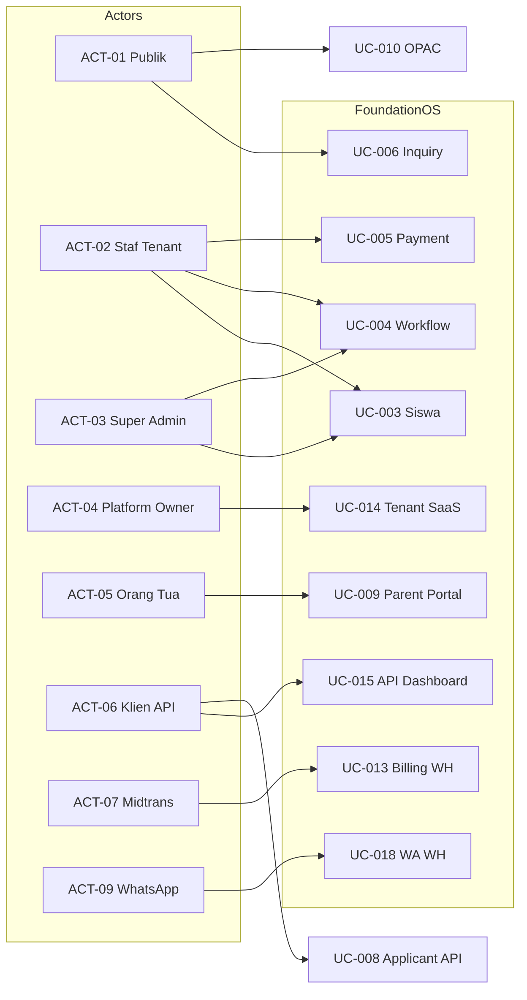
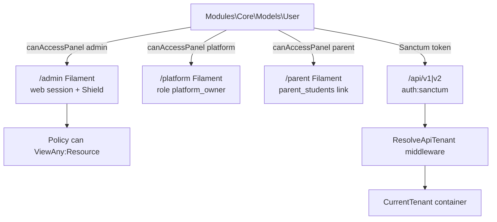

# 07 — Aktor, Use Case, dan Matriks Akses

**Commit analisis:** `d3be06aa` · **Katalog otorisasi:** `docs/catalogs/authorization-matrix.json` (257 resource, ~3100 permission)

---

## 1. Bukti Access Control (Ringkasan)

### Guard

| Guard | Driver | Pemakaian | Bukti |
|-------|--------|-----------|-------|
| `web` | session | Panel Filament, web routes | `config/auth.php` baris 40–44 |
| `sanctum` | token Bearer | API v1/v2, exam runtime | `routes/api.php` middleware `auth:sanctum` |
| Filament `Authenticate` | session + panel gate | `/admin`, `/platform`, `/parent` | `AdminPanelProvider.php` `authMiddleware` |

**TIDAK TERDETEKSI DI KODE:** guard terpisah selain `web` di `config/auth.php` (Sanctum tidak dideklarasikan sebagai guard eksplisit — pola standar Laravel Sanctum).

### Role (Spatie + domain)

| Role / tipe | Scope | Bukti |
|-------------|-------|-------|
| `platform_owner` | Global SaaS (`tenant_id = 0`) | `User::canAccessPanel('platform')` baris 465–468; migration `2026_05_22_145853_create_platform_owner_role.php` |
| `super_admin` | Per-tenant Shield | `config/filament-shield.php` `super_admin.name` |
| `panel_user` | Per-tenant Shield (akses panel dasar) | `config/filament-shield.php` `panel_user.name` |
| `counselor`, `principal` | Per-tenant (counseling) | `CounselingNotePolicy::view()` baris 25 |
| `exam_admin`, `teacher`, `lecturer`, `proctor`, `viewer` | Exam module | `Modules/Exam/app/Enums/ExamRole.php` |
| `TenantRole` (domain) | Membership label per tenant | `Modules/Core/app/Models/TenantRole.php` — **bukan** pengganti Shield permission |

### User type (identitas)

| Tipe | Kriteria kode | Bukti |
|------|---------------|-------|
| Global super admin | `users.is_super_admin = true` | `User::isGlobalSuperAdmin()` baris 458–461 |
| Tenant member | `user_tenant_roles` aktif (belum expired) | `User::canAccessPanel('admin')` baris 471–476; `canAccessTenant()` baris 158–167 |
| Platform owner | Spatie role `platform_owner` | `User::canAccessPanel('platform')` |
| Parent | Baris `parent_students.parent_user_id` | `User::canAccessPanel('parent')` baris 479–481 |
| API principal | `PersonalAccessToken` + optional `tenant_id` | `ResolveApiTenant.php` |
| Guest | Tidak terautentikasi | Route tanpa `auth` middleware |

### Permission

| Pola | Contoh | Bukti |
|------|--------|-------|
| Shield per resource | `ViewAny:Student`, `Create:Payment` | `StudentPolicy::viewAny()` → `can('ViewAny:Student')` |
| Custom exam | `view_exam`, `open_control_room` | `config/filament-shield.php` `custom_permissions` |
| Global bypass | Semua ability `true` | `AppServiceProvider.php` `Gate::before` baris 93–98 |

### Policy

| Pola | Bukti |
|------|-------|
| Generated Shield (12 methods × subject) | `authorization-matrix.json` `policy_methods` |
| Custom domain logic | `CounselingNotePolicy` — confidential notes |
| Workflow assignment (bukan Policy) | `DatabaseWorkflowEngine::authorizeActor()` baris 416–431 |

---

## 2. Daftar Aktor

| ID | Aktor | Deskripsi | Bukti akses |
|----|-------|-----------|-------------|
| **ACT-01** | Pengunjung publik | Tidak login; inquiry, OPAC browse, verifikasi surat | Route tanpa `auth` |
| **ACT-02** | Staf tenant (admin) | User dengan `user_tenant_roles`; RBAC Shield per tenant | `User::canAccessPanel('admin')` |
| **ACT-03** | Super admin global | Bypass semua Gate + akses admin semua tenant | `is_super_admin` + `Gate::before` |
| **ACT-04** | Platform owner | Kelola tenant SaaS di `/platform` | Role `platform_owner`, team `0` |
| **ACT-05** | Orang tua | Portal `/parent`; data anak ter-scope | `parent_students` + `ScopesToParentChildren` |
| **ACT-06** | Klien API | Mobile/integrasi via Sanctum | `auth:sanctum`, `resolve.api.tenant` |
| **ACT-07** | Gateway pembayaran (Midtrans) | Webhook langganan SaaS | `POST /billing/webhook` |
| **ACT-08** | Gateway donasi | Webhook donasi | CSRF except `donation/webhook` |
| **ACT-09** | Provider WhatsApp | Callback pesan | `POST api/webhooks/whatsapp/{provider}` |
| **ACT-10** | Runtime ujian eksternal | Ingest attempt CBT | `POST api/exam/runtime/attempts` + Sanctum |

### Sub-aktor (role fungsional dalam ACT-02)

| ID | Sub-aktor | Bukti |
|----|-----------|-------|
| **ACT-02a** | Approver workflow | Assignment `workflow_assignments.assigned_to_id` | `authorizeActor()` |
| **ACT-02b** | Konselor / kepala sekolah | Role `counselor`, `principal` | `CounselingNotePolicy` |
| **ACT-02c** | Staff ujian (teacher/lecturer/proctor) | `ExamRole` + `ExamAuthorizationService` | `ExamAuthorizationService::passesContextualScope()` |

### TIDAK TERDETEKSI DI KODE

| Aktor | Status |
|-------|--------|
| Siswa dengan panel login dedicated | **TIDAK TERDETEKSI DI KODE** |
| Dosen/siswa sebagai aktor terpisah dari User | Menggunakan `User` + relasi `Teacher`/`Student` |

---

## 3. Daftar Use Case

| ID | Nama use case | Aktor utama |
|----|---------------|-------------|
| UC-001 | Login ke panel admin | ACT-02, ACT-03 |
| UC-002 | Registrasi tenant baru | ACT-02 (user terdaftar) |
| UC-003 | Kelola data siswa (CRUD) | ACT-02, ACT-03 |
| UC-004 | Memajukan workflow approval | ACT-02a, ACT-03 |
| UC-005 | Verifikasi pembayaran siswa | ACT-02 |
| UC-006 | Kirim inquiry admisi publik | ACT-01 |
| UC-007 | Terima applicant → promosi student | ACT-02 |
| UC-008 | Buat applicant via API | ACT-06 |
| UC-009 | Orang tua lihat nilai/absensi anak | ACT-05 |
| UC-010 | Telusuri katalog OPAC | ACT-01 |
| UC-011 | Checkout pinjaman OPAC | ACT-02, ACT-03 |
| UC-012 | Sinkron hasil ujian runtime | ACT-06, ACT-10 |
| UC-013 | Proses webhook billing Midtrans | ACT-07 |
| UC-014 | Platform owner kelola tenant | ACT-04 |
| UC-015 | Ambil dashboard siswa (API) | ACT-06 |
| UC-016 | Verifikasi surat e-office | ACT-01 |
| UC-017 | Laporan konseling anonim | ACT-01, ACT-05 |
| UC-018 | Terima webhook WhatsApp | ACT-09 |
| UC-019 | Kelola entitas domain (meta-CRUD) | ACT-02, ACT-03 |
| UC-020 | Buat pengajuan cuti via API | ACT-06 |

---

## 4. Matriks Aktor vs Use Case

| Use case | ACT-01 | ACT-02 | ACT-03 | ACT-04 | ACT-05 | ACT-06 | ACT-07 | ACT-08 | ACT-09 | ACT-10 |
|----------|:------:|:------:|:------:|:------:|:------:|:------:|:------:|:------:|:------:|:------:|
| UC-001 | | ● | ● | | | | | | | |
| UC-002 | | ● | ● | | | | | | | |
| UC-003 | | ● | ● | | | | | | | |
| UC-004 | | ● | ● | | | | | | | |
| UC-005 | | ● | ● | | | | | | | |
| UC-006 | ● | | | | | | | | | |
| UC-007 | | ● | ● | | | | | | | |
| UC-008 | | | | | | ● | | | | |
| UC-009 | | | | | ● | | | | | |
| UC-010 | ● | | | | | | | | | |
| UC-011 | | ● | ● | | | | | | | |
| UC-012 | | | | | | ● | | | | ● |
| UC-013 | | | | | | | ● | | | |
| UC-014 | | | | ● | | | | | | |
| UC-015 | | | | | | ● | | | | |
| UC-016 | ● | | | | | | | | | |
| UC-017 | ● | | | | ● | | | | | |
| UC-018 | | | | | | | | | ● | |
| UC-019 | | ● | ● | | | | | | | |
| UC-020 | | | | | | ● | | | | |

**Keterangan:** ● = bukti route/policy mengizinkan aktor tersebut. UC-019 mencakup 257 Filament resource — ACT-02 membutuhkan permission Shield per resource.

---

## 5. Diagram Mermaid

### 5.1 Diagram use case (aktor ↔ sistem)



### 5.2 Diagram akses panel & guard



**Bukti:** `User.php:463-484`, `config/auth.php`, `routes/api.php`

---

## 6. Spesifikasi Use Case (dengan referensi kode)

---

### UC-001

**Nama:** Login ke Panel Admin

**Tujuan:** Staf tenant mengautentikasi diri untuk mengakses panel `/admin` pada konteks tenant.

**Trigger:** User membuka `/admin/login` dan mengirim kredensial.

**Pre-condition:**
- User terdaftar di `users` — `AdminPanelProvider.php` `->login()`
- Untuk akses pasca-login: `user_tenant_roles` ada ATAU `is_super_admin` — `User::canAccessPanel('admin')` baris 471–476

**Post-condition:**
- Session `web` guard aktif — `config/auth.php` guard `web`
- Tenant dipilih di Filament; subscription aktif — `EnsureTenantSubscriptionActive` di `authMiddleware`

**Normal flow:**
1. User GET halaman login Filament — `AdminPanelProvider.php` baris 47 `->login()`
2. Filament memvalidasi email/password — middleware `Authenticate` setelah sukses
3. `canAccessPanel('admin')` dievaluasi — `User.php:471-476`
4. `EnsureTenantSubscriptionActive::handle()` — `app/Http/Middleware/EnsureTenantSubscriptionActive.php`
5. User diarahkan ke dashboard — `TabbedDashboard::class` di `->pages([...])`

**Alternative flow:**
- User mengaktifkan MFA app/email — `multiFactorAuthentication()` baris 53–56 `AdminPanelProvider.php`

**Exception flow:**
- Kredensial salah → Filament auth gagal (session tidak dibuat)
- Tanpa membership tenant dan bukan super admin → `canAccessPanel` return `false` — `User.php:476`
- Subscription tidak aktif → middleware subscription memblokir — `EnsureTenantSubscriptionActive.php`

---

### UC-002

**Nama:** Registrasi Tenant Baru

**Tujuan:** User terautentikasi membuat tenant SaaS baru beserta provisioning awal.

**Trigger:** User memilih registrasi tenant di panel admin.

**Pre-condition:**
- User sudah login (session) — `RegisterTenant extends BaseRegisterTenant`
- Kode tenant belum dipakai — `RegisterTenant.php` `->unique(Tenant::class, 'code')`

**Post-condition:**
- Record `tenants` dibuat — `RegisterTenant::handleRegistration()` baris 71–80
- Admin tenant & modul diprovisi — `TenantAdminProvisioner`, `TenantModuleProvisioner`

**Normal flow:**
1. User membuka wizard tenant registration — `->tenantRegistration(RegisterTenant::class)` `AdminPanelProvider.php:51`
2. Form: name, code, timezone, locale, currency — `RegisterTenant::form()` baris 23–64
3. `handleRegistration()` membuat `Tenant::create([...])` — baris 71–80
4. `TenantAdminProvisioner` + `TenantModuleProvisioner` dipanggil — baris 81+ `RegisterTenant.php`

**Alternative flow:**
- Slug code auto dari nama — `afterStateUpdated` `Str::slug` baris 32–35

**Exception flow:**
- Validasi gagal (code duplikat) → Filament form error — `->unique(Tenant::class, 'code')`
- **TIDAK TERDETEKSI DI KODE:** rollback eksplisit jika provisioner gagal (perlu baca `TenantAdminProvisioner` penuh)

---

### UC-003

**Nama:** Kelola Data Siswa (CRUD)

**Tujuan:** Staf tenant membuat, membaca, mengubah, dan menghapus record siswa dalam scope tenant.

**Trigger:** User navigasi ke resource Students di panel admin.

**Pre-condition:**
- User punya permission `ViewAny:Student` (atau super admin bypass) — `StudentPolicy::viewAny()` baris 16–18
- `CurrentTenant` terikat — `BelongsToTenant` pada model `Student`

**Post-condition:**
- Data `students` tersimpan dengan `tenant_id` — `Modules/School/app/Models/Student.php`
- Audit dapat tercatat via relation manager — `AuditLogsRelationManager`

**Normal flow:**
1. GET list — `StudentResource` → `ListStudents` page
2. Policy `viewAny` — `StudentPolicy.php:16-18`
3. Create: form `StudentForm` — field `->required()` baris 150 `StudentForm.php`
4. Save via Filament Eloquent — `CreateStudent` / `EditStudent` pages
5. Update/delete dicek `update`/`delete` policy — `StudentPolicy.php:31-38`

**Alternative flow:**
- Import CSV — `ImportTableActions` pada `ModuleResource` (meta UC-019)

**Exception flow:**
- Tanpa permission → `403` dari Policy — `$authUser->can('Create:Student')` gagal
- Query lintas tenant → dicegah `TenantScope` — `BelongsToTenant.php`

---

### UC-004

**Nama:** Memajukan Workflow Approval

**Tujuan:** Approver yang ditugaskan memajukan instance workflow dengan aksi (approve/reject/dll.).

**Trigger:** User membuka `ViewWorkflowInstance` dan klik aksi transisi.

**Pre-condition:**
- Instance status running; ada assignment pending untuk actor — `hasPendingAssignment()` `ViewWorkflowInstance.php:47`
- Actor punya assignment atau super admin — `authorizeActor()` baris 416–431

**Post-condition:**
- Instance pindah step / completed / rejected — `determineStatus()` baris 433–448
- Log audit workflow — `WorkflowAuditLogger` via engine
- Event `WorkflowAdvanced` dispatched — import baris 15 `DatabaseWorkflowEngine.php`

**Normal flow:**
1. User buka instance — `ViewWorkflowInstance` extends `ViewRecord`
2. Header action dibentuk dari `getAvailableActionNames()` — baris 86–100
3. User isi form dinamis `buildDynamicFormSchema()` — baris 90
4. `app(WorkflowEngine::class)->advance($record, $actionName, $data, $actor, $note)` — baris 100
5. `authorizeActor()` validasi assignment — `DatabaseWorkflowEngine.php:416-431`
6. `DB::transaction` + `lockForUpdate` — baris 39–46
7. Notifikasi sukses Filament — baris 103+ `ViewWorkflowInstance.php`

**Alternative flow:**
- Return ke step sebelumnya — `returnToStep()` action baris 54–83
- Cancel — `engine->cancel()` baris 97–98

**Exception flow:**
- Bukan assignee → `WorkflowAuthorizationException` — baris 428–430
- Evidence belum lengkap → `WorkflowEvidenceRequiredException` — baris 52–60 `advance()`
- Form schema invalid → `WorkflowFormSchemaValidator` (constructor DI baris 29)

---

### UC-005

**Nama:** Verifikasi Pembayaran Siswa

**Tujuan:** Staf keuangan memverifikasi pembayaran sehingga invoice terupdate dan jurnal tercatat.

**Trigger:** User klik action Verify pada halaman view payment.

**Pre-condition:**
- Payment status belum finalized — `FinanceControlService::verifyPayment()` cek `isLockedForMutation()` baris 48–50
- User punya akses Payment resource — Shield permission via policy

**Post-condition:**
- Payment `status = verified`, `verified_by` terisi — baris 52–57
- Jurnal pembayaran dibuat — `createPaymentJournalEntry()` baris 60
- Audit `finance_payment_verified` — baris 62–66

**Normal flow:**
1. User buka `ViewPayment` — `Modules/Finance/app/Filament/Resources/Payments/Pages/ViewPayment.php`
2. Action `verifyPayment` — baris 34
3. `FinanceControlService::verifyPayment($record, $user, $notes)` — baris 46
4. Transaction: update payment, recalculate invoice, create journal — baris 45–70 `FinanceControlService.php`
5. `NotificationService::paymentVerified()` — baris 68

**Alternative flow:**
- Reject payment — `rejectPayment()` baris 74+ `FinanceControlService.php`

**Exception flow:**
- Payment sudah finalized → `RuntimeException` baris 48–50
- **API path alternatif:** `PaymentController::store()` dengan `status=verified` — `app/Http/Controllers/Api/v1/PaymentController.php` (tanpa journal otomatis sama seperti UI — **TERINDIKASI** perbedaan path)

---

### UC-006

**Nama:** Kirim Inquiry Admisi Publik

**Tujuan:** Calon mendaftar interest tanpa login; sistem membuat lead di tenant target.

**Trigger:** `POST api/inquiry` dari form web/landing.

**Pre-condition:**
- `tenant_code` valid di `tenants.code` — `InquiryController.php` baris 30
- Rate limit 10/menit — `api-routes-catalog.json` middleware `throttle:10,1`

**Post-condition:**
- Lead dibuat — `LeadInquiryService::createFromInquiry()` baris 38–45
- Response `201` dengan `lead_id` — baris 47–50

**Normal flow:**
1. Request masuk `InquiryController::store()` — `Modules/Enrollment/app/Http/Controllers/InquiryController.php`
2. Validasi field — baris 19–28
3. Resolve tenant by code — baris 30
4. Service create lead — baris 38–45

**Alternative flow:**
- UTM parameters disimpan — baris 32–36, 44

**Exception flow:**
- Tenant tidak ditemukan → `firstOrFail()` 404 — baris 30
- Validasi gagal → Laravel validation 422 — baris 19–28

---

### UC-007

**Nama:** Terima Applicant dan Promosi ke Student

**Tujuan:** Saat status applicant menjadi `accepted`, pipeline otomatis membuat student (jika setting aktif).

**Trigger:** Update `applicants.status` ke `accepted` di Filament/API.

**Pre-condition:**
- Applicant ada di tenant — `BelongsToTenant` pada `Applicant`
- Setting `enrollment.auto_promote_accepted_applicant` — `ApplicantPromotionService::SETTING_KEY` baris 19

**Post-condition:**
- Event `ApplicantAccepted` dispatched — `Applicant.php` baris 76–77
- Listener queue memanggil `promote()` — `CreateStudentFromAcceptedApplicant.php` baris 21–28
- Student dibuat; `converted_to_student_id` terisi — `ApplicantPromotionService::promote()` baris 49+

**Normal flow:**
1. Admin ubah status applicant → `accepted` — UI `ApplicantResource`
2. Model `updated` hook — `Applicant.php:68-77`
3. `ApplicantAccepted::dispatch()` — baris 77
4. Listener `CreateStudentFromAcceptedApplicant::handle()` — memanggil `ApplicantPromotionService::promote()` baris 26
5. Listener paralel: invoice (`CreateInitialInvoiceFromAcceptedApplicant`), library member — `Finance`/`Library` EventServiceProvider

**Alternative flow:**
- Auto-promote disabled → `promote()` return `null` baris 28–30 `ApplicantPromotionService.php`
- Sudah dikonversi → return existing student baris 34–36

**Exception flow:**
- Revert dari accepted → `ApplicantAcceptanceReverted` — `Applicant.php:82-87`

**Bukti test:** `tests/Feature/ApplicantAcceptedPipelineTest.php`

---

### UC-008

**Nama:** Buat Applicant via API

**Tujuan:** Klien terautentikasi membuat record applicant pada tenant token.

**Trigger:** `POST api/v1/applicants` dengan Bearer token.

**Pre-condition:**
- `auth:sanctum` + `resolve.api.tenant` — `routes/api.php` baris 44–69
- Header `Idempotency-Key` opsional pada group idempotency

**Post-condition:**
- Applicant tersimpan — `ApplicantController::store()` baris 41–45
- Webhook `enrollment.created` jika tenant ada — baris 47–55

**Normal flow:**
1. `ApplicantController::store()` — `app/Http/Controllers/Api/v1/ApplicantController.php`
2. `Validator::make` rules — baris 21–33
3. `Applicant::create` dengan `tenant_id` dari `CurrentTenant` — baris 39–45
4. `WebhookDispatcher::dispatch` — baris 48

**Alternative flow:**
- Replay idempotency → `IdempotencyKey` middleware — `app/Http/Middleware/IdempotencyKey.php`

**Exception flow:**
- Validasi gagal → 422 `validation_failed` — baris 35–37
- Token tanpa tenant → 403 `ResolveApiTenant.php:24-26`

---

### UC-009

**Nama:** Orang Tua Melihat Data Akademik Anak

**Tujuan:** Parent melihat nilai, absensi, pengumuman anak terhubung saja (read-only).

**Trigger:** Parent login `/parent` dan buka resource anak.

**Pre-condition:**
- `ParentStudent` link ada — `User::canAccessPanel('parent')` baris 479–481
- Panel parent tanpa tenant switcher — `ParentPanelProvider.php`

**Post-condition:**
- Query terfilter `student_id IN (children)` — `ScopesToParentChildren::getEloquentQuery()` baris 10–17
- Create/edit/delete disabled — `canCreate()` return false baris 19–22

**Normal flow:**
1. Parent auth session — `ParentPanelProvider` `->login()` baris 30
2. Buka `ChildGradeResource` / `ChildAttendanceResource` — `app/Filament/Parent/Resources/`
3. `getEloquentQuery()` filter by `parent_user_id` — `ScopesToParentChildren.php:12-16`
4. Tabel read-only — `canEdit` false baris 24–27

**Alternative flow:**
- Survey parent — `ParentSurveyPage.php` (page terpisah)

**Exception flow:**
- Tanpa link parent-student → `canAccessPanel('parent')` false — `User.php:480`

**Bukti test:** `tests/Feature/RoadmapV06AcademicExperienceTest.php` baris 163

---

### UC-010

**Nama:** Telusuri Katalog OPAC

**Tujuan:** Pengunjung publik mencari buku per tenant tanpa login.

**Trigger:** `GET opac/{tenant}/` 

**Pre-condition:**
- Tenant resolve by code/slug — `PublicOpacController::resolveTenant()`

**Post-condition:**
- Daftar buku paginate ditampilkan — `index()` return view baris 268–272

**Normal flow:**
1. Route `library.opac.index` — `Modules/Library/routes/web.php` baris 17–18
2. `PublicOpacController::index()` — filter search, kategori
3. View `library::opac.index` — baris 268

**Alternative flow:**
- Scope per organization — prefix `organizations/{organization}` baris 38–40 `web.php`

**Exception flow:**
- Tenant tidak ditemukan → `abort(404)` — pola `resolveTenant` di controller

---

### UC-011

**Nama:** Checkout Pinjaman OPAC

**Tujuan:** Staff perpustakaan dengan permission meminjamkan buku via antarmuka OPAC.

**Trigger:** `POST opac/{tenant}/circulation/checkout` (auth required).

**Pre-condition:**
- User login `auth, verified` — `web.php` baris 26–28
- `authorizeCirculation()` — baris 705–709 `PublicOpacController.php`

**Post-condition:**
- Loan dibuat; availability di-refresh — `LibraryCirculationService` di `handleCheckout`

**Normal flow:**
1. `checkout()` — baris 102–109 `PublicOpacController.php`
2. `authorizeCirculation($user, $tenant)` — cek `canAccessTenant` + `can('Create:Loan')` baris 707–708
3. `handleCheckout(...)` dengan `LibraryCirculationService`

**Alternative flow:**
- Quick return — `quickReturn()` baris 122–128

**Exception flow:**
- Tanpa permission Loan → `abort(403)` baris 708
- Bukan member tenant → `canAccessTenant` gagal baris 707

---

### UC-012

**Nama:** Sinkron Hasil Ujian Runtime

**Tujuan:** Engine CBT eksternal mengirim attempt; FOS menyimpan sync status.

**Trigger:** `POST api/exam/runtime/attempts`

**Pre-condition:**
- `auth:sanctum` — `Modules/Exam/routes/api.php`
- Definition & participant UUID valid

**Post-condition:**
- `ExamRuntimeSyncService::ingestAttempt()` persist — `ExamRuntimeWebhookController.php` baris 31

**Normal flow:**
1. `ExamRuntimeWebhookController::storeAttempt()` — baris 14–39
2. Validasi payload — baris 16–24
3. Load `ExamDefinition`, `ExamParticipant` — baris 26–29
4. `ingestAttempt()` — baris 31
5. JSON response sync status — baris 33–38

**Alternative flow:**
- **TIDAK TERDETEKSI DI KODE:** batch ingest endpoint terpisah

**Exception flow:**
- Participant tidak ditemukan → `findOrFail` 404 — baris 27–29
- Validasi gagal → 422

---

### UC-013

**Nama:** Proses Webhook Billing Midtrans

**Tujuan:** Memperbarui status invoice langganan SaaS dari notifikasi Midtrans.

**Trigger:** `POST /billing/webhook`

**Pre-condition:**
- CSRF dikecualikan — `bootstrap/app.php` baris 30–33
- Signature valid — `MidtransWebhookVerifier::verifySignature()` via `BillingService` baris 119

**Post-condition:**
- `SubscriptionLog` terupdate sesuai status pembayaran — `handleWebhookNotification()` baris 126+

**Normal flow:**
1. `BillingController::webhook()` — `app/Http/Controllers/BillingController.php` baris 16–37
2. `BillingService::handleWebhookNotification($request->all())` — baris 19
3. Verify signature — `BillingService.php:119`
4. DB transaction lock invoice — baris 126–130
5. Idempotent webhook key check — baris 137–141
6. Return `{'status':'ok'}` — baris 36

**Alternative flow:**
- User redirect setelah bayar — `GET /billing/finish/{tenant}` → redirect `/admin` baris 39–42

**Exception flow:**
- Signature invalid → `MidtransWebhookException` → 400 — baris 20–26
- Error lain → 500 — baris 27–33
- Amount mismatch → metadata flag, no status change — baris 143–150

---

### UC-014

**Nama:** Platform Owner Kelola Tenant

**Tujuan:** Owner SaaS mengelola tenant global di panel `/platform`.

**Trigger:** User dengan role `platform_owner` akses platform panel.

**Pre-condition:**
- `setPermissionsTeamId(0)` + `hasRole('platform_owner')` — `User.php:465-468`
- Resource tenant authorize role — `TenantResource.php` `hasRole('platform_owner')` baris 155

**Post-condition:**
- CRUD tenant di scope platform (bukan tenant Filament switcher)

**Normal flow:**
1. `PlatformPanelProvider` register panel `/platform` — `app/Providers/Filament/PlatformPanelProvider.php`
2. `canAccessPanel('platform')` true — `User.php`
3. `app/Filament/Platform/Resources/Tenants/TenantResource.php` — list/create/edit

**Alternative flow:**
- Artisan `make:platform-owner` — `app/Console/Commands/MakePlatformOwner.php`

**Exception flow:**
- Tanpa role → 403 Forbidden — `tests/Feature/PlatformPanelAccessTest.php`

---

### UC-015

**Nama:** Ambil Dashboard Siswa via API

**Tujuan:** Klien mobile mendapat ringkasan absensi, nilai, invoice siswa.

**Trigger:** `GET api/v1/students/{id}/dashboard`

**Pre-condition:**
- Sanctum + tenant resolved — `routes/api.php` baris 77
- Student exists in tenant scope

**Post-condition:**
- JSON `data` dengan agregat — `StudentDashboardController::show()` baris 25

**Normal flow:**
1. `StudentDashboardController::show($id)` — baris 17–26
2. `Student::findOrFail($id)` — baris 19
3. `Cache::remember` 300 detik — baris 21–23
4. `buildDashboard()` — absensi 30 hari baris 31–40

**Alternative flow:**
- v2 mirror endpoint — `routes/api.php` prefix `v2`

**Exception flow:**
- Student tidak ada → 404 JSON — `bootstrap/app.php` ModelNotFoundException renderable baris 65–70

---

### UC-016

**Nama:** Verifikasi Surat E-Office

**Tujuan:** Publik memverifikasi keaslian surat via token.

**Trigger:** `GET api/letters/verify/{token}`

**Pre-condition:**
- Token ada di `letters.verification_token` — `LetterVerificationController.php` baris 13

**Post-condition:**
- JSON `valid: true` + metadata surat — baris 19–23

**Normal flow:**
1. `LetterVerificationController::show($token)` — baris 11–24
2. Query letter by token — baris 13
3. Return valid + letter_number, status — baris 19–23

**Alternative flow:**
- **TIDAK TERDETEKSI DI KODE**

**Exception flow:**
- Token tidak ditemukan → `{'valid':false}` 404 — baris 15–17

---

### UC-017

**Nama:** Laporan Konseling Anonim

**Tujuan:** Pengguna mengirim laporan tanpa identitas ke tenant tertentu.

**Trigger:** `POST parent/anonymous-report`

**Pre-condition:**
- `tenant_id` exists — validasi `exists:tenants,id` baris 16 `AnonymousReportController.php`
- Throttle 10/menit — `Counseling/routes/web.php` baris 7–8

**Post-condition:**
- `AnonymousReport` status `new` — baris 22–27

**Normal flow:**
1. `AnonymousReportController::store()` — baris 13–30
2. Validasi `tenant_id`, `body` — baris 15–18
3. `AnonymousReport::create()` — baris 22–27
4. Response `accepted: true` — baris 29

**Alternative flow:**
- Staff baca laporan — Filament `AnonymousReportResource` (ACT-02, permission Shield)

**Exception flow:**
- Validasi gagal → 422

---

### UC-018

**Nama:** Terima Webhook WhatsApp

**Tujuan:** Provider WhatsApp mengirim status pesan ke aplikasi.

**Trigger:** `POST api/webhooks/whatsapp/{provider}`

**Pre-condition:**
- Route terdaftar — `routes/api.php` baris 31–32

**Post-condition:**
- Handler memproses payload — `WhatsAppWebhookController::handle()`

**Normal flow:**
1. Route ke `WhatsAppWebhookController::handle` — `routes/api.php:31-32`
2. Jika `messaging.webhooks.whatsapp_secret` terisi, verifikasi HMAC `X-Hub-Signature-256` — `WhatsAppWebhookController.php` baris 13–20
3. Return JSON `received: true` — baris 22–26

**Alternative flow:**
- Secret kosong → webhook diterima tanpa verifikasi (`verified: false`) — baris 25

**Exception flow:**
- Signature tidak cocok → `abort(403)` — baris 19

---

### UC-019

**Nama:** Kelola Entitas Domain (Meta-CRUD)

**Tujuan:** Staf mengelola ~257 entitas bisnis via pola Filament standar.

**Trigger:** Navigasi modul di panel admin.

**Pre-condition:**
- Permission Shield per resource — `authorization-matrix.json` `resource_count: 257`
- `ModuleResource` base — tenant safety

**Post-condition:**
- Record Eloquent CRUD sesuai policy

**Normal flow:**
1. `ModuleResource` discover via `ModulesPlugin` — `AdminPanelProvider.php`
2. Policy method → `can('{Action}:{Subject}')` — contoh `StudentPolicy`
3. Form validation per `*Form.php` — contoh `StudentForm::required()`

**Alternative flow:**
- Import/export CSV — `ImportTableActions`, `BaseModelImporter`

**Exception flow:**
- Global resource mutation by non-super-admin blocked — `ModuleResource` global guard — `GlobalResourceGuard.php`

---

### UC-020

**Nama:** Buat Pengajuan Cuti via API

**Tujuan:** Klien API membuat draft leave request untuk karyawan.

**Trigger:** `POST api/v1/leave-requests`

**Pre-condition:**
- Sanctum + tenant — `routes/api.php` baris 71
- Idempotency middleware pada group

**Post-condition:**
- `LeaveRequest` status `draft` — `LeaveRequestController.php` baris 33–36

**Normal flow:**
1. `LeaveRequestController::store()` — `app/Http/Controllers/Api/v1/LeaveRequestController.php`
2. Validasi dates, `total_days` — baris 19–27
3. `LeaveRequest::create` — baris 33–36

**Alternative flow:**
- UI Filament `LeaveRequestResource` — workflow cuti ACT-02 ( **TERINDIKASI** — listener workflow **TIDAK TERDETEKSI DI KODE** pada path API langsung)

**Exception flow:**
- Validasi gagal → 422 — baris 29–31

---

## 7. TIDAK TERDETEKSI DI KODE

| Item | Status |
|------|--------|
| Use case login siswa dedicated | **TIDAK TERDETEKSI DI KODE** |
| Matriks permission per 3100 ability | Hanya estimasi; matrix penuh di `authorization-matrix.json` |
| Semua alternative flow UC-018 WhatsApp | Sudah terdokumentasi di UC-018 |

---

## Regenerasi

```bash
php scripts/extract-authorization-matrix.php
php artisan test --compact tests/Feature/UserIdentityAccessTest.php
php artisan test --compact tests/Feature/ApplicantAcceptedPipelineTest.php
php artisan test --compact tests/Feature/PlatformPanelAccessTest.php
```

**Referensi:** `05_requirements_fungsional.md`, `06_requirements_nonfungsional.md`, `docs/catalogs/authorization-matrix.json`
