# 08 — Activity Diagram (Rekonstruksi dari Source Code)

**Commit analisis:** `d3be06aa` · **Use case sumber:** `07_use_case_diagram.md` (UC-001 … UC-020)

**Aturan:** Setiap langkah memetakan ke file + method/fungsi. Langkah tanpa jejak kode = **TIDAK TERDETEKSI DI KODE**.

---

## Legenda Elemen

| Simbol / istilah | Arti dalam dokumen ini | Contoh bukti |
|------------------|------------------------|--------------|
| **Decision** | Cabang `if`/`match`/`abort_if` | `{tenant isLocked?}` |
| **Validation** | `validate()`, `Validator::make`, policy, form `required` | `InquiryController::store()` baris 19–28 |
| **Loop** | `while`, `foreach` iterasi bisnis | `generateNis()` while NIS exists |
| **Approval** | Aksi positif finalize (verify, advance approve) | `verifyPayment()`, `advance()` |
| **Rejection** | Aksi negatif finalize | `rejectPayment()`, `actionName === 'reject'` |
| **Error handling** | Exception, `abort`, try/catch, JSON error | `WorkflowAuthorizationException`, `BillingController` catch |

## Legenda Path

| Path | Warna / prefix diagram | Kriteria |
|------|------------------------|----------|
| **Happy path** | subgraph `HP` | Alur sukses utama tanpa cabang error |
| **Alternative path** | subgraph `ALT` | Cabang valid alternatif (bukan failure) |
| **Error path** | subgraph `ERR` | Validasi gagal, authorization gagal, exception |

---

## Indeks Activity Diagram

| AD | Use case | Fokus kode |
|----|----------|------------|
| AD-01 | UC-001 Login panel admin | Middleware pasca-auth, subscription |
| AD-02 | UC-002 Registrasi tenant | `RegisterTenant::handleRegistration()` |
| AD-03 | UC-003 CRUD siswa | Policy + Filament resource |
| AD-04 | UC-004 Workflow advance | `DatabaseWorkflowEngine::advance()` |
| AD-05 | UC-005 Verifikasi pembayaran | `FinanceControlService::verifyPayment()` |
| AD-06 | UC-006 Inquiry publik | `InquiryController` + `LeadInquiryService` |
| AD-07 | UC-007 Applicant → student | Event + `ApplicantPromotionService::promote()` |
| AD-08 | UC-008 Applicant API | `ApplicantController` + idempotency |
| AD-09 | UC-009 Portal orang tua | `ScopesToParentChildren` |
| AD-10 | UC-011 OPAC checkout | `PublicOpacController::handleCheckout()` |
| AD-11 | UC-012 Exam runtime sync | `ExamRuntimeSyncService::ingestAttempt()` |
| AD-12 | UC-013 Webhook Midtrans | `BillingService::handleWebhookNotification()` |
| AD-13 | UC-015 Dashboard siswa API | `StudentDashboardController::show()` |
| AD-14 | UC-016 Verifikasi surat | `LetterVerificationController::show()` |

**TIDAK TERDETEKSI DI KODE:** activity terpisah untuk UC-019 meta-CRUD 257 resource (pola identik UC-003).

---

## AD-01 — UC-001 Login Panel Admin

**Bukti inti:** `AdminPanelProvider.php` middleware; `User::canAccessPanel()`; `EnsureTenantSubscriptionActive.php`

**Catatan:** Validasi email/password form login ditangani Filament/Laravel auth — **TIDAK TERDETEKSI DI KODE** (implementasi credential check di repo ini).

### Elemen teridentifikasi

| Elemen | Lokasi |
|--------|--------|
| Validation (panel access) | `User.php:471-476` `canAccessPanel('admin')` |
| Decision (super admin) | `User.php:472-473` |
| Decision (membership) | `userTenantRoles()->exists()` baris 476 |
| Decision (tenant locked) | `Tenant::isLocked()` baris 165–169 |
| Decision (billing route) | `EnsureTenantSubscriptionActive.php:20-27` |
| Error handling (redirect) | redirect billing + flash warning baris 24–25 |

### Happy path

```mermaid
flowchart TD
    subgraph HP["Happy path"]
        A1([Request ke /admin]) --> A2[Middleware session stack\nAdminPanelProvider.php:104-114]
        A2 --> A3[Authenticate::class\nauthMiddleware baris 115-118]
        A3 --> A4[SetUserLocale::handle]
        A4 --> A5{Filament::getTenant()\nada?}
        A5 -->|tidak| A6[EnsureTenantSubscriptionActive\npass through baris 16-17]
        A5 -->|ya| A7{tenant.isLocked()\nTenant.php:165}
        A7 -->|false| A6
        A6 --> A8([Panel page rendered])
    end
```

### Alternative path

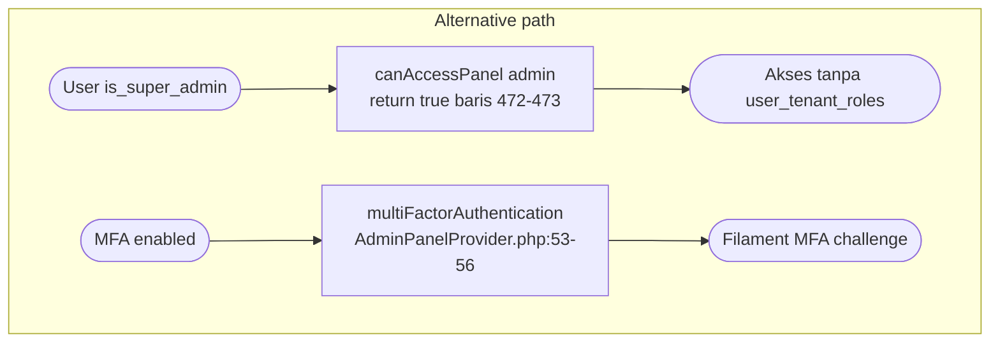

### Error path

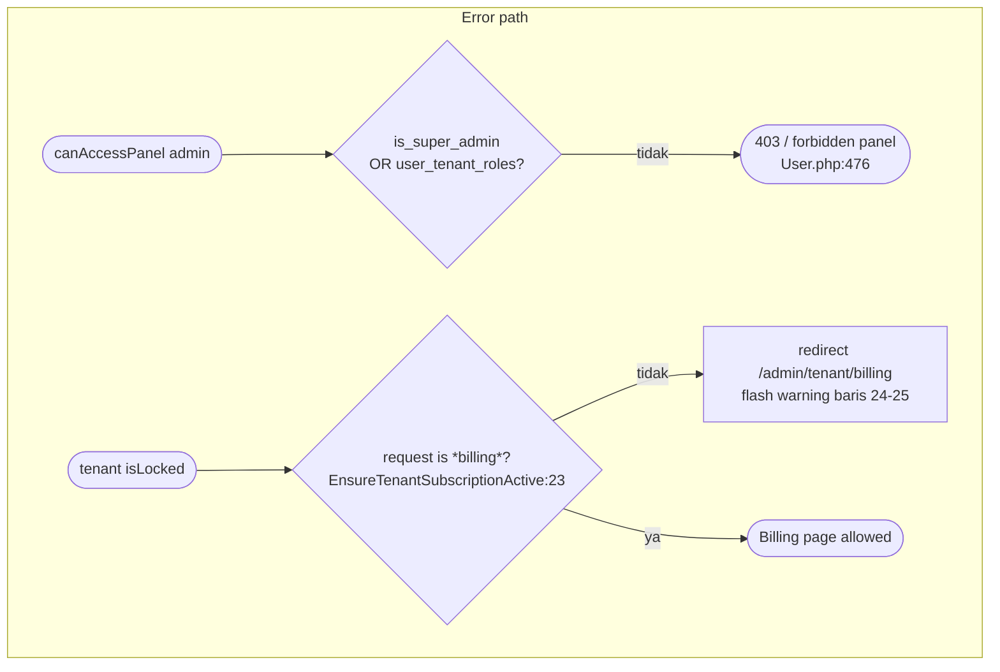

---

## AD-02 — UC-002 Registrasi Tenant Baru

**Bukti:** `RegisterTenant.php` form + `handleRegistration()` baris 67–88

### Elemen teridentifikasi

| Elemen | Lokasi |
|--------|--------|
| Validation | Form `required`, `unique(Tenant::code)` baris 39–41 |
| Validation | `alphaDash()` code baris 42 |
| Approval (create) | `Tenant::create()` baris 71–80 |
| Loop | **TIDAK TERDETEKSI DI KODE** |

### Happy path

```mermaid
flowchart TD
    subgraph HP["Happy path"]
        H1([User authenticated]) --> H2[Fill form RegisterTenant::form\nbaris 23-64]
        H2 --> H3[Submit handleRegistration]
        H3 --> H4[Tenant::create uuid,name,code,...]\nbaris 71-80]
        H4 --> H5[TenantAdminProvisioner\nensureTenantOwnerRole baris 83]
        H5 --> H6[assignShieldSuperAdmin baris 84]
        H6 --> H7[TenantModuleProvisioner\nenable core,global baris 85]
        H7 --> H8([return tenant])
    end
```

### Alternative path

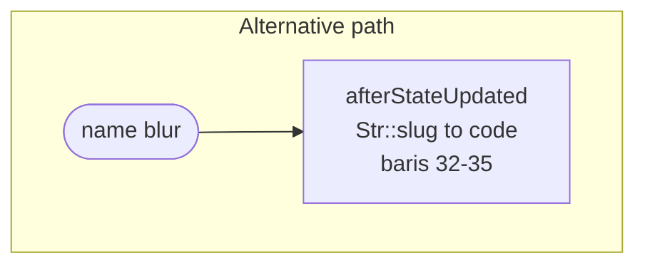

### Error path

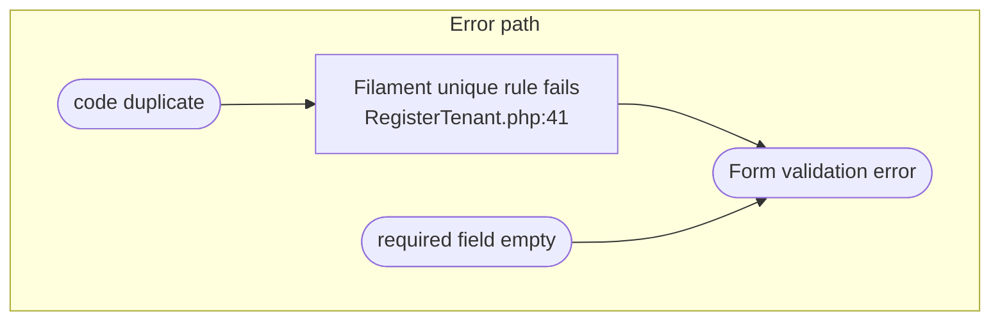

---

## AD-03 — UC-003 CRUD Siswa (Create)

**Bukti:** `StudentPolicy.php`; `StudentResource.php`; `StudentForm.php`; `ModuleResource.php`

### Elemen teridentifikasi

| Elemen | Lokasi |
|--------|--------|
| Validation (permission) | `StudentPolicy::create()` → `can('Create:Student')` |
| Validation (form) | `StudentForm` field `->required()` |
| Decision (global guard) | `ModuleResource::canCreate()` baris 58–65 |
| Error handling | Policy deny → Filament 403 |

### Happy path

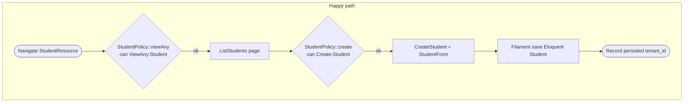

### Alternative path

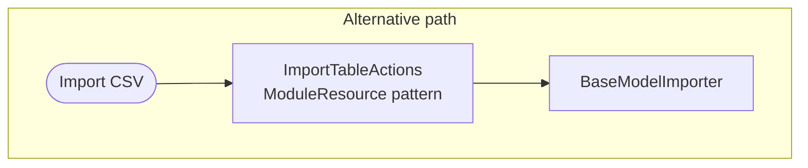

### Error path

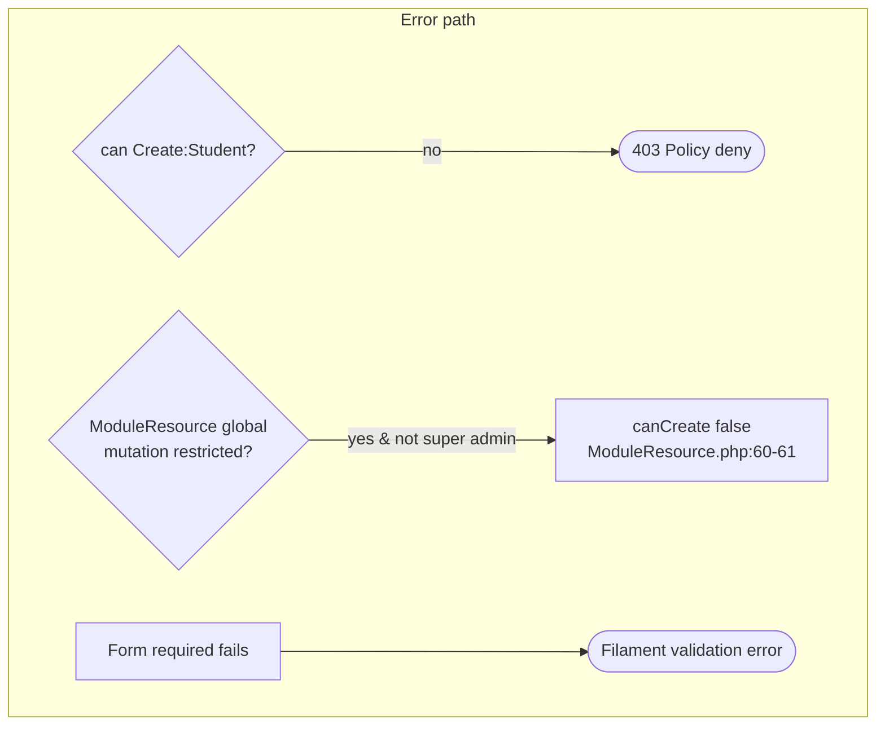

---

## AD-04 — UC-004 Workflow Advance / Cancel / Reject

**Bukti:** `ViewWorkflowInstance.php`; `DatabaseWorkflowEngine.php` `advance()`, `cancel()`, `authorizeActor()`

### Elemen teridentifikasi

| Elemen | Lokasi |
|--------|--------|
| Decision (UI actions) | `hasPendingAssignment()` baris 213–231 |
| Decision (parallel) | `parallelCoordinator->isParallel()` baris 72–77 |
| Validation (evidence) | baris 52–63 |
| Validation (form schema) | `validator->validate()` baris 68 |
| Validation (actor) | `authorizeActor()` baris 416–431 |
| Approval | `advanceLinear()` complete assignments baris 115–123 |
| Rejection | `determineStatus('reject')` → Rejected baris 435–436 |
| Rejection | `cancel()` baris 315–340 |
| Loop (parallel quorum) | `advanceParallel()` baris 73–76 |
| Error handling | `WorkflowAuthorizationException`, `WorkflowEvidenceRequiredException` |

### Happy path (linear approve)

```mermaid
flowchart TD
    subgraph HP["Happy path — advance approve"]
        H1([Open ViewWorkflowInstance]) --> H2{hasPendingAssignment\nbaris 213-231}
        H2 -->|yes| H3[User picks action e.g. approve]
        H3 --> H4[DB::transaction + lockForUpdate\nbaris 39-46]
        H4 --> H5[authorizeActor baris 48]
        H5 --> H6{requiresEvidence?\nbaris 52}
        H6 -->|count OK| H7[validator.validate baris 68]
        H7 --> H8{isParallel step?\nbaris 72}
        H8 -->|no| H9[advanceLinear]
        H9 --> H10[transitionResolver.resolve baris 110]
        H10 --> H11[Complete pending assignments\nbaris 115-123]
        H11 --> H12[Update instance status/step\nbaris 125-134]
        H12 --> H13[auditLogger.log Advanced\nbaris 136-147]
        H13 --> H14[WorkflowAdvanced::dispatch\nbaris 87-88]
        H14 --> H15([Notification success UI\nViewWorkflowInstance:105-108])
    end
```

### Alternative path

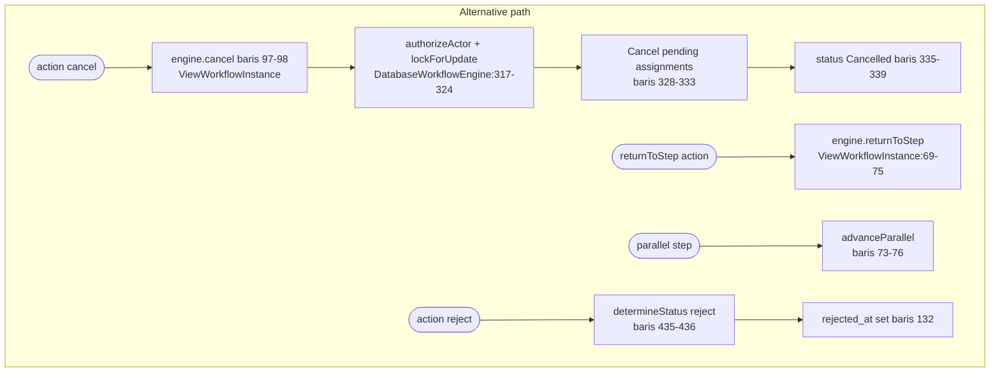

### Error path

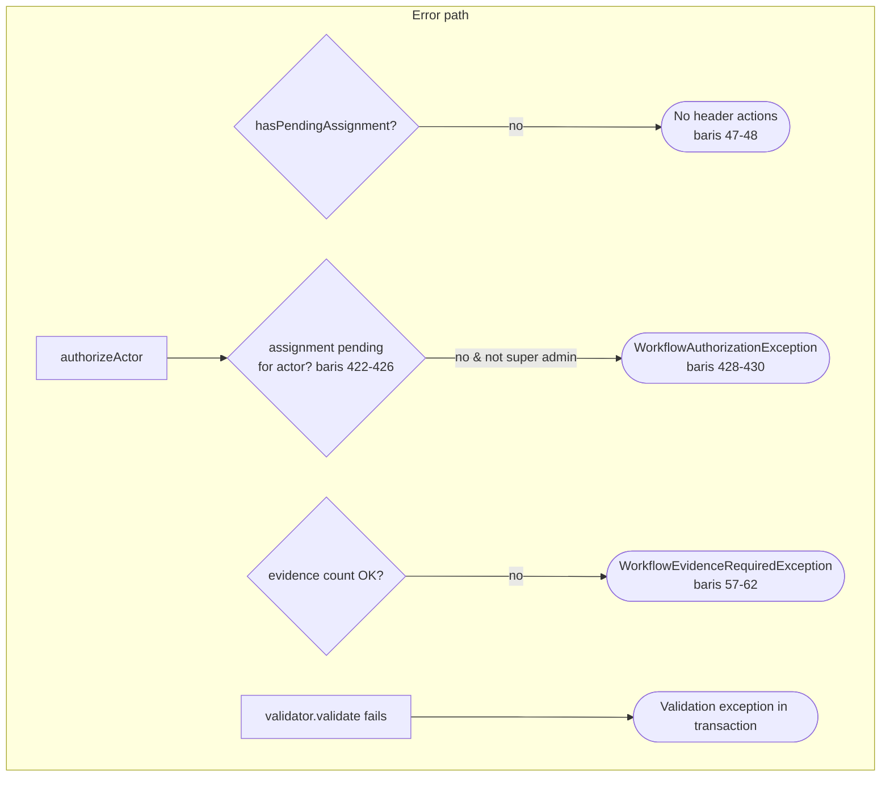

---

## AD-05 — UC-005 Verifikasi / Penolakan Pembayaran

**Bukti:** `ViewPayment.php`; `FinanceControlService.php` `verifyPayment()`, `rejectPayment()`

### Elemen teridentifikasi

| Elemen | Lokasi |
|--------|--------|
| Decision (UI visible) | `status === 'pending'` baris 38, 58 ViewPayment |
| Approval | `verifyPayment()` baris 43–71 |
| Rejection | `rejectPayment()` baris 74–99 |
| Validation | `isLockedForMutation()` baris 48–50, 79–81 |
| Loop | **TIDAK TERDETEKSI DI KODE** |
| Error handling | try/catch + Notification danger baris 49–52, 69–72 |

### Happy path (verify)

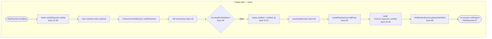

### Alternative path (reject)

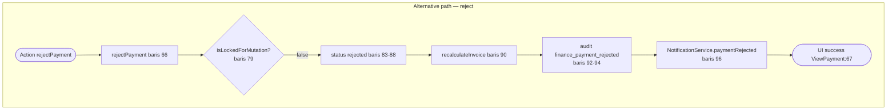

### Error path

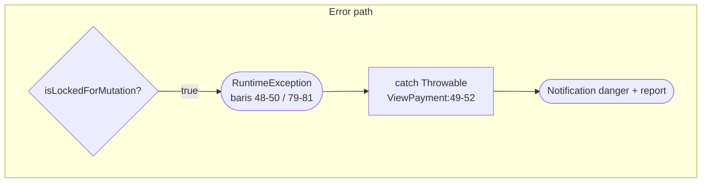

---

## AD-06 — UC-006 Inquiry Admisi Publik

**Bukti:** `InquiryController.php`; `LeadInquiryService.php`

### Elemen teridentifikasi

| Elemen | Lokasi |
|--------|--------|
| Validation | `$request->validate()` baris 19–28 |
| Decision | tenant lookup by code baris 30 |
| Approval (create lead) | `createFromInquiry()` baris 38–45 |
| Loop | **TIDAK TERDETEKSI DI KODE** |

### Happy path

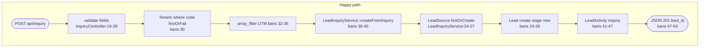

### Alternative path

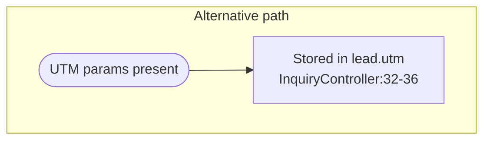

### Error path

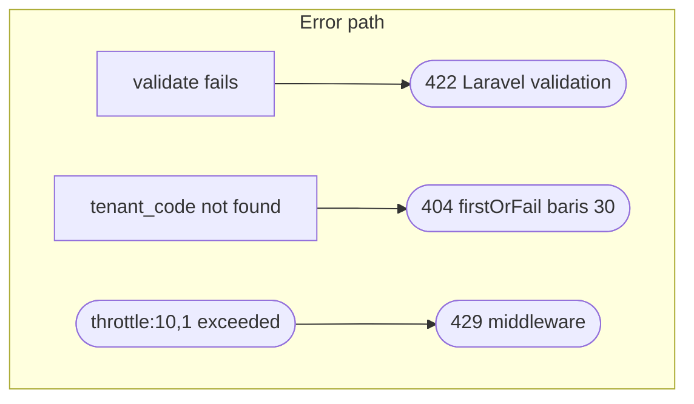

---

## AD-07 — UC-007 Applicant Accepted → Student

**Bukti:** `Applicant.php` booted; `CreateStudentFromAcceptedApplicant.php`; `ApplicantPromotionService.php`

### Elemen teridentifikasi

| Elemen | Lokasi |
|--------|--------|
| Decision | `wasChanged('status')` baris 69 |
| Decision | `status === 'accepted'` baris 76 |
| Decision | `isEnabledFor()` setting baris 28–30 |
| Decision | `converted_to_student_id` baris 34–36 |
| Loop | `generateNis()` while NIS exists baris 79–85 |
| Validation | active academic year query baris 42–47 |
| Error handling | queue listener `AutomationRunLogger` |

### Happy path

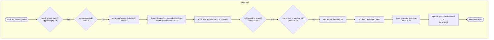

### Alternative path

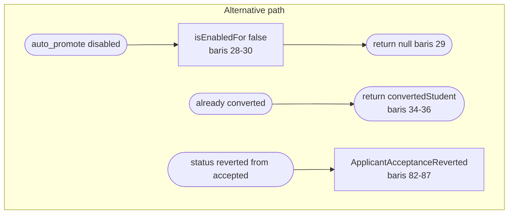

### Error path

```mermaid
flowchart TD
    subgraph ERR["Error path"]
        E1([Listener failure in queue]) --> E2([ShouldQueue retry\nCreateStudentFromAcceptedApplicant:12])
        E3([No active academic year]) --> E4[academicYearId null\nbaris 42-47 still creates student]
    end
```

---

## AD-08 — UC-008 Applicant API + Idempotency

**Bukti:** `ApplicantController.php`; `IdempotencyKey.php`; `ResolveApiTenant.php`

### Happy path

```mermaid
flowchart TD
    subgraph HP["Happy path"]
        H1([POST api/v1/applicants]) --> H2[auth:sanctum + resolve.api.tenant\nroutes/api.php:44-69]
        H2 --> H3[IdempotencyKey: no cache hit\nbaris 18-20, 42]
        H3 --> H4[Validator::make baris 21-33]
        H4 --> H5[Applicant::create + tenant_id\nbaris 41-45]
        H5 --> H6[WebhookDispatcher enrollment.created\nbaris 47-55]
        H6 --> H7[Cache response baris 44-49]
        H7 --> H8([JSON 201 success baris 57-63])
    end
```

### Alternative path

```mermaid
flowchart TD
    subgraph ALT["Alternative path"]
        A1([Idempotency-Key replay]) --> A2[Cache hit same body_hash\nIdempotencyKey:27-39]
        A2 --> A3([Return cached response\nX-Idempotency-Replayed: true])
    end
```

### Error path

```mermaid
flowchart TD
    subgraph ERR["Error path"]
        E1[validator fails] --> E2([422 error validation_failed\nbaris 35-37])
        E3[token tenant_id null\napi_require_tenant] --> E4([403 ResolveApiTenant:24-26])
        E5[idempotency body mismatch] --> E6([409 idempotency_conflict\nIdempotencyKey:28-34])
    end
```

---

## AD-09 — UC-009 Portal Orang Tua (Read)

**Bukti:** `User::canAccessPanel('parent')`; `ScopesToParentChildren.php`; `ParentPanelProvider.php`

### Happy path

```mermaid
flowchart TD
    subgraph HP["Happy path"]
        H1([GET /parent]) --> H2[Authenticate session\nParentPanelProvider:48-50]
        H2 --> H3{canAccessPanel parent?\nUser.php:479-481}
        H3 -->|ParentStudent exists| H4[Open ChildGradeResource etc.]
        H4 --> H5[getEloquentQuery filter\nScopesToParentChildren:12-16]
        H5 --> H6[whereIn student_id from parent_students]
        H6 --> H7([Read-only table canCreate false\nbaris 19-22])
    end
```

### Alternative path

```mermaid
flowchart TD
    subgraph ALT["Alternative path"]
        A1([ParentDashboard]) --> A2[ParentPanelProvider pages\nbaris 34-36]
    end
```

### Error path

```mermaid
flowchart TD
    subgraph ERR["Error path"]
        E1{ParentStudent link?} -->|no| E2([canAccessPanel false\nUser.php:480])
        E2 --> E3([403 / login denied])
    end
```

---

## AD-10 — UC-011 OPAC Checkout

**Bukti:** `PublicOpacController.php` `checkout()` baris 102–109; `handleCheckout()` baris 492–559; `authorizeCirculation()` baris 705–709

### Elemen teridentifikasi

| Elemen | Lokasi |
|--------|--------|
| Validation | `$request->validate` baris 494–498 |
| Validation | `abort_if` member/copy/policy baris 523–528 |
| Decision | member active, copy available, max loans |
| Loop | **TIDAK TERDETEKSI DI KODE** |
| Approval | Loan create + copy status borrowed baris 530–551 |
| Error handling | `abort(403)`, `abort_if(422)` |

### Happy path

```mermaid
flowchart TD
    subgraph HP["Happy path"]
        H1([POST circulation/checkout]) --> H2[auth verified middleware\nLibrary/routes/web.php:26-28]
        H2 --> H3[authorizeCirculation baris 106]
        H3 --> H4[validate member_id book_copy_id\nbaris 494-498]
        H4 --> H5[Load Member + BookCopy firstOrFail\nbaris 500-521]
        H5 --> H6[abort_if checks pass\nbaris 523-528]
        H6 --> H7[DB::transaction create Loan\nbaris 530-551]
        H7 --> H8[copy status borrowed baris 548]
        H8 --> H9[refreshMemberCounters + refreshBookAvailability\nbaris 553-556]
        H9 --> H10([redirect back with status\nbaris 558])
    end
```

### Alternative path

```mermaid
flowchart TD
    subgraph ALT["Alternative path"]
        A1([organizationCheckout]) --> A2[organization scope filter\nbaris 111-119]
        A3([quickReturn]) --> A4[handleQuickReturn baris 122-128]
    end
```

### Error path

```mermaid
flowchart TD
    subgraph ERR["Error path"]
        E1[authorizeCirculation fail] --> E2([abort 403 baris 707-708])
        E3[member not active] --> E4([abort 422 baris 523])
        E5[copy not available] --> E6([abort 422 baris 524])
        E7[max loans reached] --> E8([abort 422 baris 528])
        E9[member/copy not found] --> E10([404 firstOrFail])
    end
```

---

## AD-11 — UC-012 Exam Runtime Ingest

**Bukti:** `ExamRuntimeWebhookController.php`; `ExamRuntimeSyncService.php`

### Happy path

```mermaid
flowchart TD
    subgraph HP["Happy path"]
        H1([POST api/exam/runtime/attempts]) --> H2[auth:sanctum]
        H2 --> H3[validate payload\nExamRuntimeWebhookController:16-24]
        H3 --> H4[ExamDefinition findOrFail\nbaris 26]
        H4 --> H5[ExamParticipant findOrFail\nbaris 27-29]
        H5 --> H6[ExamRuntimeSyncService::ingestAttempt]
        H6 --> H7[DB::transaction updateOrCreate\nExamRuntimeSyncService:26-40]
        H7 --> H8[foreach gradeBridges supports\nbaris 48-54]
        H8 --> H9([JSON data id sync_status\nbaris 33-38])
    end
```

### Alternative path

```mermaid
flowchart TD
    subgraph ALT["Alternative path"]
        A1([runtime_attempt_id exists]) --> A2[updateOrCreate same key\nExamRuntimeSyncService:27-32]
        A2 --> A3([Update existing sync record])
    end
```

### Error path

```mermaid
flowchart TD
    subgraph ERR["Error path"]
        E1[validate fails] --> E2([422 validation])
        E3[definition/participant missing] --> E4([404 findOrFail])
    end
```

---

## AD-12 — UC-013 Webhook Billing Midtrans

**Bukti:** `BillingController.php`; `BillingService.php` `handleWebhookNotification()` baris 117–195

### Elemen teridentifikasi

| Elemen | Lokasi |
|--------|--------|
| Validation | `verifySignature()` baris 119 |
| Decision | `order_id` present baris 121–124 |
| Decision | invoice found baris 132–134 |
| Decision | duplicate webhook key baris 139–141 |
| Decision | amount/currency match baris 143–161 |
| Decision | `transaction_status` match baris 166–172 |
| Approval | `activateTenantSubscription` when paid baris 191–193 |
| Loop | **TIDAK TERDETEKSI DI KODE** |
| Error handling | `MidtransWebhookException` → 400; Throwable → 500 |

### Happy path

```mermaid
flowchart TD
    subgraph HP["Happy path — payment settled"]
        H1([POST /billing/webhook]) --> H2[BillingController::webhook]
        H2 --> H3[handleWebhookNotification]
        H3 --> H4[webhookVerifier.verifySignature\nbaris 119]
        H4 --> H5{order_id present?\nbaris 121}
        H5 -->|yes| H6[DB::transaction lock invoice\nbaris 126-130]
        H6 --> H7{invoice found?\nbaris 132}
        H7 -->|yes| H8{webhook key processed?\nbaris 139}
        H8 -->|no| H9{amountMatchesInvoice?\nbaris 143}
        H9 -->|yes| H10{currencyMatchesInvoice?\nbaris 153}
        H10 -->|yes| H11[match transaction_status\nbaris 166-172]
        H11 --> H12{paymentStatus paid\nand not wasPaid?\nbaris 191}
        H12 -->|yes| H13[activateTenantSubscription\nbaris 192-204]
        H13 --> H14([JSON status ok\nBillingController:36])
    end
```

### Alternative path

```mermaid
flowchart TD
    subgraph ALT["Alternative path"]
        A1([transaction pending]) --> A2[paymentStatus pending\nmatch baris 169]
        A2 --> A3([Invoice updated no activation])
        A4([duplicate webhook key]) --> A5[return early baris 139-141]
        A6([GET billing/finish]) --> A7[redirect /admin\nBillingController:41]
    end
```

### Error path

```mermaid
flowchart TD
    subgraph ERR["Error path"]
        E1[verifySignature fails] --> E2[MidtransWebhookException]
        E2 --> E3([400 JSON error\nBillingController:20-26])
        E4[other Throwable] --> E5([500 JSON error\nbaris 27-33])
        E6[amount mismatch] --> E7[metadata midtrans_validation_failure\nbaris 143-150 return]
        E8[currency mismatch] --> E9[metadata flag baris 153-160 return]
        E10[no order_id / no invoice] --> E11([silent return baris 123 / 133])
    end
```

---

## AD-13 — UC-015 Dashboard Siswa API

**Bukti:** `StudentDashboardController.php` `show()`, `buildDashboard()`

### Happy path

```mermaid
flowchart TD
    subgraph HP["Happy path"]
        H1([GET students/id/dashboard]) --> H2[auth:sanctum + tenant]
        H2 --> H3[Student::findOrFail baris 19]
        H3 --> H4[Cache::remember 300s\nbaris 21-23]
        H4 --> H5[buildDashboard]
        H5 --> H6[Attendance last 30 days\nbaris 31-40]
        H6 --> H7[Grades + invoices aggregate\nbaris 42+]
        H7 --> H8([JSON data wrapper\nbaris 25])
    end
```

### Alternative path

```mermaid
flowchart TD
    subgraph ALT["Alternative path"]
        A1([Cache hit same minute bucket]) --> A2[Return cached buildDashboard\nkey YmdHi baris 21]
    end
```

### Error path

```mermaid
flowchart TD
    subgraph ERR["Error path"]
        E1[student id invalid] --> E2([404 ModelNotFoundException\nbootstrap/app.php:65-70])
        E3[unauthenticated] --> E4([401 JSON unauthenticated])
    end
```

---

## AD-14 — UC-016 Verifikasi Surat E-Office

**Bukti:** `LetterVerificationController.php`

### Happy path

```mermaid
flowchart TD
    subgraph HP["Happy path"]
        H1([GET api/letters/verify/token]) --> H2[Letter query verification_token\nbaris 13]
        H2 --> H3{letter found?}
        H3 -->|yes| H4([JSON valid true + metadata\nbaris 19-24])
    end
```

### Error path

```mermaid
flowchart TD
    subgraph ERR["Error path"]
        E1{letter found?} -->|no| E2([JSON valid false 404\nbaris 15-17])
    end
```

**Alternative path:** **TIDAK TERDETEKSI DI KODE**

---

## Matriks Elemen per AD

| AD | Decision | Validation | Loop | Approval | Rejection | Error handling |
|----|:--------:|:----------:|:----:|:--------:|:---------:|:--------------:|
| AD-01 | ● | ● | — | — | — | ● |
| AD-02 | — | ● | — | ● | — | ● |
| AD-03 | ● | ● | — | ● | — | ● |
| AD-04 | ● | ● | ● | ● | ● | ● |
| AD-05 | ● | ● | — | ● | ● | ● |
| AD-06 | ● | ● | — | ● | — | ● |
| AD-07 | ● | ● | ● | ● | — | ● |
| AD-08 | ● | ● | — | ● | — | ● |
| AD-09 | ● | — | — | — | — | ● |
| AD-10 | ● | ● | — | ● | — | ● |
| AD-11 | ● | ● | — | ● | — | ● |
| AD-12 | ● | ● | — | ● | — | ● |
| AD-13 | ● | — | — | — | — | ● |
| AD-14 | ● | — | — | — | — | ● |

---

## Diagram Overview (Use Case → Activity)

```mermaid
flowchart LR
    UC4[UC-004 Workflow] --> AD4[AD-04 advance/cancel/reject]
    UC7[UC-007 Applicant] --> AD7[AD-07 promote pipeline]
    UC5[UC-005 Payment] --> AD5[AD-05 verify/reject]
    UC13[UC-013 Billing] --> AD12[AD-12 Midtrans webhook]
    UC10[UC-010/011 OPAC] --> AD10[AD-10 checkout]
    UC12[UC-012 Exam] --> AD11[AD-11 runtime ingest]
```

---

## TIDAK TERDETEKSI DI KODE

| Activity | Status |
|----------|--------|
| Credential check detail Filament login | Framework internal |
| Student self-service enrollment UI | **TIDAK TERDETEKSI DI KODE** |
| Payroll calculation engine loop | Model ada; engine terpusat **TIDAK TERDETEKSI DI KODE** |
| Semua cabang error OPAC selain checkout/return | Tidak semua method diverifikasi |

---

## Regenerasi & verifikasi

```bash
php artisan test --compact tests/Feature/ApplicantAcceptedPipelineTest.php
php artisan test --compact tests/Feature/WorkflowBudgetApprovalTest.php
php artisan test --compact tests/Feature/UserIdentityAccessTest.php
php artisan test --compact tests/Feature/PlatformPanelAccessTest.php
```

**Referensi:** `07_use_case_diagram.md`, `05_requirements_fungsional.md`
