# 09 — Sequence Diagram

**Commit analisis:** `d3be06aa` · **Use case sumber:** `07_use_case_diagram.md`, `08_activity_diagram.md`

## Konvensi Layer (ABCE)

| Layer | Simbol diagram | Pemetaan kode | Bukti |
|-------|----------------|---------------|-------|
| **Actor** | `actor` | User, gateway eksternal, runtime CBT | `User`, Midtrans POST, dll. |
| **Boundary** | `participant BND` | Filament page, route HTTP, middleware stack | `ViewWorkflowInstance`, `routes/api.php` |
| **Control** | `participant CTR` | Controller, Service, Middleware, Job | `*Controller`, `*Service`, `*Middleware` |
| **Entity** | `participant ENT` | Eloquent Model (bukan Repository terpisah) | `Applicant`, `Payment`, `WorkflowInstance` |
| **Database** | `participant DB` | MySQL via Eloquent | migrasi, `DB::transaction` |
| **External API** | `participant EXT` | Moodle REST, Midtrans | `MoodleClient`, webhook Midtrans |

> **Repository:** **TIDAK TERDETEKSI DI KODE** — tidak ada class `*Repository`; persistensi langsung via Eloquent Model (Entity) → Database.

---

## Indeks Diagram

| ID | Proses utama | Actor |
|----|--------------|-------|
| SD-01 | Login panel admin + cek langganan | Staf tenant |
| SD-02 | Registrasi tenant baru | User terdaftar |
| SD-03 | Verifikasi pembayaran siswa (UI) | Staf keuangan |
| SD-04 | Workflow advance | Approver |
| SD-05 | Inquiry admisi publik | Pengunjung |
| SD-06 | Applicant diterima → student | Staf + sistem event |
| SD-07 | POST applicant API | Klien API |
| SD-08 | OPAC checkout pinjaman | Staf perpustakaan |
| SD-09 | Exam runtime ingest | Runtime CBT |
| SD-10 | Webhook billing Midtrans | Midtrans |
| SD-11 | Dashboard siswa API | Klien API |
| SD-12 | Moodle outbox sync (queue) | Scheduler / queue worker |
| SD-13 | Portal orang tua (baca nilai) | Orang tua |
| SD-14 | Verifikasi surat e-office | Pengunjung |
| SD-15 | Webhook WhatsApp | Provider WhatsApp |

---

## SD-01 — Login Panel Admin + Cek Langganan

**Catatan:** Validasi kredensial login ditangani Filament/Laravel Auth — **TIDAK TERDETEKSI DI KODE** (handler credential di repo ini).

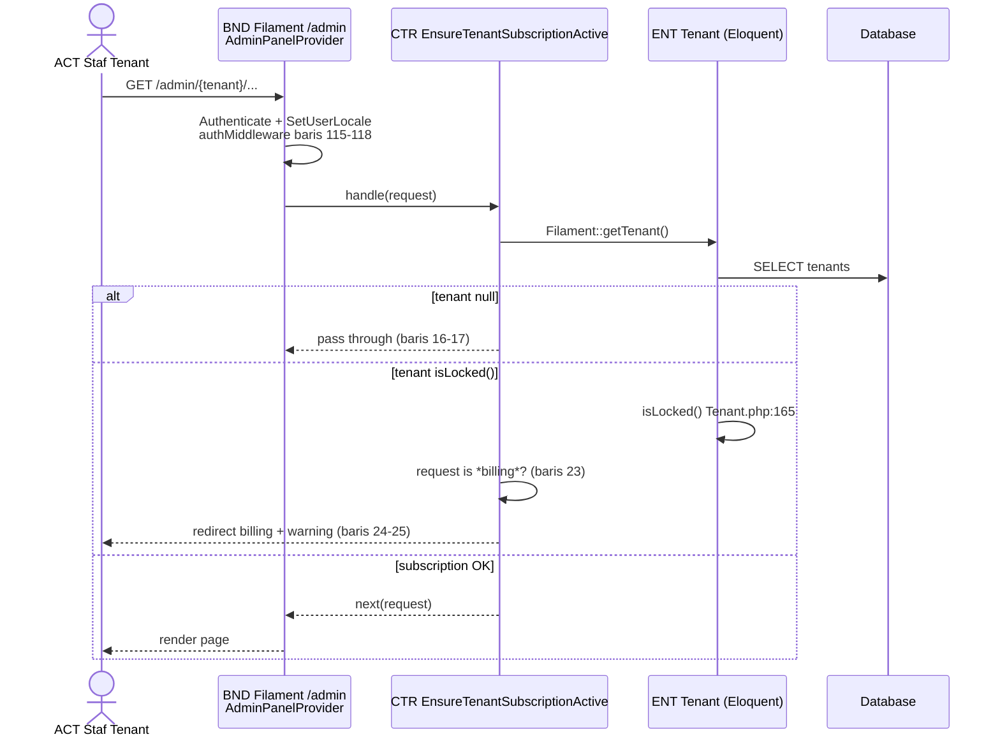

## Bukti

| Layer | File | Method / baris |
|-------|------|----------------|
| Boundary | `app/Providers/Filament/AdminPanelProvider.php` | `authMiddleware`, `->login()` baris 47, 115–118 |
| Control | `app/Http/Middleware/EnsureTenantSubscriptionActive.php` | `handle()` baris 12–30 |
| Entity | `Modules/Core/app/Models/Tenant.php` | `isLocked()` baris 165–169 |
| Actor gate | `Modules/Core/app/Models/User.php` | `canAccessPanel('admin')` baris 471–476 |

---

## SD-02 — Registrasi Tenant Baru

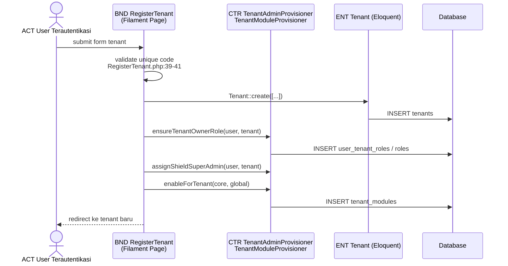

## Bukti

| Layer | File | Method |
|-------|------|--------|
| Boundary | `app/Filament/Pages/Tenancy/RegisterTenant.php` | `form()`, `handleRegistration()` baris 67–88 |
| Control | `Modules/Core/app/Services/TenantAdminProvisioner.php` | `ensureTenantOwnerRole()`, `assignShieldSuperAdmin()` |
| Control | `Modules/Core/app/Services/TenantModuleProvisioner.php` | `enableForTenant()` baris 85 |
| Entity | `Modules/Core/app/Models/Tenant.php` | `create()` |

---

## SD-03 — Verifikasi Pembayaran Siswa (Filament)

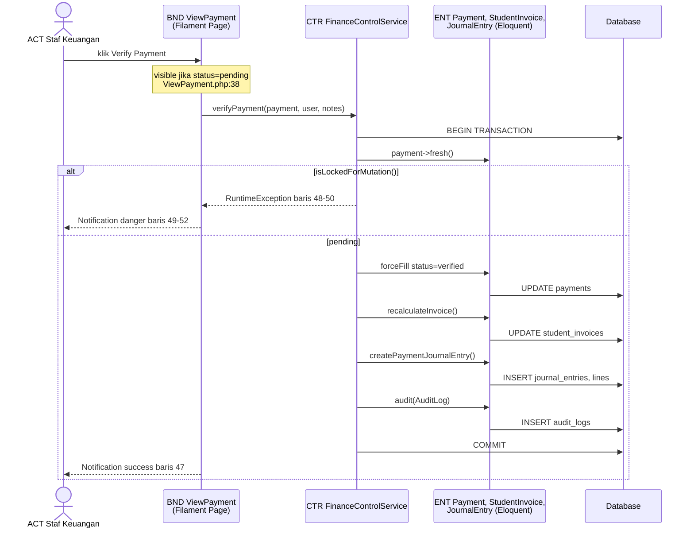

## Bukti

| Layer | File | Method |
|-------|------|--------|
| Boundary | `Modules/Finance/app/Filament/Resources/Payments/Pages/ViewPayment.php` | action `verifyPayment` baris 34–53 |
| Control | `Modules/Finance/app/Services/FinanceControlService.php` | `verifyPayment()` baris 43–71 |
| Entity | `Modules/Finance/app/Models/Payment.php` | `isLockedForMutation()` |
| Entity | `Modules/Monitoring/app/Models/AuditLog.php` | via `audit()` |

**Repository:** TIDAK TERDETEKSI DI KODE

---

## SD-04 — Workflow Advance

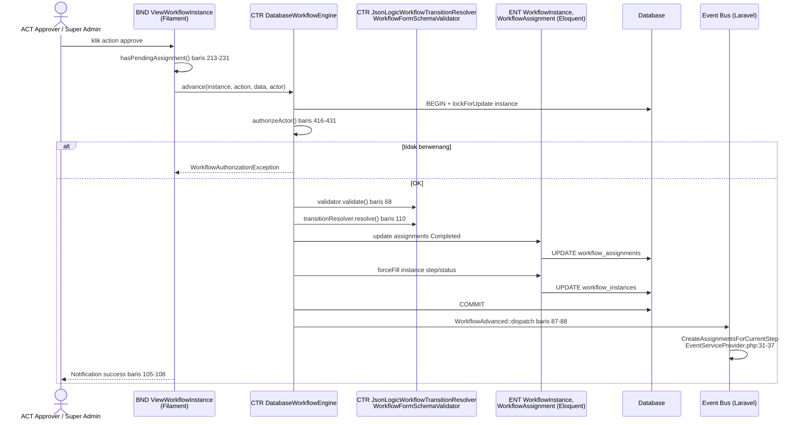

## Bukti

| Layer | File | Method |
|-------|------|--------|
| Boundary | `Modules/Workflow/app/Filament/Resources/WorkflowInstances/Pages/ViewWorkflowInstance.php` | `getHeaderActions()` baris 86–109 |
| Control | `Modules/Workflow/app/Services/DatabaseWorkflowEngine.php` | `advance()`, `authorizeActor()` |
| Control | `Modules/Workflow/app/Services/JsonLogicWorkflowTransitionResolver.php` | `resolve()` |
| Control | `Modules/Workflow/app/Providers/EventServiceProvider.php` | listener map baris 31–37 |
| Entity | `Modules/Workflow/app/Models/WorkflowInstance.php` | — |

---

## SD-05 — Inquiry Admisi Publik

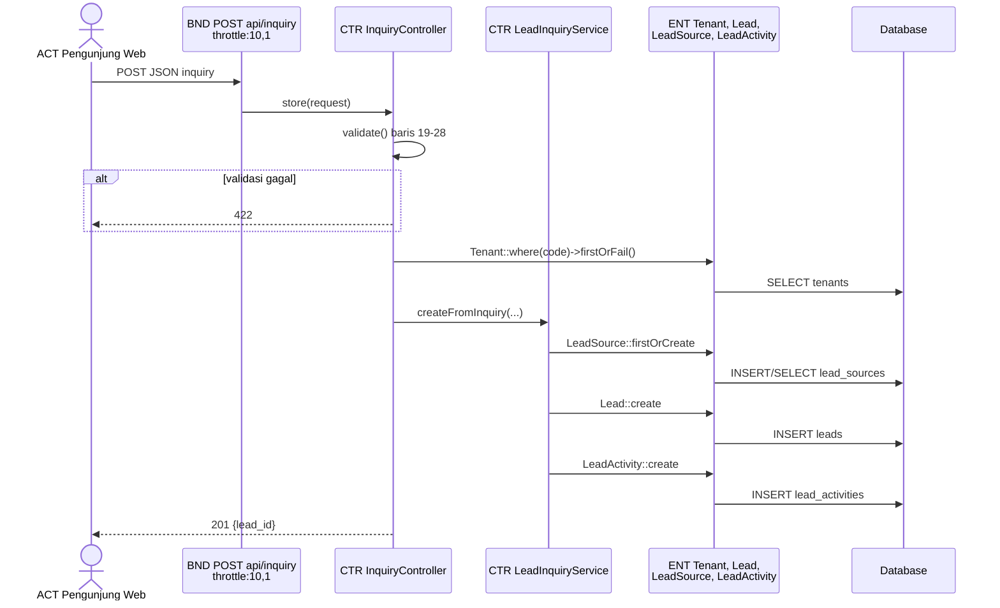

## Bukti

| Layer | File | Method |
|-------|------|--------|
| Boundary | `Modules/Enrollment/routes/api.php` | `POST /inquiry` baris 6–7 |
| Control | `Modules/Enrollment/app/Http/Controllers/InquiryController.php` | `store()` |
| Control | `Modules/Enrollment/app/Services/LeadInquiryService.php` | `createFromInquiry()` baris 15–49 |
| Entity | `Modules/Enrollment/app/Models/Lead.php` | — |

---

## SD-06 — Applicant Diterima → Student (Event Pipeline)

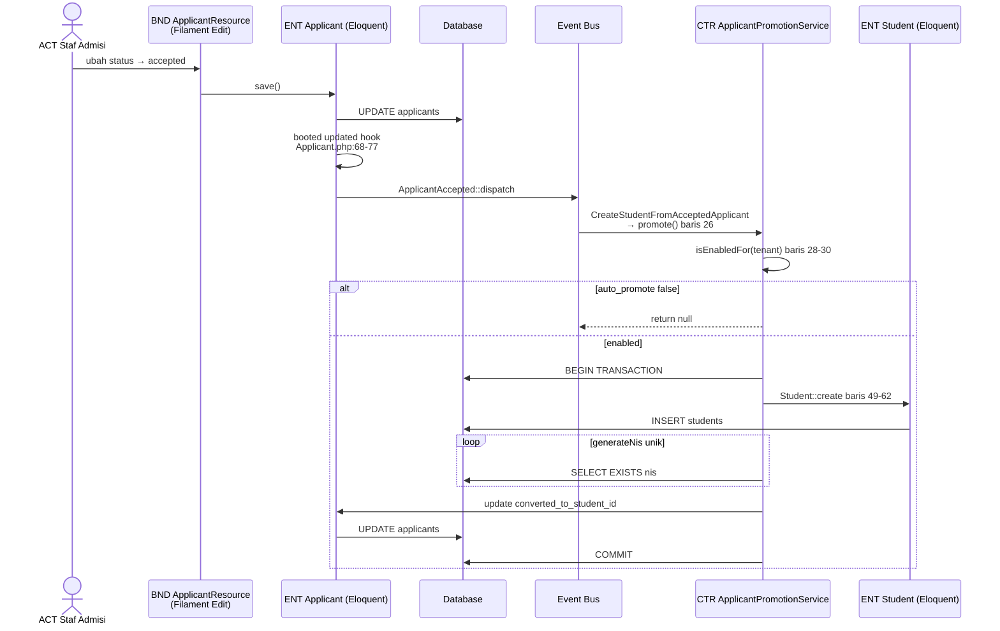

## Bukti

| Layer | File | Method |
|-------|------|--------|
| Boundary | Filament `ApplicantResource` edit page | save via Livewire |
| Entity | `Modules/Enrollment/app/Models/Applicant.php` | `booted()` baris 62–89 |
| Control | `Modules/School/app/Listeners/CreateStudentFromAcceptedApplicant.php` | `handle()` baris 21–28 |
| Control | `Modules/Enrollment/app/Services/ApplicantPromotionService.php` | `promote()` baris 26–70 |
| Test | `tests/Feature/ApplicantAcceptedPipelineTest.php` | — |

---

## SD-07 — POST Applicant API (Sanctum + Idempotency)

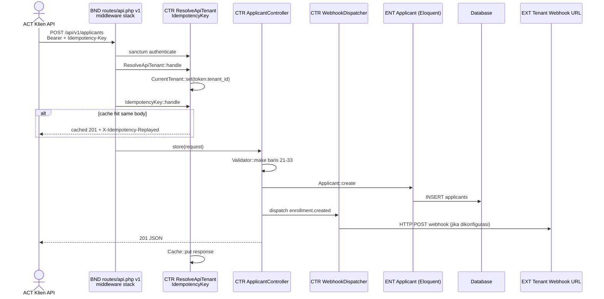

## Bukti

| Layer | File | Method |
|-------|------|--------|
| Boundary | `routes/api.php` | baris 43–72 |
| Control | `app/Http/Middleware/ResolveApiTenant.php` | `handle()` |
| Control | `app/Http/Middleware/IdempotencyKey.php` | `handle()` |
| Control | `app/Http/Controllers/Api/v1/ApplicantController.php` | `store()` |
| Control | `app/Services/WebhookDispatcher.php` | `dispatch()` |
| Entity | `Modules/Enrollment/app/Models/Applicant.php` | `create()` |

---

## SD-08 — OPAC Checkout Pinjaman

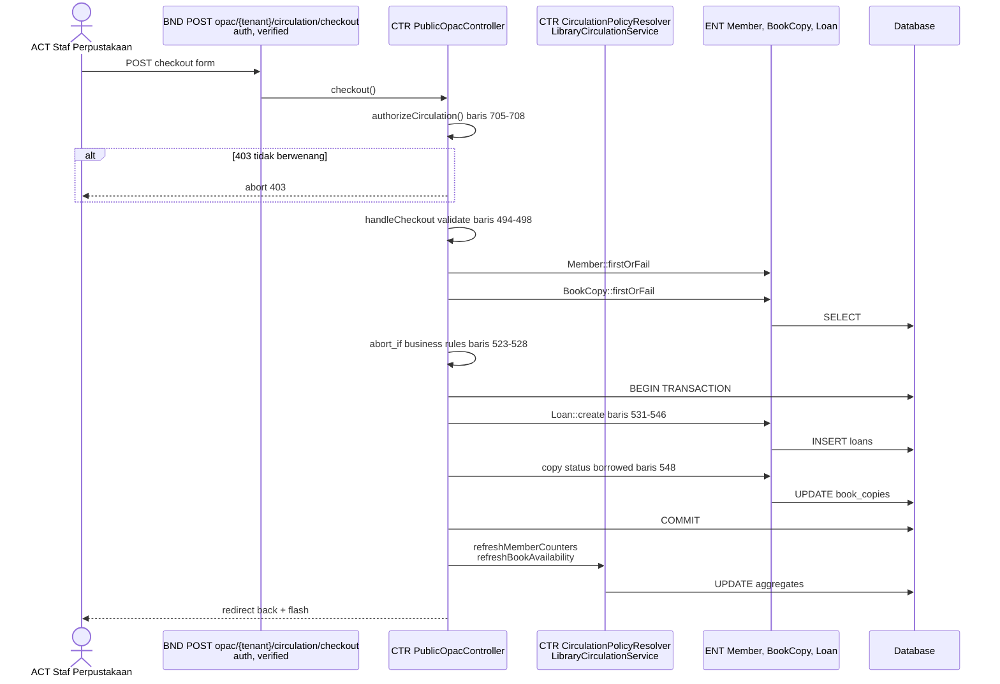

## Bukti

| Layer | File | Method |
|-------|------|--------|
| Boundary | `Modules/Library/routes/web.php` | baris 26–28 |
| Control | `Modules/Library/app/Http/Controllers/PublicOpacController.php` | `checkout()`, `handleCheckout()` baris 492–559 |
| Control | `Modules/Library/app/Support/LibraryCirculationService.php` | `refreshMemberCounters()` |
| Entity | `Modules/Library/app/Models/Loan.php` | — |

---

## SD-09 — Exam Runtime Ingest Attempt

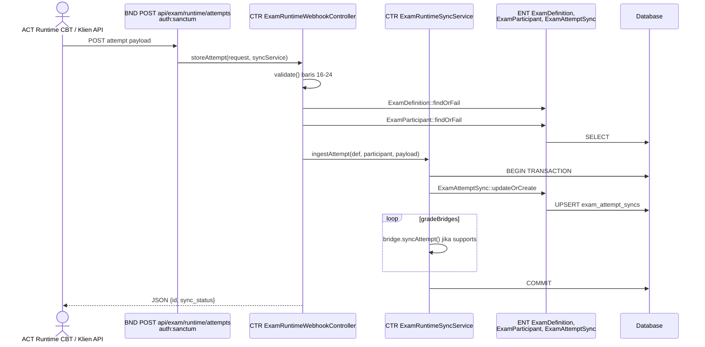

## Bukti

| Layer | File | Method |
|-------|------|--------|
| Boundary | `Modules/Exam/routes/api.php` | baris 6–8 |
| Control | `Modules/Exam/app/Http/Controllers/Api/ExamRuntimeWebhookController.php` | `storeAttempt()` |
| Control | `Modules/Exam/app/Services/ExamRuntimeSyncService.php` | `ingestAttempt()` baris 24–45 |
| Entity | `Modules/Exam/app/Models/ExamAttemptSync.php` | `updateOrCreate` |

---

## SD-10 — Webhook Billing Midtrans

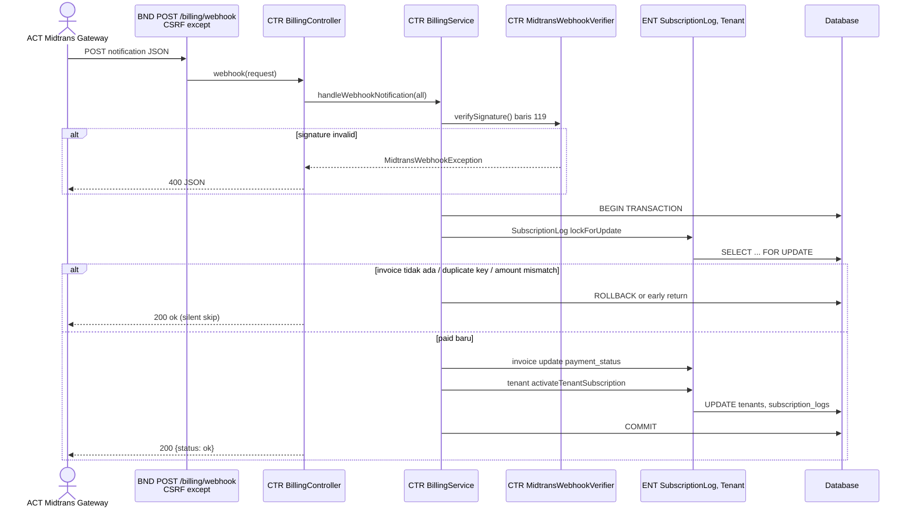

## Bukti

| Layer | File | Method |
|-------|------|--------|
| Boundary | `routes/web.php` | `billing.webhook` baris 12 |
| Boundary | `bootstrap/app.php` | CSRF except baris 30–33 |
| Control | `app/Http/Controllers/BillingController.php` | `webhook()` baris 16–37 |
| Control | `app/Services/BillingService.php` | `handleWebhookNotification()` baris 117–195 |
| Control | `app/Services/Billing/MidtransWebhookVerifier.php` | `verifySignature()` |
| External | Midtrans | POST notification |
| Entity | `Modules/Core/app/Models/SubscriptionLog.php` | — |

---

## SD-11 — Dashboard Siswa API

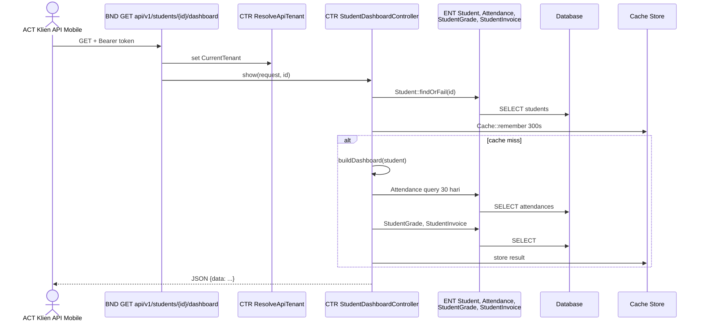

## Bukti

| Layer | File | Method |
|-------|------|--------|
| Boundary | `routes/api.php` | baris 77 |
| Control | `app/Http/Controllers/Api/v1/StudentDashboardController.php` | `show()`, `buildDashboard()` baris 17–40 |
| Entity | `Modules/School/app/Models/Student.php`, `Attendance.php` | — |
| Cache | `config/cache.php` | default store |

---

## SD-12 — Moodle Outbox Sync (Queue Worker)

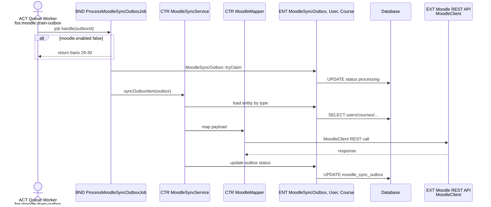

## Bukti

| Layer | File | Method |
|-------|------|--------|
| Trigger | `app/Observers/StudentObserver.php` | → `MoodleOutboxService::enqueue()` |
| Control | `app/Integrations/Moodle/MoodleOutboxService.php` | `enqueue()` baris 35+ |
| Control | `app/Jobs/ProcessMoodleSyncOutboxJob.php` | `handle()` baris 27+ |
| Control | `app/Integrations/Moodle/MoodleSyncService.php` | `syncOutboxItem()` baris 33–44 |
| External | `app/Integrations/Moodle/MoodleClient.php` | REST |
| Scheduler | `routes/console.php` | `fos:moodle:drain-outbox` |

---

## SD-13 — Portal Orang Tua (Baca Nilai Anak)

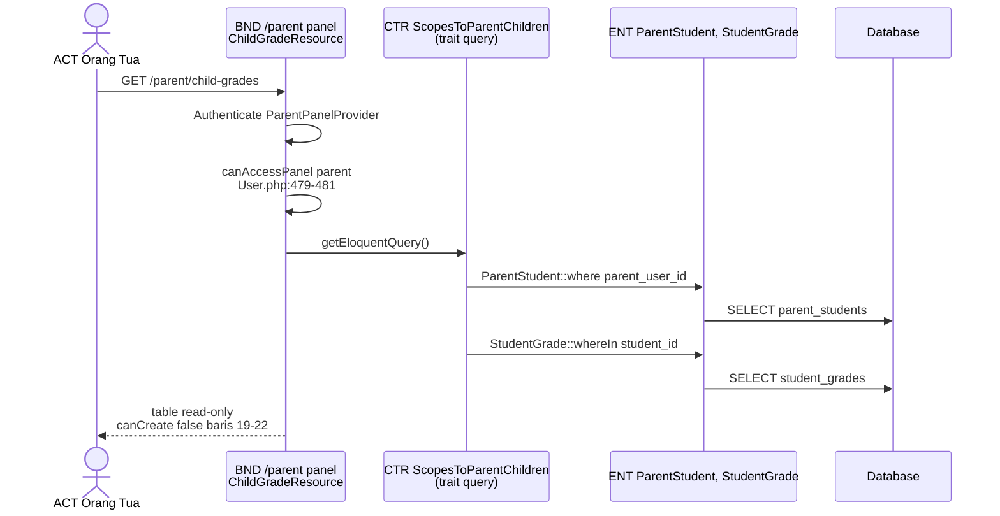

## Bukti

| Layer | File | Method |
|-------|------|--------|
| Boundary | `app/Providers/Filament/ParentPanelProvider.php` | panel `parent` |
| Boundary | `app/Filament/Parent/Resources/ChildGrades/ChildGradeResource.php` | uses trait |
| Control | `app/Filament/Parent/Support/Concerns/ScopesToParentChildren.php` | `getEloquentQuery()` baris 10–17 |
| Entity | `Modules/Core/app/Models/ParentStudent.php` | — |

---

## SD-14 — Verifikasi Surat E-Office

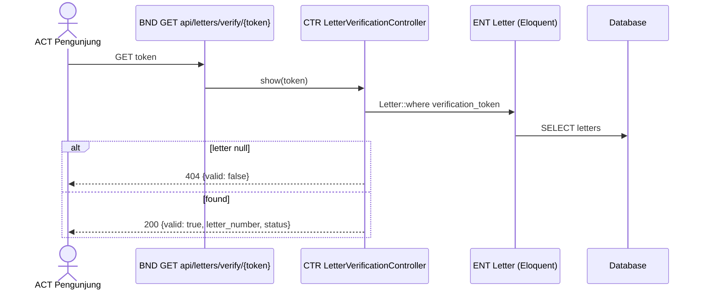

## Bukti

| Layer | File | Method |
|-------|------|--------|
| Boundary | `routes/api.php` | baris 40–41 |
| Control | `Modules/EOffice/app/Http/Controllers/LetterVerificationController.php` | `show()` baris 11–24 |
| Entity | `Modules/EOffice/app/Models/Letter.php` | `verification_token` |

---

## SD-15 — Webhook WhatsApp

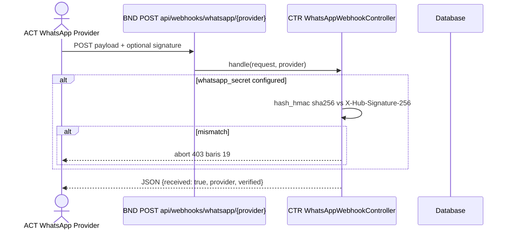

## Bukti

| Layer | File | Method |
|-------|------|--------|
| Boundary | `routes/api.php` | baris 31–32 |
| Control | `Modules/Messaging/app/Http/Controllers/WhatsAppWebhookController.php` | `handle()` baris 11–27 |

**Catatan:** Handler **tidak** mempersist payload ke DB — **TIDAK TERDETEKSI DI KODE** penyimpanan inbound message.

---

## Diagram Layer Reference (ABCE → Komponen)

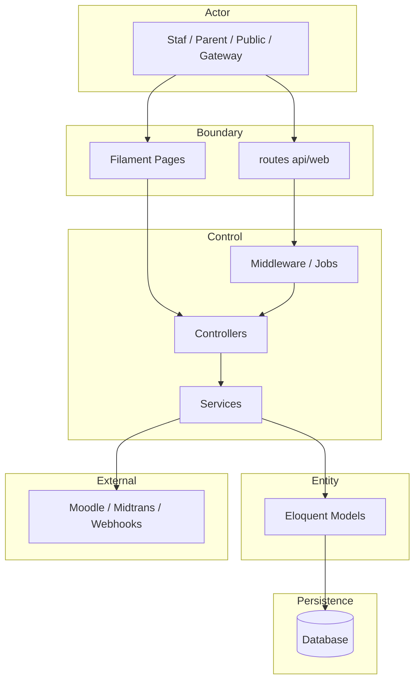

---

## TIDAK TERDETEKSI DI KODE

| Item | Status |
|------|--------|
| Layer Repository (`*Repository` class) | **TIDAK TERDETEKSI DI KODE** — Eloquent langsung |
| Sequence detail credential Filament login | Framework internal |
| Meta sequence 257 Filament CRUD | Pola identik SD-03 (Policy → Filament → Eloquent → DB) |
| WhatsApp webhook persist inbound | **TIDAK TERDETEKSI DI KODE** |

---

## Regenerasi

```bash
php artisan test --compact tests/Feature/ApplicantAcceptedPipelineTest.php
php artisan test --compact tests/Feature/WorkflowBudgetApprovalTest.php
php artisan test --compact tests/Feature/UserIdentityAccessTest.php
grep -r "class.*Repository" Modules/ app/   # expect empty
```

**Referensi:** `07_use_case_diagram.md`, `08_activity_diagram.md`, `05_requirements_fungsional.md`
