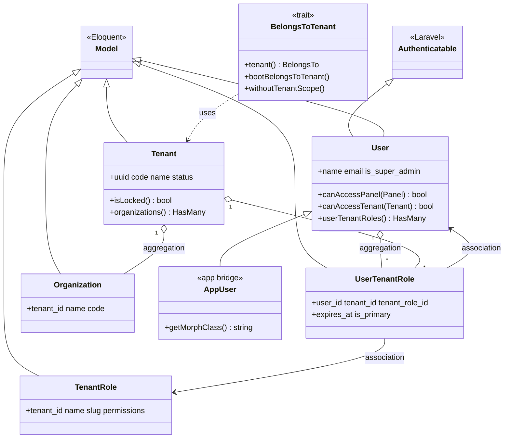
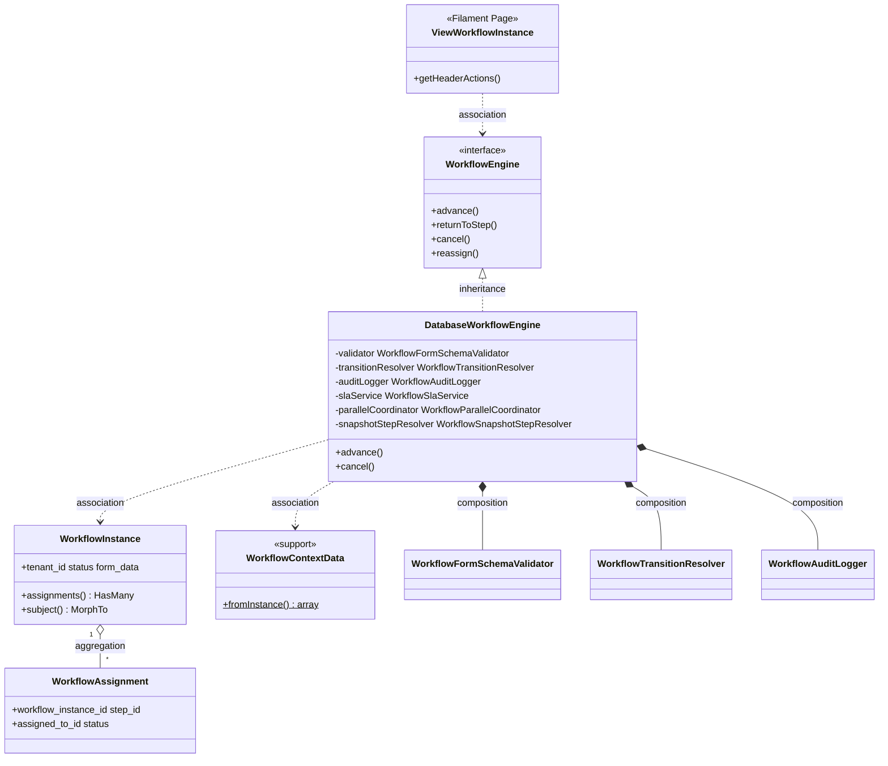
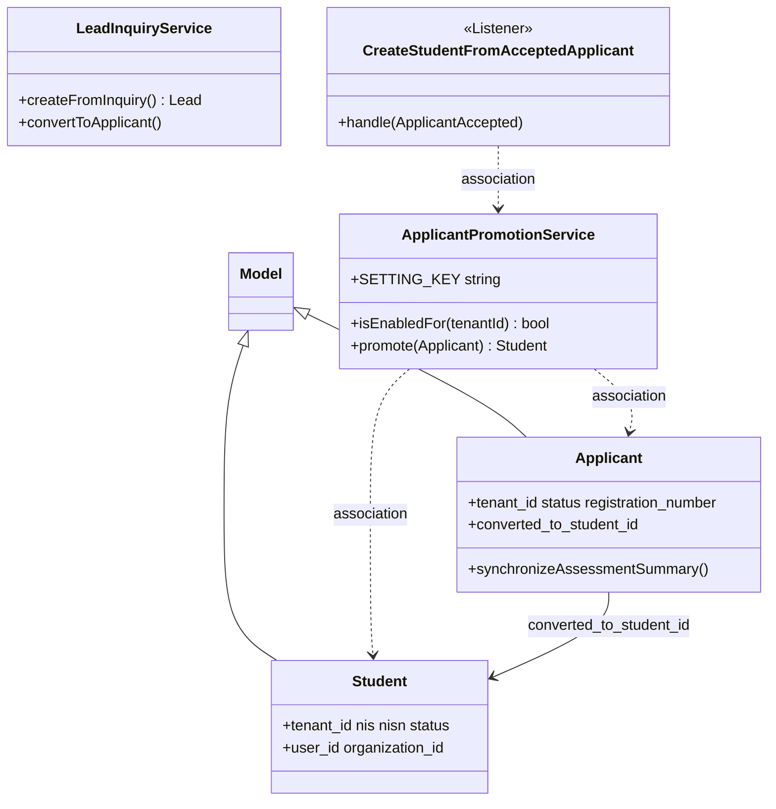
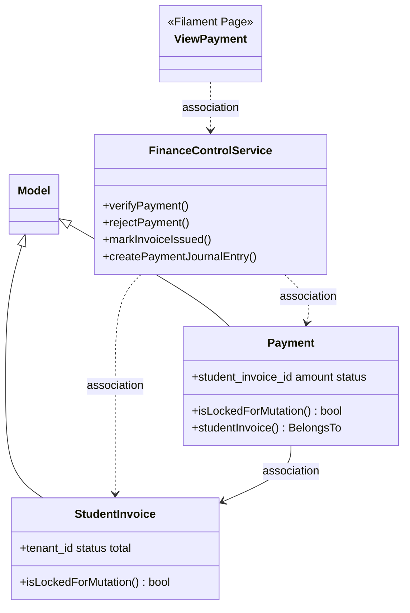
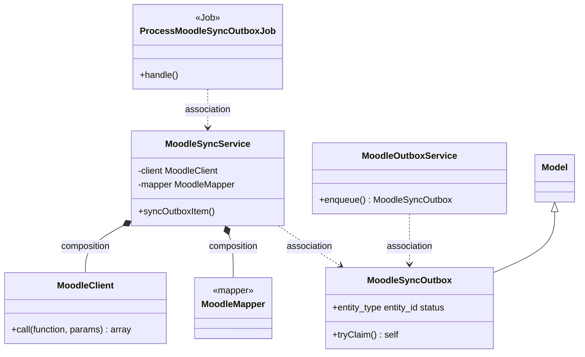
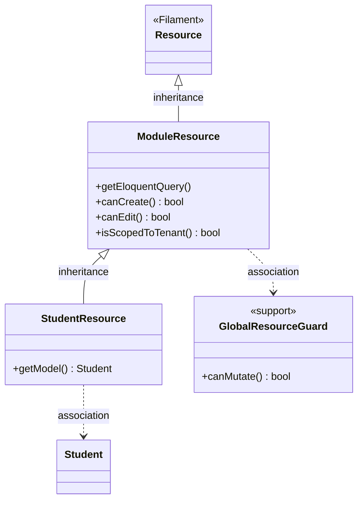

# 10 — Class Diagram

**Commit analisis:** `d3be06aa` · **Metode:** scan `extends Model`, `*Service`, `Contracts/*`, trait — tanpa menambah class fiktif

---

## 1. Identifikasi Pola

| Pola | Jumlah (scan repo) | Lokasi | Status |
|------|-------------------:|--------|--------|
| **Model / Entity** | ~380 class `extends Model` | `Modules/*/app/Models/`, `app/Models/` | **FAKTA** — Entity = Eloquent Model (tidak ada layer Entity terpisah) |
| **Service** | ~276 class `*Service` | `Modules/*/app/Services/`, `app/Services/` | **FAKTA** |
| **Interface** | 18 `interface` di `Modules/`, `app/` | `Modules/*/app/Contracts/` | **FAKTA** |
| **DTO** | 0 class DTO / DataTransferObject | — | **TIDAK TERDETEKSI DI KODE** |
| **Repository** | 0 class `*Repository` | — | **TIDAK TERDETEKSI DI KODE** |

**Catatan Entity vs Model:** Dalam codebase ini istilah **Entity** dan **Model** merujuk ke hal yang sama — class Eloquent `Illuminate\Database\Eloquent\Model`. Helper `WorkflowContextData` mengembalikan `array`, bukan DTO class.

---

## 2. Analisis Relasi UML

| Relasi | Definisi dalam codebase | Contoh bukti |
|--------|-------------------------|--------------|
| **Inheritance** | `extends` class / `implements` interface | `User extends Authenticatable`; `DatabaseWorkflowEngine implements WorkflowEngine` |
| **Composition** | Dependency wajib via constructor DI; service tidak berfungsi tanpa komponen | `DatabaseWorkflowEngine` ctor injeksi 6 collaborator — `DatabaseWorkflowEngine.php:28-35` |
| **Aggregation** | `hasMany` / `belongsTo` Eloquent; child punya FK ke parent | `WorkflowInstance::assignments()` HasMany |
| **Association** | `belongsTo`, pemanggilan method antar class, event dispatch | `FinanceControlService::verifyPayment(Payment, User)` |

---

## 3. Daftar Interface (semua yang terdeteksi)

| Interface | Modul | Implementasi (binding) | Bukti |
|-----------|-------|------------------------|-------|
| `WorkflowEngine` | Workflow | `DatabaseWorkflowEngine` | `WorkflowServiceProvider.php:52` |
| `WorkflowResolver` | Workflow | `DatabaseWorkflowResolver` | baris 49 |
| `WorkflowInstanceStarter` | Workflow | `DatabaseWorkflowInstanceStarter` | baris 51 |
| `WorkflowTransitionResolver` | Workflow | `JsonLogicWorkflowTransitionResolver` | baris 54 |
| `WorkflowFormSchemaValidator` | Workflow | `LaravelWorkflowFormSchemaValidator` | baris 53 |
| `WorkflowAssigneeResolver` | Workflow | `DatabaseWorkflowAssigneeResolver` | baris 55 |
| `WorkflowAuditLogger` | Workflow | `DatabaseWorkflowAuditLogger` | baris 56 |
| `WorkflowSlaService` | Workflow | `QueuedWorkflowSlaService` | baris 57 |
| `RuleEngine` | Workflow | `JsonLogicRuleEngine` | baris 50 |
| `GradeBridgeInterface` | Exam | implementor terdaftar DI Exam module | `GradeBridgeInterface.php` |
| `RuntimePublisherInterface` | Exam | — | `Modules/Exam/app/Contracts/` |
| `WhatsAppProvider` | Messaging | `LogWhatsAppProvider` (default) | `MessagingServiceProvider` |
| `EsignProvider` | Legal | — | `Modules/Legal/app/Contracts/` |
| `MonitoringWebhookReceiver` | ItOps | — | `Modules/ItOps/app/Contracts/` |
| `MikroTikClient` | ItOps | — | `Modules/ItOps/app/Contracts/` |

---

## 4. Diagram Mermaid — Cluster Core Tenancy



---

## 5. Diagram Mermaid — Cluster Workflow



---

## 6. Diagram Mermaid — Cluster Enrollment & School



---

## 7. Diagram Mermaid — Cluster Finance



---

## 8. Diagram Mermaid — Cluster Integrasi Moodle



---

## 9. Diagram Mermaid — Filament Resource Base



---

## 10. Kartu Class (hanya class yang ada di diagram)

### `Modules\Core\Models\Tenant`

| Aspek | Detail |
|-------|--------|
| **Tujuan** | Entitas batas SaaS; menyimpan status langganan dan metadata institusi |
| **Property** | `$fillable`: `uuid`, `code`, `name`, `status`, `subscription_expires_at`, `grace_period_ends_at`, … — baris 108–133 |
| **Method** | `isLocked(): bool` baris 165; `organizations(): HasMany`; ratusan relasi domain lain |
| **Dependency** | `Organization`, `User` (via pivot), modul School/Campus/Finance, dll. |
| **Relasi UML** | Aggregation ke `Organization`, `UserTenantRole` |

**Bukti:** `Modules/Core/app/Models/Tenant.php`

---

### `Modules\Core\Models\User`

| Aspek | Detail |
|-------|--------|
| **Tujuan** | Akun global; auth panel, MFA, membership tenant, RBAC Shield |
| **Property** | `$fillable`: `name`, `email`, `password`, `is_super_admin` (via migration), `preferred_locale`, … — baris 69–89 |
| **Method** | `isGlobalSuperAdmin()`, `canAccessPanel()`, `canAccessTenant()`, `getTenants()`, `userTenantRoles()` |
| **Dependency** | `Authenticatable`, `HasRoles`, `HasApiTokens`, `FilamentUser`, `HasTenants` |
| **Relasi UML** | Inheritance dari `Authenticatable`; aggregation ke `UserTenantRole` |

**Bukti:** `Modules/Core/app/Models/User.php` baris 57–59, 458–484

---

### `App\Models\User`

| Aspek | Detail |
|-------|--------|
| **Tujuan** | Bridge `auth` config → Core User; morph map `user` |
| **Property** | *(inherit dari Core User)* |
| **Method** | `getMorphClass(): string` → `'user'` |
| **Dependency** | `Modules\Core\Models\User` |
| **Relasi UML** | Inheritance |

**Bukti:** `app/Models/User.php`

---

### `Modules\Core\Models\UserTenantRole`

| Aspek | Detail |
|-------|--------|
| **Tujuan** | Membership user–tenant–role domain; gate akses panel admin |
| **Property** | `$fillable`: `user_id`, `tenant_id`, `tenant_role_id`, `expires_at`, `is_primary` — baris 15–24 |
| **Method** | `user()`, `tenantRole()`, `organization()`, `assignedBy()` BelongsTo |
| **Dependency** | `BelongsToTenant`, `User`, `TenantRole` |
| **Relasi UML** | Aggregation anak dari `User` + `Tenant` |

**Bukti:** `Modules/Core/app/Models/UserTenantRole.php`

---

### `Modules\Core\Models\Concerns\BelongsToTenant`

| Aspek | Detail |
|-------|--------|
| **Tujuan** | Trait scope `tenant_id`, auto-fill on create, `withoutTenantScope()` |
| **Property** | — |
| **Method** | `bootBelongsToTenant()`, `tenant()`, `withoutTenantScope()`, `allTenants()` |
| **Dependency** | `TenantScope`, `Tenant` model |
| **Relasi UML** | Association (mixin) ke semua model operasional |

**Bukti:** `Modules/Core/app/Models/Concerns/BelongsToTenant.php`

---

### `Modules\Workflow\Contracts\WorkflowEngine`

| Aspek | Detail |
|-------|--------|
| **Tujuan** | Kontrak mesin approval — advance, return, cancel, reassign |
| **Property** | — |
| **Method** | `advance()`, `returnToStep()`, `cancel()`, `reassign()` |
| **Dependency** | `WorkflowInstance`, `WorkflowAssignment`, `User` |
| **Relasi UML** | Diimplementasi oleh `DatabaseWorkflowEngine` |

**Bukti:** `Modules/Workflow/app/Contracts/WorkflowEngine.php`

---

### `Modules\Workflow\Services\DatabaseWorkflowEngine`

| Aspek | Detail |
|-------|--------|
| **Tujuan** | Implementasi runtime workflow V2 dengan transaksi DB dan audit |
| **Property** | `private readonly` collaborator: `validator`, `transitionResolver`, `auditLogger`, `slaService`, `parallelCoordinator`, `snapshotStepResolver` |
| **Method** | `advance()`, `returnToStep()`, `cancel()`, `reassign()`, `authorizeActor()` (protected) |
| **Dependency** | Interface Workflow*; model `WorkflowInstance`, `WorkflowAssignment`; event `WorkflowAdvanced` |
| **Relasi UML** | Composition 6 service; association ke Entity workflow |

**Bukti:** `Modules/Workflow/app/Services/DatabaseWorkflowEngine.php` baris 26–35, 37–92

---

### `Modules\Workflow\Models\WorkflowInstance`

| Aspek | Detail |
|-------|--------|
| **Tujuan** | Runtime snapshot instance workflow pada subject bisnis |
| **Property** | `$fillable`: `workflow_snapshot`, `context_data`, `form_data`, `status`, `current_step_id`, … — baris 20–42 |
| **Method** | `assignments()`, `logs()`, `evidences()`, `subject()` MorphTo, `currentStep()` |
| **Dependency** | `BelongsToTenant`, `Workflow`, `User`, `Organization` |
| **Relasi UML** | Aggregation `WorkflowAssignment`, `WorkflowInstanceLog` |

**Bukti:** `Modules/Workflow/app/Models/WorkflowInstance.php`

---

### `Modules\Workflow\Models\WorkflowAssignment`

| Aspek | Detail |
|-------|--------|
| **Tujuan** | Penugasan approver per step instance |
| **Property** | `$fillable`: `assigned_to_type`, `assigned_to_id`, `status`, `outcome`, `due_at`, … — baris 14–27 |
| **Method** | `instance(): BelongsTo`, `step(): BelongsTo` |
| **Dependency** | `WorkflowInstance`, `WorkflowStep` |
| **Relasi UML** | Aggregation child of `WorkflowInstance` |

**Bukti:** `Modules/Workflow/app/Models/WorkflowAssignment.php`

---

### `Modules\Workflow\Support\WorkflowContextData`

| Aspek | Detail |
|-------|--------|
| **Tujuan** | Merge `context_data`, `form_data`, metadata workflow untuk JSONLogic |
| **Property** | — |
| **Method** | `fromInstance(WorkflowInstance, array): array` (static) |
| **Dependency** | `WorkflowInstance` |
| **Relasi UML** | Association helper — **bukan DTO class** |

**Bukti:** `Modules/Workflow/app/Support/WorkflowContextData.php`

---

### `Modules\Enrollment\Models\Applicant`

| Aspek | Detail |
|-------|--------|
| **Tujuan** | Calon siswa pada periode admisi |
| **Property** | `$fillable`: `registration_number`, `full_name`, `status`, `converted_to_student_id`, … — baris 106+ |
| **Method** | `synchronizeAssessmentSummary()`; booted hook dispatch `ApplicantAccepted` baris 62–89 |
| **Dependency** | `BelongsToTenant`, `Student`, `AdmissionPeriod`, events |
| **Relasi UML** | Association ke `Student` via `converted_to_student_id` |

**Bukti:** `Modules/Enrollment/app/Models/Applicant.php`

---

### `Modules\School\Models\Student`

| Aspek | Detail |
|-------|--------|
| **Tujuan** | Siswa K-12 aktif di tenant |
| **Property** | `$fillable`: `nis`, `nisn`, `status`, `organization_id`, `user_id`, … — baris 25–45 |
| **Method** | Relasi `user()`, `organization()`, `attendances()`, `grades()`, dll. |
| **Dependency** | `BelongsToTenant`, `User`, `Organization` |
| **Relasi UML** | Association ke `Applicant` (inverse `convertedStudent`) |

**Bukti:** `Modules/School/app/Models/Student.php`

---

### `Modules\Enrollment\Services\ApplicantPromotionService`

| Aspek | Detail |
|-------|--------|
| **Tujuan** | Promosi applicant diterima → record `Student` + NIS |
| **Property** | `SETTING_GROUP`, `SETTING_KEY` constants |
| **Method** | `isEnabledFor()`, `promote()`, `generateNis()` (protected), `booleanSetting()` (protected) |
| **Dependency** | `Applicant`, `Student`, `TenantSetting`, `AcademicYear`, `DB` |
| **Relasi UML** | Association ke Entity; dipanggil listener `CreateStudentFromAcceptedApplicant` |

**Bukti:** `Modules/Enrollment/app/Services/ApplicantPromotionService.php`

---

### `Modules\Enrollment\Services\LeadInquiryService`

| Aspek | Detail |
|-------|--------|
| **Tujuan** | Buat `Lead` dari inquiry publik |
| **Property** | — |
| **Method** | `createFromInquiry()`, `convertToApplicant()` |
| **Dependency** | `Lead`, `LeadSource`, `LeadActivity`, `Applicant` |
| **Relasi UML** | Association |

**Bukti:** `Modules/Enrollment/app/Services/LeadInquiryService.php`

---

### `Modules\Finance\Models\Payment`

| Aspek | Detail |
|-------|--------|
| **Tujuan** | Pembayaran terhadap invoice siswa |
| **Property** | `$fillable`: `payment_number`, `amount`, `status`, `verified_by`, … — baris 26–46 |
| **Method** | `isLockedForMutation()`, `studentInvoice()` BelongsTo, activity log options |
| **Dependency** | `BelongsToTenant`, `StudentInvoice`, `User` |
| **Relasi UML** | Association ke `StudentInvoice` |

**Bukti:** `Modules/Finance/app/Models/Payment.php`

---

### `Modules\Finance\Services\FinanceControlService`

| Aspek | Detail |
|-------|--------|
| **Tujuan** | Aturan bisnis finance: issue invoice, verify/reject payment, jurnal |
| **Property** | — (stateless service) |
| **Method** | `markInvoiceIssued()`, `verifyPayment()`, `rejectPayment()`, `approveBudget()`, `postJournalEntry()`, `reverseJournalEntry()`, `recalculateInvoice()` |
| **Dependency** | `Payment`, `StudentInvoice`, `JournalEntry`, `AuditLog`, `NotificationService`, `DB` |
| **Relasi UML** | Association ke Entity finance & monitoring |

**Bukti:** `Modules/Finance/app/Services/FinanceControlService.php` baris 19–186

---

### `App\Models\MoodleSyncOutbox`

| Aspek | Detail |
|-------|--------|
| **Tujuan** | Outbox event sync ke Moodle |
| **Property** | `$fillable`: `entity_type`, `entity_id`, `tenant_id`, `action`, `payload`, `status`, `dedupe_key`, … — baris 22–34 |
| **Method** | `tryClaim()` (static/instance), status constants |
| **Dependency** | `ProcessMoodleSyncOutboxJob`, `MoodleSyncService` |
| **Relasi UML** | Entity persistence outbox pattern |

**Bukti:** `app/Models/MoodleSyncOutbox.php`

---

### `App\Integrations\Moodle\MoodleSyncService`

| Aspek | Detail |
|-------|--------|
| **Tujuan** | Proses item outbox → panggil Moodle API per entity type |
| **Property** | `protected MoodleClient $client`, `protected MoodleMapper $mapper` — ctor baris 28–31 |
| **Method** | `syncOutboxItem()`, `syncUserOutbox()`, `syncCourseOutbox()`, … (protected) |
| **Dependency** | `MoodleClient`, `MoodleMapper`, `User`, `Course`, `MoodleSyncOutbox` |
| **Relasi UML** | Composition `MoodleClient` + `MoodleMapper` |

**Bukti:** `app/Integrations/Moodle/MoodleSyncService.php` baris 26–44

---

### `App\Integrations\Moodle\MoodleClient`

| Aspek | Detail |
|-------|--------|
| **Tujuan** | HTTP client ke Moodle REST `server.php` |
| **Property** | — |
| **Method** | `call(string $function, array $params): array` |
| **Dependency** | `config/moodle.php`, `Illuminate\Support\Facades\Http` |
| **Relasi UML** | Association ke External API |

**Bukti:** `app/Integrations/Moodle/MoodleClient.php` baris 10–50

---

### `Modules\Core\Filament\Support\ModuleResource`

| Aspek | Detail |
|-------|--------|
| **Tujuan** | Base Filament resource: tenant scope, global guard, navigation |
| **Property** | *(inherit Filament Resource static props)* |
| **Method** | `getEloquentQuery()`, `canCreate()`, `canEdit()`, `canDelete()`, `isScopedToTenant()` |
| **Dependency** | `Filament\Resources\Resource`, `GlobalResourceGuard`, `TenantScope` |
| **Relasi UML** | Inheritance dari `Resource`; 257 child resources |

**Bukti:** `Modules/Core/app/Filament/Support/ModuleResource.php` baris 19–80

---

### `Modules\Exam\Contracts\GradeBridgeInterface`

| Aspek | Detail |
|-------|--------|
| **Tujuan** | Plug-in push nilai ujian ke gradebook eksternal |
| **Property** | — |
| **Method** | `supports(ExamDefinition): bool`, `syncAttempt(ExamDefinition, ExamAttemptSync): void` |
| **Dependency** | `ExamDefinition`, `ExamAttemptSync` |
| **Relasi UML** | Interface — implementor di Exam module |

**Bukti:** `Modules/Exam/app/Contracts/GradeBridgeInterface.php`

---

### `Modules\Messaging\Contracts\WhatsAppProvider`

| Aspek | Detail |
|-------|--------|
| **Tujuan** | Abstraksi pengiriman WhatsApp |
| **Property** | — |
| **Method** | `sendMessage()`, `sendTemplate()`, `sendMedia()` |
| **Dependency** | Implementasi konkret di `Modules/Messaging/app/Services/` |
| **Relasi UML** | Interface (hexagonal port) |

**Bukti:** `Modules/Messaging/app/Contracts/WhatsAppProvider.php`

---

## 11. TIDAK TERDETEKSI DI KODE

| Pola | Status |
|------|--------|
| Class `*Repository` / `RepositoryInterface` | **TIDAK TERDETEKSI DI KODE** |
| Class `*Dto`, `DataTransferObject`, `readonly class *Data` | **TIDAK TERDETEKSI DI KODE** |
| Entity ORM terpisah dari Model | **TIDAK TERDETEKSI DI KODE** |
| Diagram tiap ~380 model | **TIDAK DIBUAT** — pola identik `extends Model` + `BelongsToTenant` |
| Diagram tiap ~276 service | **TIDAK DIBUAT** — pola identik class service + inject model |

---

## 12. Regenerasi

```bash
rg -l "extends Model" Modules/ app/Models/ | wc -l
rg -l "class.*Service" Modules/ app/ | wc -l
rg "^interface " Modules/ app/
php scripts/extract-authorization-matrix.php
```

**Referensi:** `03_arsitektur_aplikasi.md`, `09_sequence_diagram.md`, `11_er_diagram.md`
