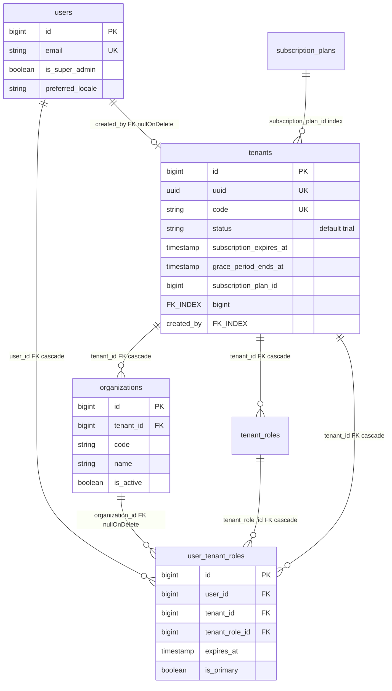
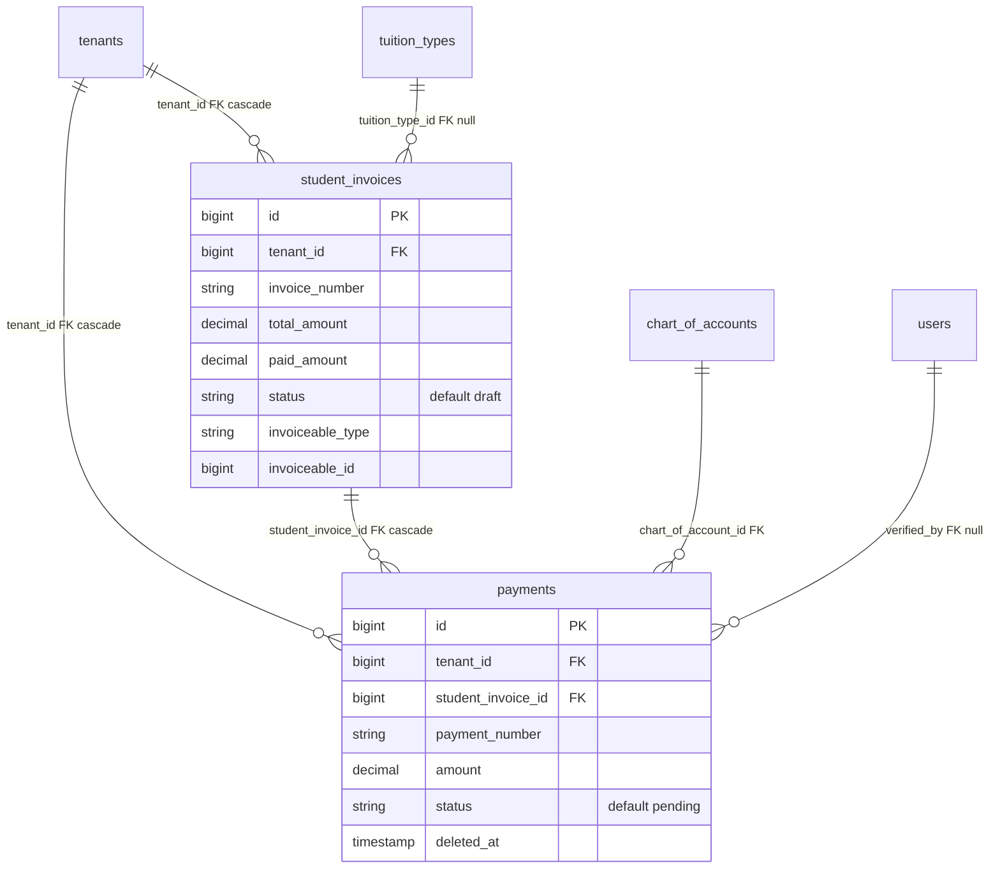
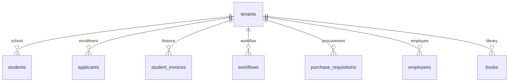

# 11 — ER Diagram

**Commit analisis:** `d3be06aa` · **Sumber schema:** Laravel migrations (`database/migrations/`, `Modules/*/database/migrations/`)

---

## 1. Analisis Migration & Schema

| Aspek | Temuan | Bukti |
|-------|--------|-------|
| **Migration files** | 37 (`database/`) + 208 (`Modules/`) ≈ **245** | `find Modules -name migrations` |
| **Tabel (`Schema::create`)** | **434** | `php scripts/extract-entity-catalog.php` → `storage/app/entity-catalog.json` |
| **Model ORM** | **402** class ↔ tabel | `entity-catalog.json` `model_count` |
| **Foreign key (verified)** | **5.473** relasi | `php scripts/extract-verified-fks.php` → `storage/app/verified-fks.json` |
| **FK ke tenants/orgs/users** | **4.104** | output script verified-fks |
| **SQL mentah** | Terbatas (`DB::statement` ALTER) | `Modules/Library/database/migrations/2026_03_26_170000_add_optional_organization_scope_to_library_tables.php` |
| **View database** | **TIDAK TERDETEKSI DI KODE** | `rg "Schema::view\|createView"` → 0 match |

### Pola schema dominan

| Pola | Bukti |
|------|-------|
| `tenant_id` FK → `tenants` cascade | Hampir semua tabel operasional |
| `organization_id` nullable | `organizations` migration |
| `deleted_at` soft delete | `2026_03_25_171000_add_soft_deletes_to_all_domain_tables.php` — includes `students`, `applicants`, `payments` |
| `foreignId()->constrained()` | Blueprint standar Laravel 13 |
| Morph `subject_type` / `subject_id` | `workflow_instances`, `student_invoices.invoiceable_*` |

---

## 2. Identifikasi Objek Database

| Objek | Jumlah | Status |
|-------|-------:|--------|
| **Table** | 434 | **FAKTA** — `entity-catalog.json` |
| **View** | 0 | **TIDAK TERDETEKSI DI KODE** |
| **Index** | Ribuan (per migration `->index()`, `->unique()`, FK implicit) | **FAKTA** — contoh di bawah per cluster |
| **Constraint UNIQUE** | Per tabel domain | **FAKTA** — e.g. `unique(['tenant_id','nis'])` students |
| **Constraint FK** | 5.473 verified | **FAKTA** — `verified-fks.json` |
| **Check constraint** | **TIDAK TERDETEKSI DI KODE** | Tidak ada `->check()` di migrasi |

---

## 3. ORM Mapping (Model ↔ Table)

| Table | Model class | Trait / scope | Bukti model |
|-------|-------------|---------------|-------------|
| `tenants` | `Modules\Core\Models\Tenant` | SoftDeletes | `Modules/Core/app/Models/Tenant.php` |
| `users` | `Modules\Core\Models\User` | HasRoles, HasApiTokens, SoftDeletes | `User.php` |
| `organizations` | `Modules\Core\Models\Organization` | BelongsToTenant | `Organization.php` |
| `user_tenant_roles` | `Modules\Core\Models\UserTenantRole` | BelongsToTenant | `UserTenantRole.php` |
| `students` | `Modules\School\Models\Student` | BelongsToTenant, SoftDeletes | `Student.php` |
| `applicants` | `Modules\Enrollment\Models\Applicant` | BelongsToTenant, SoftDeletes | `Applicant.php` |
| `payments` | `Modules\Finance\Models\Payment` | BelongsToTenant, LogsActivity | `Payment.php` |
| `student_invoices` | `Modules\Finance\Models\StudentInvoice` | BelongsToTenant | `StudentInvoice.php` |
| `workflow_instances` | `Modules\Workflow\Models\WorkflowInstance` | BelongsToTenant, SoftDeletes | `WorkflowInstance.php` |
| `workflow_assignments` | `Modules\Workflow\Models\WorkflowAssignment` | — | `WorkflowAssignment.php` |
| `moodle_sync_outbox` | `App\Models\MoodleSyncOutbox` | — | `app/Models/MoodleSyncOutbox.php` |

**Repository:** **TIDAK TERDETEKSI DI KODE** — ORM langsung Eloquent, tanpa layer repository.

---

## 4. ERD — Core Tenancy & Auth



**Bukti FK:** `2026_03_24_151400_create_tenants_table.php`, `151842_create_users_table.php`, `151842_create_organizations_table.php`, `151843_create_user_tenant_roles_table.php`, `2026_05_22_151424_add_grace_period_to_tenants.php`

**Index contoh:**
- `tenants.uuid` UNIQUE — migration create tenants baris 16
- `user_tenant_roles` UNIQUE `(user_id, tenant_id, organization_id, tenant_role_id)` — baris 24
- `users.is_super_admin` INDEX — `2026_03_25_170000_add_is_super_admin_to_users_table.php`

---

## 5. ERD — Enrollment & School

```mermaid
erDiagram
    tenants ||--o{ applicants : "tenant_id FK cascade"
    tenants ||--o{ students : "tenant_id FK cascade"
    admission_periods ||--o{ applicants : "admission_period_id FK"
    departments ||--o{ applicants : "program_choice FK"
    students ||--o| applicants : "converted_to_student_id FK"
    organizations ||--o{ students : "organization_id FK null"
    academic_years ||--o{ students : "academic_year_id FK null"
    users ||--o{ students : "user_id FK null"
    leads ||--o| applicants : "lead_id FK"

    applicants {
        bigint id PK
        bigint tenant_id FK
        string registration_number
        string status "default registered"
        bigint converted_to_student_id FK_NULL
        timestamp deleted_at
    }

    students {
        bigint id PK
        bigint tenant_id FK
        string nis
        string nisn
        string status "default active"
        timestamp deleted_at
    }
```

**Bukti:** `Modules/Enrollment/database/migrations/2026_03_24_152536_create_applicants_table.php`, `Modules/School/database/migrations/2026_03_24_152528_create_students_table.php`, soft delete `2026_03_25_171000_add_soft_deletes_to_all_domain_tables.php`

**Constraint:**
- `UNIQUE(tenant_id, registration_number)` — applicants baris 47
- `UNIQUE(tenant_id, nis)`, `UNIQUE(tenant_id, nisn)` — students baris 55–56

---

## 6. ERD — Finance



**Bukti:** `Modules/Finance/database/migrations/2026_03_24_152535_create_student_invoices_table.php`, `2026_03_24_152535_create_payments_table.php`

**Index / constraint:**
- `UNIQUE(tenant_id, invoice_number)` — student_invoices baris 33
- `UNIQUE(tenant_id, payment_number)` — payments baris 32
- Morph index `invoiceable_type`, `invoiceable_id` — `morphs('invoiceable')` baris 32

---

## 7. ERD — Workflow V2

```mermaid
erDiagram
    tenants ||--o{ workflows : "tenant_id FK"
    workflows ||--o{ workflow_steps : "workflow_id FK"
    workflows ||--o{ workflow_instances : "workflow_id FK"
    workflow_steps ||--o{ workflow_instances : "current_step_id FK"
    workflow_instances ||--o{ workflow_assignments : "workflow_instance_id FK"
    workflow_steps ||--o{ workflow_assignments : "step_id FK"
    users ||--o{ workflow_instances : "requester_id FK"
    workflow_instances }o--|| polymorphic_subject : "subject_type subject_id"

    workflows {
        bigint id PK
        bigint tenant_id FK
        string code
        int version
        boolean is_active
        timestamp deleted_at
    }

    workflow_instances {
        bigint id PK
        json workflow_snapshot
        json context_data
        string status "default running"
        bigint current_step_id FK_NULL
        timestamp deleted_at
    }

    workflow_assignments {
        bigint id PK
        bigint workflow_instance_id FK
        bigint step_id FK
        string assigned_to_type
        bigint assigned_to_id
        string status "default pending"
    }
```

**Bukti:** `Modules/Workflow/database/migrations/2026_03_26_210000_create_workflows_table.php`, `210300_create_workflow_instances_table.php`, `210500_create_workflow_assignments_table.php`

**Index contoh (workflow_instances):**
- `(tenant_id, organization_id, status)` — baris 37
- `(subject_type, subject_id)` — baris 40

---

## 8. ERD — Moodle Outbox

```mermaid
erDiagram
  moodle_sync_outbox {
    bigint id PK
    string entity_type
    bigint entity_id
    bigint tenant_id INDEX_NULL
    string action
    string dedupe_key UK
    string status "default pending"
    int attempts
  }

  moodle_entity_mappings {
    bigint id PK
    string entity_type
    bigint fos_entity_id
    string moodle_idnumber UK
  }
```

**Bukti:** `database/migrations/2026_03_25_220000_create_moodle_sync_tables.php`

**Catatan:** `moodle_sync_outbox.tenant_id` — `unsignedBigInteger` nullable **tanpa** `constrained()` eksplisit di migration baris 15.

---

## 9. ERD — Hub Domain (tingkat modul)



**Bukti:** Semua tabel di atas memiliki `foreignId('tenant_id')->constrained('tenants')` di migrasi modul masing-masing — diverifikasi via `verified-fks.json` filter `tenants`.

---

## 10. Katalog Lengkap

| Artefak | Lokasi | Regenerasi |
|---------|--------|------------|
| Entity + kolom | `storage/app/entity-catalog.json` | `php scripts/extract-entity-catalog.php` |
| Foreign keys | `storage/app/verified-fks.json` | `php scripts/extract-verified-fks.php` |
| Data dictionary kolom | `16_data_dictionary.md` | Manual + migrasi |

**TIDAK TERDETEKSI DI GIT:** `verified-fks.json` / `entity-catalog.json` tidak di-commit (generated local).

---

## 11. TIDAK TERDETEKSI DI KODE

| Item | Status |
|------|--------|
| Database VIEW | **TIDAK TERDETEKSI DI KODE** |
| Materialized view | **TIDAK TERDETEKSI DI KODE** |
| Stored procedure / trigger SQL | **TIDAK TERDETEKSI DI KODE** |
| ERD lengkap 434 tabel | **TIDAK DIBUAT** — gunakan katalog JSON |

**Referensi:** `16_data_dictionary.md`, `10_class_diagram.md`
