# 12 — BPMN (Rekonstruksi Proses Bisnis)

**Commit analisis:** `d3be06aa`  
**Sumber bukti:** service, listener, job, command, model observer, Filament action — **bukan** file `.bpmn` native.

**TIDAK TERDETEKSI DI KODE:** diagram BPMN 2.0 XML, event subprocess, compensation handler.

---

## 1. Metodologi & Legenda BPMN (Mermaid)

Notasi BPMN 2.0 disimulasikan dengan `flowchart` Mermaid karena repositori tidak menyimpan artefak BPMN resmi.

| Elemen BPMN | Notasi Mermaid | Contoh dalam diagram |
|-------------|----------------|----------------------|
| **Start Event** | `((Start))` atau `([Start: …])` | `((Start))` pendaftaran applicant |
| **End Event** | `((End))` atau `([End: …])` | `((End: Siswa aktif))` |
| **Intermediate Event** | `{{Event: …}}` | `{{Event: ApplicantAccepted}}` |
| **Task** | `[Task: …]` | `[Task: Verifikasi pembayaran]` |
| **User Task** | `[User: …]` | `[User: Approve step workflow]` |
| **Service Task** | `[Svc: …]` | `[Svc: Post jurnal akuntansi]` |
| **Gateway (XOR)** | `{Kondisi?}` | `{Status accepted?}` |
| **Gateway (AND)** | `{AND: …}` | `{AND: Semua approver parallel}` |
| **Approval** | `[Approval: …]` | `[Approval: Advance approve]` |
| **Escalation** | `[Escalation: …]` | `[Escalation: SLA overdue notify]` |
| **Notification** | `[Notify: …]` | `[Notify: InternalWorkflowNotification]` |

**Klasifikasi proses (permintaan user):**

| Kategori | Definisi dalam dokumen ini |
|----------|----------------------------|
| **Core process** | Jalur nilai bisnis utama (pendaftaran, keuangan, approval, procurement) |
| **Supporting process** | Tenancy, auth, sync, messaging, import — mendukung core |
| **Exception process** | Error, SLA breach, escalation, rejection, retry |

---

## 2. Inventaris Elemen BPMN per Domain

| Domain | Event | Task | Gateway | Approval | Escalation | Notification | Bukti utama |
|--------|-------|------|---------|----------|------------|--------------|-------------|
| **Enrollment** | `ApplicantAccepted`, `ApplicantAcceptanceReverted` | Registrasi, seleksi nilai, promote | Status `accepted?`, auto-promote enabled? | Set status `accepted` (admin) | — | **TIDAK TERDETEKSI** notifikasi khusus acceptance | `Applicant.php` booted, `ApplicantPromotionService` |
| **Finance** | `StudentInvoicePaid` | Issue invoice, record payment, verify, post journal | Payment `pending?`, invoice mutable? | `verifyPayment()` | — | `NotificationService::paymentVerified/Rejected` | `FinanceControlService` |
| **Workflow V2** | `WorkflowStarted`, `WorkflowAdvanced`, `WorkflowSlaBreached`, `WorkflowCancelled`, `WorkflowReturned` | Start instance, assign, advance, return, cancel | JSONLogic transition, parallel quorum, evidence required? | `advance()` approve/reject | `escalateOverdue()`, delegation | `InternalWorkflowNotification`, automation `internal_notification` | `DatabaseWorkflowEngine`, `WorkflowEscalationService` |
| **Procurement** | `PurchaseRequisitionApproved` | Start workflow PR, three-way match | Workflow running?, match OK? | Manual `startWorkflow` + engine advance | Sama workflow SLA | Filament toast | `ViewPurchaseRequisition`, `SyncWorkflowSubjectState`, `ThreeWayMatchValidator` |
| **School** | — (CRUD) | Create/update attendance record | — | — | — | — | Filament `AttendanceResource` — **TIDAK TERDETEKSI** engine terpusat |
| **Moodle** | Observer model change | Enqueue outbox, sync job | `moodle.enabled?`, terminal attempts? | — | Exponential retry | — | `MoodleOutboxService`, `ProcessMoodleSyncOutboxJob` |
| **Messaging** | — | Dispatch multi-channel | Channel enabled per tenant? | — | — | database / mail / whatsapp | `NotificationDispatcher` |
| **Tenancy** | Filament register | Create tenant, provision roles/modules | `isLocked?` (subscription) | — | Grace period | Billing redirect | `RegisterTenant`, `EnsureTenantSubscriptionActive` |
| **Import** | User upload CSV | Filament ImportAction | Valid rows? | — | Failed rows log | Filament import notification | `ImportTableActions`, `BaseModelImporter` |

---

## 3. Core Processes

### CP-01 Enrollment: Lead → Applicant → Seleksi → Siswa

**Nilai bisnis:** calon siswa menjadi record `students` aktif.

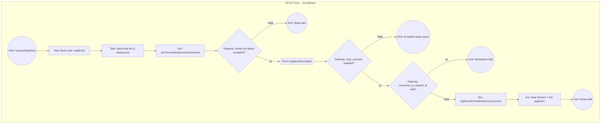

| Langkah | Tipe BPMN | Bukti |
|---------|-----------|-------|
| Buat Lead | Task | `LeadInquiryService::createFromInquiry()` |
| Lead → Applicant | Task | `LeadInquiryService::convertToApplicant()` |
| Agregasi nilai | Service Task | `Applicant::synchronizeAssessmentSummary()` |
| Status accepted | Gateway + Event | `Applicant::booted()` → `ApplicantAccepted::dispatch()` |
| Auto-promote gate | Gateway | `ApplicantPromotionService::isEnabledFor()` setting `enrollment.auto_promote_accepted_applicant` |
| Skip jika sudah convert | Gateway | `ApplicantPromotionService::promote()` baris 34–36 |
| Buat siswa | Service Task | `ApplicantPromotionService::promote()` + listener `CreateStudentFromAcceptedApplicant` |

**Listener terkait (supporting hook):** `CreateLibraryMemberFromAcceptedApplicant` — anggota perpustakaan otomatis.

---

### CP-02 Finance: Invoice → Pembayaran → Verifikasi

**Nilai bisnis:** tagihan siswa lunas dengan jurnal akuntansi terverifikasi.

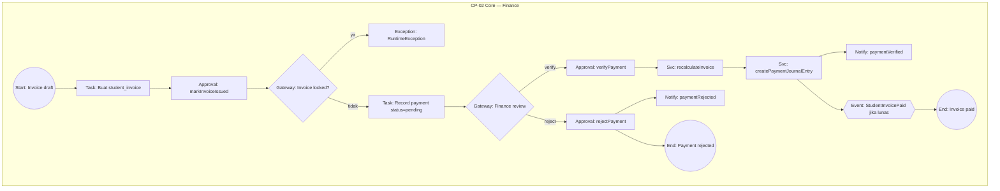

| Langkah | Tipe BPMN | Bukti |
|---------|-----------|-------|
| Issue invoice | Approval/Task | `FinanceControlService::markInvoiceIssued()` |
| Immutable issued | Gateway | `assertInvoiceMutable()` / `isLockedForMutation()` |
| Record payment | Task | Model `Payment` status default `pending` |
| Verify | Approval | `FinanceControlService::verifyPayment()` |
| Recalc status | Service Task | `recalculateInvoice()` — `draft/issued/partial/paid` |
| Post journal | Service Task | `createPaymentJournalEntry()` |
| Notifikasi | Notification | `NotificationService::paymentVerified()` |
| Invoice lunas | Event | `StudentInvoicePaid::dispatch()` |

**UI trigger:** `ViewPayment` action `verifyPayment` / `rejectPayment`.

---

### CP-03 Workflow V2: Approval Generik

**Nilai bisnis:** metadata-driven approval multi-step dengan SLA, parallel, delegation.

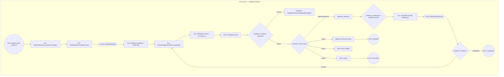

| Langkah | Tipe BPMN | Bukti |
|---------|-----------|-------|
| Resolve definisi | Service Task | `DatabaseWorkflowResolver::resolveForSubject()` |
| Start instance | Service Task | `DatabaseWorkflowInstanceStarter::start()` |
| Buat assignment | Service Task | `CreateAssignmentsForCurrentStep` + `WorkflowEscalationService::createAssignmentWithDelegation()` |
| Delegation | Gateway implisit | `WorkflowDelegation` aktif → assign ke `toUser` |
| Authorize actor | Gateway | `DatabaseWorkflowEngine::authorizeActor()` |
| Evidence gate | Gateway | `requiresEvidence()` + count evidences |
| Approve / reject | Approval | `DatabaseWorkflowEngine::advance()` |
| Status reject/cancel | Gateway | `determineStatus()` — action `reject` / `cancel` |
| Parallel | AND Gateway | `WorkflowParallelCoordinator` |
| Transisi | Gateway | `JsonLogicWorkflowTransitionResolver` |
| Automation hook | Notification (opsional) | `WorkflowAutomatedActionRunner` trigger `started/advanced/completed/...` |

**Config:** `config/workflow.php` — queue, SLA queue, escalation notify flag.

---

### CP-04 Procurement: PR → Workflow → Sourcing

**Nilai bisnis:** purchase requisition disetujui sebelum sourcing/PO.

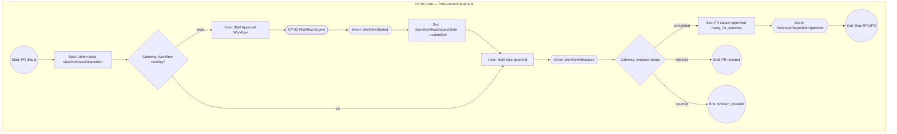

| Langkah | Tipe BPMN | Bukti |
|---------|-----------|-------|
| Start workflow manual | User Task | `ViewPurchaseRequisition::startWorkflow` |
| Sync status PR | Service Task | `SyncWorkflowSubjectState` |
| Approved → event | Event | `PurchaseRequisitionApproved::dispatch()` |
| Three-way match (pasca-PO) | Gateway terpisah | `ThreeWayMatchValidator` — **setelah** GR/VB, bukan di workflow PR |

**Catatan:** Trigger workflow **manual** dari UI PR — **TIDAK TERDETEKSI** auto-start pada create PR.

---

### CP-05 Procurement Fulfillment (Pasca-Approval)

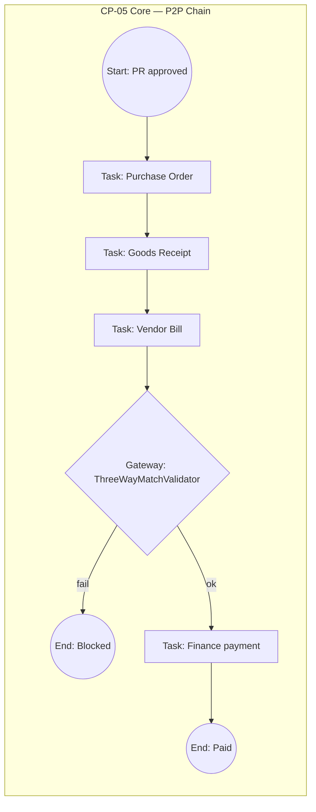

**Bukti:** `ThreeWayMatchValidator`, model `PurchaseOrder`, `GoodsReceipt`, `VendorBill`.

---

## 4. Supporting Processes

### SP-01 Tenant Onboarding & Keanggotaan User

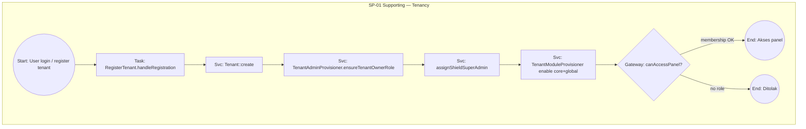

| Langkah | Bukti |
|---------|-------|
| Registrasi tenant | `app/Filament/Pages/Tenancy/RegisterTenant.php` |
| Role owner + Shield | `TenantAdminProvisioner` |
| Modul default | `TenantModuleProvisioner::enableForTenant()` |
| Akses panel | `User::canAccessPanel()` + `user_tenant_roles` |

**Assignment role tambahan:** CRUD `UserTenantRole` via Filament Core — **TIDAK TERDETEKSI** service orchestration terpusat selain provisioner.

---

### SP-02 Subscription Gate (Akses Tenant Terkunci)

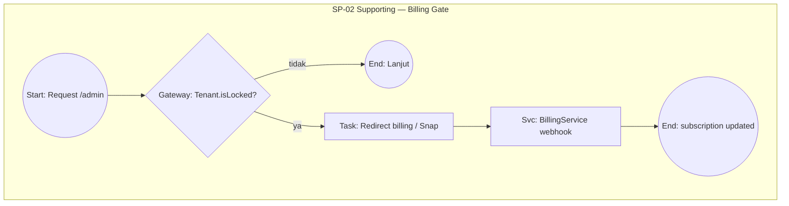

**Bukti:** `EnsureTenantSubscriptionActive`, `Tenant::isLocked()`, `BillingService`.

---

### SP-03 Moodle Sync Outbox

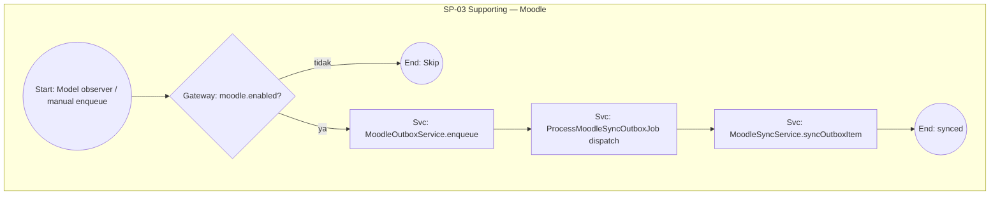

**Bukti:** `MoodleOutboxService`, `ProcessMoodleSyncOutboxJob`, observers (`CourseObserver`, `StudentObserver`, dll.).

---

### SP-04 Import / Export Data (Filament)

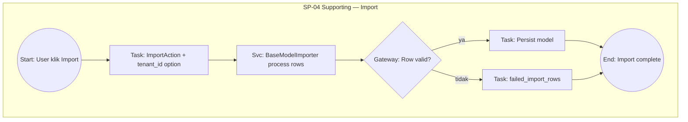

**Bukti:** `ImportTableActions::make()`, `app/Filament/Imports/BaseModelImporter.php`, tabel `imports` / `failed_import_rows`.

---

### SP-05 Messaging / Notification Dispatch

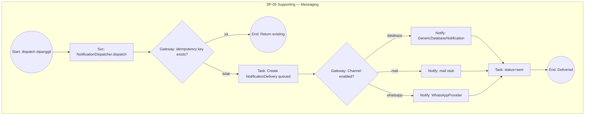

**Bukti:** `Modules/Messaging/app/Services/NotificationDispatcher.php`.

**Paralel:** `NotificationService` (Core) mengirim notifikasi Filament database untuk event finance/workflow — jalur terpisah dari Messaging module.

---

## 5. Exception Processes

### EP-01 Workflow SLA Breach & Escalation

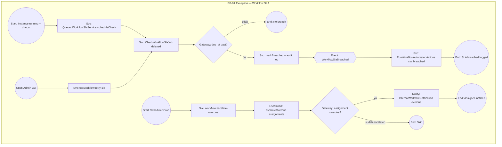

| Langkah | Tipe | Bukti |
|---------|------|-------|
| Schedule SLA check | Service Task | `QueuedWorkflowSlaService::scheduleCheck()` |
| Breach detection | Gateway + Event | `CheckWorkflowSlaJob` → `markBreached()` → `WorkflowSlaBreached` |
| Assignment escalation | Escalation | `WorkflowEscalationService::escalateOverdue()` |
| Notify assignee | Notification | `InternalWorkflowNotification` jika `workflow.escalation.notify_assignee` |
| Retry SLA jobs | Task (manual) | `fos:workflow:retry-sla` (`WorkflowRetrySlaCommand`) |

---

### EP-02 Workflow Rejection / Cancel / Return

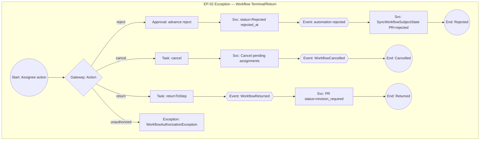

**Bukti:** `DatabaseWorkflowEngine::cancel()`, `returnToStep()`, `determineStatus()`, `SyncWorkflowSubjectState`.

---

### EP-03 Payment Verification Failure

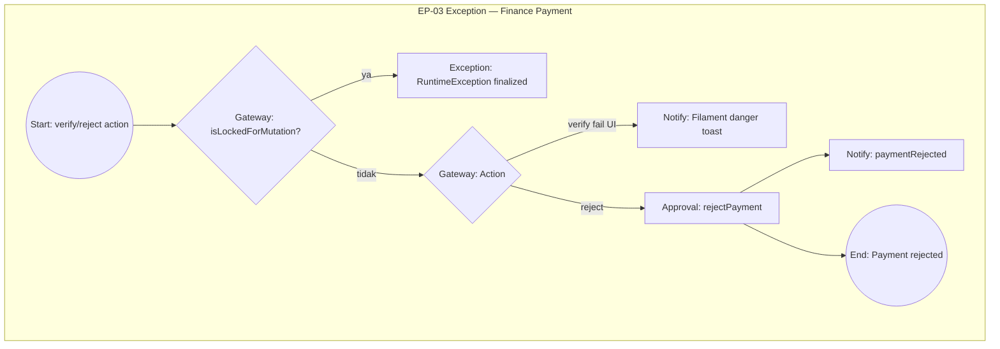

**Bukti:** `FinanceControlService::rejectPayment()`, `ViewPayment` try/catch + Filament `Notification`.

---

### EP-04 Moodle Sync Retry & Terminal Failure

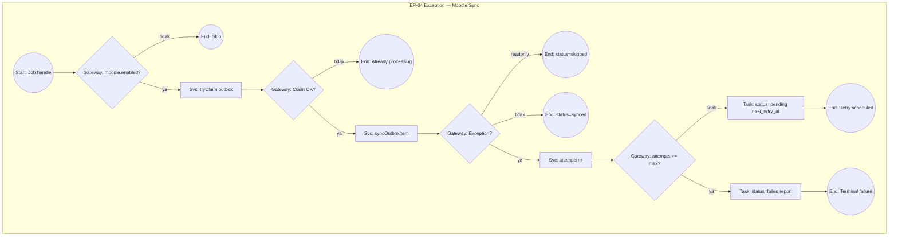

**Bukti:** `ProcessMoodleSyncOutboxJob`, `MoodleSyncRetry::nextRetryAt()`, `config/moodle.php` `max_attempts`.

---

### EP-05 Workflow Automation Failure & Retry

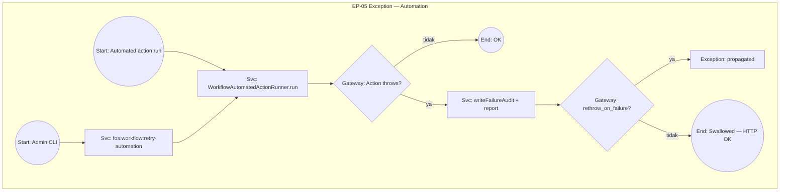

**Bukti:** `WorkflowAutomatedActionRunner::runMappedAction()` catch block, `config/workflow.php` `automation.rethrow_on_failure`, `WorkflowRetryAutomationCommand`.

---

### EP-06 Enrollment: Acceptance Reverted

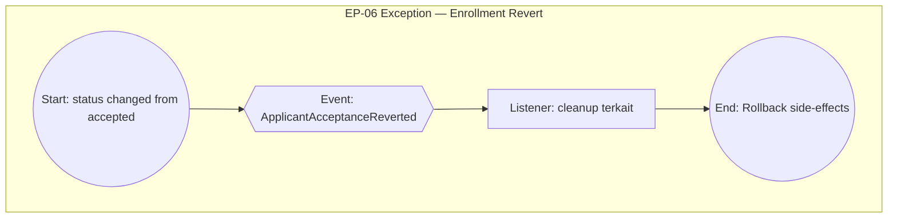

**Bukti:** `Applicant::booted()` baris 82–87, event `ApplicantAcceptanceReverted`.

---

## 6. Peta Hub Core ↔ Supporting ↔ Exception

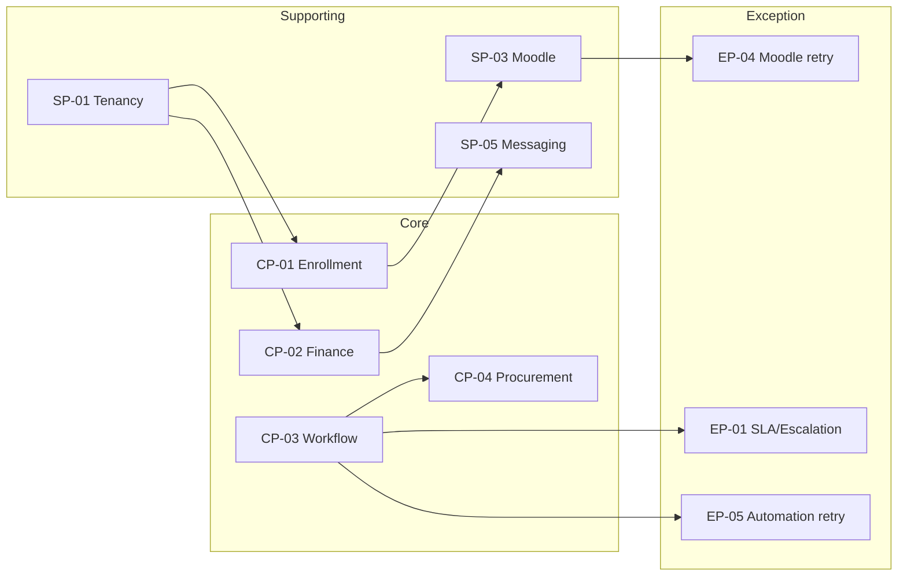

---

## 7. TIDAK TERDETEKSI DI KODE

| Proses | Status |
|--------|--------|
| Payroll end-to-end BPMN | **TIDAK TERDETEKSI DI KODE** |
| Attendance recording engine (selain CRUD Filament) | **TIDAK TERDETEKSI DI KODE** |
| Auto-start workflow pada create PR | **TIDAK TERDETEKSI DI KODE** — start manual |
| Marketplace order fulfillment | **TERINDIKASI NAMUN BELUM TERBUKTI PENUH** |
| File BPMN 2.0 XML | **TIDAK TERDETEKSI DI KODE** |
| Escalation ke manager hierarchy otomatis | **TIDAK TERDETEKSI DI KODE** — hanya notify assignee + automation hooks |

---

## 8. Referensi Silang

| Dokumen | Isi terkait |
|---------|-------------|
| `08_activity_diagram.md` | AD-04 workflow, AD-05 finance, AD-07 enrollment |
| `07_use_case_diagram.md` | UC-001–020 |
| `15_business_rules.md` | BR-W*, BR-F*, BR-E*, BR-P* |
| `WORKFLOW.md` | Runbook workflow V2 |
| `PROCUREMENT.md` | Rantai P2P |
| `FINANCE.md` | Golden path keuangan |

**Regenerasi bukti otomatis:** `scripts/build-evidence-registry.php`
