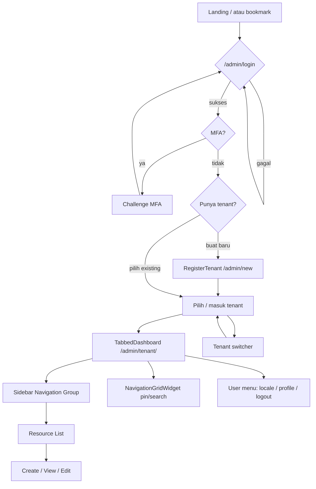
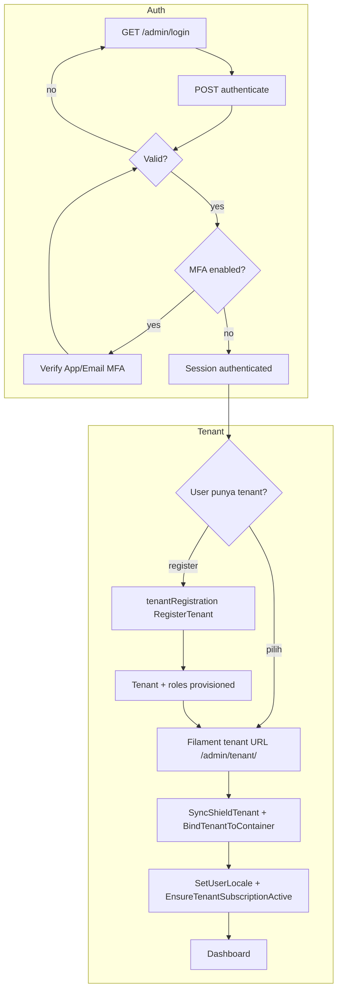
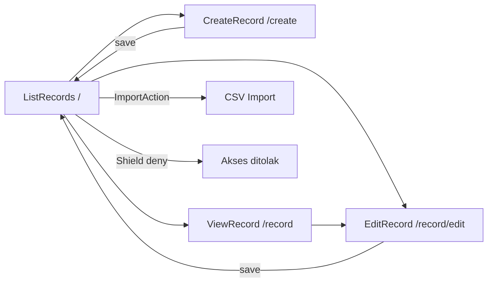

# 13 — Alur UI

**Metode:** Analisis statis source code (Filament panel providers, resources, pages, routes, middleware).  
**Aturan bukti:** Setiap klaim utama disertai path file. Yang tidak ditemukan ditandai **TIDAK TERDETEKSI DI KODE**.

---

## 1. Ringkasan Arsitektur Frontend

| Aspek | Status | Bukti |
|-------|--------|-------|
| Framework UI utama | **FAKTA** — Filament v5 (server-driven UI di PHP) | `composer.json` (`filament/filament`), `app/Providers/Filament/` |
| Interaktivitas | **FAKTA** — Livewire v4 (setiap halaman Filament = komponen Livewire) | `composer.json` (`livewire/livewire`) |
| Bundler & CSS | **FAKTA** — Vite 8 + Tailwind CSS v4 | `package.json`, `vite.config.js` |
| Tema Filament | **FAKTA** — `resources/css/filament/admin/theme.css` via `->viteTheme()` | `AdminPanelProvider.php`, `PlatformPanelProvider.php` |
| JS kustom | **FAKTA** — `resources/js/app.js`, `resources/js/workflow-designer.js` (Cytoscape untuk designer workflow) | `vite.config.js`, `package.json` |
| SPA terpisah (React/Vue/Inertia) | **TIDAK TERDETEKSI DI KODE** | Grep `inertia`, `@inertiajs`, `createRoot` — nol hasil |
| State global klien (Redux/Pinia) | **TIDAK TERDETEKSI DI KODE** | Tidak ada dependensi atau store frontend |

**INFERENSI:** UI hampir seluruhnya di-render server-side (Blade + Livewire); JavaScript dipakai untuk aset tema, workflow designer, dan perilaku Alpine.js bawaan Filament/Livewire.

### Pola komponen UI (FAKTA)

| Lapisan | Lokasi | Peran |
|---------|--------|-------|
| Panel provider | `app/Providers/Filament/*PanelProvider.php` | Registrasi panel, middleware, plugin, discovery resource/page/widget |
| Resource CRUD | `Modules/*/app/Filament/Resources/` (375 kelas `*Resource.php`) | List / Create / Edit / View — pola Filament standar |
| Base resource | `Modules/Core/app/Filament/Support/ModuleResource.php` | Tenant scoping, label/nav via `FilamentUi`, visibility modul, sort nav |
| Form / Table / Infolist | `.../Schemas/*Form.php`, `.../Tables/*Table.php` | Definisi UI terpisah dari resource class |
| Halaman kustom | `Modules/*/app/Filament/Pages/`, `app/Filament/Pages/` | Dashboard, laporan, workflow designer, billing, dll. |
| Widget | `app/Filament/Widgets/`, `Modules/*/app/Filament/Widgets/` | Stats, chart, navigation grid |
| Livewire kustom | `Modules/Workflow/app/Livewire/WorkflowCanvas.php` | Canvas designer workflow (satu komponen Livewire non-Filament-page terdeteksi) |
| Terjemahan UI | `Modules/Core/app/Support/FilamentUi.php` | Label bilingual `id` / `en` untuk field, modul, frasa |
| Import/Export tabel | `Modules/Core/app/Filament/Support/ImportTableActions.php` | Tombol import CSV + template di tabel resource |

---

## 2. Inventaris Panel & Entry Points

### 2.1 Panel Filament (FAKTA — 3 panel)

| Panel | ID | Path | Provider | Tenant | Auth |
|-------|-----|------|----------|--------|------|
| Admin (default) | `admin` | `/admin` | `app/Providers/Filament/AdminPanelProvider.php` | `Modules\Core\Models\Tenant` — `->tenant(Tenant::class)` | Login, registrasi, verifikasi email, reset password, MFA (app + email), profil |
| Platform | `platform` | `/platform` | `app/Providers/Filament/PlatformPanelProvider.php` | **Tidak** — tidak ada `->tenant()` | Login, reset password |
| Parent | `parent` | `/parent` | `app/Providers/Filament/ParentPanelProvider.php` | **Tidak** | Login, Shield plugin |

**Bukti AdminPanelProvider:** `->default()`, `->path('admin')`, `->tenantRegistration(RegisterTenant::class)`, `FilamentShieldPlugin`, `ModulesPlugin`, `SyncShieldTenant`, `BindTenantToContainer`, `EnsureTenantSubscriptionActive`, locale switcher di `userMenuItems`.

### 2.2 Entry point non-panel (FAKTA)

| Entry | Path / pola | Bukti |
|-------|-------------|-------|
| Landing | `/` | `routes/web.php` → `view('welcome')` |
| Ganti locale | `/locale/{id\|en}` (auth) | `routes/web.php`, `LocaleSwitchController.php` |
| Billing webhook / finish | `/billing/webhook`, `/billing/finish/{tenant}` | `routes/web.php` |
| CMS publik | `/cms/{site}/pages/{slug}` | `Modules/Cms/routes/web.php` |
| OPAC perpustakaan | `/opac/{tenant}/...` | `Modules/Library/routes/web.php` |
| PDF modul (campus, library, property, dll.) | Route terautentikasi per modul | `Modules/*/routes/web.php` |

### 2.3 Skala UI Admin (FAKTA)

| Metrik | Nilai | Bukti |
|--------|-------|-------|
| Modul aktif (`modules_statuses.json`) | 45 | `modules_statuses.json` |
| Filament Resource classes | 375 | `find ... *Resource.php` di `Modules/` + `app/Filament/` |
| Halaman Filament kustom (modul) | 19 | `Modules/*/app/Filament/Pages/*.php` |
| Halaman app-level (admin) | `TabbedDashboard`, `BillingPage`, `EditProfile`, `ExportCenterPage`, `Reports/CostEfficiencyReportPage` | `app/Filament/Pages/` |

---

## 3. Sitemap

Struktur navigasi sidebar Admin: **Navigation Group = nama modul** (`FilamentUi::module()`), diisi dari modul yang enabled (`Module::allEnabled()` di `AdminPanelProvider`). Item dalam grup = Resource + Page terdaftar; urutan dari `NavigationSortRegistry`. Grup modul non-Core/Global disembunyikan jika `TenantModule.is_enabled = false` (`ModuleVisibility`).

### 3.1 Panel Admin (`/admin/{tenant}/...`)

```
/admin
├── Auth (tanpa tenant)
│   ├── /login
│   ├── /register
│   ├── /email-verification/...
│   ├── /password-reset/...
│   └── MFA challenge (AppAuthentication, EmailAuthentication)
├── Tenant lifecycle
│   ├── /new (RegisterTenant — app/Filament/Pages/Tenancy/RegisterTenant.php)
│   └── /{tenant}/... (semua halaman ber-tenant)
└── /{tenant}/
    ├── / (TabbedDashboard — dashboard ber-tab modul)
    ├── billing (BillingPage — di luar grup nav)
    ├── profile (EditProfile)
    ├── Halaman app-level
    │   ├── export-center (ExportCenterPage — grup Monitoring)
    │   └── reports/cost-efficiency (CostEfficiencyReportPage)
    └── Navigation Groups (45 modul — modules_statuses.json)
        ├── Core (23 resources + 3 pages)
        │   ├── Pages: FoundationStructurePage, BrandingSettingsPage, ModuleMarketplace
        │   └── Resources: Organization, Department, AcademicYear, User, Tenant, TenantSetting, …
        ├── Global (6 resources)
        │   └── Country, Province, City, District, Village, Timezone
        ├── School (21 resources + 4 pages)
        │   ├── Pages: AcademicAnalytics, AttendanceRecapPage, ClassGradeLedgerPage, ReportCardPage
        │   └── Resources: Curriculum, Subject, SchoolClass, Student, Attendance, Assessment, …
        ├── Campus (17 resources)
        ├── Enrollment (10 resources)
        ├── Exam (5 resources)
        ├── Employee (13 resources)
        ├── Finance (10 resources + 4 pages)
        │   └── Pages: FinanceOverviewPage, ProfitLossPage, CashFlowPage, BalanceSheetPage
        ├── Procurement (14 resources)
        ├── Inventory (7 resources)
        ├── Library (21 resources)
        ├── Workflow (10 resources + 5 pages)
        │   ├── Pages: WorkflowInboxPage, WorkflowMyTasksPage, WorkflowTeamInboxPage,
        │   │           WorkflowTaskHistoryPage, WorkflowDesignerPage (/workflow/designer/{id?})
        │   └── Resources: Workflow, WorkflowInstance, WorkflowStep, …
        ├── Monitoring (5 resources + ExportCenter di app/)
        ├── Helpdesk (6 resources + HelpdeskDashboard)
        ├── Facility (8 resources + SustainabilityDashboard)
        ├── PhysicalSecurity (8 resources + VisitorKioskPage)
        ├── Cms, Donation, Training, Sales, Marketplace, Legal, Asset, Dms, EOffice, ItOps,
        │   Transport, Boarding, Cafeteria, Counseling, Clinic, Event, MerchOrder, Alumni,
        │   Risk, InternalAudit, IsoCompliance, EducationQa, KpiEnterprise, Capacity, Ai,
        │   Messaging, Printing, Consulting, Property
        │   └── (masing-masing: N resources sesuai hitungan modul — lihat NavigationSortRegistry)
        └── [Setiap Resource × halaman standar]
            ├── / (List)
            ├── /create (Create)
            ├── /{record} (View — jika didaftarkan)
            └── /{record}/edit (Edit)
```

**Contoh URL resource (FAKTA — pola Filament):**  
`/admin/{tenant}/students`, `/admin/{tenant}/students/create`, `/admin/{tenant}/students/{id}`, `/admin/{tenant}/students/{id}/edit`  
Bukti: `Modules/School/app/Filament/Resources/Students/StudentResource.php` → `getPages()`.

### 3.2 Panel Platform (`/platform/...`)

```
/platform
├── /login
├── /password-reset/...
├── / (PlatformDashboard)
├── tenants (TenantResource — List/Create/Edit/View)
└── users (UserResource — List)
```

Bukti: `app/Filament/Platform/Resources/`, `PlatformPanelProvider.php`.

### 3.3 Panel Parent (`/parent/...`)

```
/parent
├── /login
├── / (ParentDashboard)
├── my-children (MyChildrenResource — List only, read-only)
├── child-grades (ChildGradeResource — List)
├── child-attendances (ChildAttendanceResource — List)
├── child-announcements (ChildAnnouncementResource — List)
└── parent-survey (ParentSurveyPage — form survei)
```

Bukti: `app/Filament/Parent/Resources/`, `ParentPanelProvider.php`, `ParentSurveyPage.php`.  
Data anak di-scope via `ParentStudent` + `ScopesToParentChildren` — bukan `ModuleResource`.

### 3.4 UI publik (ringkas)

```
/
/cms/{site}/pages/{slug}
/opac/{tenant}/[organizations/{org}/](index|books|circulation)
/donation/webhook (POST)
/billing/webhook, /billing/finish/{tenant}
```

---

## 4. Screen Flow per Domain Utama

### 4.1 Alur umum Admin (semua domain CRUD)

```
Guest → /admin/login
     → [opsional] /admin/register → verifikasi email
     → Auth OK → [opsional] MFA challenge
     → Pilih tenant (Filament tenant menu) ATAU /admin/new (buat tenant)
     → /admin/{tenant}/ (TabbedDashboard)
     → Sidebar: grup modul → Resource List
     → Create / View / Edit
     → [Shield] aksi ditolak jika tidak ada permission
```

### 4.2 Domain School (contoh CRUD Siswa)

| Layar | Route relatif | Komponen |
|-------|---------------|----------|
| Daftar siswa | `students` | `ListStudents` + `StudentsTable` |
| Tambah | `students/create` | `CreateStudent` + `StudentForm` |
| Detail | `students/{id}` | `ViewStudent` + `StudentInfolist` |
| Ubah | `students/{id}/edit` | `EditStudent` + `StudentForm` |

Query Eloquent otomatis ter-scope `tenant_id` via `ModuleResource` + relasi ownership Filament.

### 4.3 Domain Workflow

```
WorkflowResource (definisi) → WorkflowDesignerPage (+ Livewire WorkflowCanvas)
WorkflowInstanceResource → ViewWorkflowInstance (approve/return/cancel)
WorkflowInboxPage / WorkflowMyTasksPage / WorkflowTeamInboxPage (inbox tugas)
```

### 4.4 Domain Finance

```
Resource: ChartOfAccount, Budget, StudentInvoice, Payment, JournalEntry, …
Pages: FinanceOverviewPage, ProfitLossPage, CashFlowPage, BalanceSheetPage
Dashboard tab: FinanceStatsOverview, FinanceStatsWidget (TabbedDashboard)
```

### 4.5 Domain Procurement (+ workflow)

```
PurchaseRequisition → RFQ → PurchaseOrder → GoodsReceipt → VendorBill
(Transisi approval via Workflow V2 — modul Workflow)
```

### 4.6 Platform & Parent

| Panel | Alur |
|-------|------|
| Platform | Login → PlatformDashboard (widget stat tenant) → kelola Tenant / User |
| Parent | Login → ParentDashboard → My Children / Grades / Attendance / Announcements / Survey |

---

## 5. Navigation Flow

### 5.1 Mekanisme navigasi Admin (FAKTA)

| Mekanisme | Implementasi | File |
|-----------|--------------|------|
| Sidebar vertikal | `->topNavigation(false)` | `AdminPanelProvider.php` |
| Grup navigasi | Satu grup per modul enabled; label `FilamentUi::module($name)` | `AdminPanelProvider.php` baris 89–92 |
| Label & ikon resource | `ModuleResource::getNavigationLabel()`, `NavigationIconResolver` | `ModuleResource.php`, `FilamentUi.php` |
| Urutan item | `NavigationSortRegistry::map()` per modul | `NavigationSortRegistry.php` |
| Sembunyikan modul tenant | `ModuleVisibility::shouldRegisterNavigation()` + cache 5 menit | `ModuleVisibility.php` |
| Sembunyikan item per role | Filament Shield + Spatie Permission (teams = `tenant_id`) | `FilamentShieldPlugin`, `SyncShieldTenant` |
| Dashboard grid navigasi | `NavigationGridWidget` — cari, filter grup, pin menu | `NavigationGridWidget.php`, `users.pinned_menus` |
| Notifikasi | Database notifications, polling 30s | `AdminPanelProvider.php` |

### 5.2 Pergantian tenant (FAKTA)

Filament multi-tenancy native: URL berprefix `/admin/{tenant}/`. User dengan banyak keanggotaan tenant memakai **tenant switcher** bawaan Filament (model `Tenant`). Middleware persisten: `SyncShieldTenant`, `BindTenantToContainer`.

### 5.3 Pergantian locale (FAKTA)

1. **User menu** (avatar): tautan `route('locale.switch', 'en'|'id')` — `AdminPanelProvider.php`
2. **Controller** menulis `users.preferred_locale` — `LocaleSwitchController.php`
3. **Middleware** `SetUserLocale` membaca `preferred_locale`, fallback ke `tenant_settings` (`core.default_locale`), lalu `config('app.locale')` — `SetUserLocale.php`
4. **Profil** `EditProfile` — field `preferred_locale` — `app/Filament/Pages/EditProfile.php`

### 5.4 Branding tenant (FAKTA)

`AdminPanelProvider` closures `colors()` dan `brandLogo()` membaca `tenant_settings` grup `branding` (`primary_color`, `brand_logo`). Halaman khusus: `BrandingSettingsPage` (modul Core).

### 5.5 Parent & Platform

- **Platform:** navigasi flat — hanya resource `Tenants`, `Users` + dashboard; tanpa tenant switcher.
- **Parent:** navigasi flat — 4 resource read-only + survey; `brandName` dari `FilamentUi::text('Parent portal')`; Shield aktif.

---

## 6. Wireflow Tekstual (Jalur Kritis)

### 6.1 Onboarding admin & masuk tenant

```
[Browser] GET /admin/login
    → Form email/password (Filament Login)
    → POST credentials
    → [jika MFA aktif] challenge TOTP / email OTP
    → [jika belum punya tenant] redirect RegisterTenant (/admin/new)
         → isi name, code, timezone, locale, currency
         → TenantAdminProvisioner + TenantModuleProvisioner
    → [jika multi-tenant] pilih tenant dari menu tenant
    → GET /admin/{tenant}/
    → TabbedDashboard: tab Overview + tab per modul (stats widget)
    → Sidebar: grup modul sesuai TenantModule enabled
```

### 6.2 CRUD siswa (operator sekolah)

```
/admin/{tenant}/ → klik grup "School" → Students
    → Tabel: filter, search, Import (ImportTableActions)
    → [Create] /students/create → StudentForm → save → redirect list + notifikasi
    → [View] /students/{id} → infolist + RelationManagers (audit, file upload)
    → [Edit] /students/{id}/edit → save
    → [Delete] — jika permission Shield mengizinkan
```

### 6.3 Approval procurement via workflow

```
/admin/{tenant}/purchase-requisitions → buat PR
    → WorkflowInstanceStarter membuat instance
    → Approver: WorkflowMyTasksPage atau notifikasi DB
    → ViewWorkflowInstance → action Advance / Return / Cancel
    → WorkflowEngine memproses transisi + RuleEngine (JSONLogic)
    → Lanjut ke RFQ → PO → Goods Receipt → Vendor Bill (resource chain)
```

### 6.4 Langganan tenant terkunci

```
EnsureTenantSubscriptionActive mendeteksi tenant->isLocked()
    → redirect ke /admin/{tenant}/billing (kecuali sudah di halaman billing)
    → BillingPage → Midtrans snap token (BillingService)
    → Webhook /billing/webhook mengaktifkan tenant
```

### 6.5 Portal orang tua — lihat nilai anak

```
/parent/login → auth
    → /parent/ (ParentDashboard)
    → Child Grades (ChildGradeResource)
    → Query di-scope: student_id ∈ ParentStudent.parent_user_id = auth()->id()
    → Tabel read-only nilai / rapor
    → [opsional] ParentSurveyPage — submit ParentSurveyResponse
```

---

## 7. Diagram Mermaid

### 7.1 Alur navigasi global (Admin)



### 7.2 Auth + seleksi tenant



### 7.3 Alur CRUD resource (pola umum)



### 7.4 Panel Platform

```mermaid
flowchart TD
    P1[/platform/login] --> P2{Auth OK?}
    P2 -->|no| P1
    P2 -->|yes| P3[PlatformDashboard]
    P3 --> P4[TenantResource CRUD]
    P3 --> P5[UserResource List]
    P4 --> P6[CreateTenant / EditTenant / ViewTenant]
```

### 7.5 Panel Parent

```mermaid
flowchart TD
    R1[/parent/login] --> R2{Auth OK?}
    R2 -->|no| R1
    R2 -->|yes| R3[ParentDashboard]
    R3 --> R4[MyChildren]
    R3 --> R5[ChildGrades]
    R3 --> R6[ChildAttendances]
    R3 --> R7[ChildAnnouncements]
    R3 --> R8[ParentSurveyPage]
    R4 & R5 & R6 & R7 --> R9[Query scoped ParentStudent]
```

---

## 8. Manajemen State

| State | Penyimpanan | Scope | Bukti |
|-------|-------------|-------|-------|
| Autentikasi session | Laravel session (`StartSession`) | Per browser session | Middleware di `*PanelProvider.php` |
| Tenant aktif panel | Filament tenant context + URL `{tenant}` | Per request / URL | `AdminPanelProvider.php` `->tenant(Tenant::class)` |
| Locale UI | `users.preferred_locale` (DB) + `App::setLocale()` | Per user (persisten) | `LocaleSwitchController.php`, `SetUserLocale.php` |
| Default locale tenant | `tenant_settings` (`core.default_locale`) | Per tenant | `SetUserLocale.php` |
| Permission panel | Spatie Permission + Shield; `team_foreign_key = tenant_id` | Per user per tenant | `SyncShieldTenant`, `FilamentShieldPlugin` |
| Modul aktif tenant | `tenant_modules.is_enabled` + cache 5 menit | Per tenant | `ModuleVisibility.php`, `ModuleMarketplace.php` |
| Menu pin dashboard | `users.pinned_menus` (JSON) | Per user global | `NavigationGridWidget.php` |
| Tab dashboard aktif | Query string (`persistTabInQueryString`) | Per URL session | `TabbedDashboard.php` |
| Form/table Livewire | Properti publik komponen Livewire | Per komponen (request lifecycle) | Pola Filament/Livewire |
| Notifikasi | Tabel `notifications` (database) | Per user | `->databaseNotifications()` AdminPanel |
| Workflow designer canvas | State Livewire `WorkflowCanvas` + Cytoscape di browser | Sementara di halaman designer | `WorkflowCanvas.php`, `workflow-designer.js` |
| Subscription lock | Kolom/status `Tenant::isLocked()` | Per tenant | `EnsureTenantSubscriptionActive.php` |

**TIDAK TERDETEKSI DI KODE:** Redux, Vuex, Pinia, localStorage sebagai store aplikasi utama, WebSocket state sync untuk UI admin.

---

## 9. Komponen & Halaman Khusus (inventaris singkat)

### Widget dashboard Admin (FAKTA — contoh)

`TabbedDashboard` mengagregasi: `AccountWidget`, `NavigationGridWidget`, `ExecutiveStatsOverview`, chart AR/AP/payroll/revenue/workflow, serta stats per modul (`SchoolStatsWidget`, `CampusStatsOverview`, `FinanceStatsOverview`, dll.) — `app/Filament/Pages/TabbedDashboard.php`.

### Halaman non-CRUD per modul (FAKTA)

| Modul | Halaman |
|-------|---------|
| Core | `FoundationStructurePage`, `BrandingSettingsPage`, `ModuleMarketplace` |
| School | `AcademicAnalytics`, `AttendanceRecapPage`, `ClassGradeLedgerPage`, `ReportCardPage` |
| Finance | `FinanceOverviewPage`, `ProfitLossPage`, `CashFlowPage`, `BalanceSheetPage` |
| Workflow | `WorkflowInboxPage`, `WorkflowMyTasksPage`, `WorkflowTeamInboxPage`, `WorkflowTaskHistoryPage`, `WorkflowDesignerPage` |
| Helpdesk | `HelpdeskDashboard` |
| Facility | `SustainabilityDashboard` |
| PhysicalSecurity | `VisitorKioskPage` |
| App (admin) | `BillingPage`, `ExportCenterPage`, `CostEfficiencyReportPage` |

---

## 10. TIDAK TERDETEKSI DI KODE

| Item | Status |
|------|--------|
| Panel Filament **Student** / portal siswa dedicated | **TIDAK TERDETEKSI DI KODE** |
| Frontend SPA terpisah (React/Vue/Inertia) untuk ERP admin | **TIDAK TERDETEKSI DI KODE** |
| State management klien global (Redux, Pinia, Zustand) | **TIDAK TERDETEKSI DI KODE** |
| Peta URL lengkap per 375 resource (~1500+ route) | **TIDAK TERDETEKSI DI KODE** — pola seragam Filament; inventaris per-URL tidak di-generate di repo |
| Mobile app native (iOS/Android) | **TIDAK TERDETEKSI DI KODE** |
| Design system UI di luar Filament/Tailwind | **TIDAK TERDETEKSI DI KODE** |
| Parent panel multi-tenant URL | **TIDAK TERDETEKSI DI KODE** — panel `/parent` tanpa `->tenant()` |
| Locale switcher di panel Platform/Parent | **TIDAK TERDETEKSI DI KODE** — hanya `SetUserLocale` di auth middleware (tanpa menu switch eksplisit di provider) |

---

## 11. INFERENSI (bukan fakta kode langsung)

1. **375 resource × ~4 halaman** menghasilkan ribuan URL admin dengan pola identik; dokumentasi per-URL tidak praktis — cukup pola `/admin/{tenant}/{slug}/[create|{id}|{id}/edit]`.
2. Visibility navigasi bersifat **tiga lapis**: modul tenant (`TenantModule`), permission Shield, dan policy resource (`ModuleResource` / policy per model).
3. OPAC dan CMS adalah **satu-satunya** alur UI publik non-Filament yang substansial terdeteksi; sisanya PDF/download atau webhook.

---

## Referensi File Utama

| Topik | Path |
|-------|------|
| Panel admin | `app/Providers/Filament/AdminPanelProvider.php` |
| Panel platform | `app/Providers/Filament/PlatformPanelProvider.php` |
| Panel parent | `app/Providers/Filament/ParentPanelProvider.php` |
| Base resource & nav | `Modules/Core/app/Filament/Support/ModuleResource.php` |
| Sort navigasi | `Modules/Core/app/Filament/Support/Navigation/NavigationSortRegistry.php` |
| Visibility modul | `Modules/Core/app/Filament/Support/Navigation/ModuleVisibility.php` |
| Label bilingual | `Modules/Core/app/Support/FilamentUi.php` |
| Dashboard | `app/Filament/Pages/TabbedDashboard.php` |
| Locale | `app/Http/Controllers/LocaleSwitchController.php`, `Modules/Core/app/Http/Middleware/SetUserLocale.php` |
| Modul aktif | `modules_statuses.json` |
| Vite inputs | `vite.config.js` |
