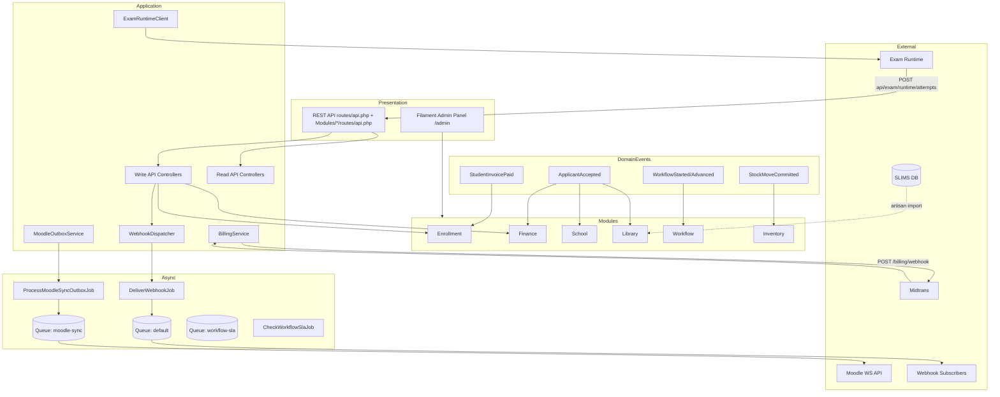
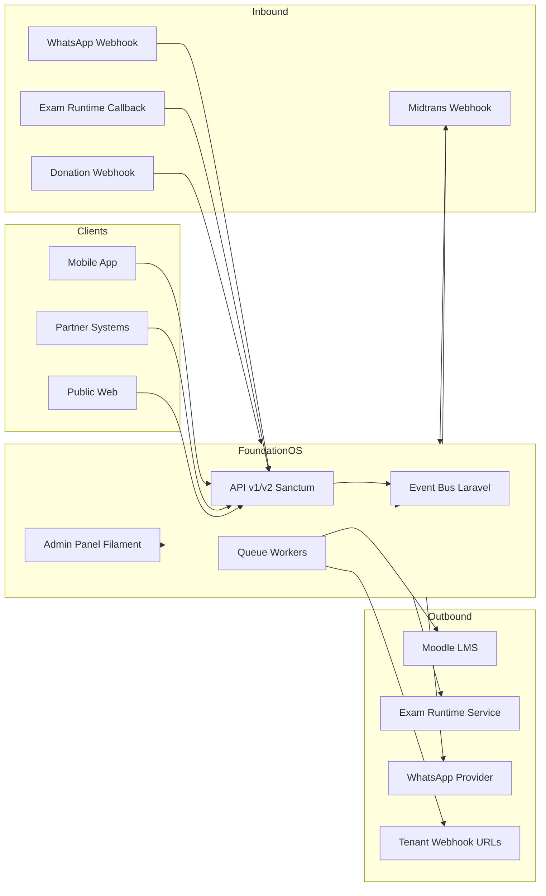

# 14 — API dan Integrasi

**Sumber bukti:** analisis statis kode + `docs/catalogs/api-routes-catalog.json` (101 rute, dihasilkan `scripts/extract-api-routes.php`, 2026-06-19). `php artisan route:list --path=api` tidak diandalkan karena gagal di lingkungan audit ini.

---

## 1. Ringkasan arsitektur integrasi

FoundationOS mengekspos **REST API** Laravel (`routes/api.php` + `Modules/*/routes/api.php`) dengan autentikasi **Laravel Sanctum** (Bearer token). Panel admin Filament (`/admin`) adalah UI utama; API publik ditujukan untuk mobile/integrasi pihak ketiga.

| Kanal | Status | Bukti |
|-------|--------|-------|
| REST API | **FAKTA** — 101 rute `api/*` | `docs/catalogs/api-routes-catalog.json` |
| GraphQL | **TIDAK TERDETEKSI DI KODE** | Tidak ada paket GraphQL/Lighthouse di `composer.json`; grep `GraphQL` hanya di dokumen roadmap |
| WebSocket / Broadcasting | **TIDAK TERDETEKSI DI KODE** | Tidak ada `config/broadcasting.php`, Reverb, Pusher, atau Laravel Echo di dependensi |
| Queue (async) | **FAKTA** — 3 job kelas + outbox Moodle | `app/Jobs/`, `Modules/Workflow/app/Jobs/`, `config/queue.php` |
| Domain events | **FAKTA** — 20 kelas event + pemetaan listener | `Modules/*/app/Events/`, `EventServiceProvider`, `app/Providers/AppServiceProvider.php` |
| Third-party HTTP | **FAKTA** — Moodle, Midtrans, Exam Runtime, WhatsApp webhook, SLIMS import | Lihat §7 |

**Pola respons API inti:** envelope `{ "data": ... }` dengan error `{ "error": { "code", "message", "details?" } }` — `app/Http/Controllers/Api/v1/ApiController.php`.

**Otorisasi API:** middleware `auth:sanctum` + (opsional) `resolve.api.tenant`. **TIDAK TERDETEKSI DI KODE:** middleware Spatie `permission`/`role` pada rute API; kebijakan Filament Shield tidak dipanggil dari controller API yang diaudit.

---

## 2. Inventaris REST API (ringkas per modul)

| Modul (katalog) | Jumlah rute | Prefix utama | Implementasi |
|-----------------|------------:|--------------|--------------|
| Api | 43 | `api/v1`, `api/v2`, `api/openapi.json` | **FAKTA** — controller JSON di `app/Http/Controllers/Api/` |
| Campus | 5 | `api/v1/campuses` | **SCAFFOLD** — controller Blade stub |
| Core | 5 | `api/v1/cores` | **SCAFFOLD** |
| Employee | 4 | `api/v1/employees` (modul) | **SCAFFOLD** (+ 2 rute JSON di Api) |
| Finance | 5 | `api/v1/finances` | **SCAFFOLD** |
| Global | 5 | `api/v1/globals` | **SCAFFOLD** |
| Inventory | 5 | `api/v1/inventories` | **SCAFFOLD** |
| Library | 5 | `api/v1/libraries` | **SCAFFOLD** |
| Monitoring | 5 | `api/v1/monitorings` | **SCAFFOLD** |
| Procurement | 5 | `api/v1/procurements` | **SCAFFOLD** |
| Sales | 5 | `api/v1/sales` | **SCAFFOLD** |
| School | 5 | `api/v1/schools` | **SCAFFOLD** |
| Enrollment | 1 | `api/inquiry` | **FAKTA** |
| Exam | 1 | `api/exam/runtime/attempts` | **FAKTA** |
| EOffice | 1 | `api/letters/verify/{token}` | **FAKTA** |
| Messaging | 1 | `api/webhooks/whatsapp/{provider}` | **FAKTA** (stub verifikasi) |

**Middleware global API** (alias di `bootstrap/app.php`): `resolve.api.tenant`, `idempotency`, `api.version.meta`, `throttle:api`.

---

## 3. Detail endpoint — API inti (terimplementasi JSON)

Kolom **Permission** = mekanisme akses yang terdeteksi di kode (bukan nama permission Shield).

### 3.1 Publik (tanpa `auth:sanctum`)

| Method | Path | Request | Response | Validation | Permission |
|--------|------|---------|----------|------------|------------|
| GET | `api/openapi.json` | — | OpenAPI 3.1 JSON | — | Publik |
| GET | `api/v2/openapi.json` | — | OpenAPI 3.1 JSON v2 | — | Publik |
| GET | `api/v2` | — | `{ data: { version, status, policy, documentation } }` | — | Publik |
| GET | `api/letters/verify/{token}` | Path: `token` | `{ valid, letter_number?, name?, status? }` atau 404 | — | Publik |
| POST | `api/inquiry` | JSON: `tenant_code`, `full_name`, `email?`, `phone?`, `source_detail?`, `utm_*?` | 201 `{ lead_id, message }` | `$request->validate(...)` — `Modules/Enrollment/app/Http/Controllers/InquiryController.php` | Publik + `throttle:10,1` |
| POST | `api/webhooks/whatsapp/{provider}` | Body mentah + header `X-Hub-Signature-256` jika secret dikonfigurasi | `{ received, provider, verified }` | HMAC opsional — `Modules/Messaging/app/Http/Controllers/WhatsAppWebhookController.php` | Publik (verifikasi signature opsional) |

### 3.2 Autentikasi & tenant (`auth:sanctum` + `resolve.api.tenant` + `throttle:api`)

| Method | Path | Request | Response | Validation | Permission |
|--------|------|---------|----------|------------|------------|
| GET | `api/v1/me` | Header: `Authorization: Bearer {token}` | `{ data: UserResource }` | — | Sanctum; token harus punya `tenant_id` jika `tenancy.api_require_tenant=true` |
| GET | `api/v1/tenants/current` | Bearer token | `{ data: TenantResource }` atau 404 `no_tenant` | — | Sanctum + tenant pada token |
| GET | `api/v1/organizations` | Query: `filter[*]`, `per_page`, `cursor` | Cursor pagination + `OrganizationResource` | Filter di controller | Sanctum + tenant scope |
| GET | `api/v1/organizations/{id}` | Path: `id` | `{ data: OrganizationResource }` | — | Sanctum + tenant scope |
| GET | `api/v1/students` | Query: `filter`, `include`, `per_page` | Cursor pagination + `StudentResource` | Filter: `nis`, `nisn`, `status`, dll. | Sanctum + tenant scope |
| GET | `api/v1/students/{id}` | Path: `id`; `include` opsional | `{ data: StudentResource }` | — | Sanctum + tenant scope |
| GET | `api/v1/students/{id}/dashboard` | Path: `id` | `{ data: { student, attendance, grades, fees, generated_at } }` | — | Sanctum; **TIDAK TERDETEKSI** policy ownership siswa |
| GET | `api/v1/college-students` | Query: `filter`, `include` | Cursor pagination + `CollegeStudentResource` | Filter di controller | Sanctum + tenant scope |
| GET | `api/v1/college-students/{id}` | Path: `id` | `{ data: CollegeStudentResource }` | — | Sanctum + tenant scope |
| GET | `api/v1/classes` | Query: `filter`, `include` | Cursor pagination + `SchoolClassResource` | Filter di controller | Sanctum + tenant scope |
| GET | `api/v1/classes/{id}` | Path: `id` | `{ data: SchoolClassResource }` | — | Sanctum + tenant scope |
| GET | `api/v1/courses` | Query: `filter`, `include` | Cursor pagination + `CourseResource` | Filter di controller | Sanctum + tenant scope |
| GET | `api/v1/courses/{id}` | Path: `id` | `{ data: CourseResource }` | — | Sanctum + tenant scope |
| GET | `api/v1/employees` | Query: `filter`, `include` | Cursor pagination + `EmployeeResource` | Filter di controller | Sanctum + tenant scope |
| GET | `api/v1/employees/{id}` | Path: `id` | `{ data: EmployeeResource }` | — | Sanctum + tenant scope |

**Bukti controller:** `app/Http/Controllers/Api/v1/*Controller.php`, resources di `app/Http/Resources/Api/v1/`.

### 3.3 Write API (`idempotency` + header `Idempotency-Key` opsional)

| Method | Path | Request (body JSON) | Response | Validation | Permission |
|--------|------|---------------------|----------|------------|------------|
| POST | `api/v1/applicants` | `admission_period_id`, `registration_number`, `full_name`, … | 201 `{ data: { id, registration_number, … } }` | `Validator` inline — `ApplicantController.php` | Sanctum + tenant; webhook outbound `enrollment.created` |
| POST | `api/v1/payments` | `student_invoice_id`, `chart_of_account_id`, `payment_number`, `amount`, … | 201 `{ data: { id, payment_number, … } }` | `Validator` inline — `PaymentController.php` | Sanctum + tenant |
| POST | `api/v1/leave-requests` | `employee_id`, `leave_type`, `start_date`, `end_date`, `total_days`, `reason`, … | 201 `{ data: { id, status: draft, … } }` | `Validator` inline — `LeaveRequestController.php` | Sanctum + tenant |
| POST | `api/v1/devices` | `token`, `platform` (`android\|ios\|web`) | 201 `{ data: { id, platform, is_active } }` | `Validator` inline — `DeviceController.php` | Sanctum; scope ke `user_id` token |
| DELETE | `api/v1/devices/{token}` | Path: `token` | 204 | — | Sanctum; hanya device milik user |

**Idempotency:** `app/Http/Middleware/IdempotencyKey.php` — cache 24 jam; konflik body → 409 `idempotency_conflict`.

### 3.4 Webhook inbound (autentikasi khusus)

| Method | Path | Request | Response | Validation | Permission |
|--------|------|---------|----------|------------|------------|
| POST | `api/exam/runtime/attempts` | `exam_definition_id` (uuid), `exam_participant_id` (uuid), `score?`, `result_json?`, … | `{ data: { id, sync_status } }` | `$request->validate(...)` — `ExamRuntimeWebhookController.php` | `auth:sanctum` (bukan webhook signature terpisah) |

### 3.5 API v2

**FAKTA:** Semua endpoint §3.2–3.3 digandakan di prefix `api/v2/*` dengan middleware tambahan `api.version.meta:v2`. Controller sama (`app/Http/Controllers/Api/v1/*`) kecuali `GET api/v2` → `Api\v2\VersionController@show`. Spesifikasi OpenAPI v2: `GET api/v2/openapi.json`.

| Method | Path v2 (contoh) | Catatan |
|--------|------------------|---------|
| GET | `api/v2/me` | Identik v1 + header meta versi |
| POST | `api/v2/applicants` | Identik v1 + idempotency |
| … | (21 endpoint lain) | Lihat katalog baris `api/v2/*` |

### 3.6 Modul `apiResource` scaffold (55 rute)

**FAKTA — pola umum** (contoh Campus; modul lain identik):

| Method | Path | Request | Response | Validation | Permission |
|--------|------|---------|----------|------------|------------|
| GET | `api/v1/{resource}` | — | **HTML view** `index` (bukan JSON) | — | `auth:sanctum` saja |
| POST | `api/v1/{resource}` | — | **TIDAK TERDETEKSI** (method kosong) | **TIDAK TERDETEKSI** | `auth:sanctum` |
| GET | `api/v1/{resource}/{id}` | — | **HTML view** `show` | — | `auth:sanctum` |
| PUT/PATCH | `api/v1/{resource}/{id}` | — | **TIDAK TERDETEKSI** (method kosong) | **TIDAK TERDETEKSI** | `auth:sanctum` |
| DELETE | `api/v1/{resource}/{id}` | — | **TIDAK TERDETEKSI** (method kosong) | — | `auth:sanctum` |

**Sumber scaffold:** `Modules/{Campus,Core,Employee,Finance,Global,Inventory,Library,Monitoring,Procurement,Sales,School}/routes/api.php` → controller `Modules\{Mod}\Http\Controllers\{Mod}Controller.php` (contoh: `Modules/Campus/app/Http/Controllers/CampusController.php`).

**Konflik rute terdeteksi:** `employees` didaftarkan dua kali — modul (`{employee}`) dan Api inti (`{id}`). Keduanya ada di katalog.

---

## 4. Tabel master — 101 endpoint (katalog)

| # | Method | Path | Modul | Controller@action | Middleware |
|---|--------|------|-------|-------------------|------------|
| 1 | POST | `api/exam/runtime/attempts` | Exam | `ExamRuntimeWebhookController@storeAttempt` | api, auth:sanctum |
| 2 | POST | `api/inquiry` | Enrollment | `InquiryController@store` | api, throttle:10,1 |
| 3 | GET | `api/letters/verify/{token}` | EOffice | `LetterVerificationController@show` | api |
| 4 | GET | `api/openapi.json` | Api | `OpenApiController@v1` | api |
| 5 | POST | `api/v1/applicants` | Api | `ApplicantController@store` | api, throttle:api, auth:sanctum, resolve.api.tenant, idempotency |
| 6 | DELETE | `api/v1/campuses/{campus}` | Campus | `CampusController@destroy` | api, auth:sanctum |
| 7 | GET | `api/v1/campuses/{campus}` | Campus | `CampusController@show` | api, auth:sanctum |
| 8 | PUT/PATCH | `api/v1/campuses/{campus}` | Campus | `CampusController@update` | api, auth:sanctum |
| 9 | GET | `api/v1/campuses` | Campus | `CampusController@index` | api, auth:sanctum |
| 10 | POST | `api/v1/campuses` | Campus | `CampusController@store` | api, auth:sanctum |
| 11 | GET | `api/v1/classes/{id}` | Api | `SchoolClassController@show` | api, throttle:api, auth:sanctum, resolve.api.tenant |
| 12 | GET | `api/v1/classes` | Api | `SchoolClassController@index` | api, throttle:api, auth:sanctum, resolve.api.tenant |
| 13 | GET | `api/v1/college-students/{id}` | Api | `CollegeStudentController@show` | api, throttle:api, auth:sanctum, resolve.api.tenant |
| 14 | GET | `api/v1/college-students` | Api | `CollegeStudentController@index` | api, throttle:api, auth:sanctum, resolve.api.tenant |
| 15 | DELETE | `api/v1/cores/{core}` | Core | `CoreController@destroy` | api, auth:sanctum |
| 16 | GET | `api/v1/cores/{core}` | Core | `CoreController@show` | api, auth:sanctum |
| 17 | PUT/PATCH | `api/v1/cores/{core}` | Core | `CoreController@update` | api, auth:sanctum |
| 18 | GET | `api/v1/cores` | Core | `CoreController@index` | api, auth:sanctum |
| 19 | POST | `api/v1/cores` | Core | `CoreController@store` | api, auth:sanctum |
| 20 | GET | `api/v1/courses/{id}` | Api | `CourseController@show` | api, throttle:api, auth:sanctum, resolve.api.tenant |
| 21 | GET | `api/v1/courses` | Api | `CourseController@index` | api, throttle:api, auth:sanctum, resolve.api.tenant |
| 22 | DELETE | `api/v1/devices/{token}` | Api | `DeviceController@destroy` | api, throttle:api, auth:sanctum, resolve.api.tenant |
| 23 | POST | `api/v1/devices` | Api | `DeviceController@store` | api, throttle:api, auth:sanctum, resolve.api.tenant |
| 24 | DELETE | `api/v1/employees/{employee}` | Employee | `EmployeeController@destroy` | api, auth:sanctum |
| 25 | GET | `api/v1/employees/{employee}` | Employee | `EmployeeController@show` | api, auth:sanctum |
| 26 | PUT/PATCH | `api/v1/employees/{employee}` | Employee | `EmployeeController@update` | api, auth:sanctum |
| 27 | GET | `api/v1/employees/{id}` | Api | `EmployeeController@show` | api, throttle:api, auth:sanctum, resolve.api.tenant |
| 28 | GET | `api/v1/employees` | Api | `EmployeeController@index` | api, throttle:api, auth:sanctum, resolve.api.tenant |
| 29 | POST | `api/v1/employees` | Employee | `EmployeeController@store` | api, auth:sanctum |
| 30 | DELETE | `api/v1/finances/{finance}` | Finance | `FinanceController@destroy` | api, auth:sanctum |
| 31 | GET | `api/v1/finances/{finance}` | Finance | `FinanceController@show` | api, auth:sanctum |
| 32 | PUT/PATCH | `api/v1/finances/{finance}` | Finance | `FinanceController@update` | api, auth:sanctum |
| 33 | GET | `api/v1/finances` | Finance | `FinanceController@index` | api, auth:sanctum |
| 34 | POST | `api/v1/finances` | Finance | `FinanceController@store` | api, auth:sanctum |
| 35 | DELETE | `api/v1/globals/{global}` | Global | `GlobalController@destroy` | api, auth:sanctum |
| 36 | GET | `api/v1/globals/{global}` | Global | `GlobalController@show` | api, auth:sanctum |
| 37 | PUT/PATCH | `api/v1/globals/{global}` | Global | `GlobalController@update` | api, auth:sanctum |
| 38 | GET | `api/v1/globals` | Global | `GlobalController@index` | api, auth:sanctum |
| 39 | POST | `api/v1/globals` | Global | `GlobalController@store` | api, auth:sanctum |
| 40 | DELETE | `api/v1/inventories/{inventory}` | Inventory | `InventoryController@destroy` | api, auth:sanctum |
| 41 | GET | `api/v1/inventories/{inventory}` | Inventory | `InventoryController@show` | api, auth:sanctum |
| 42 | PUT/PATCH | `api/v1/inventories/{inventory}` | Inventory | `InventoryController@update` | api, auth:sanctum |
| 43 | GET | `api/v1/inventories` | Inventory | `InventoryController@index` | api, auth:sanctum |
| 44 | POST | `api/v1/inventories` | Inventory | `InventoryController@store` | api, auth:sanctum |
| 45 | POST | `api/v1/leave-requests` | Api | `LeaveRequestController@store` | api, throttle:api, auth:sanctum, resolve.api.tenant, idempotency |
| 46 | DELETE | `api/v1/libraries/{library}` | Library | `LibraryController@destroy` | api, auth:sanctum |
| 47 | GET | `api/v1/libraries/{library}` | Library | `LibraryController@show` | api, auth:sanctum |
| 48 | PUT/PATCH | `api/v1/libraries/{library}` | Library | `LibraryController@update` | api, auth:sanctum |
| 49 | GET | `api/v1/libraries` | Library | `LibraryController@index` | api, auth:sanctum |
| 50 | POST | `api/v1/libraries` | Library | `LibraryController@store` | api, auth:sanctum |
| 51 | GET | `api/v1/me` | Api | `AuthController@me` | api, throttle:api, auth:sanctum, resolve.api.tenant |
| 52 | DELETE | `api/v1/monitorings/{monitoring}` | Monitoring | `MonitoringController@destroy` | api, auth:sanctum |
| 53 | GET | `api/v1/monitorings/{monitoring}` | Monitoring | `MonitoringController@show` | api, auth:sanctum |
| 54 | PUT/PATCH | `api/v1/monitorings/{monitoring}` | Monitoring | `MonitoringController@update` | api, auth:sanctum |
| 55 | GET | `api/v1/monitorings` | Monitoring | `MonitoringController@index` | api, auth:sanctum |
| 56 | POST | `api/v1/monitorings` | Monitoring | `MonitoringController@store` | api, auth:sanctum |
| 57 | GET | `api/v1/organizations/{id}` | Api | `OrganizationController@show` | api, throttle:api, auth:sanctum, resolve.api.tenant |
| 58 | GET | `api/v1/organizations` | Api | `OrganizationController@index` | api, throttle:api, auth:sanctum, resolve.api.tenant |
| 59 | POST | `api/v1/payments` | Api | `PaymentController@store` | api, throttle:api, auth:sanctum, resolve.api.tenant, idempotency |
| 60 | DELETE | `api/v1/procurements/{procurement}` | Procurement | `ProcurementController@destroy` | api, auth:sanctum |
| 61 | GET | `api/v1/procurements/{procurement}` | Procurement | `ProcurementController@show` | api, auth:sanctum |
| 62 | PUT/PATCH | `api/v1/procurements/{procurement}` | Procurement | `ProcurementController@update` | api, auth:sanctum |
| 63 | GET | `api/v1/procurements` | Procurement | `ProcurementController@index` | api, auth:sanctum |
| 64 | POST | `api/v1/procurements` | Procurement | `ProcurementController@store` | api, auth:sanctum |
| 65 | DELETE | `api/v1/sales/{sale}` | Sales | `SalesController@destroy` | api, auth:sanctum |
| 66 | GET | `api/v1/sales/{sale}` | Sales | `SalesController@show` | api, auth:sanctum |
| 67 | PUT/PATCH | `api/v1/sales/{sale}` | Sales | `SalesController@update` | api, auth:sanctum |
| 68 | GET | `api/v1/sales` | Sales | `SalesController@index` | api, auth:sanctum |
| 69 | POST | `api/v1/sales` | Sales | `SalesController@store` | api, auth:sanctum |
| 70 | DELETE | `api/v1/schools/{school}` | School | `SchoolController@destroy` | api, auth:sanctum |
| 71 | GET | `api/v1/schools/{school}` | School | `SchoolController@show` | api, auth:sanctum |
| 72 | PUT/PATCH | `api/v1/schools/{school}` | School | `SchoolController@update` | api, auth:sanctum |
| 73 | GET | `api/v1/schools` | School | `SchoolController@index` | api, auth:sanctum |
| 74 | POST | `api/v1/schools` | School | `SchoolController@store` | api, auth:sanctum |
| 75 | GET | `api/v1/students/{id}/dashboard` | Api | `StudentDashboardController@show` | api, throttle:api, auth:sanctum, resolve.api.tenant |
| 76 | GET | `api/v1/students/{id}` | Api | `StudentController@show` | api, throttle:api, auth:sanctum, resolve.api.tenant |
| 77 | GET | `api/v1/students` | Api | `StudentController@index` | api, throttle:api, auth:sanctum, resolve.api.tenant |
| 78 | GET | `api/v1/tenants/current` | Api | `AuthController@currentTenant` | api, throttle:api, auth:sanctum, resolve.api.tenant |
| 79 | GET | `api/v2` | Api | `VersionController@show` | api, throttle:api, api.version.meta:v2 |
| 80 | GET | `api/v2/classes/{id}` | Api | `SchoolClassController@show` | api, throttle:api, api.version.meta:v2, auth:sanctum, resolve.api.tenant |
| 81 | GET | `api/v2/classes` | Api | `SchoolClassController@index` | api, throttle:api, api.version.meta:v2, auth:sanctum, resolve.api.tenant |
| 82 | GET | `api/v2/college-students/{id}` | Api | `CollegeStudentController@show` | api, throttle:api, api.version.meta:v2, auth:sanctum, resolve.api.tenant |
| 83 | GET | `api/v2/college-students` | Api | `CollegeStudentController@index` | api, throttle:api, api.version.meta:v2, auth:sanctum, resolve.api.tenant |
| 84 | GET | `api/v2/courses/{id}` | Api | `CourseController@show` | api, throttle:api, api.version.meta:v2, auth:sanctum, resolve.api.tenant |
| 85 | GET | `api/v2/courses` | Api | `CourseController@index` | api, throttle:api, api.version.meta:v2, auth:sanctum, resolve.api.tenant |
| 86 | DELETE | `api/v2/devices/{token}` | Api | `DeviceController@destroy` | api, throttle:api, api.version.meta:v2, auth:sanctum, resolve.api.tenant |
| 87 | GET | `api/v2/employees/{id}` | Api | `EmployeeController@show` | api, throttle:api, api.version.meta:v2, auth:sanctum, resolve.api.tenant |
| 88 | GET | `api/v2/employees` | Api | `EmployeeController@index` | api, throttle:api, api.version.meta:v2, auth:sanctum, resolve.api.tenant |
| 89 | GET | `api/v2/me` | Api | `AuthController@me` | api, throttle:api, api.version.meta:v2, auth:sanctum, resolve.api.tenant |
| 90 | GET | `api/v2/openapi.json` | Api | `OpenApiController@v2` | api |
| 91 | GET | `api/v2/organizations/{id}` | Api | `OrganizationController@show` | api, throttle:api, api.version.meta:v2, auth:sanctum, resolve.api.tenant |
| 92 | GET | `api/v2/organizations` | Api | `OrganizationController@index` | api, throttle:api, api.version.meta:v2, auth:sanctum, resolve.api.tenant |
| 93 | GET | `api/v2/students/{id}/dashboard` | Api | `StudentDashboardController@show` | api, throttle:api, api.version.meta:v2, auth:sanctum, resolve.api.tenant |
| 94 | GET | `api/v2/students/{id}` | Api | `StudentController@show` | api, throttle:api, api.version.meta:v2, auth:sanctum, resolve.api.tenant |
| 95 | GET | `api/v2/students` | Api | `StudentController@index` | api, throttle:api, api.version.meta:v2, auth:sanctum, resolve.api.tenant |
| 96 | GET | `api/v2/tenants/current` | Api | `AuthController@currentTenant` | api, throttle:api, api.version.meta:v2, auth:sanctum, resolve.api.tenant |
| 97 | POST | `api/v2/applicants` | Api | `ApplicantController@store` | api, throttle:api, api.version.meta:v2, auth:sanctum, resolve.api.tenant, idempotency |
| 98 | POST | `api/v2/devices` | Api | `DeviceController@store` | api, throttle:api, api.version.meta:v2, auth:sanctum, resolve.api.tenant |
| 99 | POST | `api/v2/leave-requests` | Api | `LeaveRequestController@store` | api, throttle:api, api.version.meta:v2, auth:sanctum, resolve.api.tenant, idempotency |
| 100 | POST | `api/v2/payments` | Api | `PaymentController@store` | api, throttle:api, api.version.meta:v2, auth:sanctum, resolve.api.tenant, idempotency |
| 101 | POST | `api/webhooks/whatsapp/{provider}` | Messaging | `WhatsAppWebhookController@handle` | api |

### Webhook di luar prefix `api/` (terkait integrasi)

| Method | Path | Controller | Bukti |
|--------|------|------------|-------|
| POST | `/billing/webhook` | `BillingController@webhook` | `routes/web.php`, CSRF except `bootstrap/app.php` |
| POST | `/donation/webhook` | `DonationWebhookController@handle` | `Modules/Donation/routes/web.php` |

---

## 5. GraphQL

| Aspek | Status |
|-------|--------|
| Server GraphQL (Lighthouse, rebing/graphql-laravel, dll.) | **TIDAK TERDETEKSI DI KODE** |
| Skema `.graphql` | **TIDAK TERDETEKSI DI KODE** |
| Endpoint `/graphql` | **TIDAK TERDETEKSI DI KODE** |

---

## 6. WebSocket / real-time

| Aspek | Status |
|-------|--------|
| Laravel Reverb / Pusher / Ably | **TIDAK TERDETEKSI DI KODE** — tidak ada di `composer.json` |
| `config/broadcasting.php` | **TIDAK TERDETEKSI DI KODE** |
| Laravel Echo (frontend) | **TIDAK TERDETEKSI DI KODE** |
| Channel authorization routes | **TIDAK TERDETEKSI DI KODE** |

---

## 7. Queue & Jobs

### 7.1 Konfigurasi

| Item | Nilai | Bukti |
|------|-------|-------|
| Driver default | `database` (`QUEUE_CONNECTION`) | `config/queue.php` |
| Tabel jobs | `jobs` | `config/queue.php` |
| Failed jobs | `failed_jobs` (driver `database-uuids`) | `config/queue.php` |

### 7.2 Katalog job

| Job | Queue | Handler / tujuan | Dispatch dari |
|-----|-------|-------------------|---------------|
| `ProcessMoodleSyncOutboxJob` | `moodle-sync` (env `MOODLE_SYNC_QUEUE`) | `MoodleSyncService::syncOutboxItem()` | `MoodleOutboxService`, `MoodleDrainOutboxCommand` |
| `CheckWorkflowSlaJob` | `workflow-sla` (env `WORKFLOW_SLA_QUEUE`) | `WorkflowSlaService::markBreached()` | `ScheduleWorkflowSlaCheck` listener |
| `DeliverWebhookJob` | `default` | HTTP POST ke URL subscriber | `WebhookDispatcher` |

**Catatan:** `config/workflow.php` mendefinisikan queue `workflow` untuk otomasi workflow, tetapi **TIDAK TERDETEKSI DI KODE** job kelas yang memanggil `onQueue(config('workflow.queue'))` — hanya `workflow-sla` terbukti.

### 7.3 Outbox pattern (Moodle)

```
Model observer → MoodleOutboxService::enqueue() → moodle_sync_outbox → ProcessMoodleSyncOutboxJob → MoodleClient::call()
```

**Bukti:** `app/Integrations/Moodle/MoodleOutboxService.php`, `app/Jobs/ProcessMoodleSyncOutboxJob.php`, `config/moodle.php`.

---

## 8. Katalog event (domain)

### 8.1 Pemetaan terdaftar di `EventServiceProvider`

| Event | Listener(s) | Modul |
|-------|-------------|-------|
| `WorkflowStarted` | CreateAssignmentsForCurrentStep, ScheduleWorkflowSlaCheck, RunWorkflowAutomatedActions, RecordWorkflowMonitoringAudit, SyncWorkflowSubjectState, SyncBudgetWorkflowState | Workflow |
| `WorkflowAdvanced` | (sama seperti Started) + dipakai Inventory | Workflow, Inventory |
| `WorkflowCancelled` | RunWorkflowAutomatedActions, RecordWorkflowMonitoringAudit, SyncWorkflowSubjectState, SyncBudgetWorkflowState | Workflow |
| `WorkflowReturned` | (sama seperti Started) | Workflow |
| `WorkflowAssignmentCreated` | NotifyWorkflowAssignees | Workflow |
| `WorkflowSlaBreached` | RunWorkflowAutomatedActions, RecordWorkflowMonitoringAudit | Workflow |
| `ApplicantAccepted` | CreateInitialInvoiceFromAcceptedApplicant | Finance |
| `ApplicantAccepted` | CreateStudentFromAcceptedApplicant | School |
| `ApplicantAccepted` | CreateLibraryMemberFromAcceptedApplicant | Library |
| `ApplicantAcceptanceReverted` | CompensateApplicantAcceptance | Enrollment |
| `StudentInvoicePaid` | UpdateRegistrationOnInvoicePaid | Enrollment |
| `PurchaseRequisitionApproved` | CreateRfqFromApprovedPurchaseRequisition | Procurement |
| `GoodsReceiptConfirmed` | CreateStockMovesFromGoodsReceipt | Inventory |
| `StockMoveCommitted` | PostStockMoveJournal | Inventory |
| `ContractExpiringSoon` | SendContractExpiringNotification | Legal |
| `TicketCreated` | AssignTicketToAgent | Helpdesk |
| `Failed` (auth) | LogSecurityAuthEvents | Monitoring |
| `Lockout` | LogSecurityAuthEvents | Monitoring |
| `Login` | LogSecurityAuthEvents | Monitoring |

### 8.2 Event terdaftar di `AppServiceProvider`

| Event | Listener | Bukti |
|-------|----------|-------|
| `TenantSwitched` | `LogTenantSwitchAudit` | `app/Providers/AppServiceProvider.php` |

### 8.3 Event dipanggil tanpa listener eksplisit di provider (discovery / belum terpetakan)

| Event | Dipanggil dari | Listener terdaftar |
|-------|----------------|-------------------|
| `ExamResultPublished` | `ExamGradebookEventDispatcher` | **TIDAK TERDETEKSI** di `$listen` |
| `ExamResultSynced` | `ExamGradebookEventDispatcher` | **TIDAK TERDETEKSI** |
| `ExamResultGraded` | `ExamGradebookEventDispatcher` | **TIDAK TERDETEKSI** |
| `ItIncidentReceived` | `ItMonitoringWebhookReceiver` | **TIDAK TERDETEKSI** |
| `SalesOrderConfirmed` | **TIDAK TERDETEKSI** pemanggil produksi | Sales ESP kosong |
| `GoodsReceiptConfirmed` | **TIDAK TERDETEKSI** pemanggil produksi | Hanya listener |

---

## 9. Integrasi pihak ketiga

### 9.1 Moodle (outbound REST)

| Aspek | Detail | Bukti |
|-------|--------|-------|
| Arah | FOS → Moodle | `app/Integrations/Moodle/MoodleClient.php` |
| Protokol | Moodle Web Services REST `server.php` | `MoodleClient::call()` |
| Konfigurasi | `MOODLE_BASE_URL`, `MOODLE_WS_TOKEN`, `MOODLE_SYNC_ENABLED` | `config/moodle.php` |
| Pola | Outbox `moodle_sync_outbox` + job | `MoodleOutboxService.php` |
| Inbound webhook Moodle | **TIDAK TERDETEKSI DI KODE** | — |

### 9.2 Midtrans (billing SaaS)

| Aspek | Detail | Bukti |
|-------|--------|-------|
| Outbound | Snap token via `Midtrans\Snap` | `app/Services/BillingService.php` |
| Inbound | `POST /billing/webhook` | `routes/web.php` |
| Verifikasi | SHA512 signature | `app/Services/Billing/MidtransWebhookVerifier.php` |
| Paket | `midtrans/midtrans-php` | `composer.json` |

### 9.3 Exam Runtime (eksternal)

| Aspek | Detail | Bukti |
|-------|--------|-------|
| Outbound | HTTP ke `exam.runtime.base_url` | `Modules/Exam/app/Services/ExamRuntimeClient.php` |
| Inbound | `POST api/exam/runtime/attempts` | `ExamRuntimeWebhookController.php` |
| Konfigurasi | `Modules/Exam/config/exam.php` (runtime section) | — |

### 9.4 WhatsApp

| Aspek | Detail | Bukti |
|-------|--------|-------|
| Outbound | `NotificationDispatcher::sendWhatsApp()` | `Modules/Messaging/app/Services/NotificationDispatcher.php` |
| Provider | Interface `WhatsAppProvider`; default `LogWhatsAppProvider` | `MessagingServiceProvider.php` |
| Inbound webhook | `POST api/webhooks/whatsapp/{provider}` | `WhatsAppWebhookController.php` |

### 9.5 SLIMS (perpustakaan)

| Aspek | Detail | Bukti |
|-------|--------|-------|
| Arah | SLIMS DB → FOS (import) | `app/Console/Commands/LibraryImportSlimsCommand.php` |
| Protokol | Koneksi DB langsung (`slims_db_*` settings) | `LIBRARY.md`, `SlimsImportService` |
| REST API SLIMS | **TIDAK TERDETEKSI DI KODE** | — |

### 9.6 Webhook outbound (subscriber tenant)

| Aspek | Detail | Bukti |
|-------|--------|-------|
| Dispatcher | `WebhookDispatcher::dispatch($tenantId, $event, $payload)` | `app/Services/WebhookDispatcher.php` |
| Delivery | `DeliverWebhookJob` + HMAC `X-Hub-Signature-256` | `app/Jobs/DeliverWebhookJob.php` |
| Model | `WebhookSubscription`, `WebhookDelivery` | `Modules/Monitoring/Models/` |

### 9.7 Feeder DIKTI

| Aspek | Status |
|-------|--------|
| Model `FeederLog`, relasi tenant | **FAKTA** — `Modules/Core/app/Models/Tenant.php` |
| Client HTTP / protokol feeder | **TIDAK TERDETEKSI DI KODE** |

---

## 10. Dependency map (Mermaid)



---

## 11. Diagram integrasi sistem



---

## 12. TIDAK TERDETEKSI DI KODE

| Item | Catatan |
|------|---------|
| GraphQL endpoint / schema | Tidak ada dependensi atau rute |
| WebSocket / Laravel Echo / Reverb | Tidak ada konfigurasi broadcasting |
| Policy/permission per-endpoint API | Hanya Sanctum + tenant resolution |
| FormRequest khusus API | Validasi inline `Validator` / `$request->validate()` |
| Implementasi JSON untuk 55 rute modul `apiResource` | Controller scaffold mengembalikan view HTML |
| Inbound webhook dari Moodle | Hanya sync outbound |
| Protokol API Feeder DIKTI | Hanya model log |
| REST client SLIMS | Import via DB |
| Listener untuk `ExamResult*` events | Event dipublish, mapping listener tidak di ESP |
| Job pada queue `workflow` (non-SLA) | Config ada, pemakaian `onQueue` tidak ditemukan |
| OAuth2 / Passport untuk API | Sanctum bearer token saja |
| Rate limit global di luar `throttle:api` dan `throttle:10,1` inquiry | **TIDAK TERDETEKSI** |

---

## Bukti utama (indeks file)

| File | Relevansi |
|------|-----------|
| `docs/catalogs/api-routes-catalog.json` | Inventaris 101 rute |
| `routes/api.php` | API v1/v2 inti, rate limiter |
| `bootstrap/app.php` | Middleware alias, format error JSON API |
| `app/Http/Middleware/ResolveApiTenant.php` | Scoping tenant token |
| `app/Http/Middleware/IdempotencyKey.php` | Idempotency write API |
| `app/Http/Controllers/Api/v1/ApiController.php` | Envelope respons |
| `app/Integrations/Moodle/*` | Integrasi Moodle |
| `app/Services/BillingService.php` | Midtrans Snap + webhook |
| `app/Services/WebhookDispatcher.php` | Outbound webhook tenant |
| `config/queue.php`, `config/moodle.php`, `config/workflow.php` | Queue & integrasi |
| `Modules/*/routes/api.php` | Rute modul scaffold |
| `Modules/*/app/Providers/EventServiceProvider.php` | Peta event → listener |
