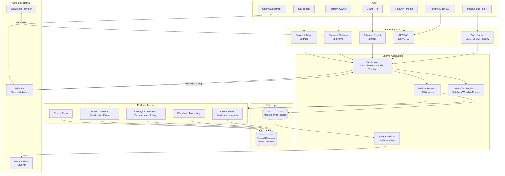

# 19 — Rangkuman untuk Pengembang

**Commit analisis:** `d3be06aa` · **Audience:** developer baru yang akan menyentuh kode FoundationOS  
Dokumen ini mensintesis [`01`](01_ringkasan_sistem.md)–[`18`](18_asumsi_dan_batasan.md). Bukan tutorial Laravel generik — baca [`CLAUDE.md`](../CLAUDE.md) dan [`AGENTS.md`](../AGENTS.md) untuk konvensi harian.

---

## Mulai Cepat

| Kebutuhan | Lokasi / perintah |
|-----------|-------------------|
| Setup lokal | `README.md` → `composer install`, `php artisan migrate`, `npm install` |
| Dev server (serve + queue + logs + vite) | `composer run dev` |
| Panel admin | `/admin` — `AdminPanelProvider.php` |
| Test minimal setelah pull | `php artisan test --compact` |
| Indeks dokumen RE | [`README.md`](README.md) |

---

## Cara Kerja Sistem

### FAKTA — Apa itu FoundationOS?

FoundationOS adalah **ERP modular SaaS untuk lembaga pendidikan** (K-12 dan perguruan tinggi). Satu deployable Laravel melayani banyak **tenant** (akun institusi) dengan **shared database** — isolasi via kolom `tenant_id`, bukan database terpisah per tenant.

### FAKTA — Alur request utama

```
HTTP Request
  → Middleware global (CSRF, session, locale)
  → [Panel Filament] Authenticate + MFA + SetUserLocale
  → [Admin] EnsureTenantSubscriptionActive (cek tenant locked → billing)
  → Filament Page / Livewire Resource ATAU Controller API
  → Module *Service (business rules)
  → Eloquent Model + TenantScope / BelongsToTenant
  → Database (MySQL/PostgreSQL/SQLite dev)
```

**Panel web (3 bukti di kode):**

| Panel | Path | Aktor |
|-------|------|-------|
| Admin | `/admin` | Staf tenant — CRUD 257 resource, workflow, billing |
| Platform | `/platform` | `platform_owner` — kelola tenant SaaS |
| Parent | `/parent` | Orang tua — nilai, absensi anak (read-scope) |

**API:** Prefix `api/v1` dan `api/v2` — Sanctum Bearer, middleware `resolve.api.tenant`, throttle 60/menit, idempotency pada POST tertentu (`routes/api.php`).

**Async:** Queue default `database`; job contoh `ProcessMoodleSyncOutboxJob` menguras outbox sync Moodle.

### INFERENSI

- Siswa/mahasiswa **tidak** punya panel Filament — konsumsi via **API dashboard** (`StudentDashboardController`). Portal siswa dedicated: **TIDAK TERDETEKSI DI KODE**.

---

## Arsitektur

### FAKTA — Pola

| Aspek | Keputusan |
|-------|-----------|
| Bentuk deploy | **Modular monolith** — 45 modul di `Modules/`, satu `composer.json` |
| Framework | Laravel 13 + Filament 5 + Livewire 4 |
| Layer | Presentation (Filament/Blade) → Service → Eloquent Model → DB |
| Tenancy | `tenant_id` + trait `BelongsToTenant` + `TenantScope`; Filament `->tenant(Tenant::class)` |
| Authorization | Spatie Permission **teams mode** (`team_foreign_key = tenant_id`) + Filament Shield |
| Membership domain | `user_tenant_roles` (siapa boleh akses tenant) **terpisah** dari Shield permission |
| Workflow | Metadata-driven V2 — `DatabaseWorkflowEngine`, JSONLogic rules, outbox SLA |
| Integrasi eksternal | Moodle (outbound), Midtrans (billing), WhatsApp webhook |

### TIDAK TERDETEKSI DI KODE

| Pola | Status |
|------|--------|
| Clean / Hexagonal / Onion architecture | Tidak diadopsi eksplisit |
| Repository layer | Persistensi langsung Eloquent |
| DTO classes | Helper array / Eloquent saja |
| Microservices | Satu proses PHP |
| Database VIEW | 0 di migrasi |

### File wajib dibaca pertama

| File | Mengapa |
|------|---------|
| `Modules/Core/app/Filament/Support/ModuleResource.php` | Base 257 Filament resources |
| `Modules/Core/app/Models/Concerns/BelongsToTenant.php` | Pola tenancy |
| `app/Providers/Filament/AdminPanelProvider.php` | Panel, MFA, Shield, middleware |
| `Modules/Workflow/app/Services/DatabaseWorkflowEngine.php` | Mesin approval |
| `Modules/Finance/app/Services/FinanceControlService.php` | Contoh business rules ketat |
| `routes/api.php` | Kontrak API mobile |
| `app/Scopes/TenantScope.php` | Global scope data |

---

## Modul Utama

### FAKTA — Tier struktural (dari `04_analisis_modul.md`)

| Tier | Modul | Peran |
|------|-------|-------|
| **Foundation** | Core | Tenant, User, Organization, `ModuleResource`, `FilamentUi`, academic year |
| **Hub domain** | School, Campus, Enrollment, Employee, Finance, Procurement, Library, Workflow | Proses bisnis inti pendidikan |
| **Cross-cut** | Global, Monitoring, Messaging | Referensi geo, audit, notifikasi |
| **Isolated / bridge** | Exam | CBT runtime via API webhook |
| **Leaf (24)** | Alumni, Boarding, Clinic, Cms, … | Domain spesialis; dependensi minimal ke Core |

### FAKTA — Entitas kunci per hub

| Modul | Model / layanan contoh |
|-------|------------------------|
| Core | `Tenant`, `User`, `Organization`, `TenantRole` |
| School | `Student`, `SchoolClass`, `Attendance`, `Assessment` |
| Campus | `Faculty`, `StudyProgram`, `Course`, `CollageStudent` |
| Enrollment | `Applicant`, `AdmissionPeriod`, `ApplicantPromotionService` |
| Employee | `Employee`, `LeaveRequest`, `SalarySlip` |
| Finance | `StudentInvoice`, `Payment`, `JournalEntry`, `FinanceControlService` |
| Procurement | `PurchaseRequisition`, `PurchaseOrder`, `ThreeWayMatchValidator` |
| Workflow | `Workflow`, `WorkflowInstance`, `WorkflowAssignment` |
| Library | `Book`, `Loan`, `Member`, OPAC publik |

### INFERENSI

Modul leaf banyak yang **dominan CRUD** — otomasi dan business rule dalam `Services/` tidak diaudit per modul (GAP-13). Aktivasi modul per tenant via `TenantModule` — tidak semua 45 modul aktif di setiap institusi.

---

## Dependency Utama

| Paket / sistem | Versi / peran | Bukti |
|----------------|---------------|-------|
| PHP | 8.4 | `composer.json` |
| Laravel | 13 | Framework inti |
| Filament | 5 | Admin UI |
| Livewire | 4 | Komponen reaktif Filament |
| coolsam/modules | 5 | Modular monolith |
| laravel/sanctum | 4 | API token |
| bezhanSalleh/filament-shield | — | RBAC panel |
| spatie/laravel-permission | — | Permission teams |
| spatie/laravel-activitylog | — | Audit atribut |
| midtrans/midtrans-php | — | Billing SaaS |
| JSONLogic (workflow) | — | Kondisi transisi workflow |
| Vite + Tailwind CSS | 8 / 4 | Frontend asset |
| Queue | `database` default | `config/queue.php` |
| Moodle REST | Outbound sync | `app/Integrations/Moodle/` |

**CI:** GitHub Actions (5 workflow) — `02_inventaris_teknologi.md`.

---

## Risiko Perubahan

Sumber: [`17_gap_analysis.md`](17_gap_analysis.md), [`15_business_rules.md`](15_business_rules.md), [`ROADMAP.md`](../ROADMAP.md).

| Area | Risiko jika diubah sembarangan | Mitigasi |
|------|-------------------------------|----------|
| **Tenancy** | Kebocoran data antar tenant | Selalu scope `tenant_id`; jangan bypass `TenantScope` tanpa alasan; test `TenantScopeIsolationTest` |
| **Shield / permission** | 403 massal atau over-permission | `shield:generate` setelah resource baru; assign role per tenant |
| **Workflow engine** | Instance stuck, SLA gagal, race parallel gateway | Transaction + row lock; jalankan `fos:workflow:health-check`; baca `WORKFLOW.md` |
| **Finance** | Jurnal tidak balance, invoice corrupt | `FinanceControlService` — jangan skip `postJournal` / `verifyPayment` |
| **Enrollment conversion** | Duplikat student dari applicant | `ApplicantPromotionService` + setting `auto_promote`; cek `converted_to_student_id` |
| **Procurement 3-way match** | Vendor bill tidak valid | `ThreeWayMatchValidator` — rantai qty/harga |
| **Moodle outbox** | Drift enrollment, sync gagal | Queue worker harus jalan; `moodle:reconcile`, `moodle:health-check` |
| **Billing Midtrans** | Tenant terkunci / tidak terbuka | `Tenant::isLocked()`, webhook signature |
| **Form validation 257 resource** | Regresi bisnis di UI | Sampling audit `*Form.php` (GAP-05) |
| **Module REST scaffold** | API modul tidak production-ready | Test integrasi per modul (GAP-06) |

---

## Area Kritis

Perubahan di area berikut memerlukan test feature + review tenancy/authorization:

1. **Authorization** — `User::canAccessPanel()`, policies Shield, `Gate::before` super admin, exam role `ExamAuthorizationService`.
2. **Workflow engine** — `advance()`, `return`, parallel gateway, `WorkflowResolver` (tenant+org specificity).
3. **Payment & invoice** — `verifyPayment()`, `recalculateInvoiceStatus()`, immutable issued invoice.
4. **Enrollment conversion** — event `ApplicantAccepted` → `ApplicantPromotionService::promote()`.
5. **Subscription billing** — `EnsureTenantSubscriptionActive`, `BillingService` webhook.
6. **API write + idempotency** — `IdempotencyKey` middleware pada POST applicants/payments.
7. **Parent portal scope** — `ScopesToParentChildren` — hanya data anak terhubung.

---

## Technical Debt yang Terdeteksi

### Dari Gap Analysis (`17`)

| ID | Item | Klasifikasi |
|----|------|-------------|
| GAP-01 | `entity-catalog.json` tidak di-git | Artefak hilang tanpa regenerasi |
| GAP-02 | `verified-fks.json` tidak di-git | Kardinalitas ERD tidak terverifikasi di CI |
| GAP-03 | Portal siswa dedicated | **TIDAK TERDETEKSI DI KODE** |
| GAP-04 | Engine payroll terpusat | **TIDAK TERDETEKSI DI KODE** |
| GAP-05 | 257 form validation rules | **TERINDIKASI** — belum diaudit penuh |
| GAP-06 | Module REST scaffold | **TERINDIKASI** — belum uji per modul |
| GAP-07 | Permission efektif per tenant DB | **KETIDAKPASTIAN** |
| GAP-08 | IaC / deploy | **TIDAK TERDETEKSI DI KODE** |
| GAP-12 | Exam gradebook E2E | **TERINDIKASI NAMUN BELUM TERBUKTI PENUH** |
| GAP-13 | 24 leaf modules kedalaman bisnis | CRUD terbukti; otomasi unknown |
| GAP-14 | WhatsApp provider produksi | Default `LogWhatsAppProvider` |

### Dari ROADMAP (epic belum / hardening)

| Epic | Status singkat | Implikasi developer |
|------|----------------|---------------------|
| Workflow V3 | Fase parallel gateway & designer **[x]** | Engine kompleks — hindari fork logic di modul consumer |
| Procurement automation | Pipeline PR→RFQ→PO→GR→VB **[x]** | Listener event workflow — idempotency penting |
| Moodle enrollment reconcile | Drift detection & auto-fix **[x]** | Default `outbound_only` — risiko tenancy |
| Tenancy hardening | Global scope & queue context **[x]** | Queue job wajib set tenant context |
| Public API | Versi & dokumentasi OpenAPI | `api/openapi.json` — kontrak mobile |

### TIDAK TERDETEKSI DI KODE (technical debt / gap produk)

| Item |
|------|
| Repository / DTO layer |
| Database VIEW |
| CHECK constraint SQL di migrasi |
| Webhook inbound dari Moodle |
| Formula penilaian K-12 global terpusat |
| Payroll calculation engine terpusat |
| Student Filament panel |
| IaC (Terraform, K8s manifests) |
| TypeScript frontend (tidak ada `tsconfig.json`) |

---

## Menambah Fitur Baru (checklist)

1. Resource di `Modules/{Name}/app/Filament/Resources/` — extend `ModuleResource`.
2. Split `Schemas/`, `Tables/` — jangan inline di resource class.
3. Label via `FilamentUi::field()` / `FilamentUi::text()` — bilingual `id`/`en`.
4. Importer di `app/Filament/Imports/` extending `BaseModelImporter`.
5. `php artisan shield:generate --all --panel=admin --option=permissions --no-interaction`
6. Feature test PHPUnit + `vendor/bin/pint --dirty --format agent`
7. `php artisan optimize:clear`

Detail: [`CLAUDE.md`](../CLAUDE.md) §Adding a New Module Resource.

---

## Perintah Berguna

```bash
# Workflow
php artisan fos:workflow:health-check --tenant=1
php artisan fos:workflow:retry-sla --tenant=1

# Moodle
php artisan moodle:health-check
php artisan moodle:reconcile

# Auth
php artisan shield:super-admin --user=1 --tenant=1 --panel=admin

# Kualitas
php artisan test --compact tests/Feature/CoreTenancyFoundationTest.php
vendor/bin/pint --dirty --format agent
composer run lint:translations
```

---

## Statistik Repo (FAKTA, commit `d3be06aa`)

| Metrik | Nilai |
|--------|------:|
| Modul `Modules/` | 45 |
| `extends ModuleResource` | 257 |
| Total Filament resource (termasuk alias) | 375 |
| Rute API `api/*` | 101 |
| Migrasi PHP | 244 |
| Tabel (dengan entity-catalog) | ~434 |
| Foreign key terverifikasi | ~5.473 |
| Feature tests PHP | 173+ |

---

## Diagram High-Level

Sintesis alur: User → Panels → Modules → DB → Eksternal.



---

## Langkah Setelah Membaca Dokumen Ini

1. Buka [`17_gap_analysis.md`](17_gap_analysis.md) — jangan asumsikan kelengkapan modul leaf atau form validation.
2. Baca [`18_asumsi_dan_batasan.md`](18_asumsi_dan_batasan.md) — pahami apa yang **tidak** diaudit.
3. Regenerasi `entity-catalog.json` jika perlu ERD/data dictionary penuh.
4. Jalankan test suite setelah setiap pull `main`.
5. Untuk domain spesifik: `WORKFLOW.md`, `FINANCE.md`, `PROCUREMENT.md`, `MOODLE.md`, `LIBRARY.md`.

---

## Pitfall Umum

| Masalah | Penyebab | Bukti |
|---------|----------|-------|
| 403 di panel | Shield permission belum di-assign | `config/filament-shield.php` |
| Data tenant lain terlihat | Bypass `TenantScope` / query tanpa tenant | `BelongsToTenant.php` |
| Resource tidak muncul di nav | Cache config/Filament | `php artisan optimize:clear` |
| CI gagal terjemahan | Label hardcoded Inggris/Indonesia | `composer run lint:translations` |
| Moodle tidak sync | Queue worker tidak jalan | `composer run dev` includes queue |
| Tenant terkunci | Subscription expired | `Tenant::isLocked()` → `BillingPage` |
