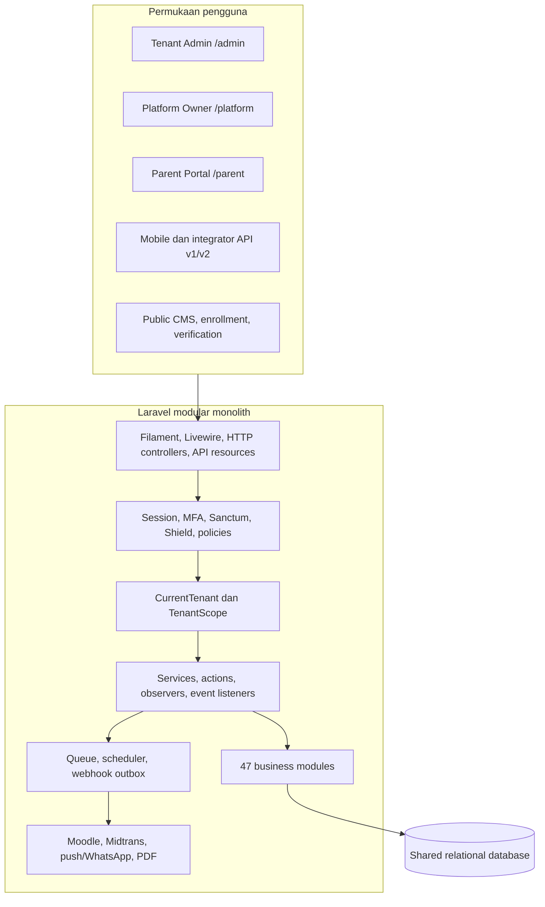
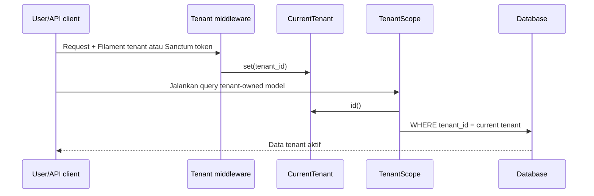
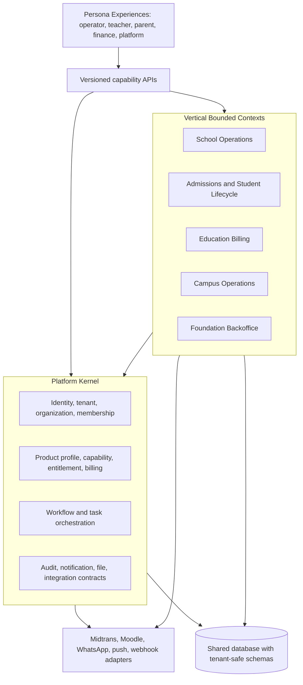

# foundationOS — Dokumentasi Teknis As-Is dan Blueprint Vertical SaaS

**Status:** baseline teknis dan rekomendasi restrukturisasi  
**Tanggal verifikasi:** 24 Agustus 2026  
**Branch yang diperiksa:** `main` (`21ef076c`)  
**Metode:** inspeksi statis terhadap kode, konfigurasi, migrasi, route, test, dan dokumen repository

Dokumen ini menjawab dua pertanyaan:

1. Apa yang saat ini benar-benar ada di foundationOS?
2. Bagaimana menyusun ulang foundationOS menjadi vertical SaaS tanpa melakukan rewrite berisiko tinggi?

Dokumen teknis lama tetap berguna sebagai referensi detail, tetapi beberapa angka di dalamnya sudah tertinggal dari kode. Dokumen ini menjadi baseline keputusan yang lebih baru dan secara eksplisit membedakan keadaan saat ini, risiko, serta arsitektur target.

---

## 1. Ringkasan Eksekutif

foundationOS saat ini adalah **modular monolith Laravel untuk operasional lembaga pendidikan**, bukan sekadar admin panel. Aplikasi sudah memiliki fondasi SaaS yang cukup lengkap:

- shared-database multi-tenancy;
- tiga panel Filament untuk operator tenant, operator platform, dan orang tua;
- subscription plan, billing, dan aktivasi modul per tenant;
- 47 feature module yang aktif;
- API Sanctum v1/v2 dan mobile/PWA shell;
- workflow engine, audit trail, queue, scheduler, webhook, dan integrasi Moodle;
- CI untuk PHPUnit, PostgreSQL, coverage, static analysis, formatting, dependency audit, dan secret scanning.

Masalah strategisnya bukan kekurangan fitur, melainkan **cakupan yang terlalu lebar dan batas produk yang belum tegas**. Empat puluh tujuh modul diperlakukan hampir setara; 45 ditandai GA, sementara `Member` dan `Voucher` belum diklasifikasikan. Harga juga masih berorientasi pada jumlah modul. Di sisi teknis, Core masih mengimpor banyak model feature, service provider pusat mendaftarkan detail lintas domain, dan beberapa alur kritis memiliki risiko keamanan atau konsistensi transaksi.

### Rekomendasi utama

1. **Jangan rewrite dan jangan pecah ke microservices sekarang.** Pertahankan modular monolith, lalu tegakkan dependency direction dan kontrak antar-bounded-context.
2. **Pilih beachhead vertical:** yayasan pendidikan multi-unit K-12. Ini paling dekat dengan kemampuan yang sudah tersedia: School, Enrollment, Finance, Exam, Parent Portal, Messaging, Counseling, serta onboarding default K-12.
3. **Jadikan Campus edition berikutnya**, bukan bagian wajib dari SKU pertama.
4. **Jual outcome/capability, bukan folder module.** Perkenalkan `ProductProfile`, `Capability`, dan `Entitlement` di atas `Module`, `TenantModule`, dan `SubscriptionPlan` yang sudah ada.
5. **Selesaikan safety gate sebelum restrukturisasi:** webhook pembayaran commerce, otorisasi API, validasi foreign key lintas tenant, event queue after-commit, dan katalog teknis yang sudah drift.

### Kesimpulan keputusan

Target yang disarankan adalah:

> **foundationOS School** — operating system untuk yayasan pendidikan yang menghubungkan penerimaan siswa, akademik, tagihan, layanan orang tua, dan operasional lintas unit dalam satu tenant.

Modul lain tetap dapat hidup sebagai add-on atau edition terpisah, tetapi tidak semuanya perlu muncul dalam produk pertama.

---

## 2. Ruang Lingkup dan Tingkat Keyakinan

### Termasuk dalam pemeriksaan

- `app/`, `Modules/`, `bootstrap/`, `config/`, `routes/`;
- migrasi, factory, seeder, model, policy, service, event/listener, job, dan Filament resource;
- API controller, request, resource, middleware, dan OpenAPI builder;
- test suite serta workflow GitHub Actions;
- dokumentasi arsitektur, reverse engineering, technical debt, dan ADR yang sudah ada.

### Batas verifikasi

PHP dan Laravel Herd tidak tersedia pada PATH sesi inspeksi ini. Karena itu:

- `artisan route:list`, migrasi, dan PHPUnit tidak dijalankan ulang;
- jumlah route runtime dan tabel database tidak dinyatakan sebagai angka baru yang terverifikasi;
- angka struktur di bawah berasal dari scan file statis;
- temuan correctness tertentu ditandai sebagai temuan statis yang perlu dibuktikan dengan test pada fase implementasi.

Tidak ada kode aplikasi, dependency, migrasi, atau konfigurasi runtime yang diubah oleh dokumen ini.

---

## 3. Snapshot Teknis Saat Ini

| Area | Kondisi terverifikasi dari repository |
|---|---:|
| Feature module aktif | **47** |
| Module yang diklasifikasikan GA | **45**; `Member` dan `Voucher` belum tercantum |
| Model di `Modules/*/app/Models` | **401** |
| Model di `app/Models` | **18** |
| Filament resource pada module | **384** |
| Service pada module | **181** |
| Policy pada module | **177** |
| Migrasi module | **215** |
| Migrasi root | **46** |
| Test root | **208** |
| Test di dalam module | **1** |
| Scheduled command | **28** |
| Root API controller | **36** |
| Root API resource | **23** |
| Root API Form Request | **7** |
| Filament panel | **3** |
| GitHub Actions workflow | **6** |

### Stack utama

| Lapisan | Teknologi |
|---|---|
| Runtime | PHP 8.4 |
| Framework | Laravel 13 |
| Admin UI | Filament 5.4, Livewire 4 |
| Styling/build | Tailwind CSS 4, Vite 8 |
| Module runtime | `coolsam/modules` 5.1 |
| API auth | Laravel Sanctum 4.3 |
| Authorization | Filament Shield + Spatie Permission teams mode |
| Audit | Spatie Activitylog 5 + domain audit models |
| Pembayaran | Midtrans SDK + internal `PaymentGateway` contract |
| PDF/QR | Dompdf + Simple QrCode |
| Observability | Laravel Pulse |
| Test/quality | PHPUnit 12, Larastan/PHPStan, Pint |

### Drift pada katalog dokumentasi lama

Katalog generated masih berguna sebagai evidence historis, tetapi tidak lagi boleh dianggap sebagai source of truth tanpa regenerasi.

| Artifact | Nilai di artifact | Kondisi scan saat ini | Catatan |
|---|---:|---:|---|
| `TECHNICAL_DOCUMENTATION.md` | 45 module | 47 module | `Member` dan `Voucher` sudah ada |
| `docs/catalogs/authorization-matrix.json` | 257 resource | 384 resource | katalog menyimpan timestamp Juni 2026 |
| `docs/catalogs/entity-catalog.json` | 402 model / 434 tabel | 419 file model statis | perlu regenerate terhadap schema runtime |
| `docs/catalogs/api-routes-catalog.json` | 101 route | belum diverifikasi ulang | masih memuat scaffold route Core yang sudah dihapus |

Implikasinya: pipeline katalog perlu menjadi build artifact yang mempunyai drift check di CI, bukan dokumen yang diperbarui manual.

---

## 4. Arsitektur As-Is



### 4.1 Permukaan aplikasi

| Surface | Tujuan | Boundary utama |
|---|---|---|
| `/admin` | Operasi tenant | Filament tenancy, Shield team `tenant_id`, subscription lock |
| `/platform` | Operasi pemilik SaaS | role `platform_owner` pada team platform |
| `/parent` | Akses orang tua | keberadaan relasi `parent_students` |
| `/api/v1` | Mobile dan integrasi aktif | Sanctum + token-bound tenant context |
| `/api/v2` | Paritas API dasar + metadata versi | controller v1 digunakan ulang untuk sebagian besar endpoint |
| Public/webhook | enrollment, verifikasi surat, pembayaran, WhatsApp | rate limit/signature bergantung endpoint |

Admin panel menemukan resource, page, dan widget dari seluruh module aktif secara dinamis. `ModuleResource` menjadi compatibility layer untuk tenant scoping Filament, pembatasan global resource, label, navigation visibility, icon, sort order, dan record title.

### 4.2 Multi-tenancy

Model tenancy yang digunakan adalah satu database bersama:

- `Tenant` adalah account/customer boundary;
- `Organization` adalah unit operasional di bawah tenant;
- `User` adalah global identity;
- membership dan role tenant disimpan melalui `user_tenant_roles`;
- model operasional menggunakan `BelongsToTenant` dan `tenant_id`;
- `TenantScope` membatasi query dengan `CurrentTenant`;
- API mengambil tenant dari `personal_access_tokens.tenant_id`;
- production dapat fail-closed melalui `TENANCY_SCOPE_FAIL_CLOSED`.



Fondasi ini sudah tepat untuk vertical SaaS shared-database. Yang perlu diperkuat adalah lifecycle context pada runtime long-lived, scoping foreign key input, dan test negatif lintas tenant.

### 4.3 Authentication dan authorization

- Filament mendukung login, reset password, email verification, serta MFA app/email pada admin panel.
- Super admin global mempunyai `Gate::before` bypass.
- Filament Shield menyediakan permission resource per tenant melalui Spatie teams mode.
- Policy tersedia luas pada module, tetapi root `AppServiceProvider` masih mendaftarkan sebagian policy dan morph map lintas domain secara terpusat.
- API write utama menggunakan Form Request dengan policy authorization.
- API read utama mengandalkan autentikasi dan tenant scope; token ability/scope yang disebut OpenAPI belum terlihat ditegakkan pada route/controller.

### 4.4 Module entitlement dan billing

Komponen komersial yang sudah ada:

- `Module`: catalog teknis dan harga per module;
- `TenantModule`: status enable/disable per tenant;
- `SubscriptionPlan`: harga dasar, seat, jumlah module, limit, dan `included_modules`;
- `TenantModuleProvisioner`: sinkronisasi catalog dan provisioning;
- `ModuleVisibility`: menyembunyikan navigation module yang tidak aktif;
- `BillingService`: invoice subscription dan Midtrans Snap;
- `EnsureTenantSubscriptionActive`: mengunci admin tenant yang subscription-nya berakhir.

Tenant baru saat ini otomatis mendapat paket K-12 berisi 12 module: Core, Global, School, Enrollment, Finance, Employee, Library, Monitoring, Workflow, Messaging, Exam, dan Counseling. Ini adalah bukti bahwa product profile sebenarnya sudah ada, tetapi masih berupa konstanta teknis.

### 4.5 Event, queue, scheduler, dan integrasi

Alur lintas domain utama menggunakan event/listener:

- Applicant accepted → Student, initial invoice, dan library member;
- Student invoice paid → registration update;
- Workflow advanced → assignment, SLA, action automation, audit, dan sinkronisasi subject;
- Purchase requisition approved → RFQ;
- Goods receipt confirmed → stock movement;
- Stock movement committed → journal entry.

Integrasi eksternal utama:

| Integrasi | Pola |
|---|---|
| Moodle | outbox, retry, reconciliation, grade pull, queue khusus |
| Midtrans subscription | Snap token + signed webhook + idempotent processing |
| Commerce payment | internal `PaymentGateway` + webhook checkout |
| Webhook outbound | HMAC delivery dengan retry/backoff |
| Messaging | push job dan WhatsApp webhook |
| PDF/QR | laporan, surat, sertifikat, bukti pembayaran |

Semua 28 schedule memakai `withoutOverlapping()`, tetapi belum memakai `onOneServer()`. Ini aman pada satu scheduler node, namun perlu diubah sebelum deployment multi-node.

---

## 5. Peta Domain Saat Ini

Pengelompokan berikut adalah pembacaan produk atas 47 folder module yang ada; ini belum merupakan boundary yang benar-benar ditegakkan di kode.

| Kelompok | Module saat ini | Peran |
|---|---|---|
| Platform kernel | Core, Global, Monitoring, Workflow, Messaging | tenant, identity, organization, entitlement, audit, orchestration, communication |
| Education lifecycle bersama | Enrollment, Exam, Library, EOffice, Dms | penerimaan, evaluasi, layanan belajar, surat, dokumen |
| K-12 operations | School, Counseling, Clinic, Boarding, Cafeteria, Transport | akademik sekolah dan student services |
| Higher education | Campus, Alumni | akademik perguruan tinggi dan alumni; Moodle berada di `app/Integrations` |
| Enterprise backoffice | Employee, Finance, Procurement, Inventory, Asset, Facility, Helpdesk, ItOps, Legal, Risk, InternalAudit, IsoCompliance, EducationQa, KpiEnterprise, Capacity, PhysicalSecurity | shared operations dan governance yayasan |
| Growth dan revenue add-ons | Cms, Donation, Event, Training, Consulting, Printing, Property, Marketplace, MerchOrder, Sales, Member, Voucher | engagement, commerce, fundraising, dan layanan eksternal |
| Cross-cutting eksperimental | Ai | prompt template dan AI-enablement |

### Temuan penting dari dependency scan

- Terdapat **137 arah import lintas module** dan **22 pasangan dependency dua arah** secara statis.
- Semua 47 module mempunyai outbound dependency; hanya 26 module menerima inbound dependency.
- Core adalah hub terbesar dan masih mengimpor feature module ke arah sebaliknya.
- `Tenant.php` berukuran 619 baris dan mengimpor **76 model feature** dari Campus, Employee, Enrollment, Finance, Library, Monitoring, Procurement, dan School.
- `User.php` masih mempunyai relationship ke model School, Campus, Member, dan Monitoring.
- `AppServiceProvider` mengetahui observer, policy, model, event security, dan morph map dari banyak feature module.
- Monitoring dipakai hampir semua module sebagai model audit/file, sehingga bertindak sebagai shared infrastructure sekaligus feature module.

Dependency yang sehat seharusnya satu arah: feature module boleh bergantung pada platform contracts, tetapi platform kernel tidak boleh bergantung pada model feature.

---

## 6. Alur Bisnis yang Sudah Bernilai sebagai Vertical SaaS

### 6.1 Tenant onboarding

1. User membuat organization/tenant melalui Filament tenancy registration.
2. Tenant dibuat dalam transaction.
3. User mendapat tenant-owner role dan Shield super-admin untuk tenant tersebut.
4. Provisioner mengaktifkan paket default K-12.
5. Navigation module tampil berdasarkan `TenantModule`.

### 6.2 Admission-to-cash

1. Lead/inquiry masuk ke Enrollment.
2. Applicant dinilai dan status berubah menjadi accepted.
3. Event membentuk Student, invoice awal, dan library member.
4. Payment diverifikasi.
5. Finance menghitung ulang invoice dan mem-post jurnal.
6. Invoice paid mengonfirmasi registration.

Ini kandidat utama value stream produk karena menghubungkan enrollment, school, finance, library, messaging, dan parent/mobile experience.

### 6.3 Procure-to-stock-to-ledger

1. Purchase requisition masuk ke Workflow.
2. Approval dapat memicu RFQ.
3. Award membentuk purchase order.
4. Goods receipt membentuk stock moves.
5. Stock movement dapat membentuk journal entry.

Alur ini bernilai sebagai backoffice add-on, tetapi sebaiknya tidak menjadi pusat positioning produk pertama.

### 6.4 Campus-to-Moodle

Observer akademik menghasilkan outbox item. Queue memproses sinkronisasi catalog, offering, enrollment, dan grade dengan retry/reconciliation. Ini cukup kuat untuk Campus edition, namun mempunyai dependency dan operasi yang berbeda dari K-12 edition.

### 6.5 Parent dan mobile experience

Parent panel, student dashboard API, device registration, notification, event, donation, shop, voucher, dan public catalog sudah menyediakan embrio engagement layer. Saat ini endpoint-nya tersebar di root API dan beberapa module; target vertical perlu mengaturnya berdasarkan persona dan journey.

---

## 7. Kekuatan Teknis yang Perlu Dipertahankan

1. **Shared-database tenancy yang eksplisit.** `BelongsToTenant`, `CurrentTenant`, dan fail-closed scope sudah mempunyai test khusus.
2. **Modular monolith sebagai deployment unit.** Cocok untuk tahap produk saat ini dan lebih mudah dioperasikan daripada microservices.
3. **Workflow engine reusable.** Approval, assignment, SLA, evidence, branching, automation guard, dan import/export definition memberi leverage lintas vertical.
4. **CI relatif matang.** SQLite dan PostgreSQL dijalankan, ditambah coverage gate, static analysis, Pint, dependency audit, dan secret scan.
5. **Event-driven business integration.** Admission, finance, procurement, inventory, dan workflow sudah tidak sepenuhnya diikat melalui controller.
6. **Billing dan entitlement sudah tersedia.** Restrukturisasi dapat evolusioner, bukan membangun commerce core dari nol.
7. **Bilingual dan multi-surface.** Admin, platform, parent, API, public, PDF, dan mobile shell sudah memiliki titik masuk.
8. **Security regression suite.** Ada test tenancy, policy, permission, workflow guardrail, API tenant token, webhook billing, dan queue context.

---

## 8. Risiko dan Temuan Prioritas

### P0 — selesaikan sebelum restrukturisasi besar

| ID | Temuan | Dampak | Evidence utama | Saran |
|---|---|---|---|---|
| P0-01 | Webhook commerce `/api/v1/payments/webhook` menerima payload tanpa verifikasi signature/provider | pihak yang mengetahui payment reference berpotensi menandai order sebagai paid | `PaymentWebhookController`, `CheckoutPaymentService` | buat provider-specific verifier, validasi amount/currency/reference, throttle, simpan event idempotency, dan tolak provider null di production |
| P0-02 | OpenAPI mendeklarasikan scope, tetapi `tokenCan()`/`hasScope()` tidak digunakan pada read API | token tenant biasa berpotensi membaca students/employees/organizations di seluruh tenant aktif tanpa role-level authorization | `OpenApiController`, root API controllers, `PersonalAccessToken` | enforce ability middleware/policy per endpoint dan test persona negatif |
| P0-03 | Foreign key input pada Payment, Leave, dan Checkout hanya divalidasi sebagai integer | ID milik tenant lain dapat disisipkan ke record tenant aktif bila FK database hanya memeriksa ID | API Form Requests | gunakan tenant-scoped `Rule::exists`, authorize parent record, dan tambahkan composite integrity/test lintas tenant |
| P0-04 | Queued domain listeners dapat didispatch di dalam DB transaction sementara `after_commit=false` | worker dapat membaca record sebelum commit; test `QUEUE_CONNECTION=sync` dapat menutupi race | Finance/Enrollment events, queued listeners, `config/queue.php` | gunakan after-commit event/listener/job dan test dengan queue database/Redis |
| P0-05 | Katalog teknis dan dokumentasi generated sudah drift | keputusan arsitektur, permission, dan API dapat memakai data yang salah | `docs/catalogs/*` | regenerate otomatis dan fail CI bila output berubah |
| P0-06 | Tabel `members`, `vouchers`, dan `voucher_claims` mempunyai lebih dari satu calon owner/model/migration | hasil instalasi bergantung urutan migrasi dan kontrak model dapat berbeda pada tabel yang sama | Library + Member; root + Sales + Voucher migrations/models | tetapkan satu canonical owner; migration lama tetap immutable, perubahan berikutnya hanya dari owner tersebut; tambah migration-ownership test |
| P0-07 | Exam runtime API hanya memakai `auth:sanctum`, tanpa `resolve.api.tenant` atau verifikasi runtime secret/HMAC | production fail-closed dapat membuat endpoint rusak; konfigurasi longgar dapat membuka akses lintas tenant | `Modules/Exam/routes/api.php`, `ExamRuntimeWebhookController`, `config/exam.php` | gunakan middleware tenant + runtime signature, scope participant ke tenant, dan test replay/cross-tenant |
| P0-08 | Key idempotency dan cart hanya memuat user/route, tidak tenant | user yang menjadi anggota beberapa tenant dapat menerima replay response atau cart dari tenant lain | `IdempotencyKey`, API `ShopController` | pusatkan tenant-aware cache key dan tambahkan test perpindahan tenant |

### P1 — batas arsitektur dan reliability

| ID | Temuan | Dampak | Saran |
|---|---|---|---|
| P1-01 | Core mengimpor feature model; `Tenant` menjadi god model | feature sulit dinonaktifkan, diuji terpisah, atau dijadikan edition | pindahkan relation/query ke module-owned query service; pertahankan wrapper sementara |
| P1-02 | `AppServiceProvider` mendaftarkan detail banyak domain | platform layer menjadi composition root yang rapuh | setiap module mendaftarkan observer, policy, morph alias, listener, dan binding miliknya |
| P1-03 | 47 module aktif, 45 ditandai GA, sedangkan `Member` dan `Voucher` belum diklasifikasikan; evidence maturity antarmodule juga tidak seragam | product scope dan support promise tidak realistis | pakai tier `core`, `supported`, `preview`, `internal`; jangan samakan smoke test dengan production readiness |
| P1-04 | `required_modules` tersedia tetapi provisioner hanya melakukan `whereIn(code)` | dependency module dapat tidak terpenuhi | validasi dependency graph, auto-enable dependency, cegah cycle, dan sediakan dry-run provisioning |
| P1-05 | `CurrentTenant` adalah singleton dan middleware API/admin tidak melakukan reset eksplisit setelah response | berisiko pada Octane atau runtime long-lived | gunakan scoped lifecycle/try-finally terminate reset; tambah Octane compatibility test sebelum mengadopsi Octane |
| P1-06 | Semua scheduler hanya memakai `withoutOverlapping()` | multi-node scheduler dapat menjalankan pekerjaan yang sama pada node berbeda | tambahkan `onOneServer()` untuk pekerjaan global/tenant batch dan tetapkan lock store production |
| P1-07 | Sebagian queue job tidak memiliki `failed()` atau explicit tenant context | kegagalan sulit direkonsiliasi dan query tenant-owned dapat salah konteks | standard job base/trait: tenant id, correlation id, backoff, timeout, `failed()`, uniqueness bila relevan |
| P1-08 | Idempotency middleware memakai cache get-then-put tanpa atomic lock | dua request paralel dengan key sama dapat sama-sama memproses | gunakan atomic lock/reservation state dan simpan response setelah commit |
| P1-09 | `BillingController::finish()` menggunakan `Request` tanpa import terlihat | route finish berpotensi gagal saat dieksekusi | tambahkan regression test route dan perbaiki import pada fase implementasi |
| P1-10 | Entitlement module terutama menutup navigation, bukan seluruh route/action/API/job | module yang tidak dibeli dapat tetap dipanggil melalui entry point non-Filament | buat satu `EntitlementEvaluator` yang dipakai middleware, policy/action, scheduler, queue, export, dan webhook |

### P2 — kualitas produk dan skala

| ID | Temuan | Dampak | Saran |
|---|---|---|---|
| P2-01 | Identitas orang tersebar pada User, Applicant, Student, CollageStudent, Employee, Library Member, dan domain Member | data duplikat, transisi lifecycle kompleks, reporting lintas peran sulit | buat person/party identity map secara additive; jangan big-bang merge tabel |
| P2-02 | API surface tersentralisasi di root dan bercampur public, mobile, commerce, serta domain | ownership dan versioning tidak jelas | kelompokkan API berdasarkan persona/capability; module memiliki route/controller/resource sendiri |
| P2-03 | Harga berbasis jumlah module | tidak merepresentasikan nilai bisnis dan mendorong fragmentasi fitur | harga berdasarkan edition, unit/active student, dan add-on bernilai |
| P2-04 | `Model::preventLazyLoading()` belum terlihat aktif | N+1 dapat lolos pada Filament/dashboard/export | aktifkan pada non-production dan buat query budget untuk halaman kritis |
| P2-05 | Banyak EventServiceProvider kosong dan module scaffold seragam | sinyal module aktif tidak sama dengan domain lengkap | hapus scaffolding kosong saat module direview; gunakan manifest maturity dan owner |

---

## 9. Target Vertical SaaS

### 9.1 Ideal customer profile pertama

**Yayasan pendidikan Indonesia dengan beberapa unit K-12** yang saat ini memakai spreadsheet dan aplikasi terpisah untuk penerimaan, data siswa, tagihan, komunikasi orang tua, serta operasional sekolah.

Mengapa ini paling sesuai dengan kode saat ini:

- tenant sudah dapat mempunyai banyak organization;
- onboarding default sudah K-12;
- School, Enrollment, Finance, Exam, Counseling, Parent, Messaging, dan mobile API sudah tersedia;
- shared backoffice dapat menjadi pembeda untuk yayasan multi-unit;
- Campus dan Moodle dapat dipertahankan sebagai edition kedua tanpa membebani onboarding K-12.

### 9.2 Product editions yang disarankan

| Edition/add-on | Isi capability | Module implementasi awal |
|---|---|---|
| **foundationOS School Core** | tenant/org, academic setup, students, classes, attendance, assessment, parent access | Core, Global, School, Monitoring |
| **Admissions & Billing** | inquiry, applicant, acceptance, invoice, payment, registration | Enrollment, Finance, Workflow, Messaging |
| **Student Success** | exam, counseling, clinic, achievement/risk | Exam, Counseling, Clinic |
| **School Services** | library, boarding, cafeteria, transport | Library, Boarding, Cafeteria, Transport |
| **Foundation Backoffice** | HR, procurement, inventory, asset, facility, documents | Employee, Procurement, Inventory, Asset, Facility, Dms, EOffice |
| **Governance** | risk, audit, ISO, education QA, KPI | Risk, InternalAudit, IsoCompliance, EducationQa, KpiEnterprise |
| **Engagement & Revenue** | CMS, donation, events, shop, voucher | Cms, Donation, Event, Marketplace, MerchOrder, Voucher |
| **foundationOS Campus** | program, course, lecturer, KRS, thesis, Moodle, alumni | Campus, Exam, Enrollment, Finance, Library, Alumni |

School Core dan Admissions & Billing sebaiknya menjadi journey utama. Add-on tidak boleh mengubah navigation atau data model inti secara tidak terkontrol.

### 9.3 Product profile, capability, dan entitlement

Gunakan tiga lapisan:

```text
ProductProfile (School Core, Campus, Foundation Backoffice)
    -> Capability (admissions.manage, billing.collect, attendance.track)
        -> Technical module/resource/route/job yang mengimplementasikan capability
            -> Tenant Entitlement (enabled, limit, start/end, configuration)
```

Pemetaan evolusioner dari model saat ini:

| Saat ini | Target |
|---|---|
| `SubscriptionPlan.included_modules` | product profile + entitlement set |
| `TenantModule` | implementation activation; bukan source of truth komersial tunggal |
| `Module.required_modules` | dependency graph tervalidasi |
| permission berdasarkan resource | permission berdasarkan business capability, dengan resource permission sebagai detail UI |
| `K12_DEFAULT_MODULE_CODES` constant | profile configuration/versioned catalog |
| harga per module | harga edition + metered dimension + add-on |

### 9.4 Arsitektur target



### 9.5 Aturan dependency target

1. Platform Kernel tidak boleh mengimpor model feature.
2. Feature boleh bergantung pada contract/value object/event yang dimiliki Platform.
3. Event producer tidak boleh mengimpor listener/downstream implementation.
4. Setiap module mendaftarkan policy, observer, morph alias, command, route, dan integration adapter miliknya.
5. Query lintas domain dilakukan melalui contract/query service atau read model, bukan chain relationship pada `Tenant`/`User`.
6. Transaksi lintas domain menggunakan after-commit event; untuk integrasi kritis gunakan transactional outbox.
7. Module activation wajib memvalidasi dependency dan entitlement.
8. Tidak ada module baru tanpa owner, maturity tier, capability map, data classification, dan test contract.

---

## 10. Target Data Architecture

### 10.1 Boundary inti

| Aggregate/boundary | Owner target |
|---|---|
| Tenant, Organization, membership, role | Platform Identity |
| Product profile, capability, entitlement, subscription | Platform Commerce |
| Applicant dan admission pipeline | Admissions |
| Student K-12, class, attendance, assessment | School Operations |
| College student, course, study plan, thesis | Campus Operations |
| Invoice, payment, journal, budget | Finance |
| Workflow definition, instance, assignment | Workflow Platform |
| Audit, webhook delivery, integration run | Platform Observability |

### 10.2 Person identity

Jangan langsung menyatukan Student, Employee, Applicant, dan Member. Buat lapisan additive:

- stable `person`/party identity atau identity-link registry;
- domain profile tetap dimiliki module;
- satu person dapat mempunyai beberapa role/profile;
- deduplication memakai identifier terverifikasi, bukan sekadar nama/email;
- migrasi dilakukan per journey, dimulai dari Applicant → Student → Parent/User.

### 10.3 Tenancy dan referential integrity

Untuk tabel tenant-owned:

- semua query request harus mempunyai context tenant;
- semua input foreign key harus dibatasi ke tenant yang sama;
- unique business key sebaiknya berawalan `tenant_id` atau `organization_id`;
- indeks mengikuti pola `tenant_id + status/date/business key`;
- cross-tenant console/report harus memakai API eksplisit seperti `withoutTenantScope()` dan diaudit;
- background job selalu membawa tenant id serta mengembalikan context pada `finally`.

---

## 11. Roadmap Restrukturisasi

### Fase 0 — Safety dan source of truth (1–2 sprint)

- harden commerce webhook;
- enforce API ability/policy dan tenant-scoped foreign keys;
- harden Exam runtime API tenant/signature boundary;
- pindahkan queued domain event ke after-commit;
- tambah test concurrency idempotency;
- tetapkan canonical owner untuk `members`, `vouchers`, dan `voucher_claims`;
- regenerate entity/API/authorization catalog dan pasang drift gate;
- perbaiki regression route billing finish;
- buat daftar maturity nyata setiap module.

**Exit criteria:** tidak ada P0 terbuka, seluruh test prioritas lolos pada PostgreSQL dan queue async yang representatif.

### Fase 1 — Product definition (1 sprint)

- tetapkan ICP K-12 multi-unit;
- definisikan School Core, Admissions & Billing, dan add-on;
- buat capability catalog serta mapping ke module/resource/route;
- definisikan pricing metric dan entitlement;
- ubah K-12 default constant menjadi product profile berversi.

**Exit criteria:** tenant baru dapat diprovision dari profile dan dependency graph tervalidasi.

### Fase 2 — Decouple Platform Kernel (3–5 sprint, bertahap)

- pindahkan observer/policy/morph registration ke module provider;
- ekstrak query feature dari `Tenant` dan `User`;
- pertahankan compatibility wrapper selama usage masih ada;
- pisahkan Monitoring sebagai platform observability contract dan UI feature;
- buat architecture test yang melarang `Modules\Core` mengimpor feature namespace.

**Exit criteria:** Core tidak mempunyai import ke School/Campus/Finance/dan feature lain, kecuali contract yang diizinkan.

### Fase 3 — School vertical experience (3–4 sprint)

- susun navigation berdasarkan persona dan journey, bukan alphabetic module;
- sempurnakan Applicant → Student → Invoice → Parent onboarding;
- satukan task inbox dan notification experience;
- susun KPI operasional inti: conversion, collection, attendance, risk, active parent;
- kurangi endpoint root dan pindahkan ownership ke capability API.

**Exit criteria:** demo end-to-end dapat dilakukan tanpa berpindah mental antar-module teknis.

### Fase 4 — Reliability dan scale (2–3 sprint)

- standardisasi job tenant context, failure handling, uniqueness, dan after-commit;
- tetapkan queue topology dan Horizon bila multi-queue mulai kompleks;
- gunakan `onOneServer()` dan distributed lock untuk scheduler multi-node;
- aktifkan lazy loading prevention dan query budget;
- tenant-aware logging/correlation context dan integration health dashboard;
- disaster recovery, retention, privacy, dan tenant export/delete runbook.

**Exit criteria:** operational readiness review lulus untuk multi-node production.

### Fase 5 — Edition berikutnya

- Campus edition dan Moodle operations;
- Foundation Backoffice add-on;
- Engagement & Revenue add-on;
- evaluasi service extraction hanya untuk workload yang benar-benar membutuhkan lifecycle/scaling terpisah.

---

## 12. Backlog Keputusan Teratas

Urutan yang disarankan:

1. Tutup celah webhook commerce dan Exam runtime API.
2. Tetapkan canonical owner untuk tabel Member/Voucher.
3. Enforce authorization pada seluruh read/write API.
4. Tambah negative test foreign key dan cache lintas tenant.
5. Jadikan domain event queue after-commit.
6. Regenerate katalog dan buat CI drift check.
7. Tetapkan ICP serta product profile K-12.
8. Regrade 47 module dengan maturity evidence.
9. Enforce dependency graph dan entitlement provisioning.
10. Tambah architecture test untuk dependency direction dan table ownership.
11. Pindahkan registration lintas domain keluar dari `AppServiceProvider`.
12. Dekopel relation feature dari `Tenant`.
13. Susun navigation berdasarkan persona/journey.
14. Standardisasi job reliability dan tenant context.
15. Tambah person identity map, multi-node scheduler, dan observability secara bertahap.

---

## 13. ADR yang Perlu Dibuat

Keputusan berikut sebaiknya dicatat sebagai Architecture Decision Record sebelum implementasi:

1. Product focus: K-12 multi-unit sebagai beachhead vertical.
2. Modular monolith dipertahankan; kriteria kapan sebuah service boleh diekstrak.
3. Definisi Platform Kernel dan dependency rule.
4. Capability/entitlement model serta versioning product profile.
5. Event after-commit versus transactional outbox.
6. Person identity map dan ownership profile domain.
7. API authorization model untuk mobile, parent, staff, dan integrator.
8. Tenant data lifecycle: export, retention, archival, and deletion.
9. Production topology: queue, scheduler, cache lock, observability, dan disaster recovery.

---

## 14. Definition of Done untuk Module/Capability

Sebuah capability tidak boleh disebut production-ready hanya karena CRUD dan Filament resource sudah ada. Minimal harus mempunyai:

- business owner dan technical owner;
- user journey dan acceptance criteria;
- explicit tenant/org boundary;
- policy untuk setiap action termasuk import/export/bulk action;
- tenant-scoped validation untuk semua foreign key;
- domain service/action untuk invariant non-trivial;
- migration index dan unique constraint sesuai pola akses;
- happy path, failure path, edge case, dan cross-tenant test;
- queue/webhook idempotency bila asynchronous;
- metrics, audit event, dan failure recovery;
- capability-to-entitlement mapping;
- runbook serta data classification;
- API/contract versioning bila dikonsumsi surface lain.

---

## 15. Evidence Index

| Topik | Evidence utama |
|---|---|
| Dependency dan package | `composer.json`, `package.json` |
| Panel | `app/Providers/Filament/*PanelProvider.php` |
| Tenancy | `app/Support/CurrentTenant.php`, `app/Scopes/TenantScope.php`, `BelongsToTenant.php`, `config/tenancy.php` |
| Module catalog/activation | `Module.php`, `TenantModule.php`, `ApplicationModuleCatalog.php`, `TenantModuleProvisioner.php` |
| Subscription/billing | `SubscriptionPlan.php`, `SubscriptionLog.php`, `BillingService.php` |
| API | `routes/api.php`, `app/Http/Controllers/Api`, `app/Http/Requests/Api`, `OpenApiController.php` |
| Commerce payment | `CheckoutPaymentService.php`, `PaymentWebhookController.php`, `PaymentGateway.php` |
| Event integration | `Modules/*/app/Providers/EventServiceProvider.php`, `EVENTS.md` |
| Moodle | `app/Integrations/Moodle`, `app/Jobs/ProcessMoodleSyncOutboxJob.php` |
| Workflow | `Modules/Workflow`, `WORKFLOW.md` |
| Scheduler/queue | `routes/console.php`, `config/queue.php`, `app/Jobs`, `app/Queue` |
| Test/CI | `phpunit.xml`, `tests/`, `.github/workflows/` |
| Existing architecture | `TECHNICAL_DOCUMENTATION.md`, `ARCHITECTURE.md`, `03-module-dependency-map.md` |
| Refactor/debt | `docs/refactor/foundationos-refactor-audit.md`, `docs/TECHNICAL_DEBT_LOG.md` |
| Tenancy ADR | `docs/adr/0001-tenancy-package-evaluation.md` |

---

## 16. Rekomendasi Akhir

foundationOS sudah mempunyai cukup banyak building block untuk menjadi vertical SaaS yang kuat. Nilai berikutnya tidak datang dari menambah modul ke-48, tetapi dari:

- mempersempit siapa pelanggan utama;
- menyatukan journey yang paling penting;
- memisahkan platform capability dari feature implementation;
- membuktikan maturity dengan test dan operability;
- mengurangi coupling tanpa menghentikan delivery.

Langkah pertama yang paling tepat adalah **stabilisasi P0 lalu formalisasi foundationOS School sebagai product profile**. Setelah profile itu dapat diprovision, dibilling, diuji, dan didemonstrasikan end-to-end, refactor boundary dapat berjalan per slice tanpa big-bang rewrite.
