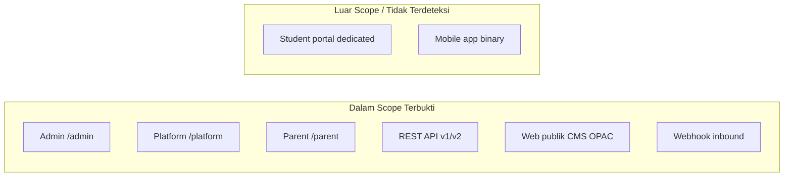

# 01 — Ringkasan Sistem

## Ringkasan Singkat

**FoundationOS** adalah aplikasi ERP modular untuk lembaga pendidikan (K-12 dan perguruan tinggi), dibangun sebagai monolit Laravel 13 dengan 45 modul fitur, antarmuka admin berbasis Filament v5, dan multi-tenancy shared-database.

---

## Temuan Utama

| Aspek | Nilai | Keyakinan |
|-------|-------|-----------|
| Nama produk | FoundationOS | TERVERIFIKASI — `README.md` |
| Pola deploy | Monolit Laravel tunggal | TERVERIFIKASI — `composer.json`, `bootstrap/app.php` |
| Jumlah modul fitur | 45 | TERVERIFIKASI — `ls Modules/` |
| Panel admin utama | `/admin` (tenant-scoped) | TERVERIFIKASI — `AdminPanelProvider.php:43-44` |
| Multi-tenancy | Shared DB, kolom `tenant_id` | TERVERIFIKASI — `BelongsToTenant.php`, `config/tenancy.php` |
| Resource Filament CRUD | 257 kelas `ModuleResource` | TERVERIFIKASI — grep `extends ModuleResource` |
| Rute API (`api/*`) | 101 | TERVERIFIKASI — `docs/catalogs/api-routes-catalog.json` |
| Migrasi database | 244 file PHP | TERVERIFIKASI — `00-repository-manifest.md` |

---

## Deskripsi Sistem (Fakta)

FoundationOS menyediakan:

1. **Manajemen tenant SaaS** — registrasi organisasi, langganan, billing Midtrans.
2. **Operasional pendidikan** — modul School (K-12), Campus (PT), Enrollment (admisi).
3. **Back-office** — Finance, Procurement, Employee, Library, Workflow, dan 30+ modul operasional lain.
4. **API REST** — Sanctum + konteks tenant untuk integrasi mobile/eksternal.
5. **Integrasi** — Moodle (outbox sync), Midtrans (billing), WhatsApp (messaging, default log provider).

**Bukti:** `README.md` (deskripsi produk), `composer.json` (dependensi), struktur `Modules/`.

---

## Aktor Sistem (Terbukti)

| ID | Aktor | Bukti |
|----|-------|-------|
| A1 | Pengguna Admin Tenant | `User::canAccessPanel('admin')` — `Modules/Core/app/Models/User.php:471-476` |
| A2 | Global Super Admin | `User::isGlobalSuperAdmin()` — `User.php:458-460`, `AppServiceProvider.php:93-98` |
| A3 | Platform Owner | Role `platform_owner` — migration `2026_05_22_145853_create_platform_owner_role.php` |
| A4 | Pengguna Orang Tua | `canAccessPanel('parent')` + `parent_students` — `User.php:479-481` |
| A5 | Klien API (token Sanctum) | `routes/api.php`, middleware `auth:sanctum` |
| A6 | Pengunjung publik | Rute tanpa auth (CMS, OPAC, inquiry) |
| A8-A12 | Sistem eksternal (webhook) | Midtrans, donation, exam runtime, WhatsApp, IT monitoring |

**TIDAK TERDETEKSI:** panel login khusus siswa (student portal) sebagai aktor terpisah.

---

## Scope Aplikasi

---

## Bukti dari Kode

- **Entry HTTP:** `public/index.php` → `bootstrap/app.php` — routing `web`, `api`, `console`, health `/up`.
- **Registrasi panel:** `bootstrap/providers.php` → `AdminPanelProvider`, `PlatformPanelProvider`, `ParentPanelProvider`.
- **Modularisasi:** `coolsam/modules` — `composer.json:15`, `config/filament-modules.php`.

---

## Catatan Ketidakpastian

| Item | Status |
|------|--------|
| Jumlah tabel DB pasti (434) | PARSIAL — dikutip di `ARCHITECTURE.md` dari `entity-catalog.json` yang tidak di-git |
| Status produksi deploy | TIDAK TERDETEKSI — tidak ada Dockerfile/K8s di repo |
| Semua 45 modul aktif per tenant | INFERENSI — aktivasi via `tenant_modules`; logika bisnis aktivasi perlu verifikasi runtime |
