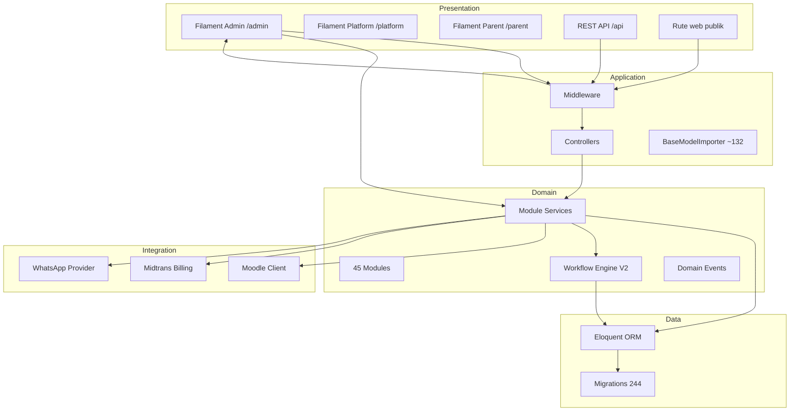
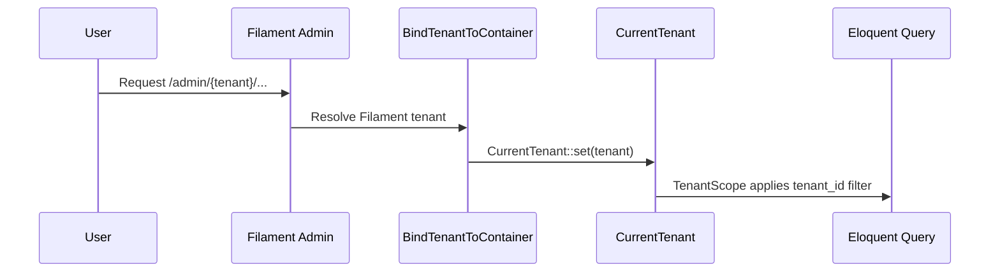

# 03 — Arsitektur Aplikasi

## Ringkasan Singkat

FoundationOS mengikuti pola **modular monolith** Laravel: satu proses aplikasi, banyak modul domain di `Modules/`, dengan pemisahan layer presentasi (Filament/Livewire), aplikasi (HTTP/controllers), domain (models/services/events), dan data (Eloquent/migrations).

---

## Temuan Utama

### Pola Arsitektur

| Pola | Implementasi | Bukti |
|------|--------------|-------|
| Modular monolith | `coolsam/modules`, 45 modul | `composer.json`, `Modules/` |
| Shared-database multi-tenancy | `tenant_id` + global scope | `BelongsToTenant.php`, `TenantScope.php` |
| Admin UI metadata-driven | Filament Resource per entitas | 257× `ModuleResource` |
| Workflow metadata-driven | Snapshot + JSONLogic | `DatabaseWorkflowInstanceStarter.php`, `JsonLogicWorkflowTransitionResolver.php` |
| Outbox integration (Moodle) | `moodle_sync_outbox` | `MoodleOutboxService.php` |

---

## Diagram Layer

---

## Entry Point & Routing

**Bukti:** `bootstrap/app.php:17-23`

| Channel | File route | Prefix |
|---------|------------|--------|
| Web | `routes/web.php` | `/` |
| API | `routes/api.php` | `api/` |
| Console | `routes/console.php` | Artisan |
| Health | built-in | `/up` |
| Modul | `Modules/*/routes/web.php`, `api.php` | variasi |

Middleware alias terdaftar: `resolve.api.tenant`, `idempotency`, `subscription.active`, Spatie `role`/`permission` — `bootstrap/app.php:34-42`.

---

## Multi-Tenancy

### Mekanisme (TERVERIFIKASI)

1. Model operasional memakai trait `BelongsToTenant` — global scope `TenantScope`.
2. Filament admin: `->tenant(Tenant::class)` — `AdminPanelProvider.php:93`.
3. Middleware `BindTenantToContainer` menyetel `CurrentTenant` dari tenant Filament aktif.
4. API: `ResolveApiTenant` dari `tenant_id` pada token Sanctum.
5. Spatie Permission **teams mode**: `team_foreign_key = tenant_id` — `config/permission.php`.

### Fail-closed

`config/tenancy.php` — scope gagal jika tenant tidak terselesaikan (TERVERIFIKASI).

---

## Panel Filament

| Panel | ID | Path | Tenant | Bukti |
|-------|-----|------|--------|-------|
| Admin | `admin` | `/admin` | Ya (`Tenant`) | `AdminPanelProvider.php:43-44,93` |
| Platform | `platform` | `/platform` | Tidak | `PlatformPanelProvider.php` |
| Parent | `parent` | `/parent` | Tidak | `ParentPanelProvider.php` |

Fitur admin: MFA (app + email), registrasi tenant, Shield, modul discovery — `AdminPanelProvider.php:48-56,132-158`.

---

## Otorisasi

| Lapisan | Mekanisme | Bukti |
|---------|-----------|-------|
| Panel access | `User::canAccessPanel()` | `User.php:465-481` |
| Resource policy | Spatie + Shield generated | `config/filament-shield.php` |
| Global bypass | `Gate::before` super admin | `AppServiceProvider.php:93-98` |
| Domain membership | `user_tenant_roles` + `TenantRole` | `TenantRole.php`, migrations |

---

## Async & Background

| Komponen | Bukti |
|----------|-------|
| Queue jobs | `app/Jobs/ProcessMoodleSyncOutboxJob.php` |
| Scheduled commands | `routes/console.php` (28 perintah) |
| Event listeners | `Modules/*/Providers/EventServiceProvider.php` |
| Workflow SLA | `ScheduleWorkflowSlaCheck` listener |

---

## Catatan Ketidakpastian

| Item | Status |
|------|--------|
| Pemisahan read/write DB | TIDAK TERDETEKSI |
| Event sourcing penuh | TIDAK TERDETEKSI — hanya domain events Laravel |
| Microservices | TIDAK TERDETEKSI — monolith |
