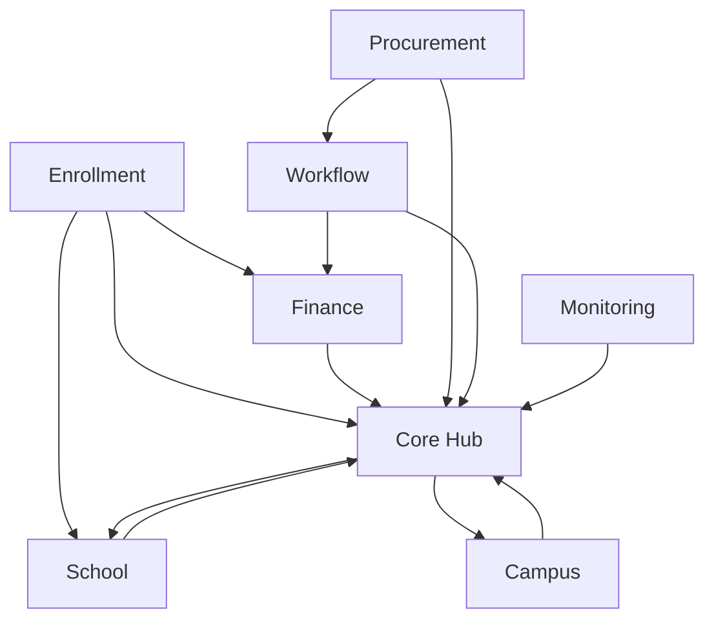

# 04 — Analisis Modul

## Ringkasan Singkat

Aplikasi terdiri dari **45 modul fitur** di bawah `Modules/`, dengan **Core** sebagai hub struktural (2.144 referensi inbound). Modul diklasifikasikan hub, bridge, dan leaf berdasarkan graf impor PHP statis.

---

## Daftar Modul (TERVERIFIKASI)

**Bukti:** `ls Modules/` — 45 direktori.

| No | Modul | Domain (dari nama + model) |
|----|-------|---------------------------|
| 1 | Core | Tenancy, user, organisasi, langganan |
| 2 | Global | Referensi geografis (negara, provinsi, dll.) |
| 3 | School | K-12: kurikulum, kelas, siswa, nilai |
| 4 | Campus | PT: fakultas, prodi, dosen, KRS |
| 5 | Enrollment | Admisi, applicant, lead CRM |
| 6 | Employee | HR, payroll, KPI, cuti |
| 7 | Finance | Akuntansi, invoice, jurnal |
| 8 | Procurement | PR, RFQ, PO, vendor bill |
| 9 | Library | Perpustakaan, pinjam, SLIMS |
| 10 | Workflow | Mesin approval metadata-driven |
| 11 | Monitoring | Audit log, webhook, file upload |
| 12-45 | Ai, Alumni, Asset, Boarding, Cafeteria, Capacity, Clinic, Cms, Consulting, Counseling, Dms, Donation, EducationQa, EOffice, Event, Exam, Facility, Helpdesk, InternalAudit, Inventory, IsoCompliance, ItOps, KpiEnterprise, Legal, Marketplace, MerchOrder, Messaging, PhysicalSecurity, Printing, Property, Risk, Sales, Training, Transport | Modul operasional spesialis |

---

## Hub Tier (Top 10)

**Bukti:** `03-module-dependency-map.md` — analisis statis `use Modules\{Name}\`.

| Rank | Modul | Skor hub | Peran |
|------|-------|----------|-------|
| 1 | Core | 2.216 | Tenancy, User, ModuleResource, FilamentUi |
| 2 | School | 308 | Domain K-12 |
| 3 | Monitoring | 299 | Cross-cut audit |
| 4 | Campus | 186 | Domain PT |
| 5 | Procurement | 186 | Pembelian + workflow |
| 6 | Finance | 177 | Akuntansi |
| 7 | Employee | 150 | HR |
| 8 | Library | 139 | Perpustakaan |
| 9 | Workflow | 131 | Approval engine |
| 10 | Enrollment | 101 | Admisi |

---

## Leaf Modules (24)

Modul dengan dependensi outbound **hanya** ke Core dan/atau Monitoring:

`Ai`, `Alumni`, `Boarding`, `Cafeteria`, `Capacity`, `Clinic`, `Consulting`, `Dms`, `EOffice`, `EducationQa`, `Event`, `Global`, `Helpdesk`, `IsoCompliance`, `ItOps`, `KpiEnterprise`, `Marketplace`, `MerchOrder`, `Messaging`, `PhysicalSecurity`, `Printing`, `Property`, `Risk`, `Training`

**Bukti:** `03-module-dependency-map.md` F-03.

---

## Coupling Bidirectional (2-cycle)

| Cluster | Modul | Bukti |
|---------|-------|-------|
| Platform hub | Core ↔ Campus, Employee, Enrollment, Finance, Library, Monitoring, Procurement, School, Global, Messaging, Printing | import graph |
| Admissions | Enrollment ↔ School, Finance | import graph |
| Workflow ops | Workflow ↔ Procurement, Finance | import graph |

**Interpretasi (INFERENSI):** Core bukan pure foundation — mengimpor model domain untuk fitur cross-cutting (mis. parent portal, notifikasi).

---

## Struktur Internal Modul (Konvensi)

**Bukti:** `CLAUDE.md`, contoh `Modules/School/`

```
Modules/{Name}/
  app/
    Filament/Resources/{Model}/
    Models/
    Policies/
    Providers/
    Services/
  database/migrations/
  routes/web.php, api.php
  module.json
```

Setiap resource Filament domain memperluas `Modules\Core\Filament\Support\ModuleResource` — **257** instance.

---

## Aktivasi Modul per Tenant

| Komponen | Bukti |
|----------|-------|
| Model `TenantModule` | `Modules/Core/app/Models/TenantModule.php` |
| Resource admin | `TenantModuleResource` |
| Tabel | migration `create_tenant_modules_table.php` |

Logika bisnis "modul mana yang aktif" — **PARSIAL** (model ada; aturan aktivasi perlu verifikasi di service/UI).

---

## Modul Terisolasi

| Modul | Temuan | Bukti |
|-------|--------|-------|
| Exam | Zero inbound import dari modul lain | `03-module-dependency-map.md` F-05 |
| Exam API | `POST api/exam/runtime/attempts` | `Modules/Exam/routes/api.php` |

---

## Diagram Dependensi (Ringkas)



---

## Catatan Ketidakpastian

- Matriks dependensi runtime (queue payload, event) — **TIDAK TERDETEKSI** (hanya statis).
- Modul dengan UI lengkap vs scaffold-only — **PARSIAL** (semua punya Resource; kedalaman service bervariasi).
