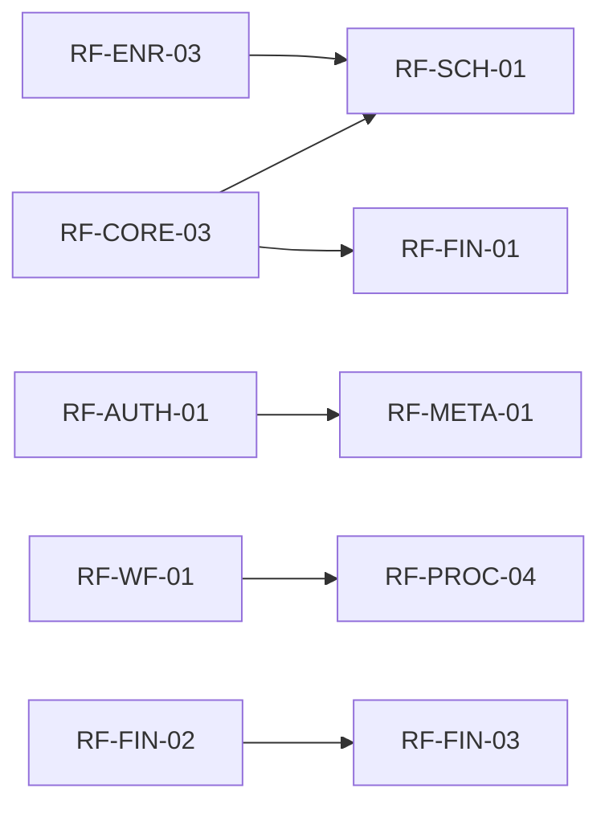

# 05 — Requirements Fungsional

## Ringkasan Singkat

Kebutuhan fungsional berikut **diturunkan dari kode** (route, Filament resource, service, event listener, artisan command). Setiap item memiliki ID dan referensi bukti. Prioritas tidak didefinisikan eksplisit di kode — kolom prioritas: **TIDAK TERDETEKSI**.

---

## Legenda

| Tipe | Arti |
|------|------|
| RF-VER | Terverifikasi — ada implementasi jelas |
| RF-IND | Indikasi requirement — pola CRUD/metadata tanpa aturan bisnis eksplisit |
| RF-PAR | Parsial — sebagian alur terbukti |

---

## Core & Tenancy

| ID | Requirement | Tipe | Bukti |
|----|-------------|------|-------|
| RF-CORE-01 | Pengguna dapat mendaftar dan login ke panel admin | RF-VER | `AdminPanelProvider.php:47-50` |
| RF-CORE-02 | Pengguna dapat mendaftarkan tenant baru | RF-VER | `->tenantRegistration(RegisterTenant::class)` — `AdminPanelProvider.php:51` |
| RF-CORE-03 | Data operasional ter-scope per `tenant_id` | RF-VER | `BelongsToTenant.php` |
| RF-CORE-04 | Admin mengelola organisasi, departemen, tahun akademik | RF-IND | `OrganizationResource`, `DepartmentResource`, `AcademicYearResource` |
| RF-CORE-05 | Tenant dapat mengatur branding (logo, warna) | RF-VER | `AdminPanelProvider.php:57-80`, `TenantSetting` |
| RF-CORE-06 | UI bilingual (id/en) | RF-VER | `FilamentUi.php`, `SetUserLocale` middleware |
| RF-CORE-07 | Langganan tenant dicek sebelum akses admin | RF-VER | `EnsureTenantSubscriptionActive.php` |

---

## Otorisasi & Peran

| ID | Requirement | Tipe | Bukti |
|----|-------------|------|-------|
| RF-AUTH-01 | RBAC per resource Filament via Shield | RF-VER | `FilamentShieldPlugin`, `config/filament-shield.php` |
| RF-AUTH-02 | Super admin global bypass policy | RF-VER | `AppServiceProvider.php:93-98` |
| RF-AUTH-03 | Platform owner mengelola tenant SaaS | RF-VER | `PlatformPanelProvider`, role `platform_owner` |
| RF-AUTH-04 | Orang tua mengakses data anak terhubung | RF-VER | `ParentPanelProvider`, `ParentStudent` model |

---

## Akademik (School & Campus)

| ID | Requirement | Tipe | Bukti |
|----|-------------|------|-------|
| RF-SCH-01 | CRUD kurikulum, mapel, kelas, guru, siswa | RF-IND | `School/*Resource.php` |
| RF-SCH-02 | Pencatatan absensi siswa | RF-VER | `Attendance` model, `AttendanceRecapService.php` |
| RF-SCH-03 | Penilaian dan rapor | RF-PAR | `Assessment`, `StudentGrade`, `ReportCardController.php` |
| RF-SCH-04 | Deteksi konflik jadwal | RF-VER | `ScheduleConflictChecker.php` |
| RF-CAM-01 | CRUD fakultas, prodi, mata kuliah, dosen | RF-IND | `Campus/*Resource.php` |
| RF-CAM-02 | KRS / study plan | RF-IND | `StudyPlan`, `StudyPlanItem` resources |
| RF-CAM-03 | Sync data ke Moodle | RF-VER | `MoodleOutboxService`, observers |

---

## Enrollment

| ID | Requirement | Tipe | Bukti |
|----|-------------|------|-------|
| RF-ENR-01 | Penerimaan lead inquiry publik | RF-VER | `POST api/inquiry` — `InquiryController` |
| RF-ENR-02 | Konversi lead ke applicant | RF-VER | `LeadInquiryService::convertToApplicant` |
| RF-ENR-03 | Promosi applicant diterima → student | RF-VER | `ApplicantPromotionService.php` |
| RF-ENR-04 | Pengaturan auto-promote via tenant setting | RF-VER | key `enrollment.auto_promote_accepted_applicant` |

---

## Employee & HR

| ID | Requirement | Tipe | Bukti |
|----|-------------|------|-------|
| RF-EMP-01 | CRUD karyawan, posisi, kontrak | RF-IND | `Employee/*Resource.php` |
| RF-EMP-02 | Payroll slip dan komponen gaji | RF-IND | `SalarySlip`, `PayrollComponent` |
| RF-EMP-03 | KPI template dan scoring | RF-IND | `KpiTemplate`, `KpiScore` |
| RF-EMP-04 | Pengajuan cuti via API | RF-VER | `POST api/v1/leave-requests` — `routes/api.php:71` |

---

## Finance

| ID | Requirement | Tipe | Bukti |
|----|-------------|------|-------|
| RF-FIN-01 | Chart of accounts, budget, jurnal | RF-IND | `Finance/*Resource.php` |
| RF-FIN-02 | Invoice siswa dan pembayaran | RF-VER | `StudentInvoice`, `Payment`, pipeline test |
| RF-FIN-03 | Invoice terbit tidak dapat diubah | RF-VER | `FinanceControlService.php:26-28` |
| RF-FIN-04 | Jurnal harus balance debit=kredit | RF-VER | `FinanceControlService.php:139-141` |
| RF-FIN-05 | Pembayaran tercatat via API | RF-VER | `PaymentController@store` |

---

## Procurement

| ID | Requirement | Tipe | Bukti |
|----|-------------|------|-------|
| RF-PROC-01 | Alur PR → RFQ → PO → GR → Vendor Bill | RF-IND | model chain + resources |
| RF-PROC-02 | Three-way match validasi | RF-VER | `ThreeWayMatchValidator.php` |
| RF-PROC-03 | Auto-create PO dari RFQ award | RF-VER | `PurchaseOrderAutoCreationService.php` |
| RF-PROC-04 | Workflow approval procurement | RF-VER | `fos:workflow:setup-procurement-pilot` command |

---

## Workflow

| ID | Requirement | Tipe | Bukti |
|----|-------------|------|-------|
| RF-WF-01 | Definisi workflow metadata (steps, transitions) | RF-VER | `Workflow`, `WorkflowStep`, migrations |
| RF-WF-02 | Start instance dengan snapshot | RF-VER | `DatabaseWorkflowInstanceStarter.php` |
| RF-WF-03 | Advance/return/cancel dengan otorisasi assignee | RF-VER | `DatabaseWorkflowEngine.php` |
| RF-WF-04 | Kondisi transisi JSONLogic | RF-VER | `JsonLogicWorkflowTransitionResolver.php` |
| RF-WF-05 | Parallel approval / quorum | RF-VER | `advanceParallel` — `DatabaseWorkflowEngine.php:158-246` |
| RF-WF-06 | Automated actions pada transisi | RF-VER | `WorkflowAutomatedActionRunner.php` |
| RF-WF-07 | Visual designer canvas | RF-PAR | `WorkflowCanvas.php` Livewire |

---

## Library

| ID | Requirement | Tipe | Bukti |
|----|-------------|------|-------|
| RF-LIB-01 | Katalog buku dan eksemplar | RF-IND | `Book`, `BookCopy` |
| RF-LIB-02 | OPAC publik | RF-VER | `Modules/Library/routes/web.php` |
| RF-LIB-03 | Sirkulasi (checkout/return) | RF-PAR | routes web + `Loan` model |
| RF-LIB-04 | Import SLIMS | RF-VER | `LibraryImportSlimsCommand.php` |

---

## API & Mobile

| ID | Requirement | Tipe | Bukti |
|----|-------------|------|-------|
| RF-API-01 | Autentikasi Sanctum + konteks tenant | RF-VER | `routes/api.php`, `ResolveApiTenant` |
| RF-API-02 | Read master data (students, classes, courses) | RF-VER | v1 GET routes |
| RF-API-03 | Idempotency pada write kritikal | RF-VER | middleware `idempotency` — `routes/api.php:68-72` |
| RF-API-04 | Student dashboard aggregate | RF-VER | `StudentDashboardController` |
| RF-API-05 | OpenAPI spec | RF-VER | `GET api/openapi.json` |

---

## Billing SaaS

| ID | Requirement | Tipe | Bukti |
|----|-------------|------|-------|
| RF-BILL-01 | Pembayaran langganan via Midtrans Snap | RF-VER | `BillingService.php`, `BillingPage` |
| RF-BILL-02 | Webhook Midtrans | RF-VER | `routes/web.php` CSRF except `billing/webhook` |

---

## Meta-Requirement CRUD

| ID | Requirement | Tipe | Bukti |
|----|-------------|------|-------|
| RF-META-01 | Import/export CSV per resource | RF-IND | `BaseModelImporter`, `ImportTableActions` — ~132 importers |
| RF-META-02 | Soft delete pada tabel domain | RF-VER | migration `add_soft_deletes_to_all_domain_tables` |
| RF-META-03 | Activity log | RF-VER | `spatie/laravel-activitylog` |

---

## Ketergantungan Antar Requirement (Terbukti)

---

## Catatan Ketidakpastian

- Requirement non-fungsional terpisah di `06_requirements_nonfungsional.md`.
- 257 resource CRUD tidak didetailkan per entitas — digolongkan RF-IND.
- User story / product backlog formal: **TIDAK TERDETEKSI DI KODE**.
