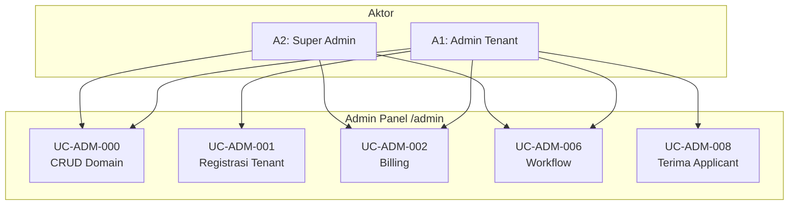
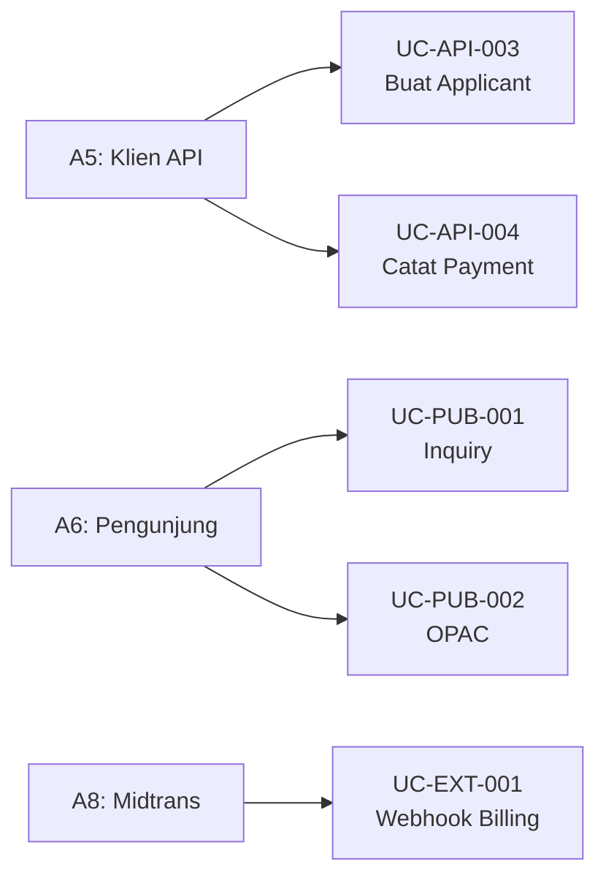

# 07 — Use Case Diagram

## Ringkasan Singkat

Use case berikut hanya mencakup alur dengan bukti route, controller, Filament page/action, atau event handler. CRUD standar 257 resource digabung sebagai satu meta use case.

**Sumber silang:** `USE_CASES.md` (diverifikasi ulang terhadap kode).

---

## Daftar Aktor

| ID | Aktor | Tipe | Bukti |
|----|-------|------|-------|
| A1 | Admin Tenant | Human | `User::canAccessPanel('admin')` |
| A2 | Global Super Admin | Human | `isGlobalSuperAdmin()` |
| A3 | Platform Owner | Human | role `platform_owner` |
| A4 | Orang Tua | Human | panel `parent` |
| A5 | Klien API | System | Sanctum token |
| A6 | Pengunjung Publik | Human/Anon | rute tanpa auth |
| A8 | Midtrans | External | webhook billing |
| A9 | Provider Donasi | External | `donation/webhook` |
| A10 | Exam Runtime | External | `api/exam/runtime/attempts` |
| A11 | WhatsApp Provider | External | `api/webhooks/whatsapp/{provider}` |

---

## Daftar Use Case

| ID | Nama | Aktor | Bukti utama |
|----|------|-------|-------------|
| UC-ADM-000 | Kelola data domain (CRUD Filament) | A1, A2 | 257× `ModuleResource` |
| UC-ADM-001 | Registrasi tenant | A1 | `RegisterTenant` |
| UC-ADM-002 | Billing Midtrans | A1, A2 | `BillingPage`, `BillingService` |
| UC-ADM-006 | Proses workflow instance | A1, A2 | `ViewWorkflowInstance`, `DatabaseWorkflowEngine` |
| UC-ADM-008 | Terima applicant | A1, A2 | `ApplicantPromotionService` |
| UC-PLT-001 | Kelola tenant SaaS | A3 | `PlatformPanelProvider` |
| UC-PAR-001 | Lihat data anak | A4 | `ParentPanelProvider` |
| UC-API-003 | Buat applicant via API | A5 | `ApplicantController@store` |
| UC-PUB-001 | Inquiry enrollment | A6 | `POST api/inquiry` |
| UC-PUB-002 | Browse OPAC | A6 | Library web routes |
| UC-EXT-001 | Webhook Midtrans | A8 | `routes/web.php` |

---

## Diagram — Panel Admin

> **Catatan:** Mermaid tidak memiliki use case diagram native; diagram berikut menggunakan flowchart dokumentatif.

---

## Diagram — API & Publik

---

## Bukti dari Kode (Contoh UC-ADM-006)

1. UI: `Modules/Workflow/app/Filament/Resources/WorkflowInstances/Pages/ViewWorkflowInstance.php:47-110`
2. Engine: `DatabaseWorkflowEngine::advance()` — `Modules/Workflow/app/Services/DatabaseWorkflowEngine.php:37`
3. Otorisasi assignee: `authorizeActor()` — baris 416-430

---

## Use Case TIDAK TERDETEKSI

| Use case yang umum di ERP pendidikan | Status |
|--------------------------------------|--------|
| Login portal siswa dedicated | TIDAK TERDETEKSI |
| Self-service registrasi mahasiswa | TIDAK TERDETEKSI (hanya admin/API) |
| Parent membayar SPP langsung | PARSIAL — payment API ada, UI parent terbatas |

---

## Catatan Ketidakpastian

- Assignee workflow bukan aktor terpisah — menggunakan kredensial A1/A2.
- Detail skenario alternatif/error per UC: lihat `08_activity_diagram.md` dan `09_sequence_diagram.md`.
