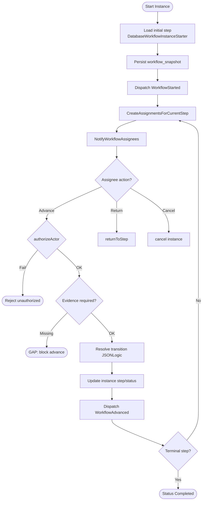
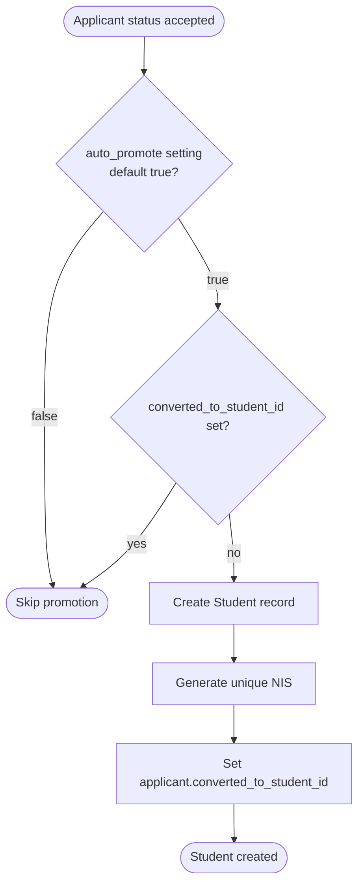
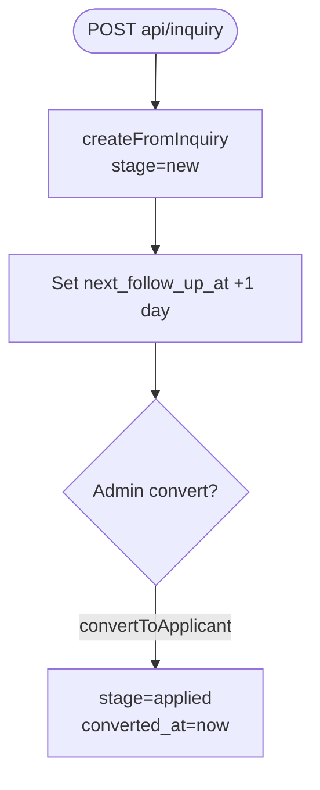
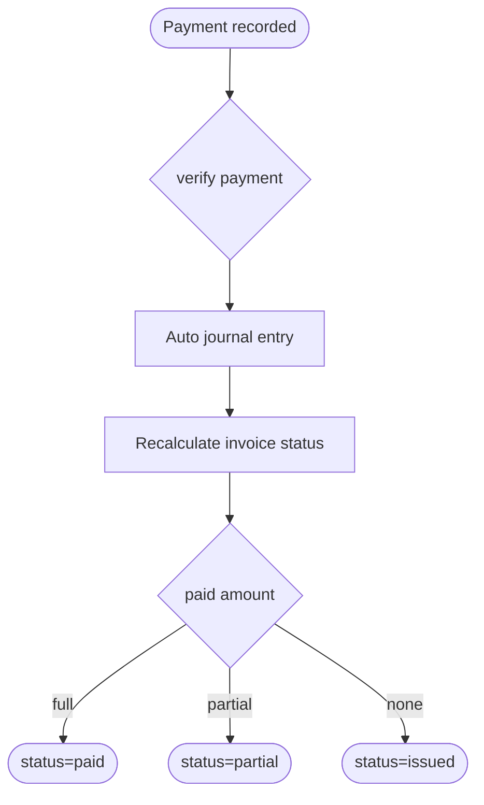
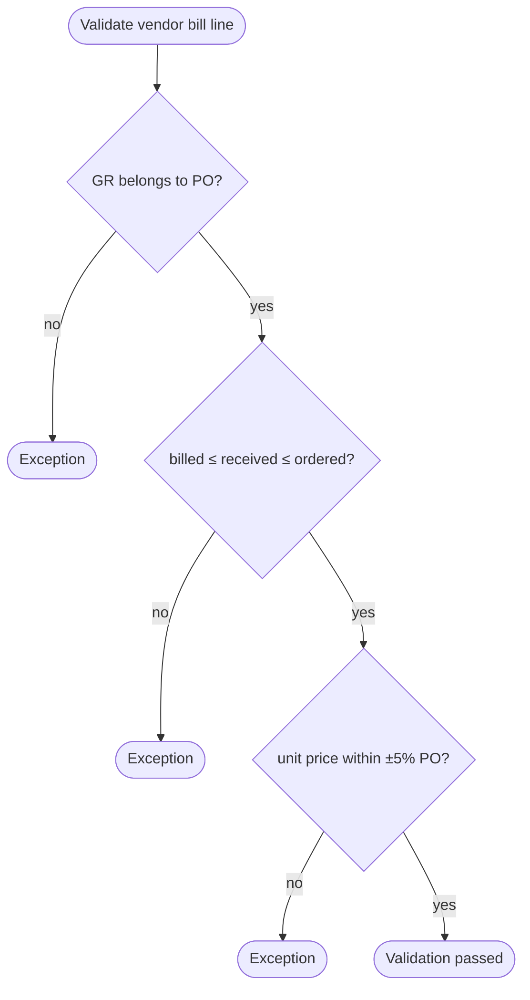
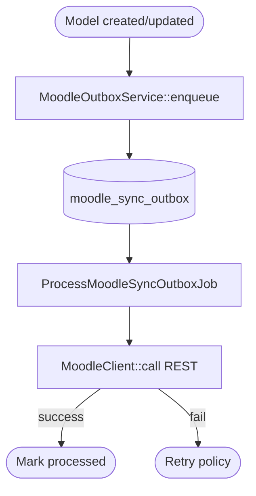
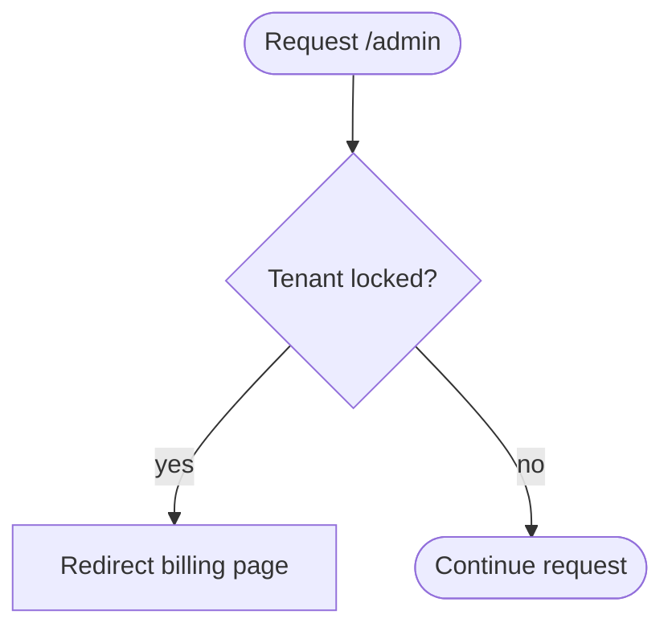

# 08 — Activity Diagram

## Ringkasan Singkat

Diagram aktivitas untuk proses bisnis yang **terbukti** di service, engine, atau listener. Langkah tanpa jejak kode ditandai `[GAP]`.

---

## AD-01: Workflow Approval (Linear)

**Bukti:** `DatabaseWorkflowEngine.php`, `CreateAssignmentsForCurrentStep.php`

**File:** `Modules/Workflow/app/Services/DatabaseWorkflowEngine.php`

---

## AD-02: Applicant Diterima → Student

**Bukti:** `ApplicantPromotionService.php`, test `ApplicantAcceptedPipelineTest.php`

**File:** `Modules/Enrollment/app/Services/ApplicantPromotionService.php:17-87`

---

## AD-03: Lead Inquiry → Applicant

**Bukti:** `LeadInquiryService.php`

**File:** `Modules/Enrollment/app/Services/LeadInquiryService.php:29-58`

---

## AD-04: Pembayaran Invoice Siswa

**Bukti:** `FinanceControlService.php`, `StudentInvoicePaidPipelineTest.php`

**File:** `Modules/Finance/app/Services/FinanceControlService.php:52-70,196-201`

---

## AD-05: Three-Way Match (Procurement)

**Bukti:** `ThreeWayMatchValidator.php`

**File:** `Modules/Procurement/app/Services/ThreeWayMatchValidator.php:30-67`

---

## AD-06: Moodle Sync Outbox

**Bukti:** `MoodleOutboxService.php`, `ProcessMoodleSyncOutboxJob.php`

**File:** `app/Integrations/Moodle/MoodleOutboxService.php`, `app/Jobs/ProcessMoodleSyncOutboxJob.php`

---

## AD-07: Tenant Subscription Gate

**Bukti:** `EnsureTenantSubscriptionActive.php`, `Tenant::isLocked()`

**File:** `app/Http/Middleware/EnsureTenantSubscriptionActive.php:14-21`

---

## Proses TIDAK TERDETEKSI (Activity)

| Proses | Status |
|--------|--------|
| End-to-end payroll calculation detail | PARSIAL — model ada, engine payroll tidak diaudit penuh |
| Full SLIMS import mapping | PARSIAL — command ada |
| Marketplace checkout | PARSIAL — resources ada |

---

## Catatan Ketidakpastian

- Parallel workflow quorum: lihat `DatabaseWorkflowEngine::advanceParallel` — diagram terpisah tidak dibuat karena kompleksitas; **PARSIAL**.
- BPMN formal: lihat `12_bpmn.md`.
