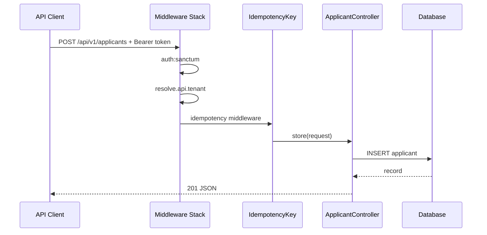
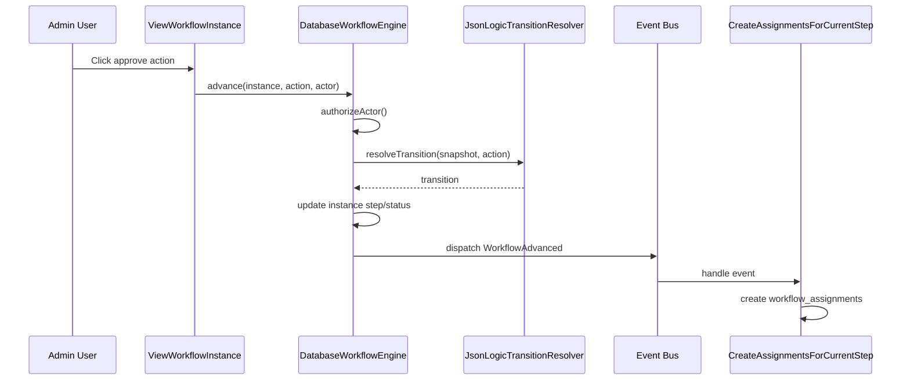
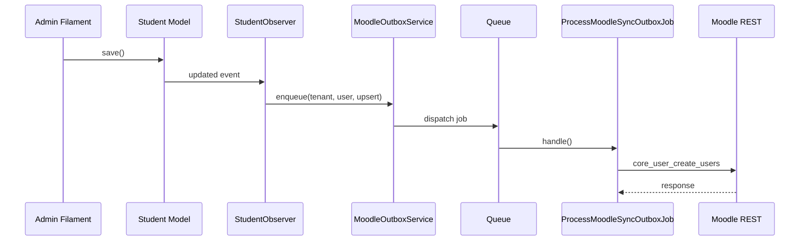
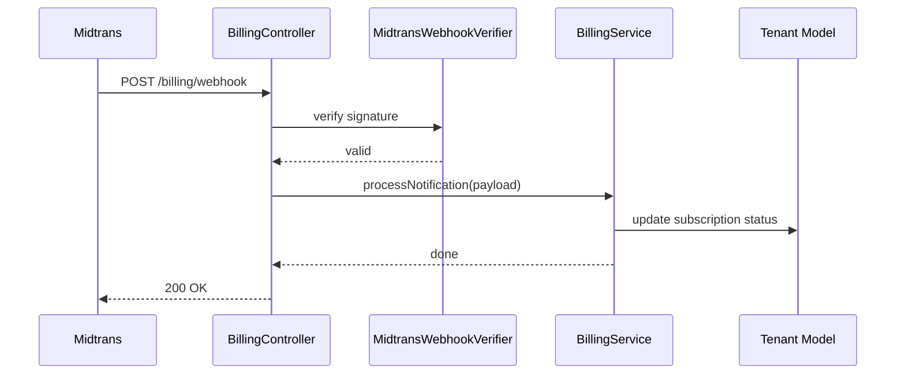
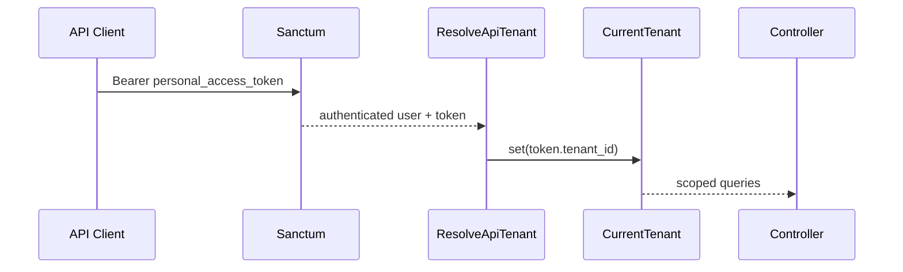
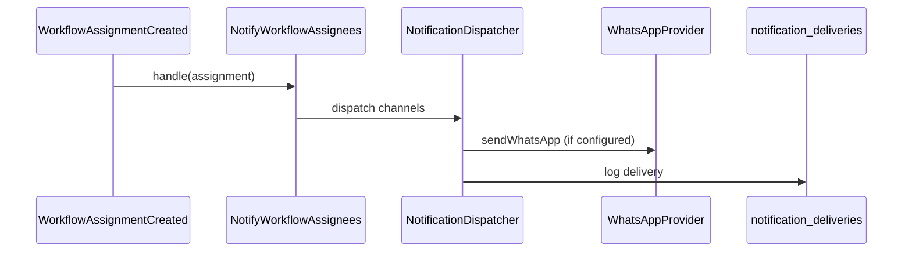
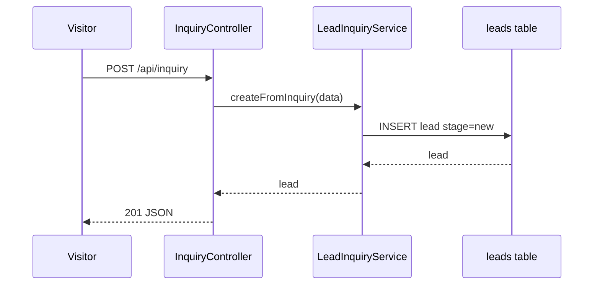

# 09 — Sequence Diagram

## Ringkasan Singkat

Diagram sequence untuk interaksi antar komponen yang paling kritis dan terbukti di kode.

---

## SD-01: API — Buat Applicant (dengan Idempotency)

**Aktor:** Klien API (A5)  
**Bukti:** `routes/api.php:68-69`, `ApplicantController`, `IdempotencyKey`

---

## SD-02: Workflow — Advance Instance

**Bukti:** `DatabaseWorkflowEngine.php`, `ViewWorkflowInstance.php`

**File:** `Modules/Workflow/app/Services/DatabaseWorkflowEngine.php:37-149`

---

## SD-03: Moodle — Observer ke Outbox

**Bukti:** `StudentObserver.php`, `MoodleOutboxService.php`

---

## SD-04: Billing Midtrans Webhook

**Bukti:** `routes/web.php`, `BillingService`, `MidtransWebhookVerifier`

---

## SD-05: Resolve Tenant pada Request API

**Bukti:** `ResolveApiTenant.php`, `CurrentTenant.php`

**File:** `app/Http/Middleware/ResolveApiTenant.php:23-31`

---

## SD-06: Notifikasi Workflow Assignee

**Bukti:** `EventServiceProvider.php`, `NotifyWorkflowAssignees.php`

---

## SD-07: Public Enrollment Inquiry

**Bukti:** `InquiryController`, `LeadInquiryService`

---

## Diagram TIDAK Dibuat

| Interaksi | Alasan |
|-----------|--------|
| Semua 257 CRUD Filament | Pola identik Livewire — redundant |
| Internal payroll calculation | **TIDAK TERDETEKSI** service engine terpusat |
| Full exam proctoring flow | **PARSIAL** — hanya webhook runtime |

---

## Catatan Ketidakpastian

- `SEQUENCE_DIAGRAMS.md` di root repo berisi SD-01–SD-13; beberapa referensi baris **Draft/stale** per `REAP_AUDIT.md`.
- Urutan listener concurrent: **INFERENSI** — Laravel synchronous default kecuali `ShouldQueue`.
