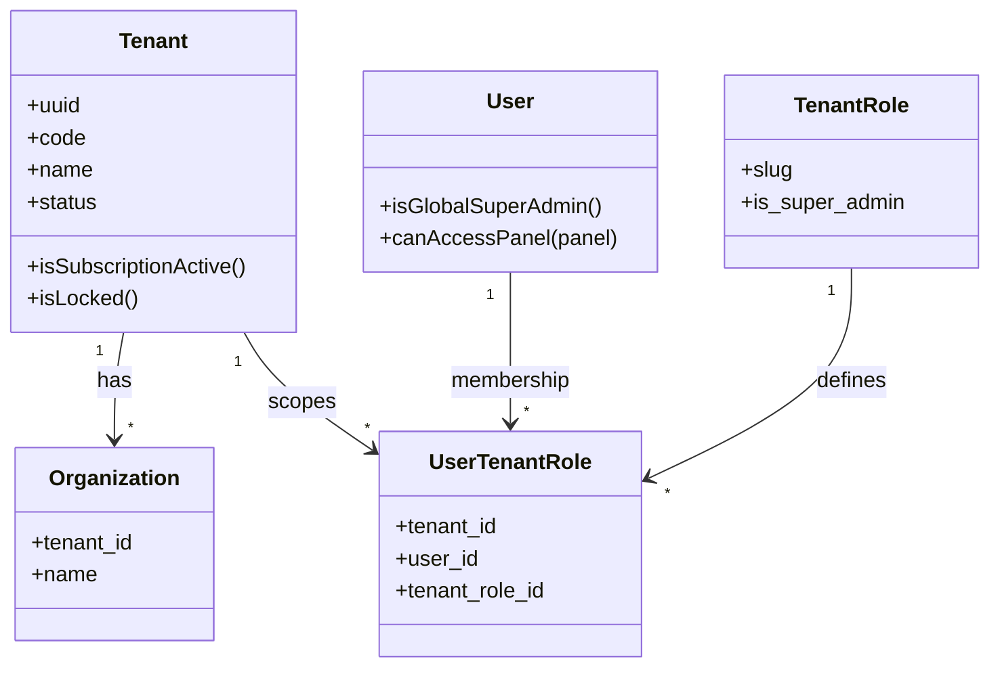
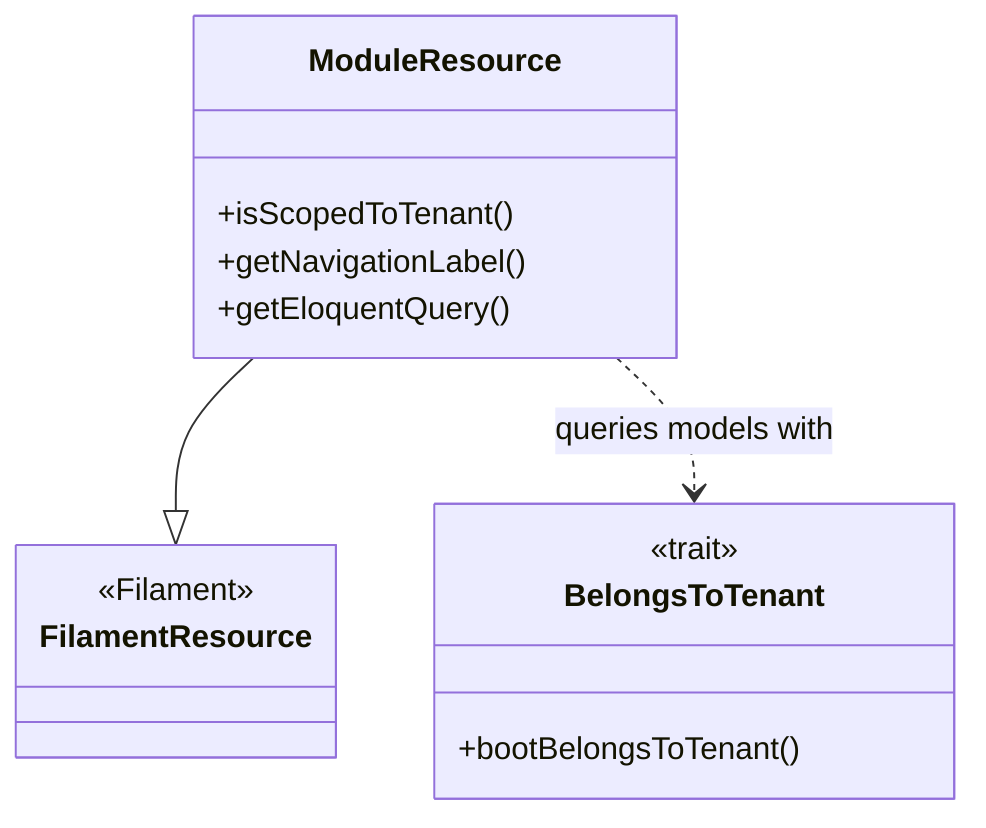
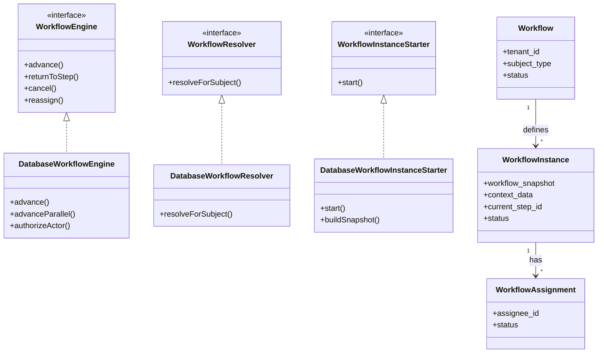
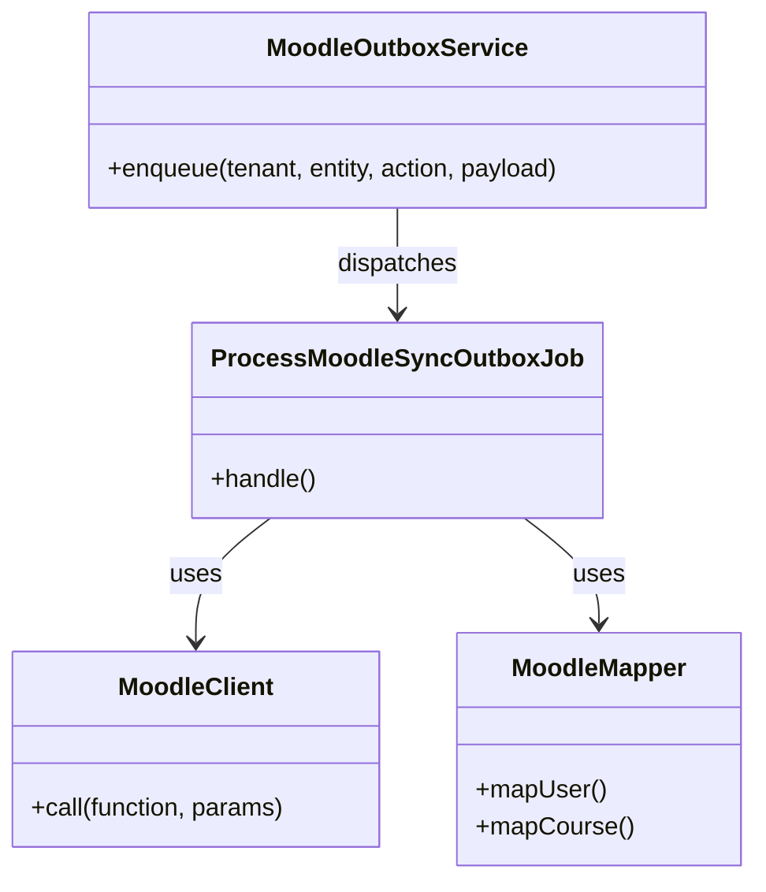
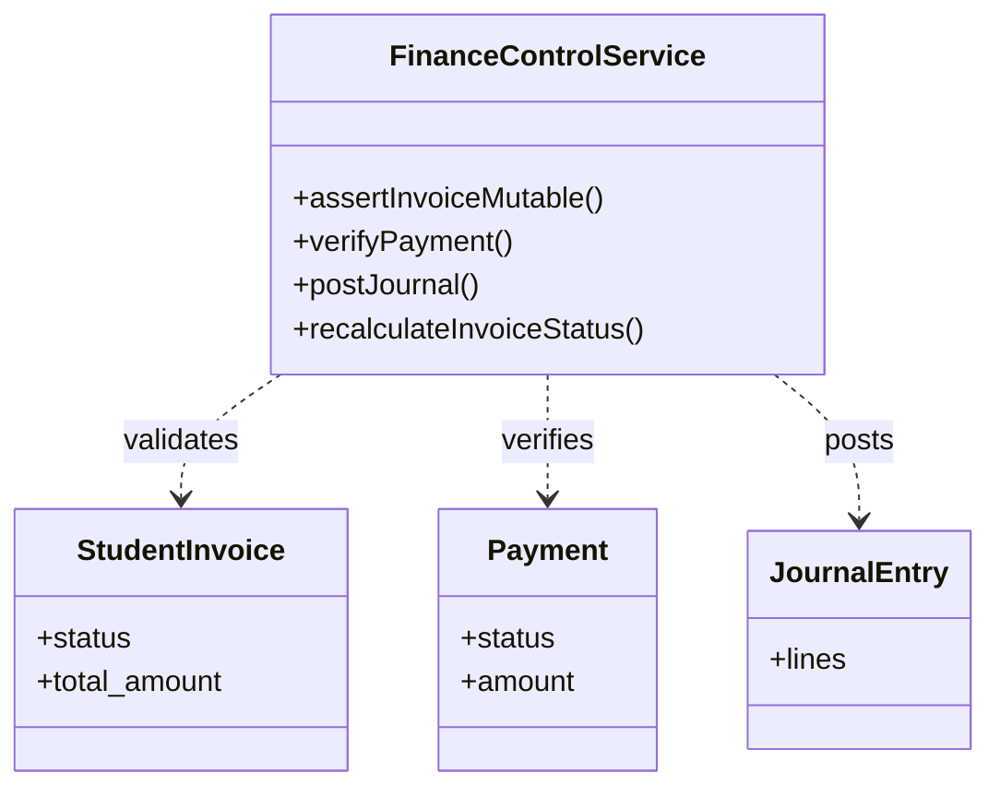

# 10 — Class Diagram

## Ringkasan Singkat

Diagram kelas untuk komponen domain **inti** yang paling menentukan arsitektur. Tidak mencakup 400+ model Eloquent — lihat `11_er_diagram.md` dan `16_data_dictionary.md`.

---

## Cluster: Multi-Tenancy & User

**Bukti:** `Modules/Core/app/Models/Tenant.php`, `User.php`, `TenantRole.php`, `UserTenantRole.php`, `Organization.php`

---

## Cluster: Filament Resource Base

**Bukti:** `Modules/Core/app/Filament/Support/ModuleResource.php:19-48`

---

## Cluster: Workflow V2

**Bukti:**
- Contracts: `Modules/Workflow/app/Contracts/`
- Implementations: `Modules/Workflow/app/Services/DatabaseWorkflow*.php`
- Models: `Modules/Workflow/app/Models/`

---

## Cluster: Moodle Integration

**Bukti:** `app/Integrations/Moodle/`

---

## Cluster: Finance Controls

**Bukti:** `Modules/Finance/app/Services/FinanceControlService.php`

---

## DTO / Repository Pattern

| Pola | Status | Bukti |
|------|--------|-------|
| Repository interface per aggregate | **TIDAK TERDETEKSI** | Tidak ada folder `Repositories/` dominan |
| DTO classes | **PARSIAL** | Array context di workflow; tidak ada namespace DTO konsisten |
| Service layer | TERVERIFIKASI | `Modules/*/Services/` |

---

## Catatan Ketidakpastian

- Diagram tidak menampilkan Policy classes (100+) — pola seragam `*Policy extends BasePolicy`.
- Relasi Eloquent lengkap per model: lihat migration + model `$fillable`/`relations()`.
