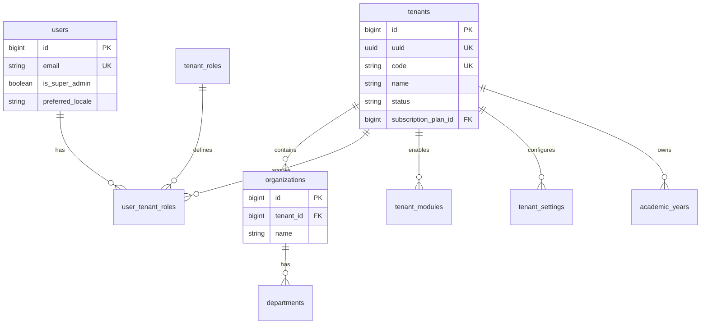
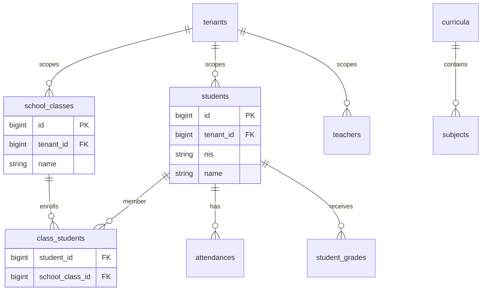
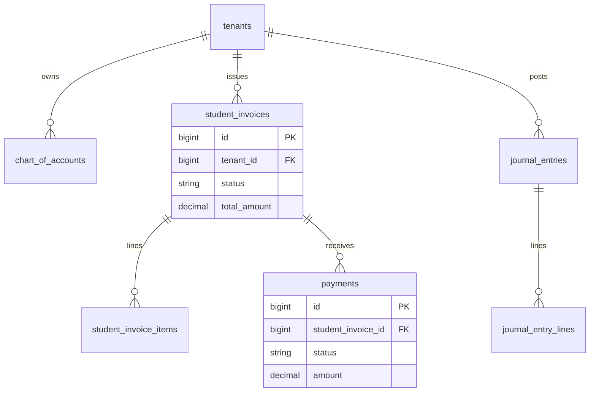
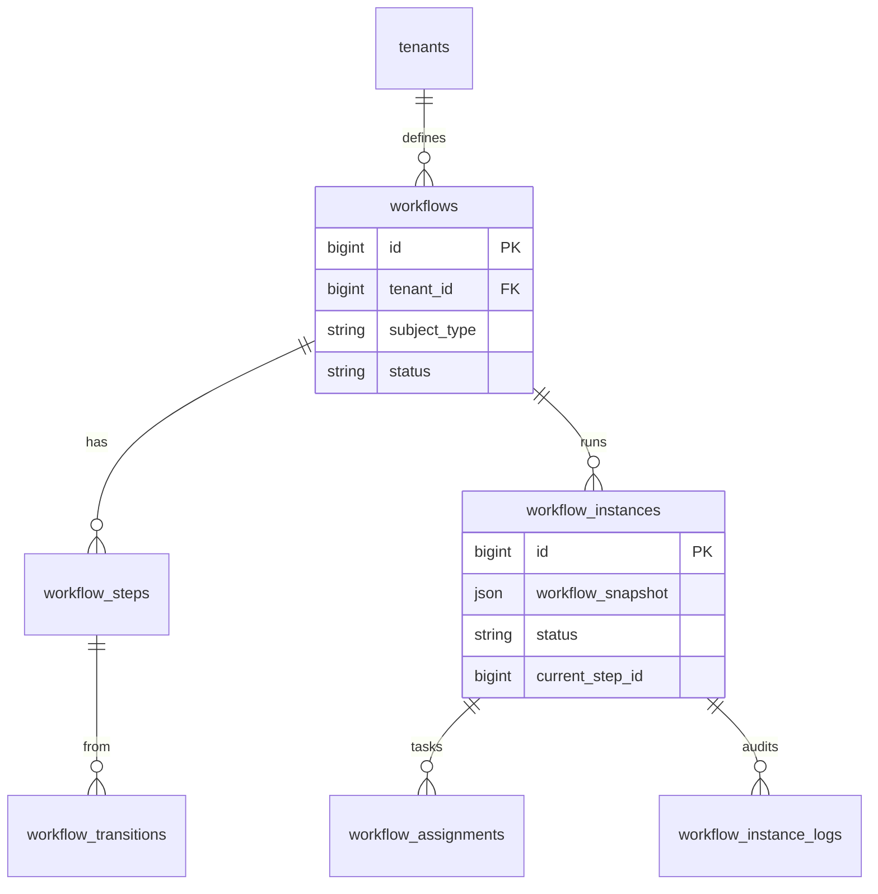
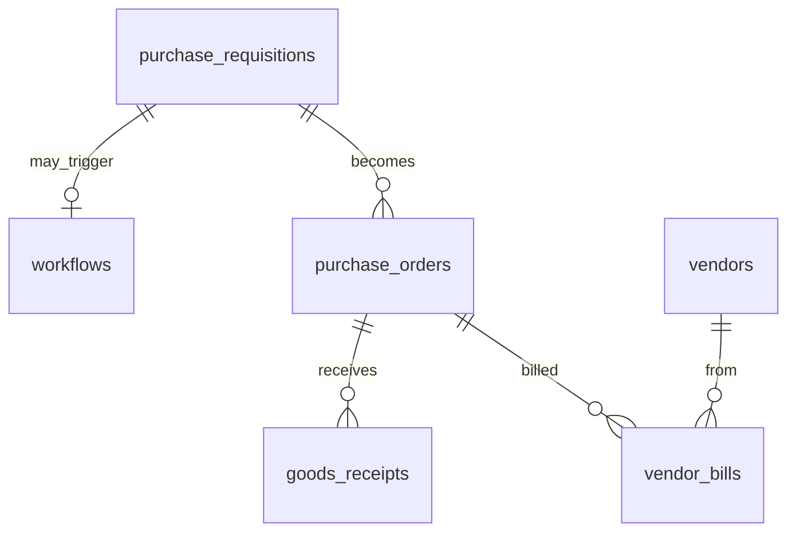

# 11 — ER Diagram

## Ringkasan Singkat

Entity-Relationship diagram **parsial** berdasarkan migrasi dan model inti. Katalog FK lengkap (`verified-fks.json`) **TIDAK TERDETEKSI DI GIT** pada commit analisis.

**Jumlah tabel dikutip di dokumentasi existing:** 434 — **PARSIAL/UNVERIFIED** (sumber `entity-catalog.json` tidak ter-commit).

---

## Hub Entitas Inti (Tenancy)

**Bukti migrasi:**
- `Modules/Core/database/migrations/2026_03_24_151400_create_tenants_table.php`
- `Modules/Core/database/migrations/2026_03_24_151842_create_users_table.php`
- `Modules/Core/database/migrations/2026_03_24_151843_create_user_tenant_roles_table.php`

---

## Domain School (K-12) — Parsial

**Bukti:** `Modules/School/database/migrations/2026_03_24_152528_create_students_table.php` dan migrasi terkait.

---

## Domain Finance — Parsial

**Bukti:** `Modules/Finance/database/migrations/`

---

## Domain Workflow

**Bukti:** `Modules/Workflow/database/migrations/2026_03_26_210*.php`

---

## Domain Procurement — Parsial

**Bukti:** `Modules/Procurement/database/migrations/`

---

## Pola Kolom Umum (TERVERIFIKASI)

| Kolom | Frekuensi | Bukti |
|-------|-----------|-------|
| `tenant_id` | Mayoritas tabel operasional | `BelongsToTenant`, migrations |
| `organization_id` | Banyak tabel domain | migrations per modul |
| `deleted_at` | Soft deletes domain | migration `add_soft_deletes_to_all_domain_tables` |
| `created_at`, `updated_at` | Standar Laravel | migrations |

---

## Kardinalitas

Kardinalitas di diagram di atas bersumber dari:
1. Nama relasi Eloquent di model (jika ada)
2. Foreign key di migration `foreignId()->constrained()`

**Catatan:** Tanpa `verified-fks.json`, kardinalitas untuk 400+ tabel lainnya = **GAP**.

---

## Catatan Ketidakpastian

| Item | Status |
|------|--------|
| ERD lengkap 434 tabel | TIDAK TERDETEKSI di repo git |
| Diagram per modul leaf (Clinic, Risk, dll.) | PARSIAL — migrasi batch `create_*_tables.php` |
| Polymorphic relations (`subject_type`) | TERVERIFIKASI di workflow, audit — detail per tabel: GAP |
