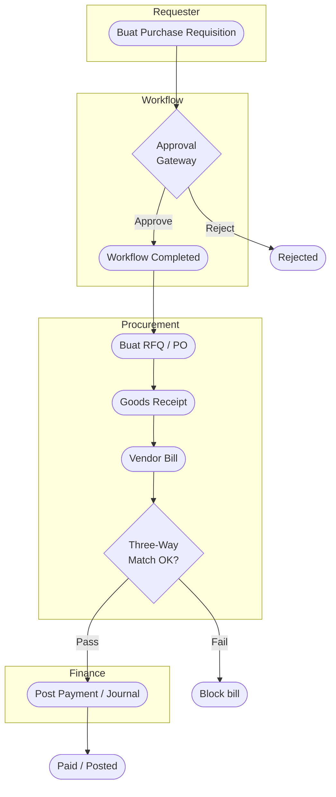
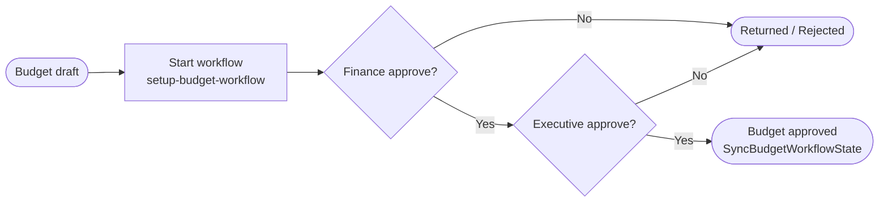
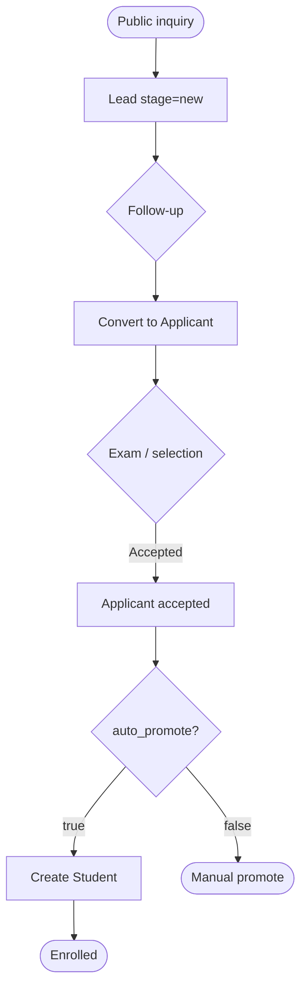
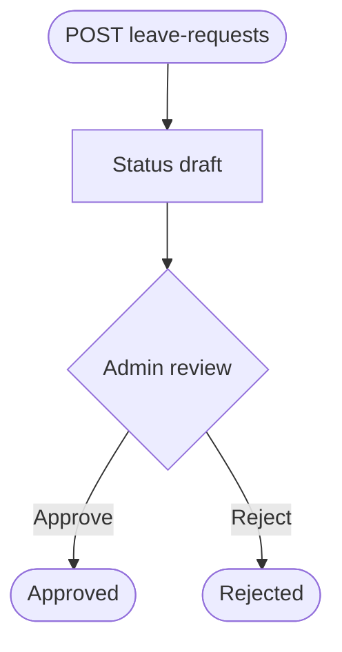
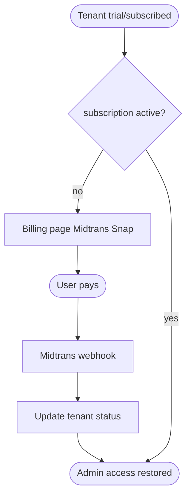

# 12 — BPMN (Proses Bisnis)

## Ringkasan Singkat

Dokumen ini menyajikan alur proses bisnis dalam notasi **BPMN-like** menggunakan Mermaid flowchart. Mermaid tidak mendukung BPMN 2.0 penuh — gateway dan swimlane disimulasikan dengan label eksplisit.

**Keterbatasan:** Hanya proses dengan bukti service/engine; tidak ada file `.bpmn` di repositori.

---

## BPMN-01: Procurement-to-Pay (Terbukti Sebagian)

**Swimlane:** Requester → Approver (Workflow) → Procurement → Finance

**Bukti:**
- Workflow: `DatabaseWorkflowEngine`, setup command `fos:workflow:setup-procurement-pilot`
- Three-way match: `ThreeWayMatchValidator.php`
- PO auto: `PurchaseOrderAutoCreationService.php`

**[GAP]:** Trigger otomatis PR→workflow tidak diaudit baris-per-baris di dokumen ini.

---

## BPMN-02: Budget Approval

**Bukti:** `SetupBudgetWorkflowCommand.php`, listener `SyncBudgetWorkflowState`, test `WorkflowBudgetApprovalTest.php`

---

## BPMN-03: Enrollment Funnel

**Bukti:** `LeadInquiryService`, `ApplicantPromotionService`, `ApplicantAcceptedPipelineTest`

---

## BPMN-04: Leave Request (API + Admin)

**Bukti:** `LeaveRequestController`, model `LeaveRequest` — detail state machine: **PARSIAL** (lihat `STATE_DIAGRAMS.md` ST-07 jika diverifikasi).

---

## BPMN-05: SaaS Subscription Billing

**Bukti:** `Tenant::isLocked()`, `EnsureTenantSubscriptionActive`, `BillingService`

---

## BPMN TIDAK Dibuat

| Proses | Alasan |
|--------|--------|
| Full payroll bulanan | Engine terpusat **TIDAK TERDETEKSI** |
| Akreditasi Education QA end-to-end | **PARSIAL** — CRUD resources |
| Marketplace order fulfillment | **PARSIAL** |

---

## Catatan Ketidakpastian

- Event subprocess, compensation, message throw/catch BPMN 2.0: **tidak dimodelkan**.
- Untuk state machine formal per entitas: `STATE_DIAGRAMS.md` (status Draft sebagian).
