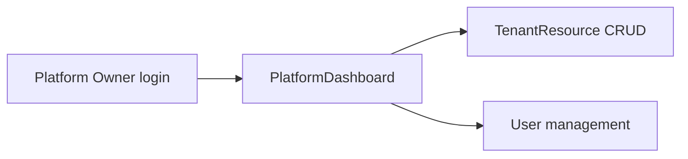
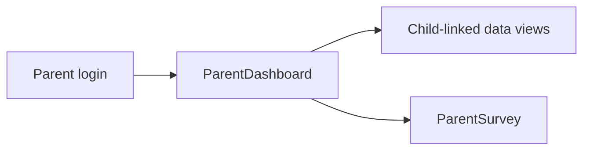

# 13 — Alur UI

## Ringkasan Singkat

FoundationOS menyajikan UI terutama melalui **tiga panel Filament** plus rute web publik dan API. Navigasi admin di-generate dari 257 `ModuleResource` dengan grouping via `FilamentUi`.

---

## Panel & Entry URL

| Panel | Path | Tenant | Login | Bukti |
|-------|------|--------|-------|-------|
| Admin | `/admin` | Ya | Ya + MFA | `AdminPanelProvider.php` |
| Platform | `/platform` | Tidak | Ya | `PlatformPanelProvider.php` |
| Parent | `/parent` | Tidak | Ya | `ParentPanelProvider.php` |

**URL contoh admin:** `/admin/{tenant_uuid}/...` — tenant route key `uuid` (`Tenant.php:95`).

---

## Alur Autentikasi Admin

```mermaid
flowchart TD
    V([Visitor]) --> Login[/admin/login]
    Login --> Auth{Credentials valid?}
    Auth -->|no| Login
    Auth -->|yes| MFA{MFA required?}
    MFA -->|yes| MFAStep[App/Email MFA]
    MFA -->|pass| TenantSelect{Tenant context}
    TenantSelect --> Dash[Dashboard TabbedDashboard]
    Dash --> Nav[Sidebar navigation groups]
```

**Bukti:** `AdminPanelProvider.php:47-56`, `TabbedDashboard.php`

---

## Struktur Navigasi Admin

| Komponen | Mekanisme | Bukti |
|----------|-----------|-------|
| Navigation group | `FilamentUi::module()` per modul | `ModuleResource.php` |
| Sort order | `navigationSortMap()` | `ModuleResource.php` |
| Label bilingual | `FilamentUi::resource()`, `::field()` | `CLAUDE.md` |
| Plugin modul | `ModulesPlugin` | `AdminPanelProvider.php:133` |

**INFERENSI:** Urutan grup mengikuti map statis — bukan konfigurasi per-tenant di DB (kecuali modul disabled).

---

## Pola Layar CRUD Standar

Setiap `ModuleResource` umumnya menyediakan:

| Halaman | Kelas pola | Bukti |
|---------|------------|-------|
| List | `Pages/List{Model}` | contoh `ListStudents.php` |
| Create | `Pages/Create{Model}` | |
| Edit | `Pages/Edit{Model}` | |
| View | `Pages/View{Model}` (opsional) | |

Form/table schema terpisah:
- `Schemas/{Model}Form.php`
- `Tables/{Models}Table.php`

**Bukti:** konvensi `CLAUDE.md`, contoh `Modules/School/app/Filament/Resources/`

---

## Alur Khusus (Non-CRUD)

| Fitur | Halaman / Komponen | Bukti |
|-------|-------------------|-------|
| Billing langganan | `BillingPage` | `app/Filament/Pages/BillingPage.php` |
| Workflow instance | `ViewWorkflowInstance` | actions advance/cancel/return |
| Workflow designer | `WorkflowCanvas` Livewire | `Modules/Workflow/app/Livewire/WorkflowCanvas.php` |
| Registrasi tenant | `RegisterTenant` | `app/Filament/Pages/Tenancy/RegisterTenant.php` |
| Profil user | `EditProfile` | `AdminPanelProvider.php:52` |
| Ganti bahasa | User menu action | `SetUserLocale` |

---

## Panel Platform



**Bukti:** `app/Filament/Platform/`, `User::canAccessPanel('platform')`

---

## Panel Parent



**Bukti:** `app/Filament/Parent/`, `ParentStudent` model

---

## UI Publik (Non-Filament)

| Alur | Route | Bukti |
|------|-------|-------|
| CMS halaman | `Modules/Cms/routes/web.php` | pages, articles |
| OPAC perpustakaan | `Modules/Library/routes/web.php` | browse, reserve |
| Verifikasi surat | `GET api/letters/verify/{token}` | `LetterVerificationController` |
| Locale switch | `routes/web.php` | authenticated |

---

## Branding per Tenant

| Elemen | Sumber | Bukti |
|--------|--------|-------|
| Primary color | `tenant_settings` group `branding` | `AdminPanelProvider.php:57-71` |
| Logo | `brand_logo` setting | `AdminPanelProvider.php:73-80` |

---

## Frontend Assets

| Asset | Build | Bukti |
|-------|-------|-------|
| Admin theme CSS | Vite `resources/css/filament/admin/theme.css` | `AdminPanelProvider.php:45` |
| Workflow designer JS | `resources/js/workflow-designer.js` | `package.json`, vite config |
| Tailwind v4 | `@tailwindcss/vite` | `package.json` |

---

## UI TIDAK TERDETEKSI

| Item | Status |
|------|--------|
| Student-facing SPA/portal | TIDAK TERDETEKSI |
| Mobile native UI (selain API) | PARSIAL — folder `mobile/` Capacitor config |
| Wireframe / design system Figma | TIDAK TERDETEKSI DI KODE |

---

## Catatan Ketidakpastian

- 257 resource × 4 halaman = ribuan URL unik — tidak diinventarisasi per URL di dokumen ini.
- Hak akses per menu: Shield permission — lihat `AUTHORIZATION_MATRIX.md`.
