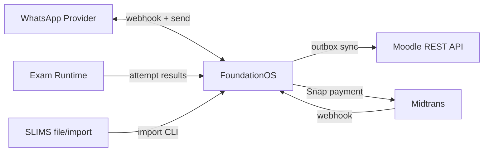

# 14 — API dan Integrasi

## Ringkasan Singkat

FoundationOS mengekspos **101 rute HTTP** dengan prefix `api/` (terverifikasi via katalog JSON), plus rute web untuk webhook dan CMS. Integrasi eksternal utama: Moodle (outbound), Midtrans (billing), WhatsApp (notifikasi).

---

## Ringkasan API

| Metrik | Nilai | Bukti |
|--------|-------|-------|
| Total rute `api/*` | 101 | `docs/catalogs/api-routes-catalog.json` |
| Versi inti mobile | v1, v2 | `routes/api.php` |
| OpenAPI | `GET api/openapi.json`, `api/v2/openapi.json` | `OpenApiController` |
| Rate limit | 60/menit per token/IP | `routes/api.php:24-28` |

---

## Middleware API

| Middleware | Fungsi | Bukti |
|------------|--------|-------|
| `auth:sanctum` | Bearer token | `routes/api.php` |
| `resolve.api.tenant` | Bind `CurrentTenant` | `ResolveApiTenant.php` |
| `throttle:api` | Rate limiting | `routes/api.php` |
| `idempotency` | Duplicate-safe POST | `IdempotencyKey.php` |
| `api.version.meta` | Response meta v2 | `AttachApiVersionMeta.php` |

---

## Endpoint Inti v1 (Mobile / Integrator)

**Bukti:** `routes/api.php:43-78`

| Method | URI | Aksi | Auth |
|--------|-----|------|------|
| GET | `api/v1/me` | Profil user | Sanctum + tenant |
| GET | `api/v1/tenants/current` | Tenant aktif | Sanctum + tenant |
| GET | `api/v1/organizations` | List org | Sanctum + tenant |
| GET | `api/v1/students` | List siswa | Sanctum + tenant |
| GET | `api/v1/college-students` | List mahasiswa | Sanctum + tenant |
| GET | `api/v1/classes` | List kelas | Sanctum + tenant |
| GET | `api/v1/courses` | List MK | Sanctum + tenant |
| GET | `api/v1/employees` | List pegawai | Sanctum + tenant |
| POST | `api/v1/applicants` | Buat applicant | + idempotency |
| POST | `api/v1/payments` | Catat pembayaran | + idempotency |
| POST | `api/v1/leave-requests` | Ajukan cuti | + idempotency |
| POST | `api/v1/devices` | Register push device | Sanctum + tenant |
| DELETE | `api/v1/devices/{token}` | Hapus device | Sanctum + tenant |
| GET | `api/v1/students/{id}/dashboard` | Dashboard siswa | Sanctum + tenant |

---

## Endpoint Publik

| Method | URI | Modul | Bukti |
|--------|-----|-------|-------|
| POST | `api/inquiry` | Enrollment | `InquiryController@store` |
| GET | `api/letters/verify/{token}` | EOffice | `LetterVerificationController` |
| GET | `api/openapi.json` | Api | `OpenApiController@v1` |

---

## Module REST Scaffold (Contoh)

Modul berikut mengekspos CRUD REST `api/v1/{resource}` via controller modul:

| Modul | Contoh URI | Bukti |
|-------|------------|-------|
| Campus | `api/v1/campuses` | `API_ROUTES.md` |
| Core | `api/v1/cores` | katalog JSON |
| Employee | `api/v1/employees` (module route) | dual dengan Api v1 read |
| Finance | `api/v1/finances` | katalog |
| Library | `api/v1/libraries` | katalog |
| Procurement | `api/v1/procurements` | katalog |

**Catatan:** Scaffold modul mungkin **tidak** memakai `resolve.api.tenant` — verifikasi per route di `api-routes-catalog.json`.

---

## Webhook Inbound

| Method | URI | Provider | Bukti |
|--------|-----|----------|-------|
| POST | `/billing/webhook` | Midtrans | `routes/web.php`, CSRF except |
| POST | `/donation/webhook` | Donation payment | `Modules/Donation/routes/web.php` |
| POST | `api/webhooks/whatsapp/{provider}` | WhatsApp | `WhatsAppWebhookController` |
| POST | `api/exam/runtime/attempts` | Exam runtime | `ExamRuntimeWebhookController` |
| POST | `/itops/monitoring/webhook` | IT monitoring | `Modules/ItOps/routes/web.php` |

---

## Integrasi Eksternal

### Moodle (Outbound)

| Aspek | Detail | Bukti |
|-------|--------|-------|
| Arah | FOS → Moodle (master data) | `MoodleOutboxService` |
| Pola | Outbox + queue job | `ProcessMoodleSyncOutboxJob` |
| Mapping | Tenant→category, Course→course, User→user | `MoodleMapper`, `MOODLE.md` |
| Trigger | Model observers | `StudentObserver`, `CourseObserver` |
| Config | `config/moodle.php` | |
| Inbound webhook Moodle | **TIDAK TERDETEKSI** | |

**Artisan:** `moodle:sync-cohorts`, `moodle:pull-grades`, `moodle:health-check`, dll.

### Midtrans (Billing SaaS)

| Aspek | Detail | Bukti |
|-------|--------|-------|
| SDK | `midtrans/midtrans-php` | `composer.json` |
| Snap token | `BillingService` | |
| Webhook verify | `MidtransWebhookVerifier` | |
| Config | `config/midtrans.php` | |

### WhatsApp (Messaging)

| Aspek | Detail | Bukti |
|-------|--------|-------|
| Contract | `WhatsAppProvider` | `Modules/Messaging/app/Contracts/` |
| Default impl | `LogWhatsAppProvider` (dev/log) | `MessagingServiceProvider.php:24` |
| Dispatch | `NotificationDispatcher::sendWhatsApp()` | |

### SLIMS (Library)

| Aspek | Detail | Bukti |
|-------|--------|-------|
| Import command | `LibraryImportSlimsCommand` | `app/Console/Commands/` |
| Mapping table | `library_slims_mappings` | migration |

### Payment Donation

**Bukti:** `Modules/Donation/routes/web.php` webhook — provider spesifik: **PARSIAL** (baca controller).

---

## Error Handling API

**Bukti:** `bootstrap/app.php:44-73`

| Kondisi | Response |
|---------|----------|
| ValidationException | JSON `validation_failed` 422 |
| ModelNotFoundException | JSON 404 |
| AuthenticationException | JSON 401 |

---

## Diagram Integrasi

---

## Catatan Ketidakpastian

- Request/response schema lengkap per endpoint: lihat `OpenApiController` — **PARSIAL** tanpa diff byte-for-byte.
- Integrasi pihak ketiga lain (Feeder DIKTI, dll.): model `FeederLog` ada — protokol API **TIDAK TERDETEKSI** penuh di audit ini.
